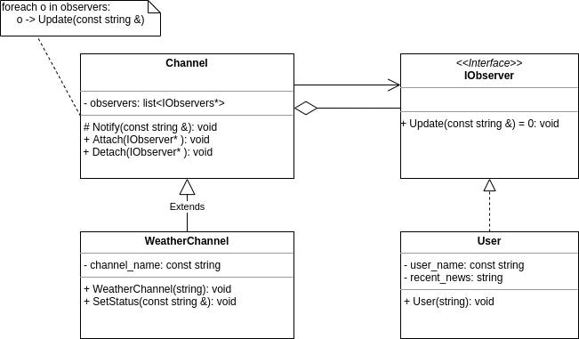

# Sprawdzian: Laboratorium C++

Użytkownicy chcą być informowani o statusie (wiadomościach) kanałów zainteresowań.
Każdy kanał (np. `WeatherChannel`) przechowuje listę użytkowników, którzy dokonali subskrypcji.
Ustawianie statusu kanału skutkuje poinformowaniem użytkowników.
Subskrypcja może być anulowana.

Zadanie:

Zaimplementuj klasy (`IObserver`, `User`, `Channel`, `WeatherChannel`), tak aby zadziałał przykładowy kod.

Kod się nie kompiluje = 0 pkt.

## Punktacja (max 40p)

 * 8p - Kod jest napisany zgodnie z dobrymi praktykami (SOLID, podział na pliki, formatowanie, itp).
 * 10p - Przykładowy kod działa.
 * 4p - Poprawne zarządzanie pamięcią.
 * 18p - Klasy są rozsądnie zaimplemtowane (np. zgodnie z przykładowym diagramem UML).
