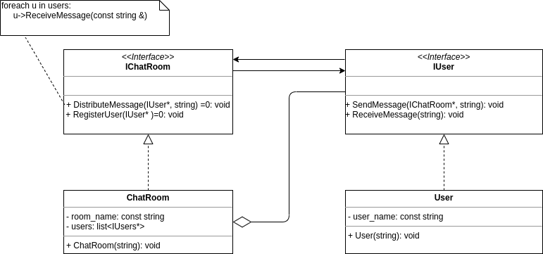

# Sprawdzian: Laboratorium C++  

Użytkownicy mogą rozmawiać ze sobą poprzez chat korzystając z różnych pokoji.
Wiadomość wysłana do danego pokoju zostanie odebrana przez wszystkich obecnych w nim użykowników.

Zadanie:

Zaimplementuj klasy (`IUser`, `User`, `IChatRoom`, `ChatRoom`), tak aby zadziałał przykładowy kod.

Kod się nie kompiluje = 0 pkt.

## Punktacja (max 40p)

 * 8p - Kod jest napisany zgodnie z dobrymi praktykami (SOLID, podział na pliki, formatowanie, itp).
 * 10p - Przykładowy kod działa.
 * 4p - Poprawne zarządzanie pamięcią.
 * 18p - Klasy są rozsądnie zaimplemtowane (np. zgodnie z przykładowym diagramem UML).
