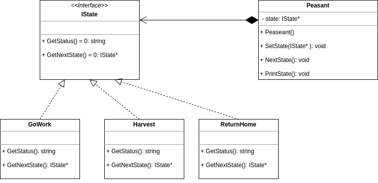

# Sprawdzian: Laboratorium C++  

Opis:

W grze komputerowej istnieje wiele rodzajów jednostek, mogących znajdować się w różnych, **następujących po sobie** stanach.
Przykładowo, jednostka typu 'chłop' może iść do pracy, zbierać żniwo lub wracać do domu.

Zadanie:

Zaimplementuj klasy (`IState`, `Peasant`, `GoWork`, `Harvest`, `ReturnHome`), tak aby zadziałał przykładowy kod znajdujący się w pliku `main.cpp`.

## Punktacja (max 40p)

Kod się nie kompiluje = 0 pkt.

* 8p - Kod jest napisany zgodnie z dobrymi praktykami (SOLID, podział na pliki, formatowanie, itp).
* 10p - Przykładowy kod działa.
* 4p - Poprawne zarządzanie pamięcią.
* 18p - Klasy są rozsądnie zaimplemtowane (np. zgodnie z przykładowym diagramem UML).
