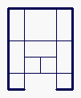

# Projekty zaliczeniowe z C++
Kryteria ocen.
Przy ocenianiu programu będę brał pod uwagę następujące elementy:
* obiektowość programu (umiejętność wykorzystania obiektowości języka C++ do
rozwiązania danego problemu, czyli np. odpowiednie zdefiniowanie klas,
odpowiednie przeciążenie operatorów itp.);
* użycie dziedziczenia;
* użycie wzorców;
* użycie biblioteki STL;
* użycie polimorfizmu (mile widziane);
* przejrzystość i czytelność kodu (komentarze, podział kodu na pliki);
* prezentację programu.

Nie w każdym programie da się umieścić wzorce, dziedziczenie, polimorfizm i biblioteki STL
na raz, jednak każdy z tych elementów będzie podwyższał ostateczną ocenę. Proszę raczej
nawet przesadzać z tymi elementami aby wykazać się ich znajomością (nawet jeśli wydawać
się będą wciśnięte do programu nieco na siłę). Interfejs użytkownika lub graficzny będą miały
najmniejszy wpływ na ocenę. Podobnie zakres możliwości przechowywania danych w
programach „bazodanowych” może być ograniczony do minimum.
Program będzie trzeba obronić, więc proszę się na to odpowiednio przygotować. Należy
podejść do tego tak jakby chcieli Państwo przedstawić ewentualnemu klientowi swój produkt
i jednocześnie pochwalić się znajomością podstawowych zagadnień z programowania w C++.
(Przy zaliczaniu programu mogę zapytać np. o jakieś podstawowe pojęcia związane z
tworzeniem klas, dziedziczeniem itp.) Na wszelki wypadek dodam jeszcze, że program musi
się skompilować i zadziałać!

Wybór zadania proszę zgłosić na zajęciach.

## Lista tematów prostszych, za 25 punktów
1. Biblioteka do działań na macierzach (wersja prostsza).
Macierze prostokątne, pamięć alokowana dynamicznie, sprawdzanie wymiarów podczas
operacji, podstawowe działania jak dodawanie odejmowanie, mnożenie, obliczanie
wyznacznika.

2. Program prezentujący klasę String.
Wszelkiego rodzaju operacje możliwe do wykonania na łańcuchach znakowych.
Możliwość wykonywania wielu operacji w jednej instrukcji, np.:
```c++
String s = ”aaa”;
int n = s.Trim().Length();
```

3. Program prezentujący klasę Wektor3D.
Operacje na wektorach 3D różnego typu, np. int i double. Należy zastosować wzorce.

4. Program prezentujący klasę Ułamek.
Operacje na liczbach całkowitych. (Wykonać operacje pokazujące poprawność działań.)

5. Punkt trójwymiarowy (wersja prostsza)
W tym zadaniu należy napisać klasę opisującą punkt w przestrzeni trójwymiarowej.
Należy zdefiniować metody wykonujące przesunięcie i obrót punktu, oraz metodę
rzutującą punkt na określoną płaszczyznę i zwracającą współrzędne rzutu na tej
płaszczyźnie. Cecha dodatkowa - zdefiniowanie klasy 'figura 3D' zawierającej zbiór
punktów, oraz operacji przesunięcia, obrotu i rzutu figury.

## Lista tematów trudniejszych, za 35 punktów
6. Baza danych pojazdów.
Wprowadzanie i usuwanie pojazdu, wyświetlanie danych o pojeździe,
odczyt i zapis bazy danych do pliku (najlepiej w formacie binarnym).
W programie należy utworzyć klasę Pojazd i przynajmniej jej dwie klasy
pochodne, np.: Osobowy i Motor. Użyć funkcji wyświetlającej dane
wykorzystującej polimorfizm.

7. Książka adresowa.
Wprowadzanie i usuwanie pozycji z książki. Odczyt i zapis książki do pliku
(najlepiej w formacie binarnym). Wyświetlanie danych z danej pozycji książki.

8. Kolejka FIFO.
Wykorzystanie kolejki FIFO do kolejkowania zamówień w sklepie.
Dodawanie zamówień, pobieranie zamówień, odczyt i zapis kolejki do pliku
(najlepiej w formacie binarnym).

9. Program prezentujący klasę Data.
Wszelkie operacje możliwe do wykonania na datach, np.: różnica dwóch dat,
przesuwanie daty o zadaną liczbę dni, miesięcy. Możliwość wyświetlania daty
w kilku różnych formatach. (Ewentualnie sprawdzanie dni świątecznych.)

10. Biblioteka do działań na macierzach (wersja trudniejsza).
Macierze prostokątne, pamięć alokowana dynamicznie, sprawdzanie wymiarów podczas
operacji. Oprócz podstawowych działań na macierzach należy: wyznaczać macierz
odwrotną, macierz trójkątną itp. Należy również zastosować wzorce.

11. Baza płyt CD z programami.
Dane w pliku tekstowym, ew. automatyczne skanowanie płyt np. „ls -R > lista” + analiza
pliku 'lista'.

12. Kalkulator tekstowy.
Podstawowe operacje + obsługa nawiasów, ewentualnie funkcje trygonometryczne.

13. Tekstowy edytor wsadowy (cos w rodzaju sed'a linuxowego).
Np. komenda 'tedytor asdas qqq' zamieni wszystkie stringi 'asdas' na 'qqq'. Może być
również proste przeszukiwanie w stylu grepa.

14. Gra w kółko i krzyżyk z komputerem
Należy napisać grę w kółko i krzyżyk na planszy 3 x 3 pola. Komputer powinien grać
inteligentnie, a więc nigdy nie przegrywać (istnieje strategia gwarantująca minimum
remis).

15. Baza danych dla biura matrymonialnego
Baza, oprócz danych osobowych powinna zawierać pole zawierające słowa kluczowe (np.
zainteresowania czy preferencje osób) i dokonywać kojarzenia par korzystając również z
tego pola. Baza powinna mieć konstrukcję obiektową.

16. Słownik elektroniczny
Program umożliwiający gromadzenie definicji pojęć, a następnie przeglądanie i
wyszukiwanie tych definicji. Cechą dodatkową może być wyszukiwanie według wzorców
z '*' i '?'.

17. Punkt trójwymiarowy (wersja trudniejsza)
W tym zadaniu należy napisać klasę opisującą punkt w przestrzeni trójwymiarowej.
Należy zdefiniować metody wykonujące przesunięcie i obrót punktu, oraz metodę
rzutującą punkt na określoną płaszczyznę i zwracającą współrzędne rzutu na tej
płaszczyźnie. Utrudnienie polega na zdefiniowaniu klasy 'figura 3D' zawierającej zbiór
punktów, oraz operacji przesunięcia, obrotu i rzutu figury.

18. Gra typu „Space Invaders”
Gra taka polega na zestrzeliwaniu statków poruszających się powoli w dół ekranu i
losowo na boki. Pojazd gracza porusza się w poziomie na dole okna (sterowany
klawiaturą) i wystrzeliwuje pociski w górę. W momencie zetknięcia się pocisku ze
statkiem wroga, ten ostatni znika. Statki wroga od czasu do czasu zrzucają bomby
pionowo w dół, każde uderzenie bomby w pojazd gracza zmniejsza jego energię, gdy
spadnie ona do zera, gracz przegrywa.

19. Gra „Tetris”
Gra powinna działać w terminalu graficznym.

20. Symulator „gry w życie”
„Gra w życie” to tak zwany automat komórkowy, składający się z kwadratowych
komórek na płaszczyźnie. Proste reguły opisują śmierć, przeżywanie i narodziny nowych
komórek. Kolejne pokolenia „organizmów” to zmieniające się układy punktów na
kwadratowej siatce. Zadanie polega na napisaniu klasy języka C++ będącej symulatorem
gry w życie. Cechy dodatkowe: zapis i odczyt organizmów na dysku, utworzenie
dwupoziomowej hierarchii klas umożliwiającej zastosowanie różnych reguł.

21. Gra „Pacman”
Plansza gry to labirynt, na którego korytarzach rozmieszczone są kropki, zjadane przez
bohatera gry, sterowanego klawiaturą. Celem gry jest zjedzenie wszystkich kropek.
Przeszkadzają w tym wrogowie sterowani przez komputer, którzy starają się złapać
gracza.

22. Gra w węża
Po planszy porusza się wąż zjadając pojawiające się przedmioty. Po zjedzeniu każdego
przedmiotu staje się dłuższy. Gracz przegrywa, gdy wąż zetknie się z sobą samym.

23. Gra „Magazynier”
Tematem zadania jest gra, znana również jako Sokoban, która polega na przepychaniu
skrzyń - przy pomocy sterowanego przez gracza magazyniera - na wyznaczone miejsce.
Oczywiście odbywa się to w dość zawile wybudowanym magazynie... Poziomy gry
powinny być czytane z pliku tekstowego (jednego lub wielu).

24. Łamigłówka „Szafa Kowalskich”
Elementy tej łamigłówki są kwadratami i prostokątami o różnych rozmiarach. Jest ich
natomiast zawsze stała ilość. Zadanie gracza polega na wysunięciu z pokoju szafy -
największego kwadratowego elementu (i tylko tego elementu).


25. Gra „River Raid”
Ta pozycja to lot samolotem bojowym wzdłuż krętej rzeki. Rzekę widzimy z góry, w
czasie lotu ekran przesuwa się w dół. Samolot musi poruszać się między brzegami,
zderzenie z brzegiem to utrata życia. Oczywiście brzegi powinny być nieregularne. Na
rzece znajdują się 2 rodzaje obiektów: statki, które należy zestrzeliwać (za to są punkty) i
beczki paliwa, nad którymi należy przelecieć aby uzupełnić paliwo. Paliwa ubywa
jednostajnie w czasie lotu. Ilość amunicji nieograniczona. Należy zaimplementować
licznik punktów i paliwa. Sterowanie samolotem: ruch w 4 kierunkach + strzał.

26. Program „Automat z napojami”
Program ma symulować działanie automatu z napojami, który po wrzuceniu odpowiedniej
monety oraz wybraniu dowolnej pozycji wydaje zamówiony napój. Zakłada się, że w
automacie znajdują się napoje różnego typu (Coca Cola, Pepsi, Sprite). Automat ma
posiadać możliwość wydawania reszty.

27. Program „Kuchenka mikrofalowa”
Program ma symulować działanie kuchenki mikrofalowej. Kuchenka mikrofalowa ma
umożliwiać „gotowanie” potraw po uprzednim ustawieniu temperatury oraz czasu
działania urządzenia. Program ma być skonstruowany w taki sposób, aby możliwa była
sytuacja w której dana potrawa „spali się” w sytuacji gdy czas „gotowania” nie odpowiada
rodzajowi „gotowanego” produktu.

28. Program „Bankomat”
Program ma symulować działanie bankomatu. Bankomat po włożeniu karty elektronicznej
(karta kredytowa, płatnicza, bankomatowa) oraz weryfikacji posiadacza karty
(sprawdzenie PIN), powinien wydawać żądaną kwotę pieniędzy. Program powinien być
napisany w taki sposób, aby przed „instalacją” bankomatu można było określić jakie
rodzaje kart elektronicznych są akceptowane (obsługiwać między innymi następujące
karty: Visa, American Express, Visa Electron, Mastercard).

29. Program „Samochód”
Program ma symulować działanie samochodu. Powinno być możliwe symulowania jazdy
samochodem z możliwością realizowania następujących funkcji:
* włączenie / wyłączenie silnika,
* zmiana biegów,
* przyśpieszanie,
* hamowanie.
Podczas „jazdy” użytkownik powinien mieć możliwość obserwowania parametrów
samochodu (szybkość, włączony bieg, obroty silnika). Program powinien obsługiwać
funkcję w których jazda nie będzie możliwa ze względu na brak benzyny, bądź zatarty
silnik (spowodowany brakiem oleju).

30. Program „Biblioteka”
Program ma wspierać bibliotekę w procesie obsługi czytelników. Powinna być możliwość
wypożyczenia książki, jej zwrotu oraz sprawdzenia czy książka jest dostępna w danej
chwili do wypożyczenia. Dla poszczególnych czytelników powinna być przechowywana
informacji o książkach aktualnie wypożyczonych, czasie w którym książkę należy
zwrócić oraz ew. karze naliczonej za opóźnienie w zwrocie książki.

31. Program „Dziekanat”
Program ma wspierać dziekanat w obsłudze procesu dydaktycznego. Powinna być
możliwość zapisania studenta na zajęcia (wykłady i ćwiczenia), kontrola ilości wolnych
miejsc na poszczególnych zajęciach, związywanie prowadzących z zajęciami. Dla
prowadzących powinno być uwzględniane pensum (210 godz. adiunkt i asystent, 180
godz. profesor, 90 godz. doktorant). Program powinien umożliwiać sprawdzenie rodzaju
zajęć na które jest zapisany dany student.

32. Program „Sklep”
Program ma wspierać obsługę sklepu dowolnego rodzaju. Powinna być możliwość
przyjęcia towaru do sklepu oraz jego sprzedaż w sposób hurtowy i detaliczny. Dla
sprzedaży hurtowej powinna być możliwość rejestrowania stałych klientów. „Sprzedaż”
ma polegać na wybieraniu towarów do koszyka, naliczaniu zbiorczej ceny, zapłatę z
pieniędzy posiadanych w portfelu oraz usuwanie „sprzedanych” towarów z magazynu.


