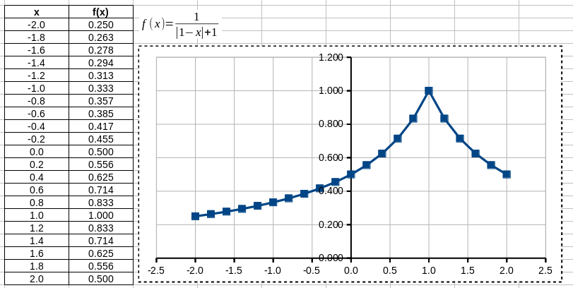

The instruction contains exercises on spreadsheet operations.
You can solve them using open source programs (e.g. *LibreOffice Calc*, *OpenOffice Calc* or *WPS SpreadSheets*) or commercial ones (e.g. *Microsoft Excel*)
Syntax differ only slightly between these programs.

The exercises are based on *LibreOffice Calc*.
It is recommended to solve each task in a separate sheet.

## Multiplication table
Create a table containing multiplication table up to ten.
To do that:

- Copy formulas automatically.
When you select a sell, you can see a small square in its lower right corner -- click on it, hold the mouse button and drag it vertically or horizontally.
This action allows one to copy formulas and updates cell references accordingly.
- You can disable updating references by using a symbol "$".
For example, reference `A$3` means that when you drag vertically, the row number is constant. 
When you drag horizontally, the column number is changing.
- In order to format the table, select cells, click with right hand button and select *Format Cells*.
With this step you open a window allowing a change of the table formatting (e.g. tab *Borders* allows one to edit lines).

## Sale of cars
Create a table with information on sale results of fife car models.

- Columns $2$ -- $5$ fill with devised data.
- Use the function `SUM()` to sum values of the selected cells.  
Provide a cell range as an argument.
For example, use `SUM(A1:A10)` to sum values in the column `A` and rows `1` to `10`.
- Format the table as in Figure 2.

## Results of a test
Create two tables.
First one should contain columns named as in the Figure 3.
Fill the table with devised data.

Second table should contain two columns `Index` and `Name and Surname`.

- The `Index` column has to be filled with the indexes from the first table but in a changed order.
- The column `Name and Surname` has to be filled using the functions `CONCATENATE()` and `VLOOKUP()`.  
Functions can be nested, e.g. formula `CONCATENATE(VLOOKUP(...), VLOOKUP(...))` is correct.
The function `CONCATENATE()` concatenates two strings in one.
For example, formula `CONCATENATE(A1, " ", A2)` joins string from the cell *A1* with a space and the string from the cell *A2*.
The function `VLOOKUP()` searches for a row containing a value given as the first argument in the first column of a selected table and returns a value from the selected column.
For example, formula `VLOOKUP(A10, A1:D6, 3, 0)` look up for a contents of the cell *A10* in the first column of the table *A1:D6* and returns a value of an adequate row in the third column.
The last argument of the function -- zero, means that the first column of the table is not sorted in the ascending order.

## Plot of a function
Create a plot of the one-dimensional function
$$
f(x) = \frac{1}{|x - 1| + 1}
$$
for $x \in [-2,2]$.  
To do this:

- Create two columns
    - first for values of the argument `x` for which the plot should be created,
    - second for the values of the function `f(x)` (an absolute value of a number is calculated with `ABS()`).
- Create an object of a type formula (*Insert* -> *Object* -> *Formula* in the program *OpenOffice*) or an object of type *Microsoft Equation* in order to add the function in a text format.
You can set the background to white by clicking on the area with right hand button and selecting *Area*.
- Select the created columns and choose *Insert* -> *Chart* in order to open the plot editor.
When the plot is ready, double click on its each element in order to enter the edition mode of the element.
Format the plot as in the Figure 4.

## Computing roots of the quadratic function
Create a sheet in a spreadsheet software in order to compute roots of the quadratic function.
To do that:

- Add an object of a type forumla to write $y=ax^2+bx+c$.
- Select cells to store the coefficients $a$, $b$, $c$ and fill them.
- Create a formula to compute *delta* using the cells from the previous point.
- Create a formula to calculate a number of roots using a value of *delta*.
Use function `IF()` to check the conditions.
For example, formula `IF(A1>0, A2, A3)` returns a value of the cell `A2` if a value in the cell `A1` is greater then zero and a value of the cell `A3` otherwise.
- Compute roots of the function (formula `SQRT()` returns the square root of a number).
Take into account a case when a selected root does not exist (in such a case the correspnding cell should contain a massage "lack")..

## Importing data from a file
Download a file [results.dat](data/cs1/results.dat) and move it to a catalogue with a spreadsheet.
You can import data from the file selecting *Sheet* -> *Insert Sheet From File* and choosing the file `results.dat`.
After confirming a choice, a new window will open allowing changing options of the import procedure.
Section *Separator Options* allows one to change a separator which divide data.
We select *Space* and click *OK*.
Sometimes the imported data requires changing the decimal separator.
In most countries this separator is a dot ".".
You can change a separator selecting *Edit* -> *Find and replace* and then in a field *Find* putting a separator that you want to change (e.g. ",") and in a field *Replace* a required separator (e.g. ".").
Finally, you click *Replace All*.

The data is ready.
Now, we have to fit a quadratic function to the data using the least squares method.
This function is sometimes called the trend function.
To do that, we create a plot and double click it in order to edit it.
Next we select any sample point (after that all point should be highlighted green) and from the main menu select *Insert* -> *Trend Lines*.
In the tab *Type* we select the polynomial regression (*polynomial*) of the second order and tick options *Show Equation*, *Show Coefficient of Determination* and click *OK*.
We should obtain a plot like in the Figure 6.

