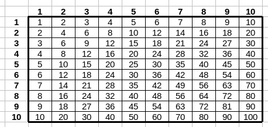
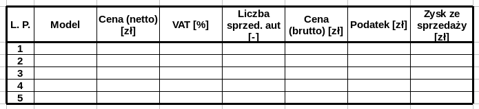
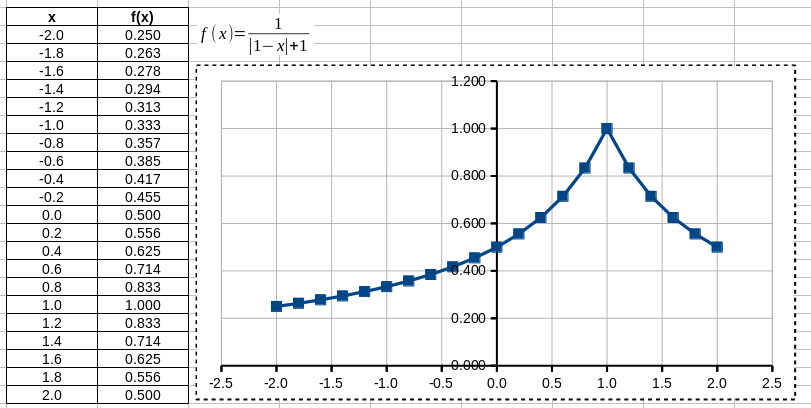
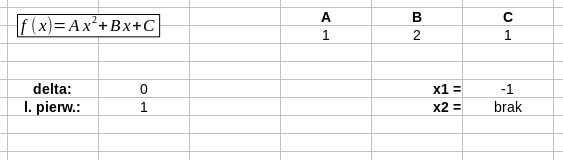
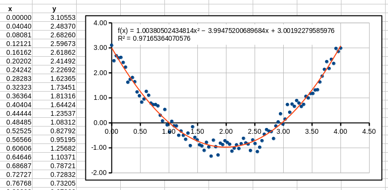
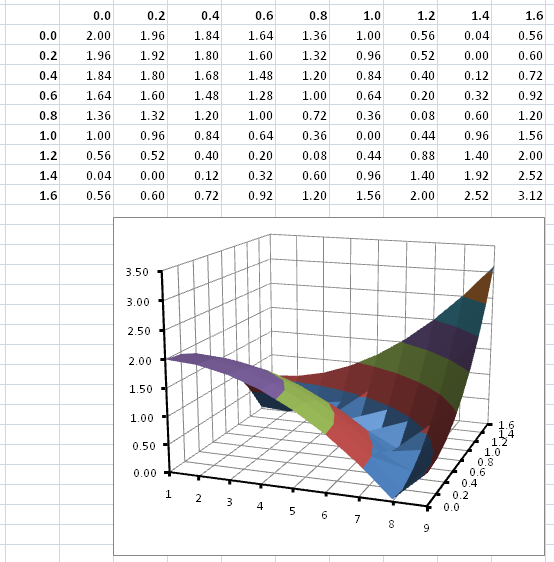

Niniejsza instrukcja zawiera ćwiczenia dotyczące arkusza kalkulacyjnego.
Można je wykonać wykorzystując darmowe oprogramowanie (np. *LibreOffice Calc*, *OpenOffice Calc* czy *WPS SpreadSheets* lub też komercyjne (np. *Microsoft Excel*).
Składnia formuł we wszystkich wymienionych programach nie różni się znacznie.

Ćwiczenia zostały oparte o program *LibreOffice Calc*.
Dla wygody, każde zadanie można rozwiązać w odrębnej karcie arkusza kalkulacyjnego.

## Tabliczka mnożenia
Stwórz tabelę zawierającą tabliczkę mnożenia do dziesięciu.
W tym celu:

- Skorzystaj z możliwości przeciągania formuł.  
Po zaznaczeniu komórki, w jej prawym dolnym rogu pojawi się kwadracik -- wystarczy kliknąć w niego i trzymając klawisz myszy przeciągnąć pionowo lub poziomo.
Akcja spowoduje skopiowanie formuły i zmianę używanych adresów.
- Zablokuj wybrane adresy z użyciem symbolu ,,$".  
Przykładowo, odwołanie `A$3` oznacza, że przy przeciągnięciu pionowo, numer wiersza nie ulegnie zmianie.
Przy przeciągnięciu poziomo, zmianie ulegnie kolumna.
- W celu sformatowania tabeli zaznacz wybrane komórki, kliknij prawym klawiszem myszki i wybierz *Format Cells*.
Wyświetlone zostaną zakładki umożliwiające zmianę wyglądu tabeli w szerokim zakresie (min. zakładka *Borders* umożliwia dodanie i edycję linii).

## Sprzedaż samochodów
Stwórz tabelę zawierającą informacje o sprzedaży pięciu modeli samochodów.

- Kolumny $2$ -- $5$ uzupełnij wymyślonymi danymi.
- W celu zsumowania zawartości komórek użyj funkcji `SUM()`.  
Argumentem jest zakres komórek, których wartości należy zsumować.
Przykładowo `SUM(A1:A10)` zsumuje wartości w kolumnie `A` w wierszach od `1` do `10`.
- Tabelę sformatuj tak aby wyglądała jak na Rys. 2.

## Wyniki z kolokwium
Stwórz dwie tabele.
Pierwsza z nich powinna zawierać kolumny o nazwach jak na Rys. 3.
Tabelę należy uzupełnić wymyślonymi danymi.

Druga tabela powinna zawierać dwie kolumny: `Nr indeksu` oraz `Imię i Nazwisko`.

- Kolumnę `Nr indeksu` należy uzupełnić numerami indeksu z poprzedniej tabeli ale w innej kolejności.
- Kolumnę `Imię i Nazwisko` należy wypełnić korzystając z funkcji `CONCATENATE()` i `VLOOKUP()`.
Funkcje można zagnieżdżać, np. wywołanie `CONCATENATE(VLOOKUP(...), VLOOKUP(...))` jest prawidłowe.  
Funkcja `CONCATENATE()` łączy wybrane ciągi znaków w jeden.
Przykładowo, formuła `CONCATENATE(A1, " ", A2)` złączy napisy zawarte w komórkach *A1* i *A2* wstawiając między nie znak spacji.  
Funkcja `VLOOKUP()` wyszukuje wiersz zawierający zadaną wartość w pierwszej kolumnie wybranej tabeli i zwraca wartość znajdującą się w wybranej kolumnie.
Na przykład, formuła `VLOOKUP(A10, A1:D6, 3, 0)` wyszuka zawartość komórki *A10* w pierwszej kolumnie tabeli *A1:D6* i zwróci zawartość odpowiedniego wiersza w trzeciej kolumnie.
Ostatni parametr funkcji -- zero, oznacza, że pierwsza kolumna tabeli, w której wyszukujemy nie jest posortowana rosnąco.

## Wykres funkcji jednej zmiennej
Stwórz wykres funkcji
$$
f(x) = \frac{1}{|x - 1| + 1}
$$
dla $x \in [-2,2]$.  
W tym celu:

- Utwórz dwie kolumny
    - pierwszą zawierającą wartości argumentu `x`, dla których ma być narysowany wykres,
    - drugą z wartościami funkcji `f(x)` (moduł liczby wyznacza funkcja `ABS()`).
- Utwórz obiekt typu formuła (*Insert* -> *Object* -> *Formula* w programie *OpenOffice*) lub obiekt typu *Microsoft Equation* w celu dodania wzoru funkcji.
Tło wzoru możesz zmienić na białe klikając prawym klawiszem myszki na pole i wybierając *Area*. 
- Zaznacz utworzone kolumny i wybierz *Insert* -> *Chart* w celu uruchomienia edytora wykresów.
Po utworzeniu wykresu, kliknij na niego dwukrotnie w celu wejścia w tryb edycji poszczególnych elementów wykresu.
Sformatuj wykres tak jak na Rys. 4.

## Wyznaczanie pierwiastków funkcji kwadratowej
Utwórz arkusz w celu wyznaczenia pierwiastków funkcji kwadratowej.
W tym celu:

- Dodaj obiekt typu formuła aby zapisać równanie.
- Wybierz komórki w celu przechowywania współczynników równania i uzupełnij je.
- Wyznacz wartość *delty* na podstawie wartości w komórkach odpowiadających współczynnikom.
- Wyznacz liczbę pierwiastków na podstawie wartości *delty*.
Użyj funkcji `IF()` w celu sprawdzenia warunków na wartość *delty*.
Przykładowo, formuła `IF(A1>0, A2, A3)` zwraca zawartość komórki `A2` jeśli wartość w komórce `A1` jest większa od zera i wartość komórki `A3` w przeciwnym przypadku.
- Wyznacz miejsca zerowe funkcji (formuła `SQRT()` zwraca pierwiastek kwadratowy z liczby).
Uwzględnij przypadek, w którym dany pierwiastek nie istnieje (niech w takim przypadku w komórce wyświetli się napis ,,brak'').

## Importowanie danych z pliku
Ściągnij przykładowy plik [wyniki.dat](data/info1/wyniki.dat) i przenieś go do katalogu z plikiem arkusza kalkulacyjnego.
Dane można zaimportować do nowej karty klikając *Sheet* -> *Insert Sheet From File* a następnie wybierając plik `wyniki.dat`.
Otworzy się nowe okno, które pozwala wybrać opcje importu.
Sekcja *Separator Options* pozwala wybrać w jaki sposób rozdzielone są dane.
Zaznaczamy *Space* i klikamy *OK*.
Zaimportowane dane często wymagają zmiany separatora dziesiętnego na ten używany w arkuszu.
Klikamy *Edit* -> *Find and replace*, następnie w polu *Find* wpisujemy przecinek a w polu *Replace* kropkę i klikamy *Replace All*.

Dane są gotowe do dalszej obróbki.
Dopasujemy do nich parabolę metodą najmniejszych kwadratów (tzw. linię trendu).
W tym celu tworzymy wykres i klikamy na niego dwukrotnie w celu edycji.
Następnie wybieramy dowolny punkt (wszystkie punkty powinny się podświetlić na zielono) i z menu głównego wybieramy *Insert* -> *Trend Lines*.
W zakładce *Type* wybieramy regresję wielomianową (*polynomial*) stopnia drugiego, zaznaczamy opcje *Show Equation* i *Show Coefficient of Determination* i klikamy *OK*.
Powinniśmy otrzymać wykres podobny do poniższego.

## Wykres funkcji dwóch zmiennych (tylko Microsoft Excel)
Utwórz wykres funkcji
$$
f(x, y) = |2 - (x^2 + y^2)|
$$
w obszarze $D={(x,y)|x\in[0,1.6] \wedge y\in[0,1.6]}$.
Pierwszy wiersz powinien zawierać wartości argumentu `x` a pierwsza kolumna wartości argumentu `y`.
Komórki znajdujące się ,,na przecięciu'' komórek zawierających współrzędne powinny zawierać wartości funkcji $f(x,y)$. 

