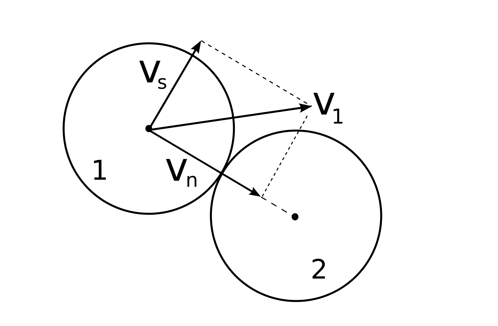
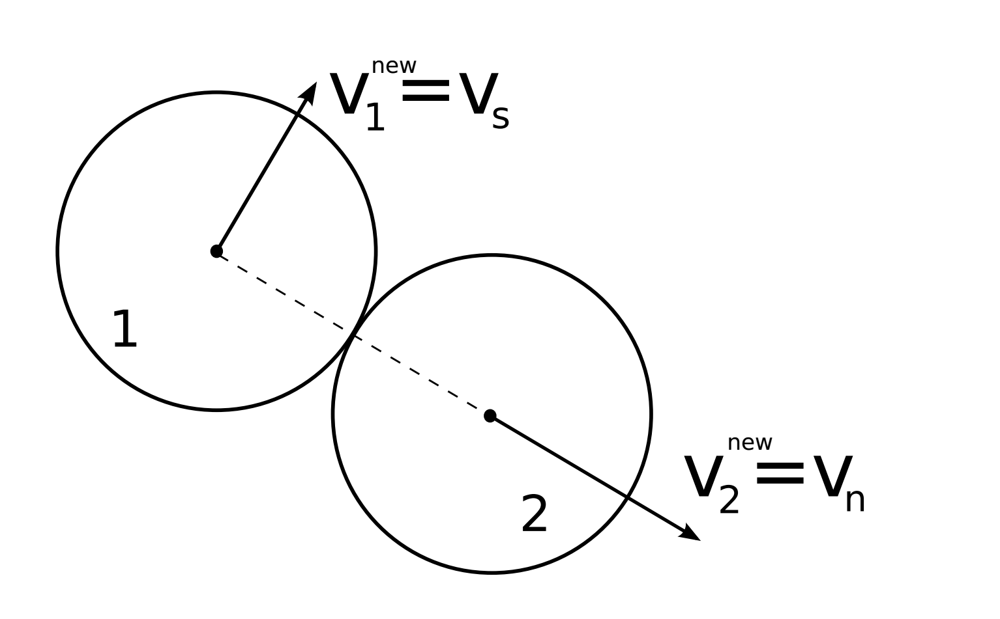

```{r, echo=FALSE}
set.seed(14) # Set seed for all the pictures to be reproducible
```

# Tablice
Celem zajęć jest wprowadzenie do używania tablic w języku C. Tablicą (ang. *array*) nazywamy ciąg zmiennych zgromadzony pod jedną globalną nazwą, które są identyfikowane indeksami. 
Na tych zajęciach zajmiemy się tylko tablicami statycznymi tzn. takimi, których rozmiar jest określany w momencie deklaracji^[bardziej zaawansowany mechanizm alokacji tablic będzie tematem następnych zajęć].
Tablicę statyczną deklarujemy tak, jak zwykłą zmienną, przy czym dodatkowo określamy jej długość. Wszystko wygląda, jak w przykładowym kodzie poniżej:

```c++
      double a[4];    	// deklaracja tablicy

      a[0] = 5.5;		   // przypisanie wartości do zmiennych
      a[1] = 3.521;
      a[2] = 6.45;
      a[3] = 4.51;

```
Zwróć uwagę, że elementy tablicy sa indeksowane od $0$ do $n-1$, gdzie $n$ to rozmiar tablicy. Można również zainicjalizować wszystkie elementy tablicy natychmiast (taki mechanizm jest użyteczny, jeśli wektory są stosunkowo krótkie):
```c++
     double b[3] = { 1.2, 2.4, -4.3};
```

# Gra w kulki

Zadanie polegać będzie na wygenerowaniu zestawu małych piłeczek w oknie graficznym, wprawieniu ich w ruch oraz implementacji prostych zasad kolizji. Ekran początkowy jest widoczny na Rysunku 1.
```{r, echo=FALSE}
n=5
p=matrix(runif(n*2),n,2)
v=matrix(runif(n*2),n,2)/5
plot(p,xlim=c(0,1),ylim=c(0,1),xlab="X",ylab="Y",asp=1,cex=3)
arrows(p[,1],p[,2],(p+v)[,1],(p+v)[,2])
lines(cbind(c(0,0,1,1,0),c(0,1,1,0,0)))
```

nasze piłki będą przychowywane tylko jako zestawy współrzędnych oraz ich prędkości. Gdy będziemy chcieli obejrzeć piłki w oknie graficznym, po prostu użyjemy funkcji \verb|circle|. Toteż w symulacji będą potrzebne następujące wektory^[tablice zazwyczaj będziemy nazywać wektorami, ze względu na fakt, że określenie "tablica" kojarzą się z obiektem o większej ilości wymiarów np. z macierzą]:
```c++ 

double x[10],y[10]           // współrzędne piłek
double cx[10], cy[10]      // składowe prędkości piłek

```

\subsection* {Pętla `for`}

Większość operacji na tych zmiennych będziemy wykonywać, używając funkcji, które będą przyjmować wprowadzone wyżej wektory jako argumenty. Funkcje będą musiały mieć podaną długość wektorów tak, aby można było wykonać pewne operacje dla każdego z elementów tego wektora.
Jeśli chcemy np. zainicjalizować wszystkie współrzędne wartością $0$, piszemy funkcję następującej treści:

```c++
void init(double *x, double *y, int N){

      for ( int i=0; i < N; ++i){
          x[i] = 0.0;
          y[i] = 0.0;}
}
```


Wykorzystaliśmy tutaj pętlę \verb|for|, która pobiera 3 argumenty:
- wartość startową,
- warunek działania (pętle działa, dopóki warunek $i<N$ jest spełniony),
- operację na argumencie (tutaj zwiększamy $i$ o 1, co będzie najpowszechniejszą praktyką^[Teoretycznie możemy w tym miejscu wykonać dowolną operację, jednak dla czytelności kodu zazwyczaj zwiększamy licznik pętli]).

Taką funkcję wywołujemy w programie głównym, podając nazwy wektorów, na których ma ona działać oraz długość tych wektorów:

```c++

	init(x, y, 10);

```

Zauważmy, że funkcja `init` pobiera 2 wskaźniki do wektorów(`x` oraz `y`) oraz jedną wartość (10). Dzięki temu funkcja operuje bezpośrednio na wektorach, na których ma operować i niczego nie musi zwracać^[Zasady działania na wskaźnikach opisano w Instrukcji 4.2.]. 


## Uwaga
Ponieważ `x` oraz `y` są wskaźnikami do pierwszych (dokładnie rzecz ujmując - zerowych) elementów tablic, można użyć mechanizmu wyłuskania wartości ze wskaźników i iterować się po wskaźnikach. Poniższy fragment kodu pokazuje dwa równoważne sposoby dostępu do wartości z tablicy:

```c++
double a[3];
// po wartościach:
a[0] = 1.2;         a[1] = 3.13;         a[2] = 0.22;
//albo na wskaźnikach:
*(a)   = 1.2;           *(a+1) = 3.13;        *(a+2) = 0.22;
```


## Ćwiczenia
Przed wykonaniem ćwiczeń upewnij się, że załączono bibliotekę \verb|winbgi2.h|, gdyż będziemy korzystać z grafiki.
- Zadeklaruj wymienione wyżej wektory o długości 10.
- Zadeklaruj okno graficzne o wymiarach $Lx \times Ly$.
- Napisz funkcję \verb|init|, która wylosuje współrzędne położeń początkowych tak, aby powstałe kółka mieściły się w oknie graficznym. Użyj funkcji \verb|rand()| znanej z poprzednich zajęć.
- Napisz funkcję `display`, która wyświetli położenie kółek (funkcja powina mieć tę samą strukturę, co funkcja \verb|init|).


# Ruch

Oczywiście piłeczki mają się poruszać, zatem konieczne będzie określenie wartości prędkości początkowych oraz zaprogramowanie ruchu piłeczek.


## Ćwiczenia

- Napisz funkcję, która wylosuje początkowe prędkości piłek. Wylosuj je tak, aby wartość prędkości wynosiła 1 
   (najłatwiej będzie wylosować dowolną liczbę i jej sinus i cosinus przypisać jako składowe prędkości piłki)
- Napisz funkcję \verb|run|, która będzie wykonwać przesunięcie każdej z piłek. Przemieszczenie będzie po prostu polegać na zwiększeniu każdej współrzędnej o składową prędkość^[piłki poruszają się ze stałą prędkością, toteż $x(t+\Delta t) = x(t) + v\Delta t $, a dla uproszczenia symulacji czas jest jednostkowy zatem $x(t+1) = x(t) + v$]:

```c++
     for ( i=0; i < N; ++i){
          x[i] += cx[i];
          y[i] += cy[i];
     }
```

- W głównym programie napisz pętlę \verb|while|, która wykona 50 kroków iteracji programu. Niech przy każdym kroku wyświetla położenie każdej piłki. W ciele pętli użyj funkcji \verb|animate(100)| - spowolni ona wykonywanie kolejnych kroków pętli. Jej użycie wyglądało następująco.

```c++
while(animate(100)) {
   clear(); // wyczysci okno graficzne dla nowej klatki
   // Dalsza czesc ciala petli
}
```


# Kolizje ze ścianami
Chcielibyśmy, aby piłeczki miały wbudowany jakiś mechanizm kolizji ze ścianami. 
Zderzenia będą doskonale sprężyste, kąt padania na przeszkodę będzie zatem równy kątowi odbicia od niej. Kąty mierzone względem normalnej do ściany.

## Ćwiczenia
- Do funkcji \verb|run| dopisz warunek, który sprawdza, czy piłka zderzyła się ze ścianą. W przypadku kolizji należy zastosować prawo odbicia, które będzie miało prostą formę:
Jeśli uderzamy w ścianę poziomą, wystarczy zmienić składową prędkości $cy$ na przeciwną. Analogicznie przy kolizji ze ścianą pionową, zmieniamy składową $cx$ na przeciwną.
Sprawdź, jak działa program np. dla 5000 kroków.
- Napisz funkcję `showEnergy`, która będzie wyświetlała na ekranie wartość całkowitej energii kinetycznej układu.


# Kolizje z piłkami

Dopisz funkcję 'searchAndCollide' , która sprawdza, czy piłki zderzają się ze sobą nawzajem.
Trzeba będzie przeiterować się po wszystkich współrzędnych sąsiadów i sprawdzić, czy odległość piłek jest dostatecznie mała.
Jeśli tak jest, piłki odbiją się od siebie, zachowując pęd oraz energię. 
Załóżmy, że piłki, które się ze sobą zderzą mają indeksy $i$ i $j$. Ich prędkości należy policzyć w następujący sposób:
- Należy sprowadzić wszystko do układu odniesienia zwiazanego z drugą piłeczką oraz dodatkowo policzyć wektor jednostkowy wskazujący kierunek łączący środki obu piłek:
$$
v_{1}= [cx_{i} - cx_{j}, cy_{i} - cy_{j}]
$$
$$
L=\sqrt{(x_{i}-x_{j})^2 +(y_{i}-y_{j})^2 }
$$
$$
n= [(x_{i}-x_{j})/L,(y_{i}-y_{j})/L]
$$
- Przy zderzeniu przekazywana jest jedynie predkość normalna do płaszczyzny zderzenia obu piłek (patrz Rys. 2 i 3). Liczymy ją w nastepujący sposób:

$$
v_{n}= [v_{nx},v_{ny}]=[(v_{1x}n_{x}+v_{1y}n_{y})n_{x},(v_{1x}n_{x}+v_{1y}n_{y})n_{y}]
$$

- Policzona powyżej predkość jest odejmowana od prędkości piłki 1 oraz dodawana do prędkosci piłki 2 (która była zerem w nowym układzie):
$$
v_{1}^{new}= [v_{1x}-v_{nx}, v_{1y}-v_{ny}], v_{2}^{new}= [v_{nx},v_{ny}]
$$

- Na koniec wracamy do starego układu odniesienia:
$$
cx_{i}^{new}=cx_{i} - v_{nx} 
$$
$$
cy_{i}^{new}=cy_{i} - v_{ny}
$$
$$
cx_{j}^{new}=cx_{j}+ v_{nx}
$$
$$
cy_{j}^{new}=cy_{j}+v_{ny}
$$


Zderzenie piłek w układzie związanym z drugą piłką (druga piłka jest nieruchoma). Prędkości przed wymianą pędu.



Zderzenie. Prędkosci po wymianie pędu. Składowa równoległa do osi wyzanczonej przez środki piłek zostaje przekazana piłce 2.
