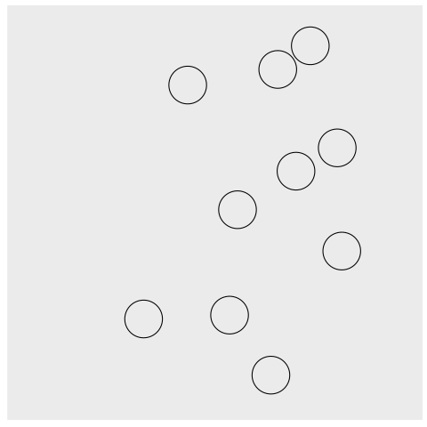

---
author:
- W. Regulski
- K. Marchlewski
course: Informatyka I
material: Instrukcja 5
number: 5
---

```{r, echo = FALSE}
set.seed(14) # Set seed for all the pictures to be reproducible
```

# Tablice
Celem dzisiejszych zajęć jest wprowadzenie do tablic w języku C.
Tablicą (ang. *array*) nazywamy ciąg zmiennych tego samego typu, które zajmują kolejne komórki pamięci.
Aby dostać się do zadanego elementu, używamy nazwy tablicy i indeksu identyfikującego element.
Na tych zajęciach zajmiemy się tablicami statycznymi, tzn. takimi, których rozmiar jest określany w momencie deklaracji^[Bardziej zaawansowany mechanizm alokacji tablic będzie tematem następnych zajęć].
Tablicę statyczną deklarujemy tak jak zwykłą zmienną, przy czym dodatkowo określamy jej długość (czyli liczbę elementów).
Przykładowo:

```c++
  double a[4];     // deklaracja tablicy

  a[0] = 5.5;      // definicja - przypisanie wartosci do zmiennych
  a[1] = 3.521;
  a[2] = 6.45;
  a[3] = 4.51;

```
Zwróć uwagę, że elementy tablicy są indeksowane liczbami od $0$ do $N - 1$, gdzie $N$ to rozmiar tablicy.
Elementy tablicy można również zainicjalizować natychmiast -- w momencie deklaracji:
```c++
  double b[3] = {1.2, 2.4, -4.3};  // wartosci zawarte w nawiasach
                                   // "{" i "}" definiuja tablice
  double c[5] = {0};               // wszystkie elementy tablicy zostana
                                   // uzupelnione zerami
```

# Gra w kulki
Zadanie polegać będzie na:

- wygenerowaniu w oknie graficznym zestawu małych piłeczek,
- wprawieniu ich w ruch,
- implementacji zasad kolizji ze ścianami oraz
- implementacji wzajemnych zderzeń piłeczek. 

Przykładowy ekran początkowy widoczny jest na Rysunku 1 (strzałki zaznaczono poglądowo).

```{r, echo = FALSE}
n <- 10
R <- 0.1
p <- matrix(runif(n * 2), n, 2) * (1 - 2 * R) + R
v <- (matrix(runif(n * 2), n, 2) * 2 - 1) / 5

plot(p, xlim = c(0, 1), ylim = c(0, 1), xlab = "X", ylab = "Y",
     asp = 1, cex  = 3, bty = "n")
arrows(p[, 1], p[, 2], (p + v)[, 1], (p + v)[, 2], angle = 10, length = 0.2)
lines(cbind(c(0, 0, 1, 1, 0), c(0, 1, 1, 0, 0)))
```

Nasze piłki przechowywane będą jako zestawy współrzędnych $(x, y)$ oraz prędkości $(xV, yV)$.
Oznacza to, że będą potrzebne następujące tablice:
```c++ 
double x[10], y[10];        // wspolrzedne pilek
double xV[10], yV[10];      // skladowe predkosci pilek
```
Gdy będziemy chcieli obejrzeć piłki w oknie graficznym, użyjemy funkcji `circle()`.
Jako argumenty podamy elementy tablic odpowiadające danej piłce.
Przykładowo, jeśli chcemy obejrzeć pierwszą piłkę:
```c++ 
circle(x[0], y[0], 5);
```

## Modyfikacja tablic -- pętla `for`

Większość operacji będziemy wykonywać, używając funkcji, które będą przyjmować wprowadzone wyżej tablice jako argumenty.
Funkcje będą musiały także pobierać długość tablic tak, aby operacje można było wykonać dla każdego z jej elementów.
Jeśli chcemy np. zainicjalizować wszystkie współrzędne wartością $0$, napiszemy funkcję:
```c++
void init(double *x, double *y, int N) {
  int i;
  
  for (i = 0; i < N; i++) {
    x[i] = 0.0;
    y[i] = 0.0;
  }
}
```

Wykorzystaliśmy tutaj pętlę `for`, która pobiera $3$ argumenty:

- wartość startową licznika $i = 0$,
- warunek stopu (pętla działa, dopóki $i < N$ ),
- operację na liczniku (tutaj zwiększamy $i$ o $1$, co będzie najpowszechniejszą praktyką^[Teoretycznie możemy w tym miejscu wykonać dowolną operację, jednak dla czytelności kodu zazwyczaj zwiększamy licznik pętli]).

Taką funkcję wywołujemy w programie głównym, podając nazwy tablic, na których ma działać oraz ich długość:
```c++
  init(x, y, 10);
```

Czytelnik zauważy, że funkcja `init` pobiera dwa wskaźniki do tablic (u nas do tablicy `x` oraz `y`).
Oznacza to, że w momencie wywołania funkcja oczekuje podania adresów tych tablic.
My podaliśmy jedynie ich nazwy (`x` i `y`) -- wynika stąd, że nazwa tablicy jest jednocześnie jej adresem.

Warto podkreślić, że wykorzystanie wskaźnika to podstawowy sposób na przekazanie tablicy do funkcji.
Tablicy nie da się przekazać przez wartość, tak jak w przypadku ,,zwykłych'' zmiennych (`int`, `double`, itd.).
Można ją przekazać jedynie przez wskaźnik^[Można wykorzystać struktury aby przekazać tablicę przez wartość -- temat ten wykracza jednak po za zakres ćwiczeń.].

## Uwaga
Ponieważ `x` oraz `y` są wskaźnikami do pierwszych elementów tablic, można wykorzystać mechanizm działań na wskaźnikach.
Poniższy fragment kodu pokazuje dwa równoważne sposoby dostępu do wartości zawartej w tablicy:

```c++
double a[3];

a[0] = 1.2;       // inicjalizacja klasyczna z wykorzystaniem "[" i "]"
a[1] = 3.13;
a[2] = 0.22;

*(a + 0) = 1.2;   // inicjalizacja z wykorzstaniem wskaznikow
*(a + 1) = 3.13;
*(a + 2) = 0.22;
```

## Ćwiczenia
Przed wykonaniem ćwiczeń upewnij się, że dołączono bibliotekę `winbgi2.h`.

- Zadeklaruj wymienione wyżej tablice (`x`, `y`, `xV` i `yV`) o długości $10$.
- Otwórz okno graficzne o wymiarach $L_x \times L_y = 400 \times 400$.
- Napisz funkcję `initPositions`, która losuje położenia początkowe kulek tak, aby mieściły się w oknie graficznym.
Użyj funkcji `rand()` z biblioteki `stdlib.h` (patrz zajęcia $4$).
- Napisz funkcję `display`, która wyświetli w oknie graficznym aktualne położenia kulek
    - funkcja powinna przyjmować te same argumenty co funkcja `init`,
    - przyjmij, że promienie kulek są równe $R = 20$.
- Napisz funkcję `showTable`, która drukuje w terminalu zawartość tablic (tym razem funkcja będzie pobierała cztery wskaźniki i liczbę).

# Ruch

Kulki powinny poruszać się, musimy zatem:

- określić ich prędkości początkowe oraz
- ustalić prawo opisujące ich ruch.

## Ćwiczenia

- Napisz funkcję, która losuje prędkości początkowe piłeczek.
Składowe prędkości (`xV` oraz `yV`) wylosuj tak, aby ich wartości znalazły się w przedziale $[-1, 1]$.
- Za pomocą funkcji `showTable` sprawdź czy wylosowane wartości są prawidłowe.
- Napisz funkcję `move`, która wykona przesunięcie każdej z piłeczek.
Przemieszczenie będzie polegać na zwiększeniu każdej współrzędnej o odpowiadającą jej składową prędkości.  
Piłki poruszają się ze stałą prędkością, zatem $\mathbf{x} (t + \Delta t) = \mathbf{x} + \mathbf{v} \Delta t$.
Dla uproszczenia symulacji przyjmiemy, że czas jest jednostkowy.
Zatem $\mathbf{x}(t + 1) = \mathbf{x}(t) + \mathbf{v}$.
```c++
for (i = 0; i < N; i++) {
  x[i] += xV[i];
  y[i] += yV[i];
}
```
- W funkcji `main` napisz pętlę `for`, która wykona $i = 50$ wywołań funkcji `move`.
Pamiętaj żeby po każdym kroku w oknie graficznym były wyświetlane nowe położenia piłek.
W ciele pętli koniecznie użyj funkcji `animate(100)`.
Spowolni ona wykonywanie kolejnych kroków pętli.
Jeśli nie dodasz tej funkcji, nie zauważysz, że piłki się poruszają.  
Użycie funkcji `aimate` wygląda następująco:
```c++
for(i = 0; i < 50; i++) {
  animate(100);   // oczkiwanie przez 100 ms
  clear();        // czyszczenie okna dla nowej klatki
                  // pozostale instrukcje...
}
```

# Kolizje ze ścianami
Chcielibyśmy, aby piłeczki miały wbudowany mechanizm kolizji ze ścianami.
Zderzenia są doskonale sprężyste, zatem w układzie współrzędnych związanym ze ścianami, kąt padania będzie równy równy kątowi odbicia.

## Ćwiczenia

- Napisz funkcję `collideWall`, która sprawdza czy piłka zderzyła się ze ścianą.
W przypadku kolizji należy zastosować prawo odbicia, które sprowadza się do:
    - przy uderzeniu w ścianę poziomą, zamiany składowej prędkości $yV$ na przeciwną.
    Składowa $xV$ pozostaje bez zmian.
    - przy kolizji ze ścianą pionową, zamiany składowej $xV$ na przeciwną.
    Składowa $yV$ pozostaje bez zmian.
- Dodaj funkcję do pętli i sprawdź, działanie programu dla np. $3000$ kroków.
- Napisz funkcję `showEnergy`, która w terminalu  będzie wyświetlała wartość całkowitej energii kinetycznej układu.

# Kolizje z piłkami
Napisz funkcję `collideBall`, która sprawdza czy piłki zderzają się ze sobą nawzajem.
W celu wykonania tego sprawdzenia, należy wyznaczyć odległość dla każdej pary piłek i sprawdzić czy jest mniejsza niż $2\cdot R = 40$ (przyjęliśmy wcześniej, że promień piłki to $R = 20$).

Następnie należy zmodyfikować prędkości piłek zgodnie z poniższymi wzorami.  
Oznaczenia:

 - $\mathbf{v}'$ -- prędkość piłki po zderzeniu.
 - $\Delta \mathbf{v}$ -- zmiana prędkości wynikła ze zderzenia.
 - $\mathbf{r}_1$ i $\mathbf{r}_2$ -- promienie wodzące piłek (współrzędne).
 - $C$ -- parametr, ułatwiający wyprowadzenie i zapis wzorów.
 
$$\mathbf{v}'_1= \mathbf{v}_1 + \Delta \mathbf{v}$$
$$\mathbf{v}'_2= \mathbf{v}_2 - \Delta \mathbf{v}$$
$$\Delta \mathbf{v} = C \cdot (\mathbf{r}_{2} - \mathbf{r}_{1})$$
gdzie:
$$C = \frac{(\mathbf{r}_{1}-\mathbf{r}_{2}) \cdot (\mathbf{v}_1-\mathbf{v}_2)}{||\mathbf{r}_{1}-\mathbf{r}_{2}||^2}$$

# Przykładowa animacja



# Wyprowadzenie wzoru na prędkości piłek po zderzeniu

Założenia:

1. Zderzenia są niesprężyste,
2. Zjawisko tarcia nie występuje,
3. Kulki mają ten sam promień $R$ oraz masę $m$.

Analiza:

1. Z założeń 1. i 2. wynika, że w momencie zderzenia na kulki będzie działać siła o kierunku takim samym jak wektor łączący środki kulek.
W naszym przypadku, wektorem tym będzie
$$\Delta \mathbf{r} = \mathbf{r}_{2} - \mathbf{r}_{1}.$$
Siłę możemy więc zapisać jako proporcjonalną do tego wektora
$$\mathbf{F} = A \cdot (\mathbf{r}_{2} - \mathbf{r}_{1})\textrm{, gdzie}$$
$A$ to pewien parametr, który nie zmieni kierunku wektora ale zmieni jego zwrot i wartość.

2. Z II zasady dynamiki wiemy, że zmiana pędu będzie proporcjonalna do przyłożonej siły.
Zatem:
$$\Delta \mathbf{p} = B \cdot (\mathbf{r}_{2} - \mathbf{r}_{1}) \textrm{, gdzie}$$
rola parametru $B$ jest taka sama jak parametru $A$.
Informacja ta upraszcza równania zasady zachowania pędu.
Możemy teraz zapisać, że nowe pędy kulek to stare wartości $\pm$ zmiana pędu:
$$
\left\{
\begin{array}{rcl}
    \mathbf{p}'_1 & = & \mathbf{p}_1 + \Delta \mathbf{p} \\
    \mathbf{p}'_2 & = & \mathbf{p}_2 - \Delta \mathbf{p}
\end{array}
\right.
$$

3. W tym momencie mamy $7$ niewiadomych ($\mathbf{p}'_1$, $\mathbf{p}'_2$, $\Delta \mathbf{p}$, B) i $6$ równań ($3$ równania wektorowe).
Musimy więc skorzystać także z równania zachowania energii:
$$
\frac{m_1||\mathbf{v}_1||^2}{2} + \frac{m_2||\mathbf{v}_2||^2}{2} = \frac{m_1||\mathbf{v}'_1||^2}{2} + \frac{m_2||\mathbf{v}'_2||^2}{2}
$$
4. Biorąc pod uwagę, że masy piłek są takie same równania możemy uprościć:
$$\Delta \mathbf{v} = C \cdot (\mathbf{r}_{2} - \mathbf{r}_{1}) \textrm{ (1)}$$
$$
\left\{
\begin{array}{rcl}
    \mathbf{v}'_1 & = & \mathbf{v}_1 + \Delta \mathbf{v} \\
    \mathbf{v}'_2 & = & \mathbf{v}_2 - \Delta \mathbf{v}
\end{array}
\right. \textrm{ (2)}
$$
$$
||\mathbf{v}_1||^2 + ||\mathbf{v}_2||^2 = ||\mathbf{v}'_1||^2 + ||\mathbf{v}'_2||^2 \mathrm{ (3)}
$$
Podstawiamy teraz równanie (2) do (3) otrzymując:
$$
0 = ||\Delta \mathbf{v}||^2 + (\mathbf{v}_1 - \mathbf{v}_2) \Delta \mathbf{v} \textrm{ (4)}
$$
Do równania (4) wstawiamy równanie (1) i otrzymujemy wzór na $C$:
$$C = \frac{(\mathbf{r}_{1}-\mathbf{r}_{2}) \cdot (\mathbf{v}_1-\mathbf{v}_2)}{||\mathbf{r}_{1}-\mathbf{r}_{2}||^2} \textrm{ (5)}$$
Otrzymany parametr $C$ możemy podstawić do równania (1), które z kolei podstawiamy do równania (2) otrzymując szukane wyrażenia na prędkości po zderzeniu.

Zderzenie piłek ilustruje poniższy schemat:

```{R echo = FALSE}
arrows2 = function(...) arrows(..., angle = 10, length = 0.2)
a <- seq(0, 2 * pi, len = 100)
p <- 2 * c(cos(0.3), sin(0.3))
v1 <- c(-0.5, 1.2)
v2 <- c(0.5, 1.6)
C <- sum((v1-v2) * (-p)) / sum(p * p)

plot(NA, xlim = c(-2, 4), ylim = c(-1, 2), asp = 1,
     axes = FALSE, xlab = "", ylab = "")
lines(cos(a), sin(a))
lines(cos(a) + p[1], sin(a) + p[2])
arrows2(0, 0, p[1], p[2], lty = 2)
text(0, 0, labels = expression(r[2]), lwd = 2,adj = c(-.2, 1))
text(p[1], p[2], labels = expression(r[1]), lwd = 2, adj = c(-.2, 1))
text(p[1]/3, p[2]/3, labels = expression(r[1] - r[2]), lwd = 2, adj = c(-.2, 1))
text(p[1]/3, p[2]/3, labels = expression(r[1] - r[2]), lwd = 2, adj = c(-.2, 1))
arrows2(0, 0, v2[1], v2[2], lwd = 2)
text(v2[1]/2, v2[2]/2, labels = expression(v[2]), lwd = 2, adj = c(-.2, 1))
arrows2(p[1], p[2], p[1] + v1[1], p[2] + v1[2], lwd=2)
text(p[1] + v1[1]/2, p[2] + v1[2]/2, labels = expression(v[1]), lwd = 2, adj = c(1.2, 1))
arrows2(v2[1], v2[2], v2[1] - C * p[1], v2[2] - C * p[2])
text(v2[1] - C * p[1]/2, v2[2] - C * p[2]/2, labels = expression(Delta * v), lwd = 2, adj = c(.5,-0.2))
arrows2(p[1] + v1[1], p[2] + v1[2], p[1] + v1[1] + C * p[1], p[2] + v1[2] + C * p[2])
text(p[1] + v1[1] + C * p[1]/2, p[2] + v1[2] + C * p[2]/2, labels = expression(Delta * v), lwd = 2, adj = c(.5, -0.2))
v1 <- v1 + C * p
v2 <- v2 - C * p
arrows2(0, 0, v2[1], v2[2])
arrows2(p[1], p[2], p[1] + v1[1], p[2] + v1[2])
```


## Dla dociekliwych

Celem lepszego zrozumienia działania stosu i statycznej alokacji pamięci przanalazuj poniższy kod.
Jest on niepoprawny. Błędy tego typu, znane jako  [stack buffer overflow](https://en.wikipedia.org/wiki/Stack_buffer_overflow) były wielokrotnie wykorzystywane przez twórców złośliwego oprogramowania. 
Sprawdź wynik uruchomienia programu w wersji 'release/debug' oraz 'x84/x64'. 
Jak wytłumaczysz różnicę?

```c++
void array_overflow()
{
	int a = 123456;
	int tab[5];
	printf("Adress of &a = %p value of a = %d \n", &a, a);

	for (int i = -10; i < 10; i++){
		tab[i] = i;
	}

	for (int i = -10; i < 10; i++){
		printf("&tab[%d] = %p tab[%d] = %d \n ", i, &tab[i], i, tab[i]);
	}

	printf("Adress of &a = %p value of a = %d \n", &a, a);
}

int main()
{
	array_overflow();
	printf("\n---DONE---\n");
	//system("pause");

	return 0;
}

```
