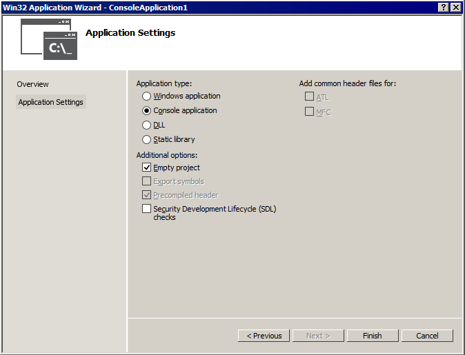
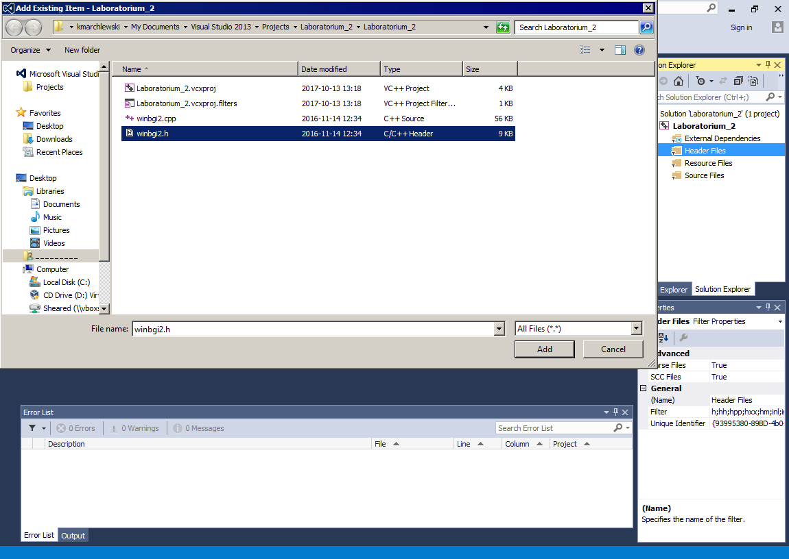
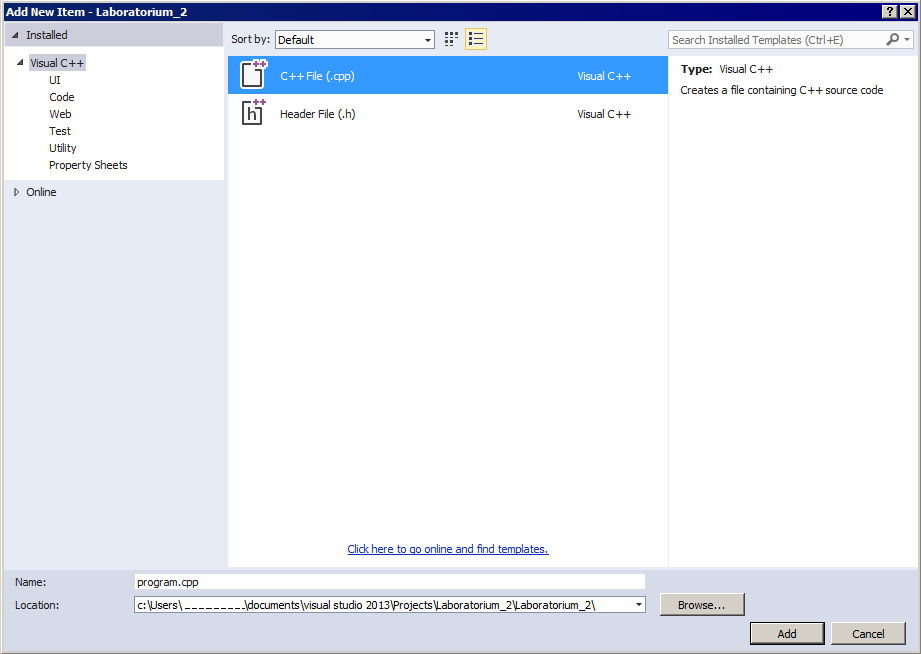

# Tworzenie nowego projektu w programie Microsoft Visual Studio 2013

Instrukcja opisuje w jaki sposób stworzyć nowy projekt w programie Microsoft Visual Studio 2013 wraz z biblioteką graficzną `winbgi2`.

1. Otwórz program Microsoft Visual Studio.
2. Uruchom link *New project* znajdujący się pod nagłówkiem *Start*.
Jeśli strona startowa nie wyświetli się, wybierz z menu głównego *File* -> *New Project*.
    - Po rozwinięciu listy *Templates* wybierz *Visual C++*.
    W głównej części ekranu pojawią się cztery typy projektów.
    Wybierz *Win32 Console Application*
    - Uzupełnij pole *Name* wybraną nazwą projektu i pole *Location* ścieżką do swojego katalogu.
Okno programu powinno wyglądać tak, jak poniżej:


3. Kliknij *OK*, a w kolejnym oknie *Next >*.
Wyświetlone zostanie okno *Application Settings*, w którym:
    - Na liście *Application type* sprawdź czy zaznaczona jest opcja *Console application*.
    - Na liście *Additional options* zaznacz opcję *Empty project* i odznacz opcję *Security Development (...)*.
Okno programu powinno wyglądać tak, jak poniżej:



4. Kliknij *Finish*.
W katalogu, który wybrałeś jako miejsce dla utworzenia projektu, powstał folder o wybranej przez Ciebie nazwie.
Otwórz go.
Znajdują się w nim pliki, które w tym momencie nas nie interesują, oraz katalog o nazwie takiej samej jak nazwa katalogu nadrzędnego.
Otwórz go.
Znajdujesz się teraz w katalogu projektu, który zawiera tylko dwa pliki *\*.wcxproj* i *\*.wcxproj.filters*.

5. Wybierz pliki biblioteki graficznej *winbgi2.cpp* oraz *winbgi2.h* i skopiuj je do katalogu projektu.
Katalog powinien wyglądać następująco:


6. Wróć do programu Miscrosoft Visual Studio i zarejestruj pliki biblioteki graficznej.
W tym celu znajdź panel *Solution Explorer*.
Zawiera on pliki należące do Twojego projektu.
Kliknij na *Header Files*, wybierz *Add* a następnie *Existing Item*.


7. Otworzy się okno eksploratora, w którym należy wybrać plik nagłówkowy *winbgi2.h*.



8. Wykonaj tą samą procedurę dla pliku źródłowego.
Tym razem kliknij na *Source Files* i wybierz dodawanie nowego pliku.
Po otwarciu eksploratora wskaż *winbgi2.cpp*.

9. Ostatnim krokiem będzie dodanie pliku źródłowego, w którym będzie znajdował się kod naszego programu.
Kliknij na *Source Files*, wybierz *Add* i *New Item*.
Otworzy się okno wyboru typu pliku, w którym należy wskazać *C++ File (.cpp)*.
W polu *Name* wpisz wybraną nazwę (przykładowo **program.cpp**) i kliknij *Add*.



10. Ostatecznie okno projektu powinno wyglądać następująco:


11. Kliknij na plik źródłowy z kodem programu (w naszym przykładzie **program.cpp**) i wpisz przykładowy kod:


Instrukcje oznaczają odpowiednio:
```c++
#define _CRT_SECURE_NO_WARNINGS  // Wylaczenie ostrzezen dotyczacych funkcji 
                                 // scanf(), printf(), itd.
#include <stdio.h>               // Dolaczenie biblioteki z funkcjami wejscia/wyjscia
#include <math.h>                // Dolaczenie biblioteki z funkcjami matematycznymi
#include "winbgi2.h"             // Dolaczenie biblioteki graficznej

void main() {
  graphics(220, 220);            // Otworzenie okna do rysowania
  circle(110, 110, 25);          // Narysowanie kolka
  wait();                        // Oczekiwanie z zamknieciem okna do momentu gdy
                                 // uzytkownik nacisnie dowolny klawisz
}
```

12. Biblioteka graficzna wymaga zmiany jednego ze standardowych ustawień.
W tym celu klikamy na *PROJECT* a następnie na *Nazwa Projektu Properties*.


13. W nowo otwartym oknie rozwijamy listę *Configuration Properties*, wybieramy opcję *General*, klikamy w prostokąt obok pola *Character Set* -- pojawi się strzałka symbolizująca listę, rozwijamy ją i wybieramy opcję *Use Multi-Byte Character Set*.
Wybór zatwierdzamy klikając *OK*.


14. Program jest gotowy do skompilowania i uruchomienia.
Robimy to przez kliknięcie klawiszy `Ctrl` + `F5` lub przez rozwinięcie menu *DEBUG* i kliknięcie *Start Without Debbuging*.
Po kompilacji program automatycznie się uruchamia:


