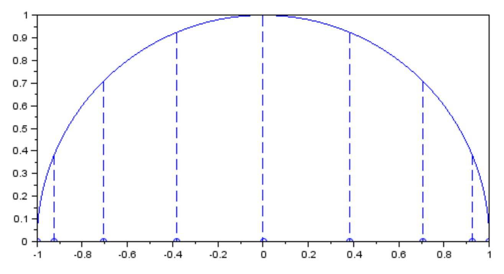

# Interpolacja


## Interpolacja w praktyce inżynierskiej

Dziś będziemy się zajmować zagadnieniem interpolacji. Załóżmy, że w pewnym urządzeniu technicznym ze zbiornika, który może być umieszczony na różnej wysokości rurą wypływa woda aż do jego opróżnienia. Wykonaliśmy eksperyment, umieszczając rzeczony zbiornik na kilku różnych wysokościach (np. 2, 3 i 4 m) i dla każdej z tych wysokości dokonaliśmy pomiaru czasu, po jakim następuje opróżnienie zbiornika. W procesie projektowania (może optymalizacji?) zależy nam zwykle na tym, by umieć przewidzieć ten czas dla dowolnej wysokości umieszczenia zbiornika, która zawiera się między skrajnymi, a więc np. na wysokości wynoszącej 3.27 m. Musimy więc przez nasze dane pomiarowe umieć przeprowadzić krzywą, która wiarygodnie przybliży taką zależność. Mówimy wtedy o interpolacji, czyli interpolowaniu zbioru dyskretnych (punktowych) danych w ciągłą zależność określoną dla każdego argumentu leżącego między skrajnymi punktami, na których opieramy interpolację.

#### Meritum
Interpolacja to zagadnienie przeprowadzenia krzywej (pewnej zależności) przez wszystkie (!!!) punkty ze zbioru danych tak, aby otrzymać przebieg domniemanej zależności między punktami pomiarowymi. Tzn., że liczba stopni swobody dopasowanej krzywej musi być równa liczbie punktów w zbiorze danych (liczba równań musi być równa liczbie niewiadomych).

## Interpolacja wielomianowa

W tym momencie przejdziemy do zbadania działania interpolacji wielomianowej
Lagrange’a. Funkcja interpolująca to wielomian.

### Ćwiczenia
1. Napisz program, który wygeneruje zestaw n punktów (udających punkty eksperymentalne) o współrzędnych $[x_i, exp(-x_i^2)]$,
gdzie $x_i = a + i \cdot h$
$h = \frac{b-a}{n-1}$
$i=0,...,n-1$
zaś $a=-2, b=2$.

   Może być Ci przydatne przypomnienie użycia funkcji `malloc` do alokacji pamięci:
```c++
double *x;
x = (double*)malloc(n*sizeof(double));
free(x);
```

2. Obliczy wartość wielomianu interpolacyjnego Lagrange’a w punktach rozmieszczonych czterokrotnie gęściej, tzn. dla $t_i=a+\frac{i\cdot h}{4}, i=0,...,4n-4$. Wartość funkcji w dowolnie wybranym punkcie (dla argumentu xx leżącego w dowolnym miejscu między danymi punktami) oblicz, korzystając z funkcji `lagrange(double *x, double *y, int n, double xx)`. Przykład najprostszego użycia funkcji `lagrange` pokazany jest poniżej.
```c++
int main()
{
    double x[3] = {0, 1, 2};
    double y[3] = {0, 1, 4};
    double f, t = 1.5
    // Wyznacz wartosc paraboli dla t = 1.5
    f = lagrange(x, y, 3, t);
}
```

3. Wydrukuj te wyniki (dla każdego $t$) na ekran.

4. Wyświetl je graficznie, korzystając z nowej funkcji zaimplementowanej w bibliotece graficznej. Kod poniżej pokazuje prosty przykład wyświetlenia wykresu funkcji sinus.
```c++
int main()
{
    graphics(600, 400);scale(0, 7, -1.2, 1.2); // okresl xmin, xmax, ymin, ymax
    double x = 0;
    while(x<6.28)
    {
        point(x, sin(x));
        x += 0.01;
    }
}
```

5. Zapisz wyniki do pliku.

6. Obejrzyj wyniki na wykresie dla różnych wartości parametru n.

7. Dla wybranego n stwórz w Excelu wykres błędu interpolacji.

8. Powtórz wyniki dla innej funkcji interpolowanej. Przyjrzyj się dokładnie wynikom otrzymanym dla funkcji |x|. Dlaczego tak wyglądają?

#### Uwaga
Parametry funkcji `lagrange(double *x, double *y, int n, double xx)` to:
- `x,y` - wskaźniki do $n$-elementowych tablic zawierających współrzędne punktów interpolowanych,
- `n` - rozmiar wektora (liczbę jego elementów),
- `xx` - bieżącą wartość argumentu (zmienna rzeczywista), dla którego obliczamy wartość wielomianu Lagrange’a.

### Dla ambitnych
Sprawdźmy, czy można coś zrobić, aby poprawić zachowanie i stabilność interpolacji wielomianowej. Posłużymy się w tym celu dalej funkcją $|x|$ jako jedną z bardziej wymagających.


#### Węzły Czebyszewa
Spróbujmy oprzeć naszą interpolację na punktach, których odcięte będą dobrane w odpowiedni sposób. Do tej pory punkty były rozłożone równomiernie. Teraz je rozłóżmy w taki sposób, aby były gęściej rozłożone przy brzegach ob-
szaru i rzadziej w środku. Można tego dokonać nastepująco. Chcemy rozłożyć punkty w przedziale $x = [−1, 1]$. Wykreślmy zatem półokrąg o środku w połowie tego przedziału i promieniu równym połowie długości przedziału (czyli u nas półokrąg o środku w $x = 0$ i promieniu $R = 1$). Podzielmy łuk równomiernie (mierząc wzdłuż łuku) na $n − 1$ fragmentów. Teraz zrzutujmy punkty podziału na oś $x$. Tak wygenerowane węzły mają więc współrzędne (wyprowadź w domu na spokojnie ten wzór - to dość proste) $x$-owe dane wzorem:
$$
x_i = -cos(\frac{i \cdot \pi}{n-1}),  i=0,...,n-1
$$
Dla ogólnego przypadku przedziału x = [a, b] wzór wyglądałby tak:
$$
x_i = - \frac{b-a}{2} cos(\frac{i \cdot \pi}{n-1}) + \frac{a+b}{2},  i=0,...,n-1
$$

#### Ćwiczenie
Zmodyfikuj swój program tak, aby początkowy zestaw punktów generował dla współrzędnych zdefiniowanych w powyższy sposób. Wystarczy zmienić jedną linię kodu. Sprawdź działanie interpolacji funkcji $|x|$ z użyciem węzłów Czebyszewa. Czy wyniki są inne?