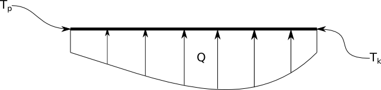

# Metoda eliminacji Gaussa

Pliki do wykorzystania w poniższym ćwiczeniu można pobrać za pomocą poniższych linków:

- [Plik nagłówkowy gauss.h](http://ccfd.github.io/courses/code/info2/gauss.h)
- [Plik źródłowy gauss.cpp](http://ccfd.github.io/courses/code/info2/gauss.cpp)

W ramach niniejszego ćwiczenia można:

1. Rozwiązać układ równań, w którym występuje macierz Hilberta.
Zadanie ma pokazać jak uwarunkowanie układu wpływa na numeryczną poprawność eliminacji Gaussa.
2. Rozwiązać zagadnienie rozkładu temperatury w pręcie.
Zadanie ma pokazać jak rozwiązać "rzeczywiste" zagadnienie wykorzystując eliminację Gaussa.

**Wybór zadania zależy od prowadzącego ćwiczenia.**

## Zadanie 1: macierz Hilberta

Macierz Hilberta jest macierzą, której uwarunkowanie rośnie wyjątkowo szybko z wymiarem.
Oznacza to, że za pomocą metod numerycznych prawidłowe rozwiązanie układu, w którym występuje taka macierz, można uzyskać tylko dla niewielkich rozmiarów macierzy.

Rozwiąż układ równań $Hx=b$, w którym:

- $H$ jest macierzą Hilberta o elementach $h_{ij} = \frac{1}{1+i+j}$, $i,j = \{0,1,\ldots,N-1 \}$,
- $x$ to szukane rozwiązanie,
- $b$ to wektor prawych stron, w którym elementy to sumy $b_{i} = \sum_{j=0}^{N-1}h_{ij}$.

Taki układ ma analityczne rozwiązanie.
Jakie ono jest?

### Ćwiczenia

1. Zaalokuj dynamicznie pamięć na dwuwymiarową tablicę $H$ o wymiarze $N\times N$ w celu przechowywania elementów macierzy Hilberta.
2. Zaalokuj dynamicznie pamięć na wektory $b$ oraz $x$.
3. Napisz funkcję o nagłówku
```c++
void HilbertMatrix(int N, double **H);
```
która tworzy macierz Hilberta $H$.

4. Napisz funkcję o nagłówku
```c++
void displayMatrix(int N, double **H);
```
która drukuje macierz $H$ na ekranie.

5. Napisz funkcję
```c++
void computeVec(int N, double **H, double *b);
```
która oblicza wektor prawych stron $b$ oraz funkcję
```c++
void plotVec(int N, double *v);
```
która drukuje wektor $v$ na ekranie.

6. Zastosuj funkcję realizującą metodę eliminacji Gaussa do rozwiązania układu równań $Hx=b$.
Nagłówek funkcji jest postaci
```c++
void gauss(int N, double **A, double *x, double *b);
```
gdzie:

- $N$ to liczba równań,
- $A$ to macierz układu równań,
- $x$ to wektor, w którym zostanie zapisane rozwiązanie,
- $b$ to wektor prawych stron.
    
7. Przetestuj działanie programu dla różnych wartości $N$.  
8. Jak zmiana typu zmiennych wpływa na dokładność obliczeń?

## Zadanie 2: rozkład temperatury w pręcie

## 1. Wstęp
Niniejsze zadanie pozwoli na zapoznanie się z jedną z metod numerycznych służących do rozwiązywania układów równań liniowych.
Metody te mają niesłychane znaczenie w kontekście praktycznie wszystkich zagadnień mechaniki, od kinematyki po złożone problemy mechaniki ośrodków ciągłych.
Większość problemów z jakimi mamy do czynienia sprowadza się do opisu zjawiska za pomocą jakiegoś typu równań czy to algebraicznych, czy różniczkowych.
Człowiek, dzięki abstrakcyjnemu myśleniu, potrafi sobie radzić z różnymi ich typami.
Niestety nie jest tak w przypadku komputerów.
One, będąc maszynami liczącymi, świetnie sobie radzą w przypadku wykonywania prostych algebraicznych operacji.
"Rozumieją" podstawowe pojęcie liczb oraz operacji algebraicznych, takich jak dodawanie, odejmowanie czy mnożenie.
Jednak nie radzą już sobie z problemami bardziej złożonymi, takimi jak pojęcie funkcji ciągłej, różniczkowania.
Oczywiście za pomocą odpowiedniego kodu możne w pewnym sensie nauczyć je dokonywania różniczkowania, ale to wciąż będzie wykonane za pomocą przekształceń algebraicznych.
Biorąc pod uwagę zarówno zalety jak i ograniczenia takich maszyn, ludzkość skierowała swoją uwagę na rozwiązywanie problemów na sposób przybliżony.
Nie staramy się już rozwiązać problemu opisanego za pomocą abstrakcyjnych tworów matematycznych, lecz przybliżamy je czymś co w wykazuje podobne cechy ale za to daje się rozwiązać przy wykorzystaniu komputerów.
Jednym z przykładów takiego uproszczenia są metody poznane na poprzednich zajęciach - rozwiązywania równań nieliniowych czy jawnego całkowania równań różniczkowych.
W tych przypadkach ostateczne rozwiązanie sprowadzało się do zapisania odpowiedniego schematu iteracyjnego.
Oprócz tego typu metod zostały także opracowane takie których rozwiązywanie sprowadza się do rozwiązania bardzo dużego układu równań liniowych:
$$
A \cdot x = b
$$
gdzie:

- $A$ to macierz układu równań,
- $x$ to wektor niewiadomych a
- $b$ to wektor prawych stron układu równań.

Jedną z takich metod jest metoda różnic skończonych.
Jej sformułowanie polega na zastąpieniu odpowiednich pochodnych za pomocą różnic pomiędzy wartościami w ściśle przewidzianych punktach.
Takie podejście w ostateczności prowadzi do przeformułowania problemu z równania różniczkowego do dużego układu algebraicznych równań liniowych (takie przeformułowanie nazywamy dyskretyzacją równań).
Rozwiązanie takiego układu - znalezienie nieznanego wektora niewiadomych $x$ - wymaga dokonania odwrócenia macierzy $A$ i przemnożenia jej lewostronnie z wektorem $b$:
$$
x = A^{-1}
\cdot b
$$
Na zajęciach z algebry poznali Państwo metodę odwracania macierzy, która była oparta na obliczaniu wyznaczników dopełnień algebraicznych.
Metoda ta, choć poprawna, jest niestety bardzo kosztowna.
Aby obliczyć wyznacznik dopełnienia należy uprzednio znów obliczyć zbiór wyznaczników macierzy o rozmiarze o jeden mniejszej.
W praktyce nie jesteśmy zainteresowani znalezieniem postaci odwrotności macierzy $A$ tylko znalezieniem takiego $x$ który będzie spełniał postawiony układ równań.
Do takiego zadania z kolei bardzo dobrze się nadaje metoda **eliminacji Gaussa**.
Metoda ta pozwala efektywnie obliczyć wartości wektora $x$, lecz jawnie nie wyznacza odwrotności macierzy $A$.

W dalszej części ćwiczeń wykonamy dwa zadania.
Pierwsze zadanie będzie polegało na przygotowaniu odpowiedniego układu równań liniowych - czyli przygotowaniu macierzy układu $A$ oraz wektora prawych stron $b$.
Obie te wielkości zostaną utworzone jako rezultat zastosowania metody różnic skończonych dla jednowymiarowego równania ustalonego przewodnictwa ciepła.
W drugiej części ćwiczeń zajmiemy się rozwiązaniem tego układu równań za pomocą rzeczonej metody eliminacji Gaussa.
Wynikiem rozwiązania takiego układu równań będzie rozkład wartości temperatury wzdłuż ogrzewanego pręta.

## 2. Przygotowanie układu równań

Na początek zajmijmy się przygotowaniem układu równań.
Tak jak już na początku wspomnieliśmy powstanie on jako wynik dyskretyzacji równania przewodnictwa cieplnego:


Problem który chcemy rozwiązać to rozkład temperatury w stalowym pręcie o długości $L=1[m]$ i przewodności cieplnej $\lambda=58[\frac{W}{mK}]$.
Pręt jest ogrzewany za pomocą źródła ciepła zmieniającego się wzdłuż pręta - $Q= - 10^4 \cdot sin(x\pi)[\frac{W}{m^3}]$.
Ponadto na obu końcach pręta utrzymywane są stałe temperatury $T_p=273[K]$ i $T_k=300[K]$. 

Proces ten opisuje następujące równanie:
$$ \lambda \frac{d^2T}{dx^2} = Q(x) $$
Biorąc pod uwagę stałą wartość przewodności możemy zapisać równanie jako:
$$ \frac{d^2T}{dx^2} = \frac{Q(x)}{\lambda} $$
Aby w pełni sformułować nasz problem należy wziąć pod uwagę warunki brzegowe postawione dla tego zagadnienia:
$$ T(x=0) = T_p $$
$$ T(x=L) = T_k $$

W celu rozwiązania tego problemu metodą różnic skończonych musimy go przeformułować do postaci układu równań liniowych.
Na początek musimy dokonać dyskretyzacji przestrzennej zagadnienia.
W tym celu musimy podzielić obszar obliczeniowy (długość pręta $L=1[m]$) [0, 1] na $N$ odcinków, tak jak to pokazano no poniższym rysunku.


Punkty $x_0, x_1, \ldots x_N$ będziemy nazywali węzłami siatki obliczeniowej.
Na tą chwilę, możemy założyć, że wszystkie punkty (łącznie jest ich N+1) są równo oddalone, tj. zachodzi $x_{i+1}-x_i = h$, gdzie $h$ ma stałą, ustaloną wartość równą:
$$h = \frac{1}{N}$$

Zanim przejdziemy do dyskretyzacji równania, wprowadźmy następujące oznaczenie: 
$$ T = [T_0, T_1, T_2, T_3, ..., T_N]^T$$
gdzie $T$ jest wektorem przechowującym wartości rozwiązania (wartości funkcji $T=T(x)$) w kolejnych punktach siatki obliczeniowej. 

Teraz przypomnijmy sobie jak wygląda definicja pochodnej funkcji:
$$ \frac{dT}{dx} = \lim_{dx\to 0}{\frac{T(x+dx)-T(x)}{dx}}$$

Komputer nie potrafi operować na nieskończenie małych liczbach, dlatego należy wprowadzić przybliżenie w postaci skończonego przyrostu $h$ (liczby małej, ale skończonej):
$$\frac{dT}{dx} \approx \frac{T(x+h)-T(x)}{h}$$

W powyższym równaniu pojawia się pewien problem: dla jakiej wartości zmiennej $x$ powyższe przybliżenie odwzorowuje pochodną, dla $x$, $x+h$ czy może $x+\frac{h}{2}$? Tak na prawdę powyższe przybliżenie będzie prawdziwe dla każdej z wymienionych wartości $x$, z racji tego, że jest to tylko przybliżenie.
Jeśli przyjmiemy, że jest to przybliżenie $\frac{dT}{dx}(x)$ to skończymy z poznanym na poprzednich zajęciach jawnym schematem Eulera.
Jeśli założymy, że jest to $\frac{dT}{dx}(x+h)$ otrzymamy niejawny schemat Eulera (nie da się tak łatwo go zastosować jak to robiliśmy poprzednio).
Nas jednak w tej chwili interesuje założenie, że taka różnica $\frac{T(x+h)-T(x)}{h}$ odwzorowuje wartość pochodnej $\frac{dT}{dx}(x+\frac{h}{2})$.
Można udowodnić, że takie założenie, tzw. schematu centralnego, jest bardziej dokładne i w rezultacie daje nam schemat drugiego rzędu dokładności (rząd dokładności określa z jaką potęgą zmienia się błąd przybliżenia przy zmianie wielkości kroku $h$). 

Z racji tego, że nasz wyjściowy problem jest opisany przez drugą pochodną $\frac{d^2T}{dx^2}$ spróbujmy zastosować powyższe przybliżenie ponownie.
Wprowadźmy oznaczenie $\frac{dT}{dx} = Y$, wtedy nasz wyjściowy problem będzie wyglądał tak:
$$\frac{dY}{dx} = \frac{Q(x)}{\lambda}$$
Zastosujmy nasze przybliżenie dla funkcji $Y$ wykorzystując założenie o pochodnej centralnej:
$$\frac{Y(x+\frac{h}{2})-Y(x-\frac{h}{2})}{h} = \frac{Q(x)}{\lambda}$$
Zastosujmy ponownie pochodną centralną, ale teraz dla wartości pochodnej $Y(x+\frac{h}{2})=\frac{dT}{dx}(x+\frac{h}{2})$ oraz $Y(x-\frac{h}{2})\frac{dT}{dx}(x-\frac{h}{2})$:
$$
Y(x+\frac{h}{2}) = \frac{T(x+h)-T(x)}{h}\\
Y(x-\frac{h}{2}) = \frac{T(x)-T(x-h)}{h}
$$
Podstawiając powyższe do wzoru wyjściowego otrzymamy:
$$\frac{\frac{T(x+h)-T(x)}{h} - \frac{T(x)-T(x-h)}{h}}{h} = \frac{T(x+h)-2\cdot T(x)+T(x-h)}{h^2} = \frac{Q(x)}{\lambda}$$

Powyższy wzór jest przybliżeniem drugiej pochodnej za pomocą wartości rozwiązania w 3 punktach: $x-h, x, x+h$.
Powyższy schemat jest przybliżeniem drugiego rzędu, co zapewnia dużą dokładność odwzorowania pochodnej.
Równanie to wykorzystamy w celu przygotowania odpowiedniego układu równań.
Zanim przejdziemy do ostatecznego sformułowania układu równań przemnóżmy zaproponowane równanie przez $h^2$:
$$ T(x+h) - 2T(x) + T(x-h) = \frac{Q(x)}{\lambda}h^2 $$
Wróćmy do obrazka przedstawiającego dyskretyzację.
Weźmy pod uwagę węzły o numerach od 1,...,N-1.
Jeśli podstawimy kolejne $x_i$ do równania powyżej, to otrzymamy zestaw następujących równań:
$$
T_2 - 2 \cdot T_1 + T_0 = \frac{Q(x_1)}{\lambda} \cdot h^2 \\
T_3 - 2 \cdot T_2 + T_1 = \frac{Q(x_2)}{\lambda} \cdot h^2 \\
T_4 - 2 \cdot T_3 + T_2 = \frac{Q(x_3)}{\lambda} \cdot h^2 \\
. \\
. \\
. \\
T_N - 2 \cdot T_{N-1} + T_{N-2} = \frac{Q(x_{N-1})}{\lambda} \cdot h^2
$$
Umyślnie pominięte zostały węzły $0$ i $N$, ponieważ dla nich trudno jest napisać równanie, skoro nie istnieją węzły $x_{-1}$ i $x_{N+1}$ - nimi zajmiemy się później.
Teraz należy zwrócić uwagę na samą postać uzyskanych równań.
Każde z nich wiąże 3 niewiadome wielkości, oznaczane jako $T_{i+1}, T_{i}, T_{i-1}$.
Są to wartości poszukiwanej funkcji w odpowiadających im węzłach.
Wprowadźmy jeszcze jedno oznaczenie:
$$ F_i = \frac{Q(x_i)}{\lambda} \cdot h^2$$
Wtedy kolejne równanie będzie miało postać:
$$ T_{i+1} - 2 \cdot T_i + T_{i-1} = F_i $$
Jak widać, jest to proste równanie liniowe wiążące 3 niewiadome i znaną wielkość $F_i$.
Jeśli zbierzemy wielkości $T_i$ w jednym dużym wektorze $T$, tak jak to przyjęliśmy na początku, zbiór równań dla $i=1,2,..N-1$ możemy zapisać w postaci macierzowej:
$$ K \cdot T = F$$
gdzie $K$ określa odpowiednią macierz współczynników:
$$
\begin{bmatrix}
1 & -2 & 1 & 0 & \dots & \dots & \dots & 0\\
0 & 1 & -2 & 1 & 0 & \dots & \dots & 0\\
0 & 0 & 1 & -2 & 1 & 0 & \dots & 0\\
\vdots & \ddots & \ddots & \ddots & \ddots & \ddots & \ddots &  0\\
0 & \dots & \dots & \dots & \dots & & 1 & -2 & 1 
\end{bmatrix}
\times
\begin{bmatrix}
T_0 \\
T_1 \\
T_2 \\
\vdots \\
T_{N}
\end{bmatrix}
=
\begin{bmatrix}
F_1 \\
F_2 \\
\vdots \\
F_{N-1}
\end{bmatrix}
$$

Powyższy układ równań nie jest jeszcze skończony.
Jak łatwo zauważyć, macierz nie jest kwadratowa, ponieważ brakuje nam dwóch równań odpowiadających węzłom $x_0$ i $x_N$.
Jest to miejsce w którym powinniśmy wziąć pod uwagę warunki brzegowe.
Zgodnie z postawionym problemem mamy:
$$
T(x=x_0) = T_0 = T_p = 273\\
T(x=x_N) = T_N = T_k = 300
$$
W zasadzie powyższe stwierdzenie jest wystarczające aby uznać je za równanie, które w istocie jest wyraża równość.
Można jednak zrobić też inaczej.
Uznać wartości $T_0$ i $T_N$ jako znane i wyeliminować pierwszą oraz ostatnią kolumnę z układu równań.
Iloczyn odpowiedniego współczynnika i znanej wielkości powinien wtedy powędrować do wektora prawych stron $F$.
W naszym przypadku, z uwagi na uproszczenie kodu, po prostu dopiszemy 2 dodatkowe równania od układu równań modyfikując macierz oraz wektor prawych stron:

$$
\begin{bmatrix}
1 & 0 & 0 & 0 & \dots & \dots & \dots & 0\\
1 & -2 & 1 & 0 & \dots & \dots & \dots & 0\\
0 & 1 & -2 & 1 & 0 & \dots & \dots & 0\\
0 & 0 & 1 & -2 & 1 & 0 & \dots & 0\\
\vdots & \ddots & \ddots & \ddots & \ddots & \ddots & \ddots &  0\\
0 & \dots & \dots & \dots & \dots  & 1 & -2 & 1\\
0 & \dots & \dots & \dots & \dots & \dots & \dots & 1\\
\end{bmatrix}
\times
\begin{bmatrix}
T_0 \\
T_1 \\
T_2 \\
\vdots \\
T_{N-1}\\
T_{N}
\end{bmatrix}
=
\begin{bmatrix}
273 \\
\frac{Q(x_1)}{\lambda} \cdot h^2 \\
\frac{Q(x_2)}{\lambda} \cdot h^2 \\
\vdots \\
\frac{Q(x_{N-1})}{\lambda} \cdot h^2 \\
300
\end{bmatrix}
$$

### Ćwiczenia

1. Zaalokuj dynamicznie pamięć na macierz $K$.
Pamiętaj, że liczba punktów dyskretyzacji jest równa $N+1$ dla zaprezentowanego przykładu.
2. Zaalokuj dynamicznie pamięć na wektor prawych stron $F$ oraz wektor poszukiwanego rozwiązania $T$.
3. Napisz funkcję, która posłuży do uzupełnienia macierzy $K$.
Nagłówek funkcji powinien mieć postać:
```c++
void computeMatrix(int N, double **K);
```
Uzupełnij macierz $K$.

4. Napisz funkcję służącą do wyświetlania macierzy $K$ o nagłówku:
```c++
void displayMatrix(int n, double **K);
```
Sprawdź czy uzyskana macierz jest odpowiednio utworzona.

5. Napisz funkcję, która posłuży do uzupełnienia wektora prawych stron $F$.
Nagłówek funkcji powinien mieć postać:
```c++
void computeVector(int N, double *F);
```
Uzupełnij wektor $F$.

6. Napisz funkcję służącą do wyświetlania wektorów $F$ oraz $T$ o nagłówku:
```c++
void displayVector(int n, double *F);
```
Sprawdź czy wektor $F$ jest poprawnie utworzony.

## 3. Rozwiązanie układu równań

Przejdźmy teraz do ostatniej części ćwiczeń - rozwiązania układu równań.
W wyniku tego działania otrzymamy tablicę $T$ przechowującą wartości rozwiązania problemu przewodnictwa ciepła w z góry narzuconych punktach.

### Ćwiczenia

1. Zastosuj funkcję realizującą metodę eliminacji Gaussa do rozwiązania powyższego układu równań.
Nagłówek funkcji jest postaci:
```c++
void gauss(int N, double **A, double *x, double *b);
```
gdzie:

- $N$ to liczba równań,
- $A$ to macierz układu równań,
- $x$ to wektor, w którym zostanie zapisane rozwiązanie,
- $b$ to wektor prawych stron.

2. Sporządź wykres funkcji $T=T(x)$ wykorzystując bibliotekę graficzną.
Dla liczby podziałów $N = 20$ (21 punktów) powinieneś uzyskać wynik podobny do zaprezentowanego poniżej
```{r, echo=FALSE}
N = 20
lambda = 58
h = 1./N
K = diag(x=-2, nrow=N+1, ncol=N+1)
K[row(K) == col(K) + 1] = 1
K[row(K)+1 == col(K) ] = 1
K[1,]=0
K[1,1]=1
K[N+1,]=0
K[N+1,N+1]=1
x = matrix(seq(from=0, to=1., by=h))
F = apply(x*pi,1,sin)
F = -1e4*F/lambda*(h*h)
F[1] = 273
F[N+1] = 300
T = solve(K,F)
plot(x,T, "l", ylab = "T(x)")
points(x,T)
grid()
```

3. Przetestuj działanie programu dla różnych `N` (nie przesadź, ponieważ metoda Gaussa nie jest metodą optymalną do tego typu problemów).

4. Oblicz wartość wyznacznika macierzy $K$.
