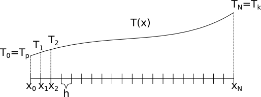

# Metoda eliminacji Gaussa

Pliki do wykorzystania w poniższym ćwiczenie można pobrać za pomocą poniższych linków:

 - [Plik nagłówkowy gauss.h](http://ccfd.github.io/courses/code/info2/gauss.h)
 - [Plik źródłowy gauss.cpp](http://ccfd.github.io/courses/code/info2/gauss.cpp)

## 1. Wstęp
W trakcie poniższych zajęć zapoznamy się z jedną z metod numerycznych służących do rozwiązywania układów równań liniowych. Metody te mają niesłychane znaczenie w kontekście praktycznie wszystkich zagadnień mechaniki, od kinematyki po złożone problemy mechaniki ośrodków ciągłych. Większość problemów z jakimi mamy doczynienia sprowadzają się do opisu zjawiska za pomocą jakiegoś typu równań, czy to algebraicznych czy różniczkowych. Człowiek, dzięki abstrakcyjnemu myśleniu, potrafi sobie radzić z różnymi ich typami. Niestety nie jest tak w przypadku komputerów. One, będąc maszynami liczącymi, świetnie sobie radzą w przypadku wykonywania prostych algebraicznych operacji. "Rozumieją" podstawowe pojęcie liczb oraz operacji algebraicznych, takich jak dodawanie, odejmowanie czy mnożenie. Jednak nie radzą już sobie z problemami bardziej złożonymi, takimi jak pojęcie funkcji ciągłej, różniczkowania. Oczywiście za pomocą odpowiedniego kodu możne w pewnym sensie nauczyć je dokonywania różniczkowania, ale to wciąż będzie wykonane za pomocą przekształceń algebraicznych. Biorąc pod uwagę zarówno zalety jak i ograniczenia takich maszyn, ludzkość skierowała swoją uwagę na rozwiązywanie problemów na sposób przybliżony. Nie staramy się już rozwiązać problemu opisanego za pomocą abstrakcyjnych tworów matematycznych, lecz przybliżamy je czymś co w wykazuje podobne cechy ale za to daje się rozwiązać przy wykorzystaniu komputerów. Jednym z przykładów takiego uproszczenia są metody poznane na poprzednich zajęciach - rozwiązywania równań nieliniowych czy jawnego całkowania równań różniczkowych. W tych przypadkach ostateczne rozwiązanie sprowadzało się do zapisania odpowiedniego schematu iteracyjnego. Oprócz tego typu metod zostały także opracowane takie których rozwiązywanie sprowadza sisę do rozwiązania bardzo dużego układu równań liniowych:
$$ A \cdot x = b $$
gdzie: $A$ to macierz układu równań, $x$ to wektor niewiadomych a $b$ to wektor prawych stron układu równań. Jedną z takich metod jest metoda różnic skończonych. Jej sformułowanie polega na zastąpieniu odpowiednich pochodnych za pomocą różnic pomiędzy wartościami w ściśle przewidzianych punktach. Takie podejści w ostateczności prowadzi do przeformułowania problemu z równania różniczkowego do dużego układu algebraicznych równań liniowych (Takie przeformułowanie nazywamy dyskretyzacją równań). Rozwiązanie takiego układu - znalezienie nieznanego wektora niewiadomych $x$ - wymaga dokonania odwrócenia macierzy $A$ i przemnożenia jej lewostronnie z wektorem $b$:
$$ x = A^{-1}\cdot b$$
Na zajęciach z algebry poznali Państow metodę odwracania maciarzy, która była oparta na obliczaniu wyznaczników dopełnień algebraicznych. Metoda ta, choć poprawna, jest niestety bardzo kosztowna. Aby obliczyć wyznacznik dopełnienia należy uprzednio znów obliczyć zbiór wyznaczników macierzy o rozmiarze o jeden mniejszej. W praktyce nie jesteśmy zainteresowani znalezieniem postaci odwrotności macierzy $A$ tylko znalezieniem takiego $x$ który będzie spełniał postawiony układ równań. Do takiego zadania z kolei bardzo dobrze się nadaje metoda **eliminacji Gaussa**. Metoda ta pozwala efektywnie obliczyć wartości wektora $x$, lecz jawnie nie wyznacza odwrotności macierzy $A$. 

W daleszej części ćwiczeń wykonamy dwa zadania. Pierwsze zadanie będzie polegało na przygotowaniu odpowiedniego układu równań liniowych - czyli przygotowaniu macierzy układu $A$ oraz wektora prawych stron $b$. Obie te wielkości zostaną utworzone jako rezultat zastosowania metody różnic skończonych dla jednowymiarowego równania ustalonego przewodnictwa ciepła. W drugiej części ćwiczeń zajmiemy się rozwiązaniem tego układu równań za pomocą rzeczonej metody eliminacji Gaussa. Wynikiem rozwiązania takiego układu równań będzie rozkład wartości temperatury wzdłuż ogrzewanego pręta. 


## 2. Przygotowanie układu równań

Na początek zajmijmy się przygotowaniem układu równań. Tak jak już na początku wspomnieliśmy powstanie on jako wynik dyskretyzacji równania przewodnictwa cieplnego:


Problem który chcemy rozwiązać to rozkład temperatury w stalowym pręcie o długości $L=1[m]$ i przewodności cieplnej $\lambda=58[\frac{W}{mK}]$. Pręt jest ogrzewany za pomocą źródła ciepła zmieniającego się wzdłuż pręta - $Q=sin(\frac{x}{\pi})[\frac{W}{m^3}]$. Ponadto na obu końcach pręta utrzymywne są stałe temperatura $T_1=273[K]$ i $T_2=300[K]$. 

Proces ten opisuje następujące równanie:
$$ \lambda \frac{d^2T}{dx^2} = Q(x) $$
Biorąc pod uwagę stałą wartość przewodności możemy zapisać równanie jako:
$$ \frac{d^2T}{dx^2} = \frac{Q(x)}{\lambda} $$
Biorąc pod uwage temperatury na końcach pręta można sformułować warunki brzegowe dla tego zagadnienia:
$$ T(x=0) = T_p $$
$$ T(x=L) = T_k $$

Aby rozwiązać ten problem musimy go przeformułować do postaci układu równań liniowych za pomocą metody różnic skończonych. W naszym przypadku mamy tylko jedną 




## 3. Rozwiązanie układu równań


## Ćwiczenia
1. Macierz $A$ i wektor $b$ zadeklaruj statycznie dla maksymalnie $N = 50$ elementów.
2. Napisz funkcje odpowiednio generujące macierz Hilberta, wyświetlające macierz, generujące wektor prawych stron oraz wyśtwietlające wektor. Ich nagłówki (które muszą zawierać maksymalny rozmiar macierzy) mają postać:
```c++
void HilbertMatrix(int n, double A[][N]);
void DisplayMatrix(int n, double A[][N]);
void ComputeVec(int n, double A[][N], double v[]);
void DisplayVec(int n, double v[]);.
```
3. Zastosuj funkcję realizującą metodę eliminacji Gaussa do rozwiązania powyższego układu równań. Nagłówek funkcji jest postaci `void gauss(int n, double A[][N], double b[], doublex[])`, gdzie `n` to liczba równań, `A` to macierz układu równań, `b` - wektor prawych stron, zaś `x` to wektor, w którym zostanie zapisany wynik. 
4. Przetestuj działanie programu dla różnych `n`.
5. Na podstawie funkcji gauss napisz funkcję wyznaczającą macierz trójkątną. Następnie wykorzystując tę macierz, oblicz wartość wyznacznika.
6. Przerób program tak, aby macierz i wektor były wczytywane z wcześniej utworzonych plików.
7. Zamień statyczną alokację pamięci na alokację dynamiczną.
