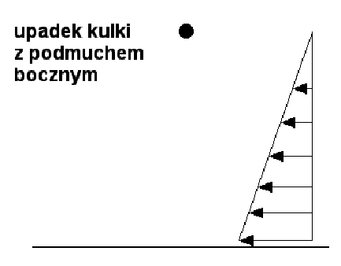

# Zadanie domowe

## Zadanie 1

Dany jest układ:

a sprężyna ma charakterystykę nieliniową: $F = k_1(1+k_2 \cdot x^2)$

#### W ramach zadania należy:
1. Wykonać rysunek (**porządny!**), rysunek powinien zawierać: wprowadzony układ współrzędnych (początek w położeniu równowagi), siły działające na ciało, inne wielkości mające wpływ na rozwiązanie zadania (wymiary, współczynniki, itp.).
2. Wyprowadzić różniczkowe równania ruchu.
3. Sprowadzić ww. równania do układu równań I rzędu.
4. Układ równań rozwiązać numerycznie za pomocą procedury `vrk4`.
5. Sporządzić wykresy: $x(t), v_x(t)$.

#### Uwagi
 * Wszystkie stałe wymagane do rozwiązania zadania (warunki początkowe, wymiary, itp.) proszę zadawać z klawiatury
 * Warunki początkowe: $x_0 \neq 0,  v_0 \neq 0$
 * Wykresy sporządzić dla przykładowego zestawu danych (**dane te należy zapisać razem z wykresem**)
 * Wyprowadzenia, rysunki i wykresy należy oddawać w formie pisemnej
 
----
 
## Zadanie 2
Dany jest układ:

#### W ramach zadania należy:
1. Wykonać rysunek (**porządny!**), rysunek powinien zawierać: wprowadzony układ współrzędnych (początek w położeniu równowagi), siły działające na masę, inne wielkości mające wpływ na rozwiązanie zadania (wymiary, współczynniki, itp.).
2. Wyprowadzić różniczkowe równania ruchu.
3. Sprowadzić ww. równania do układu równań I rzędu.
4. Układ równań rozwiązać numerycznie za pomocą procedury `vrk4`.
5. Sporządzić wykresy: $\alpha(t), \omega(t), \omega(\alpha)$.
6. Sporządzić wykres energii mechanicznej w czasie E_{MECH}(t).

#### Uwagi
 * Wszystkie stałe wymagane do rozwiązania zadania (warunki początkowe, wymiary, itp.) proszę zadawać z klawiatury
 * Warunki początkowe: $\alpha_0 \neq 0,  \omega_0 \neq 0$
 * Wykresy sporządzić dla przykładowego zestawu danych (**dane te należy zapisać razem z wykresem**)
 * Wyprowadzenia, rysunki i wykresy należy oddawać w formie pisemnej

----

## Zadanie 3

Dany jest układ:

wahadło matematyczne; duże drgania, tzn. $sin(\alpha) \neq \alpha$

#### W ramach zadania należy:
1. Wykonać rysunek (**porządny!**), rysunek powinien zawierać: wprowadzony układ współrzędnych (początek w położeniu równowagi), siły działające na masę, inne wielkości mające wpływ na rozwiązanie zadania (wymiary, współczynniki, itp.).
2. Wyprowadzić różniczkowe równania ruchu.
3. Sprowadzić ww. równania do układu równań I rzędu.
4. Układ równań rozwiązać numerycznie za pomocą procedury `vrk4`.
5. Sporządzić wykresy: $\alpha(t), \omega(t), \omega(\alpha)$.
6. Sporządzić wykres energii mechanicznej w czasie E_{MECH}(t).

#### Uwagi
 * Wszystkie stałe wymagane do rozwiązania zadania (warunki początkowe, wymiary, itp.) proszę zadawać z klawiatury
 * Warunki początkowe: $\alpha_0 \neq 0,  \omega_0 \neq 0$
 * Wykresy sporządzić dla przykładowego zestawu danych (**dane te należy zapisać razem z wykresem**)
 * Wyprowadzenia, rysunki i wykresy należy oddawać w formie pisemnej

----

## Zadanie 4

Dany jest układ:

#### W ramach zadania należy:
1. Wykonać rysunek (**porządny!**), rysunek powinien zawierać: wprowadzony układ współrzędnych (początek w położeniu równowagi), siły działające na ciało, inne wielkości mające wpływ na rozwiązanie zadania (wymiary, współczynniki, itp.).
2. Wyprowadzić różniczkowe równania ruchu.
3. Sprowadzić ww. równania do układu równań I rzędu.
4. Układ równań rozwiązać numerycznie za pomocą procedury `vrk4`.
5. Sporządzić wykresy: $x(t), v_x(t), y(t), v_y(t), y(x)$.

#### Uwagi
 * Wszystkie stałe wymagane do rozwiązania zadania (warunki początkowe, wymiary, itp.) proszę zadawać z klawiatury
 * warunki początkowe: $x_0 , y_0$ – zależnie od wprowadzonego układu, $v_0 \neq 0$
 * Wykresy sporządzić dla przykładowego zestawu danych (**dane te należy zapisać razem z wykresem**)
 * Wyprowadzenia, rysunki i wykresy należy oddawać w formie pisemnej
 
----

## Zadanie 5

Dany jest układ:

$$ F_oporu = \frac{\rho v^2}{2} \cdot S \cdot C $$
gdzie: $\rho$-gęstość powietrza, $v$-prędkość kuli względem powietrza, $S$-powierzchnia odniesienia i $C$-stały współczynnik. 

#### W ramach zadania należy:
1. Wykonać rysunek (**porządny!**), rysunek powinien zawierać: wprowadzony układ współrzędnych (początek w położeniu równowagi), siły działające na ciało, inne wielkości mające wpływ na rozwiązanie zadania (wymiary, współczynniki, itp.).
2. Wyprowadzić różniczkowe równania ruchu.
3. Sprowadzić ww. równania do układu równań I rzędu.
4. Układ równań rozwiązać numerycznie za pomocą procedury `vrk4`.
5. Sporządzić wykresy: $z(t), v_z(t)$.

#### Uwagi
 * Wszystkie stałe wymagane do rozwiązania zadania (warunki początkowe, wymiary, itp.) proszę zadawać z klawiatury
 * warunki początkowe: $x_0$ zależnie od wprowadzonego układu współrzędnych, $z_0 \neq 0$ 
 * Wykresy sporządzić dla przykładowego zestawu danych (**dane te należy zapisać razem z wykresem**)
 * Wyprowadzenia, rysunki i wykresy należy oddawać w formie pisemnej
 
----

## Zadanie 6

Dany jest układ:

duże drgania, tzn. $sin(\alpha) \neq \alpha$; uproszczenie: siła od sprężyny działa zawsze poziomo

#### W ramach zadania należy:
1. Wykonać rysunek (**porządny!**), rysunek powinien zawierać: wprowadzony układ współrzędnych (początek w położeniu równowagi), siły działające na masę, inne wielkości mające wpływ na rozwiązanie zadania (wymiary, współczynniki, itp.).
2. Wyprowadzić różniczkowe równania ruchu.
3. Sprowadzić ww. równania do układu równań I rzędu.
4. Układ równań rozwiązać numerycznie za pomocą procedury `vrk4`.
5. Sporządzić wykresy: $\alpha(t), \omega(t), \omega(\alpha)$.
6. Sporządzić wykres energii mechanicznej w czasie E_{MECH}(t).

#### Uwagi
 * Wszystkie stałe wymagane do rozwiązania zadania (warunki początkowe, wymiary, itp.) proszę zadawać z klawiatury
 * Warunki początkowe: $\alpha_0 \neq 0,  \omega_0 \neq 0$
 * Wykresy sporządzić dla przykładowego zestawu danych (**dane te należy zapisać razem z wykresem**)
 * Wyprowadzenia, rysunki i wykresy należy oddawać w formie pisemnej
 
----

## Zadanie 7

## Zadanie 8

## Zadanie 9

## Zadanie 10

## Zadanie 11

## Zadanie 12

## Zadanie 13

## Zadanie 14

## Zadanie 15

## Zadanie 16

## Zadanie 17

## Zadanie 18

## Zadanie 19

## Zadanie 20

## Zadanie 21

## Zadanie 22

## Zadanie 23

## Zadanie 24

