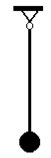
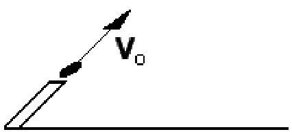

# Zadanie domowe

#Zadanie 1

#Zadanie 2

#Zadanie 3

#Zadanie 4

#Zadanie 5

#Zadanie 6

#Zadanie 7

#Zadanie 8

#Zadanie 9

#Zadanie 10

#Zadanie 11

#Zadanie 12

#Zadanie 13

#Zadanie 14

#Zadanie 15

#Zadanie 16

#Zadanie 17

#Zadanie 18

#Zadanie 19

#Zadanie 20

#Zadanie 21

#Zadanie 22

#Zadanie 23

#Zadanie 24

