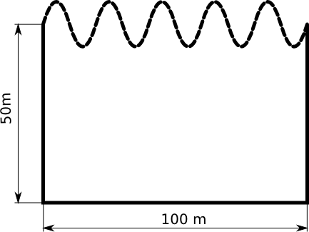
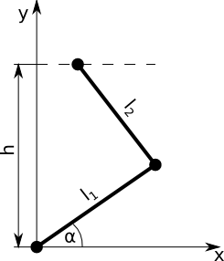

# Zadania treningowe

## Wstęp
Jako materiał pomocniczy do zadań można skorzystać z plików:

- [Plik nagłówkowy narzedzia.h](http://ccfd.github.io/courses/code/info2/narzedzia.h)
- [Plik nagłówkowy narzedzia.cpp](http://ccfd.github.io/courses/code/info2/narzedzia.cpp)

W tych plikach znajdują się zebrane wszystkie funkcje numeryczne implementujące poznane przez nas metody. Dodatkowo zamieszczona zosatła tam funkcja rysuj_wykres która rysuje wykres na podstawie przekazanych tablic x oraz y. Narzędzia z tych plików mogą Państwo dołączyć do projektu i dodać dyrektywę `#include "narzedzia.h"` lub tylko przekopiować odpowiednie funkcje wprost do pliku roboczego `main.cpp`.

Zadania od 1-5 są zadaniami z zakresu materiału dotyczącego 3 pierwszych ćwiczeń laboratoryjnych. 

## Zadanie 1
Samolot lecący na pewnej wysokości został uszkodzony i uległ wypadkowi. Większość systemów sterowania i narzędzi pomiarowych przestało działać. Jedyne co udało się zarejestrować to przeciążenia działające na samolot w zależności od położenia i wysokości nad ziemią:

$$\vec{a} = [a_x(x,y), a_y(x,y)]$$

Oprócz przebiegu przeciążeń udało się także zarejestrować prędkość $V=V_0$ w momencie uszkodzenia oraz wysokości na jakiej znajdował się samolot w czasie spadania:
$$y=f(x)$$

Ponieważ nic więcej nie udało się zarejestrować komisja badająca wypadek nie potrafi wyznaczyć prędkości z jaką samolot uderzył w ziemię. Twoim zadaniem jest im pomóc i wyznaczyć prędkość wiedząc, że zarejestrowane przeciążenie to:
$$\vec{a} = \left[10^{-2} \cdot (0.8+sin(x \cdot 10^{-2}), 10 \cdot (0.8+sin(y)) \right] \left[\frac{m}{s^2}\right]$$
Masa samolotu to 
$$m=50 \cdot 10^3$$
wysokość samolotu w funkcji położenia:
$$y=-10^3 \cdot (\frac{x}{10^4}-4.91318) \cdot sin(\frac{x}{10^4}-4.91318) [m]$$
a prędkość na początku awarii: 
$$v(x=0)=85 [\frac{m}{s}]$$

## Zadanie 2
Pan Janusz wymyślił sobie, że ogrodzi działkę od strony północnej na kształt sinusoidy. Jako, że nie uczęszczał na zajęcia z informatyki 2 to nie potrafi sam obliczyć jaką długość siatki powinien on zakupić w sklepie. Wymiary działki są następujące:



Górną krawędź opisuje funkcja 
$$2 \cdot sin(\frac{x}{10})$$
gdzie $x=0$ odpowiada lewemu bokowi. Pomóż Panu Januszowi i oblicz ile metrów siatki potrzebuje aby ogrodzić swoją działkę.

## Zadanie 3
Zamieszczony mechanizm na rysunku poniżej składa się z dwóch członów połączonych między sobą, z ziemią i szyną na górze parami obrotowymi. 



Mechanizm ten ma 1 stopień swobody(można jedynie przesuwać górny punkt wzdłuż linii kreskowej). Górna końcówka przemieszcza się w czasie zgodnie z następującym równaniem:
$$ x = 2 \cdot sin(t) + 2 $$
Wymiary mechanizmu to:
$$
h = 10 \\
l_1 = 5 \\
l_2 = 8
$$
Wyznacz zależność kąta α od czasu dla 10 różnych chwil czasowych: $t = 0, 0.5, 1, 1.5, ..., 4.5$. Następnie dokonaj interpolacji z otrzymanych punktów i przedstaw na wykresie zależność:
$$ \alpha = \alpha(t) $$
wykorzystując 100 punktów, których wartości powinny pochodzić z zastosowania interpolacji metodą wielomianową. 

### Dla zainteresowanych
Wykonaj animację ruchu mechanizmu korzystając z biblioteki graficznej, funkcji `animate` oraz funkcji `clear` (funkcja `animate` wstrzymuje działanie programu na pewną chwilę, a funkcja `clear` czyści okno). Za pomocą tych funkcji można napisać prostą animację w następujący sposób:
```c++
int iter=0;
while(animate(15) && iter<liczba_czasow)
{
    clear();
    .... rysowanie mechanizmu...
    iter++;
}
```
## Zadanie 4 (typu kolokwialnego)

Masz zadaną funkcję zmiennej $x$ która zawiera dodatkowy parametr $a$:
$$ f(x) = - x \cdot sinh(x) + a $$

### Wersja podstawowa zadania
1. Znajdź 2 miejsca zerowe powyższej funkcji dla parametru $a=1$.

2. Oblicz całkę z zadanej funkcji dla parametru $a=1$ i w granicach od pierwszego miejsca zerowego do drugiego $[x_{01}; x_{02}]$

3. Wyświetlić obliczone miejsca zerowe i całkę z dokładnością do 3 miejsc po przecinku.

### Wersja zaawansowana zadania
1. Zmodyfikuj funkcję obliczającą miejsca zerowe oraz funkcję całkującą tak, aby przyjmowała wskaźnik do funkcji dwuargumentowej (typu `double funkcja(double x, double a)`) oraz dodatkowy parametr typu `double a`.  
**Uwaga** Należy pamiętać aby wewnątrz odpowiedniej funkcji podczas wywołania przekazanej funkcji wykorzystać także dodany parametr `a`.

2. Znajdź 2 miejsca zerowe przedstawionej na początku funkcji dla zakresu parametrów $a=1,2,\dots, 10$.

3. Dla parametrów $a=1,2,\dots, 10$ oblicz całkę w granicach pomiędzy pomiędzy pierwszym a drugim pierwiastkiem ($[x_{01}; x_{02}]$, wyznaczonymi w poprzednim podpunkcie) odpowiednim dla poszczególnych wartości parametru $a$.

4. Zapisz poszczególne wartości parametru $a$ oraz obliczone wartości całki w dwóch oddzielnych tablicach.

5. Dokonaj interpolacji funkcji $Całka=f(a)$ metodą wielomianową i przedstaw wynik w punktach: $a=1, 1.1, 1.2, \dots, 9.9, 10$ na wykresie wykorzystując bibliotekę graficzną. 

**Mała podpowiedź:** Pierwiastki równania $−x \cdot sinh(x) + a$ dla $a=1, \dots, 10$ to liczby z zakresów:
$$ 
x_{01} = [-0.5, -2.5] \\
x_{01} = [0.5, 2.5]
$$


## Zadanie 5

Zarejestrowano prędkość poruszającego się samochodu w przedziale czasu $t \in <0, 3>$ sekund. Okazało się, że prędkość tą opisuje następująca funkcja:
$$
\newcommand{\tmax}{3}
\newcommand{\seekdistance}{5}
\newcommand{\rhsfunction}{sin(t) \cdot cosh(t)}
\newcommand{\rhsfunctionlong}{sin(t) \cdot \frac{e^t+e^{-t}}{2}}
\newcommand{\rhsfunctionlongTau}{sin(\tau) \cdot \frac{e^\tau+e^{-\tau}}{2}}
v(t) = \rhsfunction = \rhsfunctionlong \quad [\frac{m}{s}]
$$

Twoim zadaniem jest znalezienie takiej wartości czasu $t$ po której samochód przejedzie $\seekdistance[m]$. W celu rozwiązania tego problemu **musisz skorzystać** z metod poznanych na poprzednich zajęciach:

- całkowania numerycznego,
- interpolacji wielomianowej,
- rozwiązywania równań nieliniowych.


**Mała podpowiedź:** Aby rozwiązać to zadanie należy rozwiązać równanie nieliniowe 
$$x(t)-5=0$$ 
Funkcja $x(t)$ powinna być określona za pomocą wielomianu interpolacyjnego rozpiętego na punktach $(t_i, x_i)$ wyznczonych za pomocą całek:
$$ x_i = int_0^{t_i} \rhsfunctionlongTau d\tau $$
gdzie wartości $t_i$ powinny być punktami z przedziału $t\in<0,3>$.

------------------

# Podpowiedzi do zadań

Poniżej zamieszczamy znaczące podopiedzi pokazujące jak należy rozwiązać powyższe zadania. Zanim z nich skorzystasz spróbuj własnych sił. Zadania są tak skonstruowane abyś przećwiczył samodzielne definiowanie problemu oraz rozwiązywanie go za pomocą metod numerycznych poznanych na zajęciach. 

## Zadanie 1
Rozwiązanie tego zadania polega na skorzystaniu z zasady zachowania energii. Znamy prędkość początkową, znamy tor ruchu oraz znamy przeciążenie. Za pomocą przeciążenia możemy obliczyć siłę wypadkową działającą na samolot. Czyli znamy tor i siłę, a zatem możemy obliczyć pracę sił wypadkowych. Podsumowując możemy napisać:
$$E_0 = \frac{m\cdot v_0^2}{2}$$
$$ W = \int_{x_0}^{x_1}{\vec{F}(x,y(x)) \cdot \vec{ds}} $$
a $y$ mamy z danych zadania:
$$y=-10^3 \cdot (\frac{x}{10^4}-4.91318) \cdot sin(\frac{x}{10^4}-4.91318)$$
$$ E_k = E_0 + W \quad \to \quad  v_k = \sqrt{2 (\frac{mv_0^2}{2} + \int_{x_0}^{x_1}{\vec{F}\cdot \vec{ds}})} $$
Pozostaje obliczyć całkę z iloczynu skalarnego. W tym wypadku jedyne rzeczy których nie znamy to $\vec{ds}$ i $\vec{F}$. Jeśli znamy krzywą po której porusza się samolot to wektor przyrostu drogi to nic innego jak:
$$ \vec{ds} = \left[dx, y'dx\right]$$
gdzie $y'$ to pochodna która jest równa:
$$
\frac{dy}{dx} = -0.1 \cdot ( sin(\frac{x}{10^4}-4.91318) + (\frac{x}{10^4} - 4.91318) \cdot cos(\frac{x}{10^4} - 4.91318) )
$$

Z kolei siła to: 
$$ \vec{F} = m \cdot \vec{a} = m \cdot \left[10^{-2} \cdot (0.8+sin(x \cdot 10^{-2}), 10 \cdot (0.8+sin(y)) \right] \left[\frac{m}{s^2}\right] $$
Ostatecznie całka którą należy obliczyć to:
$$ 
\begin{aligned}
    m\cdot \int_{x_0}^{x_1} \vec{a} \cdot \vec{ds} = m\cdot \int_{x_0}^{x_1} [1, y'] \cdot \left[10^{-2} \cdot (0.8+sin(x \cdot 10^{-2}), 10 \cdot (0.8+sin(y)) \right] dx
\end{aligned}
$$

Jedyna rzecz której nie posiadamy to koniec przedziału całkowania. Jak wiemy końcem będzie moment zderzenia samolotu z ziemią, czyli y=0 . Ponieważ równanie to jest nieliniowe, to wypada skorzystać w tym miejscu z jakiejś metody do rozwiązywania równań nieliniowych. Jak będziemy znali ten ostatni parametr to pozostaje scałkować numerycznie (np. metodą trapezów)
pracę i można obliczyć ostatecznie wartość prędkości.

Schemat rozwiązania:

1. Przygotuj funkcję obliczającą wysokość w zależności od $x$
$$y(x)=-10^3 \cdot (\frac{x}{10^4}-4.91318) \cdot sin(\frac{x}{10^4}-4.91318)$$

2. Rozwiąż równianie nieliniowe(metodą bisekcji/siecznych/stycznych) i znajdź współrzędną $x$ zderzenia (warunek $y=0$). Rozwiązanie widać od razu w równaniu $x = 49131.8$, lecz zaleca się przetestowanie działania różnych metod, poniweważ $y(x)=0$ ma wiele miejsc zerowych, a my jesteśmy zainteresowani tylko tym najbliższym 0 i dodatnim. 

3. Przygotuj funkcję obliczającą pochodną $\frac{dy}{dx}$ (możesz ją zastosować także do metody newtona).

4. Przygotuj funkcję obliczającą funkcję podcałkową określającą pracę sił wypadkowych (skorzystaj z funkcji z pkt. 3).

4. Oblicz całkę stosując metodę trapezów lub simpsona.

5. Oblicz energię kinetyczną początkową. 

6. Oblicz ostateczną wartość prędkości.


## Zadanie 2

To zadanie jest mniej złożone niż poprzednie. W zasadzie sprowadza się jedynie do obliczenia całki z długości łuku krzywej opisanej za pomocą funkcji $y=f(x)$. W przypadku tak prostej funkcji elementarna długość łuku to:
$$ ds = \sqrt{f'(x)^2 + 1} dx$$
W związku z tym długość łuku to:
$$ \int_{x_0}^{x_1}{ds} = \int_{x_0}^{x_1}{\sqrt{f'(x)^2 + 1} dx} $$
Po podstawieniu funkcji opisującej północne ogrodzenie dostaniemy:
$$ \int_{x_0}^{x_1}{\sqrt{(0.5\cdot cos(\frac{x}{10}))^2 + 1} dx} $$

Zatem schemat rozwiązania zadania będzie następujący:

1. Przygotuj funkcję podcałkową.

2. Wykonaj całkowanie znaną Ci metodą.

3. Oblicz końcową długość ogrodzenia.

4. Znajdź w internecie cenę ogrodzenia w kształcie kota.

5. Oblicz cenę końcową ogrodzenia.

6. Wystaw fakturę Panu Januszowi za wykorzystanie magicznych umiejętności całkowania dowolnej funkcji :-)

## Zadanie 3
Przyjmijmy, że dolny punkt znajduje się w punkcie $[0,0]$. Wtedy możemy napisać 2 równania opisujące ten mechanizm:
$$ 
x_1^2 + y_1^2  = l_1^2 \quad \to \quad y_1 = \sqrt{l_1^2 - x_1^2}, \quad ponieważ \quad y_1 > 0 \\
(x_2 − x_1)^2 +(h − y_1)^2 =l_2^2
$$
a po podstawieniu ($x_2$ wynika z danych):
$$ (2 \cdot sin(t) + 2 − x_1)^2 +(h − \sqrt{l_1^2 - x_1^2} )^2 =l_2^2 $$

Mamy zatem jedno równanie nieliniowe opisujące ruch dolnej korby mechanizmu, gdzie niewiadoma to $x_1$. Czas w tym równaniu występuje tylko jako parametr, który będzie się zmieniał co zadany krok przy kolejnych rozwiązaniach tego równania. W związku z tym najwygodniej bedzie czas zadeklarować jako zmienną globalną, tak aby nie trzeba było modyfikować funkcji znajdujących się w plikach narzedzia.h i narzedzia.cpp. Pozostaje rozwiązać to równanie wykorzystując np. metodę siecznych.

Schemat rozwiązania:

1. Utwórz tablice do przechowywania 11 czasów oraz 11 kątów $\alpha$

2. Utwórz pętlę w której będziesz zmieniał czas od $t=0, \dots, 4.5$ co $0.5$

3. W pętli wywołaj metodę bisekcji/siecznych/stycznych aby znaleźć rozwiązanie równania opisującego współrzędną $x_1$ . Oblicz następnie współrzędną $y_1$.

4. Mając wsp. $x_1$ , $y_1$ oblicz kąt $\alpha$ używając np.: funkcji $atan(x)$ i zapisz w tablicy nową chwilę czasową oraz nowy kąt $\alpha$.

5. Otwórz nową pętlę która będzie iterowała od $0, \dots, 99$. Następnie używając funkcji „lagrange” dokonaj interpolacji kata $\alpha$ dla chwil czasowych $0.00, 0.05, 0.1, 0.15 , \dots, 4.5$. Dla każdej chwili czasowej narysuj na wykresie punkt o współrzędnych $\left[t_i , \alpha_(t_i )\right]$


## Zadanie 5

Aby znaleźć czas dla którego przebyta odległość jest równa $\seekdistance[m]$ należy znaleźć zależność:
$$ x = x(t) \qquad gdzie \quad t \in <0,\tmax> $$

Znając ją można następnie ułożyć równanie:
$$ x(t) - \seekdistance = 0 $$

którego rozwiązaniem będzie poszukiwany czas $t$. 

Skąd zatem wziąć funkcję $x = x(t)$? Należy skorzystać ze informacji jaką niesie prędkość pojazdu. Biorąc pod uwagę równanie określające prędkość można sformułować następujące zagadnienie:

$$
\begin{align*}
	&\frac{dx}{dt} = \rhsfunction \\
    &x|_{t=0} = 0 \\
    &t \in <0, \tmax>
\end{align*}
$$

Powyższy problem to nic innego jak poszukiwanie całki nieoznaczonej funkcji $\frac{dx}{dt}=v(t)$. Ale jak to zrobić za pomocą poznanych narzędzi? Otóż należy połączyć 2 metody - całkowanie numeryczne oraz interpolację. Poznane metody całkowania pozwalają wyznaczyć całkę oznaczoną postaci:

$$ C = \int_a^b f(\tau)d\tau $$

Z kolei całka nieoznaczona to w praktyce funkcja określona jako:

$$ F(t) = \int_{t_0}^t f(\tau)d\tau $$

Co w naszym przypadku sprowadza się do:

$$ x(t) = \int_0^t v(\tau)d\tau=\int_0^t \rhsfunctionlongTau d\tau $$

Z racji tego, że poznane przez nas metody pozwalają na obliczenie całki z funkcji na **konkretnym przedziale** to musimy wykonać pewne przybliżenie, które będzie polegało na obliczeniu wartości funkcji $x(t)$ w skończonej liczbie punktów, czyli:

$$ x_0=x(0), x_1=x(h), x_2=x(2 \cdot h), \dots , x_{N-1}=x((N-1)\cdot h = 3)$$

a następnie na dokonaniu interpolacji za pomocą wielomianów Lagrange'a tak, aby przybliżenie funkcji $x=x(t)$ przechodziło przez wyznaczone punkty $(t_i, x_i)$. 

Podsumowując algorytm rozwiązania problemu będzie następujący:

- Oblicz szereg całek $\int_0^t v(\tau) d\tau$ aby wyznaczyć wartości $x_i$.
- Przygotuj funkcję która będzie potrafiła zwrócić wartość $x=x(t)$ dla dowolnego parametru $t$ wykorzystując "pod spodem" interpolację wielomianową. 
- Wykorzystaj funkcję z poprzedniego punktu aby rozwiązać równanie $x=x(t)$ wybraną metodą i znaleźć poszukiwany czas $t$. 

### Krok 1

Oblicz $N$ poniższych całek dowolnie wybraną metodą numeryczną:
$$ x_i = \int_{0}^{t_i} \rhsfunctionlongTau dt $$
gdzie:
$$ t_i=i \cdot h, \quad h=\frac{\tmax}{N-1}, \quad i=0, 1, \dots, N-1 $$
Wartości całek zapisz w tablicy X a wartości czasów dla których całki są obliczone w tablicy T (tablice mogą być zadeklarowana statycznie). $N$ wybierz dowolne, na początek możesz zacząć od $N=10$. 

### Krok  2

Utwórz funkcję "polozenia" która będzie przyjmowała jako argument jedną (dowolną) liczbę $t$ i zwracała wartość położenia wykorzystując interpolację wielomianową i wartości $x_i$ obliczone dla czasów $t=0, h, 2h, \dots$ w poprzednim zadaniu.

***Uwaga*** Tablice do przechowywania całek i czasów zadeklaruj jako zmienne globalne (najlepiej przed wszystkimi funkcjami) tak aby z poziomu funkcji obliczającej wartości funkcji $x=x(t)$ mieć do nich dostęp. 

### Krok  3
Wykorzystaj znaną Ci metodę rozwiązywania równań nieliniowych i znajdź rozwiązanie równania:
$$ x(t) - \seekdistance = 0 $$

Pierwiastek tego równania znajduje się w przedziale $0-3$. Sprawdź jak rozwiązanie zmienia się wraz ze zmianą $N$ z zadania 1.

------------------

# Rozwiązania zadań

## Zadanie 1
```c++
#include <math.h>
#include <stdio.h>
#include "narzedzia.h"

const double m = 5e4, v0 = 85;

double y(double x)
{
    return -1e3*(x/1e4 - 4.91318)*sin(x/1e4 - 4.91318);
}

double dydx(double x)
{
    return -0.1*( sin(x/1e4-4.91318) + (x/1e4 - 4.91318)*cos(x/1e4 - 4.91318) );
}

double dWdx(double x)
{
    double F[] = { -m*(sin(x/1e2)+0.8)/1e2, - m*10*(0.8+sin(y(x))) };
    double ds[] = {1, dydx(x)};

    return F[0]*ds[0] + F[1]*ds[1];
}

int main()
{
    int iter;

    double x0 = styczna(4e4,y, dydx, 1e-4, &iter);

    printf("x0=%e\ty(x0)=%e\tNiter=%d\n", x0, y(x0),iter);

    double praca = trapez(0, x0, dWdx, 1e3);
    double E0 = m*v0*v0/2;

    printf("praca=%e\tE0=%e\n", praca, E0);

    double v = sqrt( 2*( E0 + praca )/m );

    printf("v=%e\n", v);

    return 0;
}
```

## Zadanie 2
```c++
#include <math.h>
#include <stdio.h>
#include "narzedzia.h"

double fun(double x)
{
    return sqrt( pow(0.5*cos(x/10),2) + 1);
}

int main()
{
    double calka = simpson(0,100,fun, 100);

    double ogrodzenie = 100 + 50*2 + calka;

    printf("dlugosc ogrodzenia to %.2lf[m]\n", ogrodzenie);

    return 0;
}
```

## Zadanie 3
```c++
#define _CRTP_USE_SECURE_NO_WARNINGS
#include <math.h>
#include <stdio.h>
#include "narzedzia.h"
#include "winbgi2.h"

double time=0;
const double h = 10;
const double l1 = 5;
const double l2 = 8;
const int N = 10;
const int M = 100;

double equation(double x1)
{
    return pow(2*sin(time) + 2 - x1, 2) + pow(h - sqrt( l1*l1-x1*x1 ), 2) - l2*l2;
}

const double pi = 4.*atan(1.);
double degree(double radian)
{
	return 180. / pi* radian;
}


int main()
{
	graphics(1000, 1000);

	setbkcolor(WHITE);
	
	//Set black color for frame drawing
	setgray(0.);
	scale(0, 0, 5, 60);
	title("time", "angle", "alpha(t)");

    //Solution
    double alpha[N];
    double times[N];
    int itr;
    double dt = 5./(N-1);
	double xs=0;
	double xe=5;
	double x1 = 0;


	setlinestyle(0, 1, 2);

    for(int i=0; i<N; ++i)
    {
		x1 = bisec(0, 5, equation, 1e-3, &itr);
        double y1 = sqrt(l1*l1 - x1*x1);

        alpha[i] = atan(y1/x1);
        times[i] = time;
   
		time += dt;

		circle(times[i], degree(alpha[i]), 5);
    }

    //Interpolation
    double alpha2[M];
	double times2[M];
    dt = 5./(M-1);
    time = 0;

	setcolor(0.9);

    for(int i=0; i<M; ++i)
    {
       alpha2[i] = lagrange(times, alpha, N, time);
	   times2[i] = time;

	   time += dt;  

	   if (i > 0)
	   {
		   line(times2[i-1], degree(alpha2[i-1]), times2[i], degree(alpha2[i]));
	   }
    }
    wait();

	//Animate mechanism
	for (int i = 0; i < M && animate(15); ++i)
	{
		clear();

		setgray(0.);
		setlinestyle(0, 1, 1);
		scale(-3, 0, 10, 10);
		
		//draw 2 parts of mechanism
		setgray(0.5);
		setlinestyle(0, 1, 5);
		line(0, 0, l1*cos(alpha2[i]), l1*sin(alpha2[i]));
		line(l1*cos(alpha2[i]), l1*sin(alpha2[i]), 5 * sin(times2[i]) + 2, h);


		//Draw the guide 
		setcolor(0.9);
		setlinestyle(1, 1, 1);
		line(-3, h, 10, h);

	}

	wait();
}
```

## Zadanie 4
```c++
#include <math.h>
#include <stdio.h>
#include "narzedzia.h"

double trapezParam(double a, double b, double parameter, double(*fun)(double, double), int n)
{
    int i;
    double h=(b-a)/(n-1), calka=0, x1, x2;
    for(i=0; i<n-1; ++i)
    {
        x1 = a + i*h;
        x2 = a + (i+1)*h;
        calka += ( fun(x1, parameter) + fun(x2, parameter) )/2 * h;
    }
    return calka;
}

double stycznaParam(double x0, double parameter, double(*fun)(double, double), double(*poch)(double, double), double eps, int *n_iter)
{
    double deltaX=1;
    *n_iter = 0;
    while(fabs(fun(x0, parameter)) > eps && fabs(deltaX) > eps)
    {
        deltaX = - fun(x0, parameter)/poch(x0, parameter);
        x0 = x0 + deltaX;
        (*n_iter)++;
        if(*n_iter > 1e3)
        {
            *n_iter=-1;
            return x0;
        }
    }
    return x0;
}

double funkcja(double x, double a)
{
    return -x*sinh(x) + a;
}

double pochodna(double x, double a)
{
    return -sinh(x) - x*cosh(x);
}


int main()
{
    const int N = 10;
    const int M = 100;

    double x01[N], x02[N], C[N], parametry[N];
    int iter;

    for(int i=0; i<N; ++i)
    {
        parametry[i] = i+1;

        x01[i] = stycznaParam(-1, i+1, funkcja, pochodna, 1e-4, &iter);
        x02[i] = stycznaParam(1, i+1, funkcja, pochodna, 1e-4, &iter);

        C[i] = trapezParam(x01[i], x02[i], i+1, funkcja, 100);
    }

    double da = 9./(M-1);
    double a = 1;
    for(int i=0; i<M; ++i, a+=da)
    {
        double ci = lagrange(parametry, C, N, a);

        printf("dla a=%.3lf calka=%.3lf\n", a, ci);
    }

    return 0;
}
```


## Zadanie 5
```c++
#include <stdlib.h>
#include <stdio.h>
#include <math.h>

#include "narzedzia.h"

const int N=10;
double T[N];
double X[N];

double predkosc(double t)
{
    return sin(t)*(exp(t)+exp(-t))/2;
}

double polozenia(double t)
{
    return lagrange(T, X, N, t);
}

double rownanie(double t)
{
    return polozenia(t) - 5;
}

int main()
{
    double h = 3./(N);
    X[0]=0;
    for(int i=1; i<N; ++i)
    {
        X[i] = trapez(0, i*h, predkosc, 10);
        T[i] = i*h;
    }

    int itr;
    double t0 = bisec(0, 3, rownanie, 1e-4, &itr);

    printf("Polozenie 5m zostaje osiagniete po %e sekundach\nIter=%d\n", t0, itr);

    return 0;
}
```
