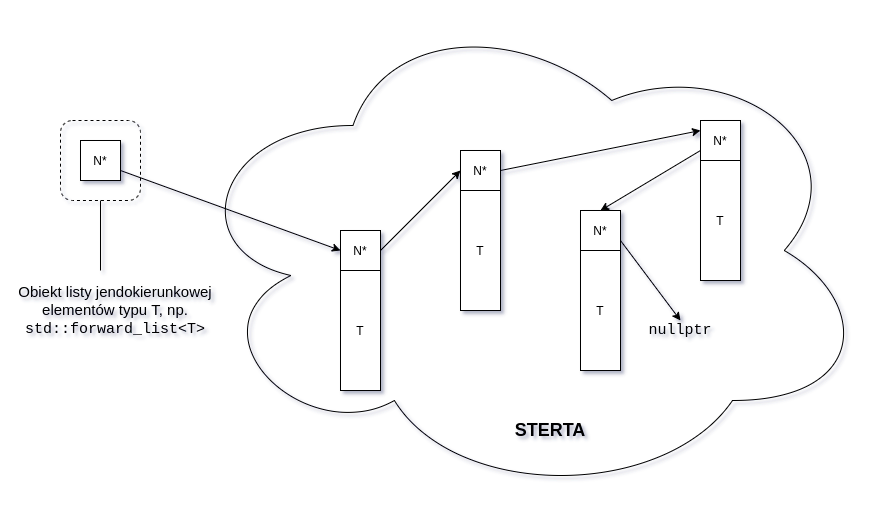

# Laboratorium V
## Wstęp
Na dzisiejszych zajęciach przyjrzymy się kontenerom dostępnym w STL.
Kontenery to klasy, które służą do przechowywania wielu obiektów danego typu.
Sposób przechowywania obiektów (struktura danych) jest jednym z najbardziej kluczowych zagadnień programowania.
W 1976r. Niklaus Wirth opublikował nawet książkę o słynnym tytule *Algorithms + Data Structures = Programs*.
Biblioteka standardowa oferuje szeroką gamę różnych kontenerów, której nie mamy niestety czasu omówić w pełni.
Zamiast tego, postaramy bliżej zapoznać się jedynie z kilkoma wybranymi kontenerami i wyciągnąć możliwie ogólne wnioski dotyczące korzystania z nich.
Podkreślmy, że nie ma kontenerów lepszych i gorszych, a jedynie takie, które lepiej lub gorzej nadają się do rozwiązania konkretnego problemu.

Aby móc skupić się na zachowaniu kontenerów, a nie szczegółach typów, które mają być w nich przechowywane, do niniejszej instrukcji dołączony jest plik `Human.hpp`, w którym zaimplementowana jest klasa reprezentująca człowieka.
Zadania zebrane poniżej zakładają, że czytelnik ma do niego dostęp.

## Wybrane typy kontenerów
Poniżej wymienione zostało kilka podstawowych kontenerów STL.
Warto rozumieć ich działanie, a przynajmniej wiedzieć o ich istnieniu.

- [`std::vector`](https://en.cppreference.com/w/cpp/container/vector) - dynamicznie alokuje ciągły blok pamięci na trzymane obiekty.
Po zapełnieniu alokuje nowy, większy blok pamięci i przepisuje do niego elementy.
- [`std::array`](https://en.cppreference.com/w/cpp/container/array) - statycznie alokuje blok pamięci o rozmiarze określonym przez parametr szablonu.
Pozwala na łatwe kopiowanie zawartości (ma dobrze zdefiniowane metody specjalne).
- [`std::map`](https://en.cppreference.com/w/cpp/container/map) - przechowuje pary klucz-element (typy obu określone przez parametry szablonu).
Pozwala na dostęp do elementów poprzez klucz, np. `mapa_ocen["Janina Kowalska"] = 5`.
- [`std::list`](https://en.cppreference.com/w/cpp/container/list) - rozprasza elementy w pamięci.
każdy element należy do komórki, która przechowuje wskaźnik do kolejnej komórki.
W konsekwencji, aby dostać się do *i*-tego elementu musimy przejść przez *i*-1 elementów go poprzedzających.
- [`std::deque`](https://en.cppreference.com/w/cpp/container/deque) - dwukierunkowa kolejka (możemy dodawać elementy na końcu i na początku).
Typowe implementacje alokują pamięć blokami (np. na 16 elementów, nie na 1).

## `std::vector`
Kontenerem, po który sięgamy najczęściej, jest wektor.
Wynika to z wygody, którą nam oferuje: zachowuje się z grubsza jak tradycyjna tablica (dane ciągłe w pamięci, indeksowany dostęp przy pomocy operatora `[ ]`), z tą różnicą, że potrafi dynamicznie zwiększać swoją pojemność według naszej potrzeby.
Pod maską, wektor składa się tak naprawdę z 3 pól: wskaźnika do pierwszego elementu, długości (`size`) i pojemności (`capacity`).
Kontener zbliżony do wektora poznaliśmy już na 2. laboratorium - wtedy pisaliśmy go sami.

### Tworzenie i niszczenie wektora
Najczęściej korzystamy z poniższych konstruktorów wektora typu `std::vector<T>`:

1. konstruktor domyślny - tworzy pusty wektor
2. konstruktor przyjmujący `unsigned int` - tworzy wektor o rozmiarze równym podanej liczbie, wypełniony elementami skonstruowanymi przy pomocy konstruktora domyślnego klasy T (jeżeli takiego nie ma, to nasz kod się nie skompiluje)
3. konstruktor przyjmujący `unsigned int` i obiekt typu `T` - wypełnia wektor liczbą kopii przyjętego obiektu równą podanej liczbie
4. konstruktor przyjmujący listę (w znaczeniu `std::initializer_list`) elementów, które mają zostać do niego podane
5. konstruktory kopiujące is przenoszące

Destruktor wektora poprawnie dealokuje pamięć, a w konsekwencji niszczy wszystkie zawarte w nim obiekty.
Zachowanie to jest zgodne z naszymi oczekiwaniami i pozwala nam skupić się na ważniejszych rzeczach; nie musimy martwić się o wołanie `delete[]`.

### Dodawanie elementów do wektora
Nowe elementy dodajemy do wektora przy pomocy metod `push_back` oraz `emplace_back`.
Nazewnictwo to zgodne jest z konwencją biblioteki standardowej:

- `push` - sugeruje, że wkładamy do tablicy element, który istnieje gdzie indziej w programie, tzn. wykonuje jego kopię i dodaje do wektora
- `emplace` - sugeruje, że element jest tworzony w miejscu (*in place*), tzn. `emplace_back` przyjmuje argumenty konstruktora elementu, który tworzony jest już w wektorze - omijamy kopię
- `back` - ten sufiks sugeruje, że element dodawany jest na końcu wektora (niektóre kontenery potrafią dodawać elementy także od przodu)

Zobaczmy różnicę między `push_back` i `emplace_back` na przykładzie:
```C++
std::vector<std::string> vs;      // pusty wektor stringów
std::string wyraz{"słowo"};       // przykładowy string
vs.push_back(wyraz);              // dodaj kopię istniejącego stringa do wektora
wyraz += " drugie słowo";         // obiekt wyraz istnieje niezależnie
vs.emplace_back("trzecie słowo"); // skonstruuj string na końcu wektora na podstawie const char*
```
Warto zaznaczyć, że tak naprawdę `push_back` woła `emplace_back` - wykorzystuje on wtedy konstruktor kopiujący (lub przenoszący).

### Indeksowanie
Indeksowanie po wektorze odbywa się przy pomocy operatora `[ ]`, dokładnie tak jak po zwykłej tablicy.
Sięgnięcie poza zakres (`v[i]`, gdzie `i >= v.size()`) jest nielegalne (zachowanie analogiczne do tradycyjnej tablicy).
Wektor trawersować możemy także używając iteratorów, ale o tym później.

### Usuwanie elementów
Ostatni element wektora możemy usunąć przy pomocy metody `pop_back`.

### Zadania
Przećwiczmy teraz wymienioną powyżej funkcjonalność szablonu `std::vector`.

#### Zadanie 1
Stwórz pusty wektor `int`ów.
Wyświetl jego rozmiar i pojemość.
Napisz pętlę, w której dodasz do niego dowolną liczbę całkowitą (użyj `push_back` lub `emplace_back`, w tym przypadku jest to bez znaczenia), a następnie wyświetlisz rozmiar i pojemność wektora.
Wykonaj ciało pętli np. 100 razy.
Jak zmienia się pojemność wektora, gdy jest on zapełniony i dodajesz do niego element?

#### Zadanie 2
W każdej iteracji napisanej pętli wyświetl dodatkowo adres pierwszego elementu (`&v[0]`).
Czy pozostaje on stały wraz ze wzrostem rozmiaru wektora?
Dlaczego tak/nie?

#### Zadanie 3
Stwórz przy pomocy konstruktora nr 3 wektor 100 `int`ów o wartości 42.
Wyświetl jego długość i pojemność.
Wykonaj program 2 razy, raz używając do inicjalizacji nawiasów `()`, a raz `{}`.
Jakie będą efekty?
Dlaczego tak się dzieje?
Zapytaj osobę prowadzącą zajęcia.

**Podpowiedź**: chodzi o specjalne zasady konstrukcji dotyczące `std::initializer_list`.

**Wniosek**: w większości przypadków nadal preferujemy inicjalizację przy pomocy nawiasów klamrowych, natomiast w przypadku klas posiadających konstruktory przyjmujące `std::initializer_list` musimy zachować czujność i postępować ostrożnie.

#### Zadanie 4
Napisz program, który tworzy w pętli na podstawie danych podanych do konsoli obiekty klasy `Human` i przechowuje je w wektorze (wczytuj z klawiatury przynajmniej imię).
Porównaj, jak wyglądał będzie program, gdy użyjesz `push_back` i `emplace_back`.
Zastanów się ile kopii obiektu `std::string` wykonujesz.
Przemyśl jak może Ci pomóc `std::move` (`std::string` ma dobrze zdefiniowaną semantykę przenoszenia).

#### Zadanie 5
Zmodyfikuj program tak, aby podanie do konsoli konkretnej wartości (np. "pop") powodowało usunięcie ostatniego elementu.

#### Zadanie 6
Zweryfikuj poprawne wykonanie poprzedniego zadania wyświetlając imiona osób zawartych w wektorze.

## `std::list`
Lista jest jedną z najprostszych struktur danych.
Składa się ona z węzłów (ang. *node*) - każdy węzeł przechowuje 1 element oraz wskaźnik do kolejnego węzła (ostatni węzeł wskazuje na `nullptr`).
Jeżeli węzły przechowują także wskaźnik do poprzedniego węzła, mówimy o liście dwukierunkowej.
Pomocna w zrozumieniu tej struktury danych może być następująca wizualizacja rozkładu w pamięci elementów listy jednokierunkowej:



Jak widać, możemy dodawać nowe elementy na dowolnej pozycji listy (z przodu, z tyłu, gdzieś w środku) bez konieczności przesuwania elementów już istniejących.
Ceną, którą płacimy za tę wygodę jest czas dostępu do elementów - aby dostać się do *i*-tego elementu, musimy przejść przez *i* - 1 elementów go poprzedzających.

Listy są tematem, na który moglibyśmy poświęcić osobne zajęcia.
Tutaj przytaczamy je jedynie dla kontrastu z wektorem, aby zobrazować, że biblioteka standardowa zapewnia podobny interfejs dla drastycznie różniących się kontenerów.

### Tworzenie i niszczenie listy
Na zajęciach rozważymy jedynie konstruktor domyślny, tworzący pustą listę.
Jak nietrudno się domyślić, destruktor listy niszczy wszystkie jej węzły, dzięki czemu nie doznajemy wycieku pamięci.

### Dodawanie elementów do listy
Na zajęciach pominiemy dodawanie elementów w środku listy (choć nie jest szczególnie skomplikowane, zainteresowanych odsyłamy do dokumentacji metody `insert`).
Rozważymy następujące 4 metody służące do dodawania elementów na końcach:

- `push_back`
- `emplace_back`
- `push_front`
- `emplace_front`

Ich działanie jest analogiczne wobec metod szablonu `std::vector`.
Jak widzimy ujednolicone nazewnictwo pomaga nam przy poznawaniu nowych kontenerów - nie musimy za każdym razem uczyć się nowych nazw metod.

### Dostęp do elementów listy
Dostęp do elementów listy uzyskujemy przeważnie przy pomocy iteratorów (o których powiemy niżej).
Na chwilę obecną ograniczymy się do metod `front` i `back`, które zwracają referencję odpowiednio do pierwszego i ostatniego elementu listy.

### Usuwanie elementów z listy
Pierwszy i ostatni element listy możemy usunąć odpowiednio przy użyciu metod `pop_front` i `pop_back`.
Metodę `erase`, usuwającą elementy ze środka listy, pozostawiamy dla chętnych.

#### Zadanie 7
Stwórz pustą listę typu `int`.
Dodaj do niej 1 element.
Wydrukuj pierwszy i ostatni element listy.

#### Zadanie 8
Dodaj do listy drugi element (z przodu lub z tyłu).
Wydrukuj je ponownie.

#### Zadanie 9
Wydrukuj adresy pierwszego i ostatniego elementu.
Czy są one blisko siebie?

#### Zadanie 10
Dodaj z przodu listy kilka elementów.
Czy zmienił się adres ostatniego elementu?
Dlaczego tak/nie?

#### Zadanie 11
Sprawdź, czy lista ma zdefiniowany operator nawiasów kwadratowych (indeksowania).
Jak sądzisz, dlaczego tak jest?

## Iteratory
Jak zobaczyliśmy w zadaniu 11, lista nie ma zdefiniowanego operatora `[ ]`.
Aby dostać się do jej elementów, musimy użyć iteratorów.
Iterator jest koncepcyjnie podobny do wskaźnika, gdyż jego zadaniem jest wskazywanie na elementy kontenera (nie tylko listy).
Iteratorem nazywamy obiekt klasy, która ma zdefiniowane następujące operatory:

- operator dereferencji (`*`) - dereferencjonując operator uzyskujemy dostęp do elementu, na który wskazuje
- (opcjonalnie) operator `->` - pozwala na dostęp do pól i metod elementów (zdefiniowany dla naszej wygody, możemy to także osiągnąć przy pomocy operatora dereferencji)
- operator pre- lub post-inkrementacji (`++`) - po inkrementacji, iterator wskazuje na następny element kontenera
- operatory porównania (`==`, `!=`) - porównują, czy dwa iteratory wskazują na ten sam element
- (opcjonalnie) operator pre- lub post-dekrementacji (`--`) - wtedy nazywamy iterator dwukierunkowym (*bidirectional*), pełni on rolę analogiczną do operatora `++`
- (opcjonalnie) operator `+` lub `+=` przyjmujący liczbę całkowitą - wtedy nazywamy go iteratorem losowego dostępu (*random access*), operator ten pozwala nam przesunąć iterator do przodu lub do tyłu o dowolną liczbę elementów

Jeżeli przyjrzymy się powyższej specyfikacji, możemy dostrzec, że wskaźniki są iteratorami losowego dostępu.
Kontenerem, na elementy którego wskazują, jest cała przestrzeń pamięci naszego komputera (podobieństwo do nazwy RAM jest nieprzypadkowe!).

Nas będą jednak interesowały iteratory odpowiadające konkretnym kontenerom.
Wszystkie kontenery STL posiadaja zdefiniowane wewnątrz siebie klasy iteratorów.
Na przykład, najprostszym iteratorem wektora elementów typu `T` jest klasa `std::vector<T>::iterator`.
Sam typ nie jest oczywiście wystarczający - potrzebujemy konkretnych obiektów.
Do ich otrzymania służą metody kontenerów: `begin` i `end` (oraz ich dodatkowe odmiany, o których niżej).
`begin` zwraca iterator do pierwszego elementu wektora, `end` zwraca iterator **za** ostatni element.
Możemy więc już zobaczyć, jak działają iteratory w praktyce:
```C++
std::vector<int>           v{1, 2, 3};
std::vector<int>::iterator it = v.begin();

// Jawnie drukujemy zawartość wektora
std::cout << *it++;
std::cout << *it++;
std::cout << *it;
```

#### Zadanie 12
Wykonaj ponownie zadanie 6, tym razem używając w pętli `for` opartej o iteratory, a nie bezpośrednio indeksy i opeator `[ ]`.
Warunkiem zakończenia pętli powina być równość bieżącego iteratora oraz obiektu zwróconego przez metodę `end`.

#### Zadanie 13
Wydrukuj całą zawartośc listy stworzonej w zadaniu 10.

#### Zadanie 14
Teraz wydrukuj zawartość listy od tyłu.
wykorzystaj fakt, że `std::list` implementuje listę dwukierunkową.

W zadaniu 14 nieco niewygodna była konieczność indeksowania od iteratora poprzedzającego `list.end()`.
Prowadzi ona do dość subtelnego bugu: gdyby nasza lista była pusta, mielibyśmy nieskończoną pętle!
Jeżeli kontener jest pusty, to iterator do pierwszego elementu oraz **za** pierwszy element są równe.
Dekrementacja iteratora poprzedzającego `list.end()` nie doprowadzi zatem nigdy do iteratora `list.begin()`.
Ponieważ problem trawersowania kontenerów od końca jest dość powszechny, biblioteka standardowa oferuje mechanizm, który to ułatwia: iteratory odwrotne (*reverse iterator*).
Ideę ich działania zobrazowano poniżej.


Ostatni rodzaj iteratora, jaki poznamy, to iterator `const`.
Nie oznacza to, że nie możemy zmieniać jego wartości (taki iterator nie jest szczególnie przydatny, poza tym możemy go stworzyć po prostu deklarując np. `const std::vector<int>::iterator it = ...`), oznacza to, że nie możemy zmienić wartości elementu, na który wskazuje.
Możemy za to wskazać nim na inny element (tak samo jak każdym innym operatorem).
Iteratory `const` są przydatne, gdy trawersujemy kontener celem odczytu elementów - odbieramy sobie wtedy możliwość nieumyślnej zmiany ich wartośi.
Podsumowując, poznaliśmy następujące typy iteratorów:

- (forward) iterator - metody `begin()` i `end()`
- reverse iterator - metody `rbegin()` i `rend()`
- `const` (forward) iterator - metody `cbegin()` i `cend()`
- `const` reverse iterator - metody `crbegin()` i `crend()`

#### Zadanie 15
Wykonaj ponownie zadanie 14, tym razem używając iteratora typu `std::list<int>::const_reverse_iterator`

#### Zadanie 16
Wykonaj ponownie zadanie 15, tym razem zwiększając zawarte w liście liczby o 1 przed ich wydrukowaniem.
Czy kod się skompiluje?
Jaki iterator powinien teraz zostać użyty?

## Na deser
### `auto`
W rodzinie języków C/C++ nie możemy przeciążać funkcji po typach, które zwraca.
Oznacza to, że jeżeli podamy do jakiejś funkcji argumenty konkretnego typu, to możemy (a co ważniejsze kompilator może) jednoznacznie stwierdzić, jaki będzie typ zwróconej wartości.
Aby skrócić kod, od standardu C++11 możemy więc zastąpić typ zwracanego przez funkcję obiektu słowem `auto`.
Na przykład, kod:
```C++
std::vector<int> v{1, 2, 3};
for (std::vector<int>::const_reverse_iterator it = v.crbegin(); it != v.crend(); ++it)
    std::cout << *it;
```
możemy skrócić do:
```C++
std::vector<int> v{1, 2, 3};
for (auto it = v.crbegin(); it != v.crend(); ++it)
    std::cout << *it;
```
Zaoszczędzony na jego pisaniu czas możemy poświęcić na przyjemniejsze czynności, np. głaskanie psów.

### Range-based for loop
Ostatnią sztuczką C++11 skracającą kod, jaką dziś poznamy, będzie *ranged-based for loop* (tłumacznie na polski nieznane jest autorowi).
Najczęstszą pętlą, jaką piszemy, jest przejście w kolejności po całej rozpiętości kontenera (od `begin` do `end`):
```C++
std::vector<int> v{1, 2, 3};
for (auto it = v.begin(); it != v.end(); ++it)
    std::cout << *it;
```
Jeżeli kontener wspiera metody `begin` i `end`, możemy powyższy kod zastąpić:
```C++
std::vector<int> v{1, 2, 3};
for(int e : v)
    std::cout << e;
```
W powyższym kodzie wykonujemy kopię każdego elementu `v` i drukujemy ją do konsoli.
Jeżeli nie chcemy wykonywać kopii, możemy napisać:
```C++
for(const int& e : v)
    std::cout << e;
```
#### Zadanie 17
Wykonaj zadania 12 i 13 używając ranged-based for loop.
