# Zadanie domowe

## Zadanie 1

Dany jest układ:
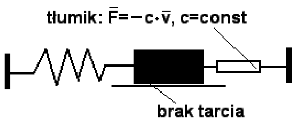

a sprężyna ma charakterystykę nieliniową: $k = k_1(1+k_2 \cdot x^2)$

#### W ramach zadania należy:
1. Wykonać rysunek (**porządny!**), rysunek powinien zawierać: wprowadzony układ współrzędnych (początek w położeniu równowagi), siły działające na ciało, inne wielkości mające wpływ na rozwiązanie zadania (wymiary, współczynniki, itp.).
2. Wyprowadzić różniczkowe równania ruchu.
3. Sprowadzić ww. równania do układu równań I rzędu.
4. Układ równań rozwiązać numerycznie za pomocą procedury `vrk4`.
5. Sporządzić wykresy: $x(t), v_x(t)$.

#### Uwagi
 * Wszystkie stałe wymagane do rozwiązania zadania (warunki początkowe, wymiary, itp.) proszę zadawać z klawiatury
 * Warunki początkowe: $x_0 \neq 0,  v_0 \neq 0$
 * Wykresy sporządzić dla przykładowego zestawu danych (**dane te należy zapisać razem z wykresem**)
 * Wyprowadzenia, rysunki i wykresy należy oddawać w formie pisemnej
 
----
 
## Zadanie 2
Dany jest układ:

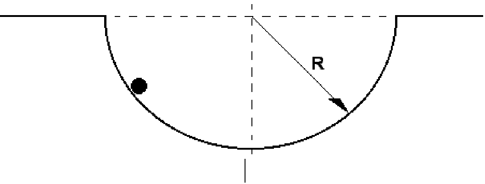

#### W ramach zadania należy:
1. Wykonać rysunek (**porządny!**), rysunek powinien zawierać: wprowadzony układ współrzędnych (początek w położeniu równowagi), siły działające na masę, inne wielkości mające wpływ na rozwiązanie zadania (wymiary, współczynniki, itp.).
2. Wyprowadzić różniczkowe równania ruchu.
3. Sprowadzić ww. równania do układu równań I rzędu.
4. Układ równań rozwiązać numerycznie za pomocą procedury `vrk4`.
5. Sporządzić wykresy: $\alpha(t), \omega(t), \omega(\alpha)$.
6. Sporządzić wykres energii mechanicznej w czasie $E_{MECH}(t)$.

#### Uwagi
 * Wszystkie stałe wymagane do rozwiązania zadania (warunki początkowe, wymiary, itp.) proszę zadawać z klawiatury
 * Warunki początkowe: $\alpha_0 \neq 0,  \omega_0 \neq 0$
 * Wykresy sporządzić dla przykładowego zestawu danych (**dane te należy zapisać razem z wykresem**)
 * Wyprowadzenia, rysunki i wykresy należy oddawać w formie pisemnej

----

## Zadanie 3

Dany jest układ:

wahadło matematyczne; duże drgania, tzn. $sin(\alpha) \neq \alpha$

#### W ramach zadania należy:
1. Wykonać rysunek (**porządny!**), rysunek powinien zawierać: wprowadzony układ współrzędnych (początek w położeniu równowagi), siły działające na masę, inne wielkości mające wpływ na rozwiązanie zadania (wymiary, współczynniki, itp.).
2. Wyprowadzić różniczkowe równania ruchu.
3. Sprowadzić ww. równania do układu równań I rzędu.
4. Układ równań rozwiązać numerycznie za pomocą procedury `vrk4`.
5. Sporządzić wykresy: $\alpha(t), \omega(t), \omega(\alpha)$.
6. Sporządzić wykres energii mechanicznej w czasie $E_{MECH}(t)$.

#### Uwagi
 * Wszystkie stałe wymagane do rozwiązania zadania (warunki początkowe, wymiary, itp.) proszę zadawać z klawiatury
 * Warunki początkowe: $\alpha_0 \neq 0,  \omega_0 \neq 0$
 * Wykresy sporządzić dla przykładowego zestawu danych (**dane te należy zapisać razem z wykresem**)
 * Wyprowadzenia, rysunki i wykresy należy oddawać w formie pisemnej

----

## Zadanie 4

Dany jest układ:

#### W ramach zadania należy:
1. Wykonać rysunek (**porządny!**), rysunek powinien zawierać: wprowadzony układ współrzędnych (początek w położeniu równowagi), siły działające na ciało, inne wielkości mające wpływ na rozwiązanie zadania (wymiary, współczynniki, itp.).
2. Wyprowadzić różniczkowe równania ruchu.
3. Sprowadzić ww. równania do układu równań I rzędu.
4. Układ równań rozwiązać numerycznie za pomocą procedury `vrk4`.
5. Sporządzić wykresy: $x(t), v_x(t), y(t), v_y(t), y(x)$.

#### Uwagi
 * Wszystkie stałe wymagane do rozwiązania zadania (warunki początkowe, wymiary, itp.) proszę zadawać z klawiatury
 * warunki początkowe: $x_0 , y_0$ – zależnie od wprowadzonego układu, $v_0 \neq 0$
 * Wykresy sporządzić dla przykładowego zestawu danych (**dane te należy zapisać razem z wykresem**)
 * Wyprowadzenia, rysunki i wykresy należy oddawać w formie pisemnej
 
----

## Zadanie 5

Dany jest układ:

$$ F_{oporu} = \frac{\rho v^2}{2} \cdot S \cdot C $$
gdzie: $\rho$-gęstość powietrza, $v$-prędkość kuli względem powietrza, $S$-powierzchnia odniesienia i $C$-stały współczynnik. 

#### W ramach zadania należy:
1. Wykonać rysunek (**porządny!**), rysunek powinien zawierać: wprowadzony układ współrzędnych (początek w położeniu równowagi), siły działające na ciało, inne wielkości mające wpływ na rozwiązanie zadania (wymiary, współczynniki, itp.).
2. Wyprowadzić różniczkowe równania ruchu.
3. Sprowadzić ww. równania do układu równań I rzędu.
4. Układ równań rozwiązać numerycznie za pomocą procedury `vrk4`.
5. Sporządzić wykresy: $z(t), v_z(t)$.

#### Uwagi
 * Wszystkie stałe wymagane do rozwiązania zadania (warunki początkowe, wymiary, itp.) proszę zadawać z klawiatury
 * warunki początkowe: $x_0$ zależnie od wprowadzonego układu współrzędnych, $z_0 \neq 0$ 
 * Wykresy sporządzić dla przykładowego zestawu danych (**dane te należy zapisać razem z wykresem**)
 * Wyprowadzenia, rysunki i wykresy należy oddawać w formie pisemnej
 
----

## Zadanie 6

Dany jest układ:

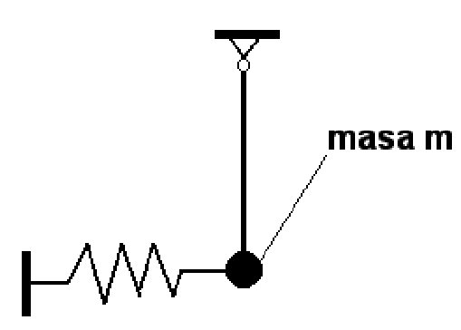

duże drgania, tzn. $sin(\alpha) \neq \alpha$; uproszczenie: siła od sprężyny działa zawsze poziomo

#### W ramach zadania należy:
1. Wykonać rysunek (**porządny!**), rysunek powinien zawierać: wprowadzony układ współrzędnych (początek w położeniu równowagi), siły działające na masę, inne wielkości mające wpływ na rozwiązanie zadania (wymiary, współczynniki, itp.).
2. Wyprowadzić różniczkowe równania ruchu.
3. Sprowadzić ww. równania do układu równań I rzędu.
4. Układ równań rozwiązać numerycznie za pomocą procedury `vrk4`.
5. Sporządzić wykresy: $\alpha(t), \omega(t), \omega(\alpha)$.
6. Sporządzić wykres energii mechanicznej w czasie $E_{MECH}(t)$.

#### Uwagi
 * Wszystkie stałe wymagane do rozwiązania zadania (warunki początkowe, wymiary, itp.) proszę zadawać z klawiatury
 * Warunki początkowe: $\alpha_0 \neq 0,  \omega_0 \neq 0$
 * Wykresy sporządzić dla przykładowego zestawu danych (**dane te należy zapisać razem z wykresem**)
 * Wyprowadzenia, rysunki i wykresy należy oddawać w formie pisemnej
 
----

## Zadanie 7

Dany jest układ:

duże drgania, tzn. $sin(\alpha) \neq \alpha$; uproszczenie: siła od sprężyny działa zawsze poziomo

#### W ramach zadania należy:
1. Wykonać rysunek (**porządny!**), rysunek powinien zawierać: wprowadzony układ współrzędnych (początek w położeniu równowagi), siły działające na masę, inne wielkości mające wpływ na rozwiązanie zadania (wymiary, współczynniki, itp.).
2. Wyprowadzić różniczkowe równania ruchu.
3. Sprowadzić ww. równania do układu równań I rzędu.
4. Układ równań rozwiązać numerycznie za pomocą procedury `vrk4`.
5. Sporządzić wykresy: $\alpha(t), \omega(t), \omega(\alpha)$.
6. Sporządzić wykres energii mechanicznej w czasie $E_{MECH}(t)$.

#### Uwagi
 * Wszystkie stałe wymagane do rozwiązania zadania (warunki początkowe, wymiary, itp.) proszę zadawać z klawiatury
 * Warunki początkowe: $\alpha_0 \neq 0,  \omega_0 \neq 0$
 * Wykresy sporządzić dla przykładowego zestawu danych (**dane te należy zapisać razem z wykresem**)
 * Wyprowadzenia, rysunki i wykresy należy oddawać w formie pisemnej
 
----

## Zadanie 8

Dany jest układ:

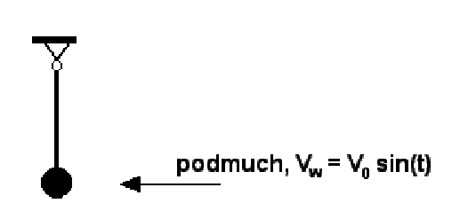

$$ F_{oporu} = \frac{\rho v^2}{2} \cdot S \cdot C $$
gdzie: $\rho$-gęstość powietrza, $v$-prędkość kuli względem powietrza, $S$-powierzchnia odniesienia i $C$-stały współczynnik. 

#### W ramach zadania należy:
1. Wykonać rysunek (**porządny!**), rysunek powinien zawierać: wprowadzony układ współrzędnych (początek w położeniu równowagi), siły działające na masę, inne wielkości mające wpływ na rozwiązanie zadania (wymiary, współczynniki, itp.).
2. Wyprowadzić różniczkowe równania ruchu.
3. Sprowadzić ww. równania do układu równań I rzędu.
4. Układ równań rozwiązać numerycznie za pomocą procedury `vrk4`.
5. Sporządzić wykresy: $\alpha(t), \omega(t), \omega(\alpha)$.
6. Sporządzić wykres energii mechanicznej w czasie $E_{MECH}(t)$.

#### Uwagi
 * Wszystkie stałe wymagane do rozwiązania zadania (warunki początkowe, wymiary, itp.) proszę zadawać z klawiatury
 * Warunki początkowe: $\alpha_0 \neq 0,  \omega_0 \neq 0$
 * Wykresy sporządzić dla przykładowego zestawu danych (**dane te należy zapisać razem z wykresem**)
 * Wyprowadzenia, rysunki i wykresy należy oddawać w formie pisemnej
 
----

## Zadanie 9

Dany jest układ:

sprężyna o charakterystyce nieliniowej: $k = k1 (1+k_2 \cdot x^2)$

#### W ramach zadania należy:
1. Wykonać rysunek (**porządny!**), rysunek powinien zawierać: wprowadzony układ współrzędnych (początek w położeniu równowagi), siły działające na masę, inne wielkości mające wpływ na rozwiązanie zadania (wymiary, współczynniki, itp.).
2. Wyprowadzić różniczkowe równania ruchu.
3. Sprowadzić ww. równania do układu równań I rzędu.
4. Układ równań rozwiązać numerycznie za pomocą procedury `vrk4`.
5. Sporządzić wykresy: $x(t), v_x(t)$.
6. Sporządzić wykres energii mechanicznej w czasie $E_{MECH}(t)$.

#### Uwagi
 * Wszystkie stałe wymagane do rozwiązania zadania (warunki początkowe, wymiary, itp.) proszę zadawać z klawiatury
 * Warunki początkowe: $x_0 \neq 0,  v_0 \neq 0$
 * Wykresy sporządzić dla przykładowego zestawu danych (**dane te należy zapisać razem z wykresem**)
 * Wyprowadzenia, rysunki i wykresy należy oddawać w formie pisemnej
 
----

## Zadanie 10

Dany jest układ:

$$ F_{oporu} = \frac{\rho v^2}{2} \cdot S \cdot C $$
gdzie: $\rho$-gęstość powietrza, $v$-prędkość kuli względem powietrza, $S$-powierzchnia odniesienia i $C$-stały współczynnik. 

#### W ramach zadania należy:
1. Wykonać rysunek (**porządny!**), rysunek powinien zawierać: wprowadzony układ współrzędnych (początek w położeniu równowagi), siły działające na ciało, inne wielkości mające wpływ na rozwiązanie zadania (wymiary, współczynniki, itp.).
2. Wyprowadzić różniczkowe równania ruchu.
3. Sprowadzić ww. równania do układu równań I rzędu.
4. Układ równań rozwiązać numerycznie za pomocą procedury `vrk4`.
5. Sporządzić wykresy: $x(t), v_x(t), y(t), v_y(t)$.

#### Uwagi
 * Wszystkie stałe wymagane do rozwiązania zadania (warunki początkowe, wymiary, itp.) proszę zadawać z klawiatury
 * warunki początkowe: $x_0, y_0$ zależnie od wprowadzonego układu współrzędnych, $v_0 \neq 0$ 
 * Wykresy sporządzić dla przykładowego zestawu danych (**dane te należy zapisać razem z wykresem**)
 * Wyprowadzenia, rysunki i wykresy należy oddawać w formie pisemnej

----

## Zadanie 11

Dany jest układ:

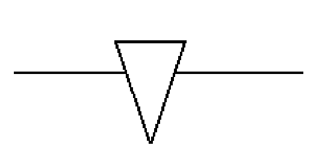

Stożek w wodzie. Należy tak dobrać gęstość, aby stan równowagi odpowiadał zanurzeniu do $\frac{2}{3}$ wysokości. W celu uproszczenia problemu należy wziąć pod uwage jedyni siły hydrostatyczne. 

#### W ramach zadania należy:
1. Wykonać rysunek (**porządny!**), rysunek powinien zawierać: wprowadzony układ współrzędnych (początek w położeniu równowagi), siły działające na masę, inne wielkości mające wpływ na rozwiązanie zadania (wymiary, współczynniki, itp.).
2. Wyprowadzić różniczkowe równania ruchu.
3. Sprowadzić ww. równania do układu równań I rzędu.
4. Układ równań rozwiązać numerycznie za pomocą procedury `vrk4`.
5. Sporządzić wykresy: $z(t), v_z(t)$.
6. Sporządzić wykres energii mechanicznej w czasie $E_{MECH}(t)$.

#### Uwagi
 * Wszystkie stałe wymagane do rozwiązania zadania (warunki początkowe, wymiary, itp.) proszę zadawać z klawiatury
 * Warunki początkowe: $z_0 \neq 0, v_0 \neq 0$
 * Wykresy sporządzić dla przykładowego zestawu danych (**dane te należy zapisać razem z wykresem**)
 * Wyprowadzenia, rysunki i wykresy należy oddawać w formie pisemnej
 
----

## Zadanie 12

Dany jest układ:

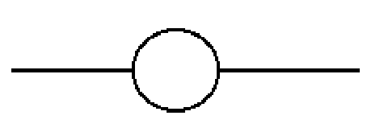

Kula w wodzie. Należy tak dobrać gęstość, aby stan równowagi odpowiadał zanurzeniu do $\frac{1}{2}$ wysokości. W celu uproszczenia problemu należy wziąć pod uwage jedyni siły hydrostatyczne. 

#### W ramach zadania należy:
1. Wykonać rysunek (**porządny!**), rysunek powinien zawierać: wprowadzony układ współrzędnych (początek w położeniu równowagi), siły działające na masę, inne wielkości mające wpływ na rozwiązanie zadania (wymiary, współczynniki, itp.).
2. Wyprowadzić różniczkowe równania ruchu.
3. Sprowadzić ww. równania do układu równań I rzędu.
4. Układ równań rozwiązać numerycznie za pomocą procedury `vrk4`.
5. Sporządzić wykresy: $z(t), v_z(t)$.
6. Sporządzić wykres energii mechanicznej w czasie $E_{MECH}(t)$.

#### Uwagi
 * Wszystkie stałe wymagane do rozwiązania zadania (warunki początkowe, wymiary, itp.) proszę zadawać z klawiatury
 * Warunki początkowe: $z_0 \neq 0, v_0 \neq 0$
 * Wykresy sporządzić dla przykładowego zestawu danych (**dane te należy zapisać razem z wykresem**)
 * Wyprowadzenia, rysunki i wykresy należy oddawać w formie pisemnej
 
----

## Zadanie 13

Dany jest układ:

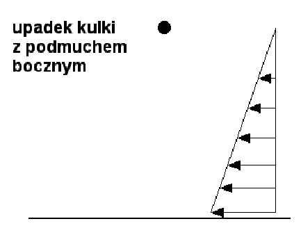

$$ F_{oporu} = \frac{\rho v^2}{2} \cdot S \cdot C $$
gdzie: $\rho$-gęstość powietrza, $v$-prędkość kuli względem powietrza, $S$-powierzchnia odniesienia i $C$-stały współczynnik. 

#### W ramach zadania należy:
1. Wykonać rysunek (**porządny!**), rysunek powinien zawierać: wprowadzony układ współrzędnych (początek w położeniu równowagi), siły działające na ciało, inne wielkości mające wpływ na rozwiązanie zadania (wymiary, współczynniki, itp.).
2. Wyprowadzić różniczkowe równania ruchu.
3. Sprowadzić ww. równania do układu równań I rzędu.
4. Układ równań rozwiązać numerycznie za pomocą procedury `vrk4`.
5. Sporządzić wykresy: $x(t), v_x(t), y(t), v_y(t)$.

#### Uwagi
 * Wszystkie stałe wymagane do rozwiązania zadania (warunki początkowe, wymiary, itp.) proszę zadawać z klawiatury
 * warunki początkowe: $x_0, y_0$ zależnie od wprowadzonego układu współrzędnych, $v_0 \neq 0$ 
 * Wykresy sporządzić dla przykładowego zestawu danych (**dane te należy zapisać razem z wykresem**)
 * Wyprowadzenia, rysunki i wykresy należy oddawać w formie pisemnej

----

## Zadanie 14

Dany jest układ:

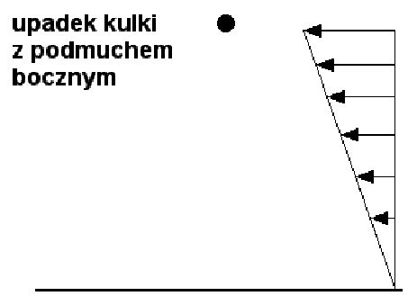

$$ F_{oporu} = \frac{\rho v^2}{2} \cdot S \cdot C $$
gdzie: $\rho$-gęstość powietrza, $v$-prędkość kuli względem powietrza, $S$-powierzchnia odniesienia i $C$-stały współczynnik. 

#### W ramach zadania należy:
1. Wykonać rysunek (**porządny!**), rysunek powinien zawierać: wprowadzony układ współrzędnych (początek w położeniu równowagi), siły działające na ciało, inne wielkości mające wpływ na rozwiązanie zadania (wymiary, współczynniki, itp.).
2. Wyprowadzić różniczkowe równania ruchu.
3. Sprowadzić ww. równania do układu równań I rzędu.
4. Układ równań rozwiązać numerycznie za pomocą procedury `vrk4`.
5. Sporządzić wykresy: $x(t), v_x(t), y(t), v_y(t)$.

#### Uwagi
 * Wszystkie stałe wymagane do rozwiązania zadania (warunki początkowe, wymiary, itp.) proszę zadawać z klawiatury
 * warunki początkowe: $x_0, y_0$ zależnie od wprowadzonego układu współrzędnych, $v_0 \neq 0$ 
 * Wykresy sporządzić dla przykładowego zestawu danych (**dane te należy zapisać razem z wykresem**)
 * Wyprowadzenia, rysunki i wykresy należy oddawać w formie pisemnej

----

## Zadanie 15

Dany jest układ:

$$ F_{oporu} = \frac{\rho v^2}{2} \cdot S \cdot C $$
gdzie: $\rho$-gęstość powietrza, $v$-prędkość kuli względem powietrza, $S$-powierzchnia odniesienia i $C$-stały współczynnik. 

#### W ramach zadania należy:
1. Wykonać rysunek (**porządny!**), rysunek powinien zawierać: wprowadzony układ współrzędnych (początek w położeniu równowagi), siły działające na ciało, inne wielkości mające wpływ na rozwiązanie zadania (wymiary, współczynniki, itp.).
2. Wyprowadzić różniczkowe równania ruchu.
3. Sprowadzić ww. równania do układu równań I rzędu.
4. Układ równań rozwiązać numerycznie za pomocą procedury `vrk4`.
5. Sporządzić wykresy: $x(t), v_x(t), y(t), v_y(t)$.

#### Uwagi
 * Wszystkie stałe wymagane do rozwiązania zadania (warunki początkowe, wymiary, itp.) proszę zadawać z klawiatury
 * warunki początkowe: $x_0, y_0$ zależnie od wprowadzonego układu współrzędnych, $v_0 \neq 0$ 
 * Wykresy sporządzić dla przykładowego zestawu danych (**dane te należy zapisać razem z wykresem**)
 * Wyprowadzenia, rysunki i wykresy należy oddawać w formie pisemnej

----

## Zadanie 16

Dany jest układ:

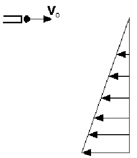

$$ F_{oporu} = \frac{\rho v^2}{2} \cdot S \cdot C $$
gdzie: $\rho$-gęstość powietrza, $v$-prędkość kuli względem powietrza, $S$-powierzchnia odniesienia i $C$-stały współczynnik. 

#### W ramach zadania należy:
1. Wykonać rysunek (**porządny!**), rysunek powinien zawierać: wprowadzony układ współrzędnych (początek w położeniu równowagi), siły działające na ciało, inne wielkości mające wpływ na rozwiązanie zadania (wymiary, współczynniki, itp.).
2. Wyprowadzić różniczkowe równania ruchu.
3. Sprowadzić ww. równania do układu równań I rzędu.
4. Układ równań rozwiązać numerycznie za pomocą procedury `vrk4`.
5. Sporządzić wykresy: $x(t), v_x(t), y(t), v_y(t)$.

#### Uwagi
 * Wszystkie stałe wymagane do rozwiązania zadania (warunki początkowe, wymiary, itp.) proszę zadawać z klawiatury
 * warunki początkowe: $x_0, y_0$ zależnie od wprowadzonego układu współrzędnych, $v_0 \neq 0$ 
 * Wykresy sporządzić dla przykładowego zestawu danych (**dane te należy zapisać razem z wykresem**)
 * Wyprowadzenia, rysunki i wykresy należy oddawać w formie pisemnej

----

## Zadanie 17

Dany jest układ:

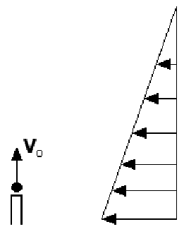

$$ F_{oporu} = \frac{\rho v^2}{2} \cdot S \cdot C $$
gdzie: $\rho$-gęstość powietrza, $v$-prędkość kuli względem powietrza, $S$-powierzchnia odniesienia i $C$-stały współczynnik. 

#### W ramach zadania należy:
1. Wykonać rysunek (**porządny!**), rysunek powinien zawierać: wprowadzony układ współrzędnych (początek w położeniu równowagi), siły działające na ciało, inne wielkości mające wpływ na rozwiązanie zadania (wymiary, współczynniki, itp.).
2. Wyprowadzić różniczkowe równania ruchu.
3. Sprowadzić ww. równania do układu równań I rzędu.
4. Układ równań rozwiązać numerycznie za pomocą procedury `vrk4`.
5. Sporządzić wykresy: $x(t), v_x(t), y(t), v_y(t)$.

#### Uwagi
 * Wszystkie stałe wymagane do rozwiązania zadania (warunki początkowe, wymiary, itp.) proszę zadawać z klawiatury
 * warunki początkowe: $x_0, y_0$ zależnie od wprowadzonego układu współrzędnych, $v_0 \neq 0$ 
 * Wykresy sporządzić dla przykładowego zestawu danych (**dane te należy zapisać razem z wykresem**)
 * Wyprowadzenia, rysunki i wykresy należy oddawać w formie pisemnej

----

## Zadanie 18

Dany jest układ:

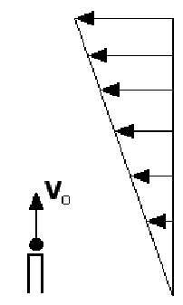

$$ F_{oporu} = \frac{\rho v^2}{2} \cdot S \cdot C $$
gdzie: $\rho$-gęstość powietrza, $v$-prędkość kuli względem powietrza, $S$-powierzchnia odniesienia i $C$-stały współczynnik. 

#### W ramach zadania należy:
1. Wykonać rysunek (**porządny!**), rysunek powinien zawierać: wprowadzony układ współrzędnych (początek w położeniu równowagi), siły działające na ciało, inne wielkości mające wpływ na rozwiązanie zadania (wymiary, współczynniki, itp.).
2. Wyprowadzić różniczkowe równania ruchu.
3. Sprowadzić ww. równania do układu równań I rzędu.
4. Układ równań rozwiązać numerycznie za pomocą procedury `vrk4`.
5. Sporządzić wykresy: $x(t), v_x(t), y(t), v_y(t)$.

#### Uwagi
 * Wszystkie stałe wymagane do rozwiązania zadania (warunki początkowe, wymiary, itp.) proszę zadawać z klawiatury
 * warunki początkowe: $x_0, y_0$ zależnie od wprowadzonego układu współrzędnych, $v_0 \neq 0$ 
 * Wykresy sporządzić dla przykładowego zestawu danych (**dane te należy zapisać razem z wykresem**)
 * Wyprowadzenia, rysunki i wykresy należy oddawać w formie pisemnej

----

## Zadanie 19

Dany jest układ:

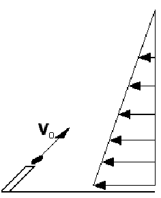

$$ F_{oporu} = \frac{\rho v^2}{2} \cdot S \cdot C $$
gdzie: $\rho$-gęstość powietrza, $v$-prędkość kuli względem powietrza, $S$-powierzchnia odniesienia i $C$-stały współczynnik. 

#### W ramach zadania należy:
1. Wykonać rysunek (**porządny!**), rysunek powinien zawierać: wprowadzony układ współrzędnych (początek w położeniu równowagi), siły działające na ciało, inne wielkości mające wpływ na rozwiązanie zadania (wymiary, współczynniki, itp.).
2. Wyprowadzić różniczkowe równania ruchu.
3. Sprowadzić ww. równania do układu równań I rzędu.
4. Układ równań rozwiązać numerycznie za pomocą procedury `vrk4`.
5. Sporządzić wykresy: $x(t), v_x(t), y(t), v_y(t)$.

#### Uwagi
 * Wszystkie stałe wymagane do rozwiązania zadania (warunki początkowe, wymiary, itp.) proszę zadawać z klawiatury
 * warunki początkowe: $x_0, y_0$ zależnie od wprowadzonego układu współrzędnych, $v_0 \neq 0$ 
 * Wykresy sporządzić dla przykładowego zestawu danych (**dane te należy zapisać razem z wykresem**)
 * Wyprowadzenia, rysunki i wykresy należy oddawać w formie pisemnej

----

## Zadanie 20

Dany jest układ:

$$ F_{oporu} = \frac{\rho v^2}{2} \cdot S \cdot C $$
gdzie: $\rho$-gęstość powietrza, $v$-prędkość kuli względem powietrza, $S$-powierzchnia odniesienia i $C$-stały współczynnik. 

#### W ramach zadania należy:
1. Wykonać rysunek (**porządny!**), rysunek powinien zawierać: wprowadzony układ współrzędnych (początek w położeniu równowagi), siły działające na ciało, inne wielkości mające wpływ na rozwiązanie zadania (wymiary, współczynniki, itp.).
2. Wyprowadzić różniczkowe równania ruchu.
3. Sprowadzić ww. równania do układu równań I rzędu.
4. Układ równań rozwiązać numerycznie za pomocą procedury `vrk4`.
5. Sporządzić wykresy: $x(t), v_x(t), y(t), v_y(t)$.

#### Uwagi
 * Wszystkie stałe wymagane do rozwiązania zadania (warunki początkowe, wymiary, itp.) proszę zadawać z klawiatury
 * warunki początkowe: $x_0, y_0$ zależnie od wprowadzonego układu współrzędnych, $v_0 \neq 0$ 
 * Wykresy sporządzić dla przykładowego zestawu danych (**dane te należy zapisać razem z wykresem**)
 * Wyprowadzenia, rysunki i wykresy należy oddawać w formie pisemnej

----

## Zadanie 21

Dany jest układ:

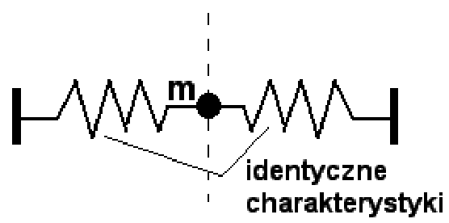

Ruch masy może odbywać się tylko w pionie, sprężyna o charakterystyce nieliniowej: $k = k_1(1 + k_2 \cdot x^2)$.

#### W ramach zadania należy:
1. Wykonać rysunek (**porządny!**), rysunek powinien zawierać: wprowadzony układ współrzędnych (początek w położeniu równowagi), siły działające na masę, inne wielkości mające wpływ na rozwiązanie zadania (wymiary, współczynniki, itp.).
2. Wyprowadzić różniczkowe równania ruchu.
3. Sprowadzić ww. równania do układu równań I rzędu.
4. Układ równań rozwiązać numerycznie za pomocą procedury `vrk4`.
5. Sporządzić wykresy: $z(t), v_z(t)$.
6. Sporządzić wykres energii mechanicznej w czasie $E_{MECH}(t)$.

#### Uwagi
 * Wszystkie stałe wymagane do rozwiązania zadania (warunki początkowe, wymiary, itp.) proszę zadawać z klawiatury
 * Warunki początkowe: $z_0 \neq 0,  v_0 \neq 0$
 * Wykresy sporządzić dla przykładowego zestawu danych (**dane te należy zapisać razem z wykresem**)
 * Wyprowadzenia, rysunki i wykresy należy oddawać w formie pisemnej
 
----

## Zadanie 22

Dany jest układ:

Ruch masy może odbywać się tylko w pionie. 

#### W ramach zadania należy:
1. Wykonać rysunek (**porządny!**), rysunek powinien zawierać: wprowadzony układ współrzędnych (początek w położeniu równowagi), siły działające na masę, inne wielkości mające wpływ na rozwiązanie zadania (wymiary, współczynniki, itp.).
2. Wyprowadzić różniczkowe równania ruchu.
3. Sprowadzić ww. równania do układu równań I rzędu.
4. Układ równań rozwiązać numerycznie za pomocą procedury `vrk4`.
5. Sporządzić wykresy: $z(t), v_z(t)$.
6. Sporządzić wykres energii mechanicznej w czasie $E_{MECH}(t)$.

#### Uwagi
 * Wszystkie stałe wymagane do rozwiązania zadania (warunki początkowe, wymiary, itp.) proszę zadawać z klawiatury
 * Warunki początkowe: $z_0 \neq 0, v_0 \neq 0$
 * Wykresy sporządzić dla przykładowego zestawu danych (**dane te należy zapisać razem z wykresem**)
 * Wyprowadzenia, rysunki i wykresy należy oddawać w formie pisemnej
 
----

## Zadanie 23

Dany jest układ:

#### W ramach zadania należy:
1. Wykonać rysunek (**porządny!**), rysunek powinien zawierać: wprowadzony układ współrzędnych (początek w położeniu równowagi), siły działające na masę, inne wielkości mające wpływ na rozwiązanie zadania (wymiary, współczynniki, itp.).
2. Wyprowadzić różniczkowe równania ruchu.
3. Sprowadzić ww. równania do układu równań I rzędu.
4. Układ równań rozwiązać numerycznie za pomocą procedury `vrk4`.
5. Sporządzić wykresy: $x(t), v_x(t)$.
6. Sporządzić wykres energii mechanicznej w czasie $E_{MECH}(t)$.

#### Uwagi
 * Wszystkie stałe wymagane do rozwiązania zadania (warunki początkowe, wymiary, itp.) proszę zadawać z klawiatury
 * Warunki początkowe: $x_0 \neq 0, v_0 \neq 0$
 * Wykresy sporządzić dla przykładowego zestawu danych (**dane te należy zapisać razem z wykresem**)
 * Wyprowadzenia, rysunki i wykresy należy oddawać w formie pisemnej
 
----

## Zadanie 24

Dany jest układ:

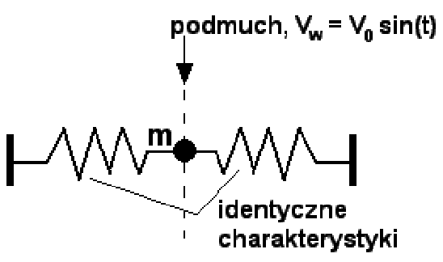

Ruch masy może odbywać się tylko w pionie, opór powietrza wyraża się wzorem:
$$ F_{oporu} = \frac{\rho v^2}{2} \cdot S \cdot C $$
gdzie: $\rho$-gęstość powietrza, $v$-prędkość kuli względem powietrza, $S$-powierzchnia odniesienia i $C$-stały współczynnik. 

#### W ramach zadania należy:
1. Wykonać rysunek (**porządny!**), rysunek powinien zawierać: wprowadzony układ współrzędnych (początek w położeniu równowagi), siły działające na masę, inne wielkości mające wpływ na rozwiązanie zadania (wymiary, współczynniki, itp.).
2. Wyprowadzić różniczkowe równania ruchu.
3. Sprowadzić ww. równania do układu równań I rzędu.
4. Układ równań rozwiązać numerycznie za pomocą procedury `vrk4`.
5. Sporządzić wykresy: $z(t), v_z(t)$.
6. Sporządzić wykres energii mechanicznej w czasie $E_{MECH}(t)$.

#### Uwagi
 * Wszystkie stałe wymagane do rozwiązania zadania (warunki początkowe, wymiary, itp.) proszę zadawać z klawiatury
 * Warunki początkowe: $z_0 \neq 0,  v_0 \neq 0$
 * Wykresy sporządzić dla przykładowego zestawu danych (**dane te należy zapisać razem z wykresem**)
 * Wyprowadzenia, rysunki i wykresy należy oddawać w formie pisemnej
 
----
