# Cel ćwiczenia

Zapoznanie z podstawowymi funkcjami programów: **ANSYS DesignModeler** (tworzenie geometrii) i **ANSYS Meshing** (dyskretyzacja domeny), oraz ich współdziałaniem z **ANSYS Fluent** (obliczenia przepływowe) wewnątrz i poza środowiskiem Workbench.

Więcej informacji znajduje się w pomocy programu ANSYS Workbench lub na stronie [ANSYS Workbench](https://ansyshelp.ansys.com/)

# Rozpoczęcie pracy - Środowisko Workbench

## Wstęp
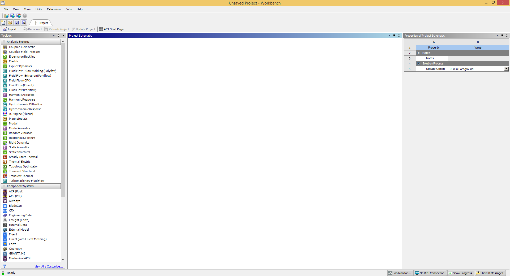

Okno główne środowiska Workbench składa się z okna wyboru narzędzi (panel po lewej stronie okna) oraz okna schematu projektu (główna część okna).
Panel narzędzi jest podzielony na pięć zakładek, z czego dwie pierwsze są potrzebne by zacząć podstawową pracę ze środkowiskiem Workbench.
Zakładka **Component systems** jest listą dostępnych programów jakie możemy używać w obrębie środowiska Workbench.
Zakładka **Analysis Systems** zawiera zestaw standardowych systemów do analizy złożonych z omówionych wcześniej komponentów. 

#### Rozpoczynanie pracy z wykorzystaniem gotowego systemu

Aby rozpocząć pracę, należy przeciągnąć **Fluid Flow(Fluent)** do zaznaczonego pola w oknie schematu projektu (Rys. 2). Z tego sposobu tworzenia projektów będziemy korzystać na wszystkich zajęciach.

Jak można zauważyć, wyciągnięty blok zawiera komplet modułów z zakładki **Component systems**, który pozwala na przeprowadzenie pełnej analizy numerycznej. 
Od stworzenia geometrii, przez dyskretyzacje domeny po obróbkę wyników.
Klikamy na napis *Fluid Flow(Fluent)* pod stworzonym blokiem i **zmianiamy nazwę** na Instrukcja N, gdzie N to numer instrukcji.
Na potrzeby tych laboratoriów, **niech to będzie standardowy sposób** tworzenia kolejnych analiz.

---

#### Tworzenie własnych systemów (alternatywa)

Rozwiń

Czasem się zdaża, chociażby przy duzych projektach obliczeniowych, że nasz system do analizy wymaga podejścia uszytego na miarę. 
Wtedy możemy wykorzystać pełną funkcjonalność okna schematu projektu.
Tworzenie pierwszego elementu naszego schematu nie różni się niczym od poprzedniego podejścia.
Wyciągamy interesujący nas bloczek z **Component systems** i puszczamy w zaznaczone pole w **Project schematic**. 

Dodanie każdego kolejnego można zrobić na dwa sposoby. 

- Pierwszym sposobem jest upuszczenie w dowolne miejsce kolejnego komponentu i połączenie ich przez przeciągnięcie komórki z jednego komponentu do odpowiadającej jej nazwą komórki w drugim komponencie (Rys. 3a).
- Drugim sposobem jest, upuszczenie nowo dodawanego komponentu w podświetloną komórkę wcześniej dodanego komponentu (Rys. 3b)

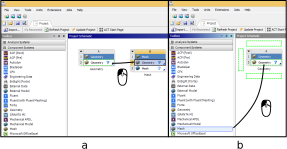

W ten sposób możemy tworzyć duże schematy projektów (Rys. 4).

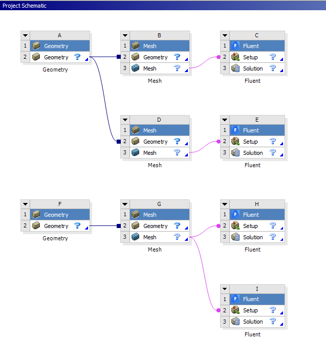

---

#### Symbole w komórkach komponentów systemu

Rozwiń

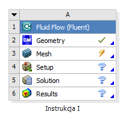

**Poszczególne komórki programów mogą mieć różne stany w zależności od aktywności użytkownika:**

 - *Brak danych* - Wymagane są dane z poprzedzających komórek. W tym stanie komórki mogą się nie otworzyć.

 - *Odśwież dane* - Dane w komórkach poprzedzających zostały zmienione od ostatniego stanu.

 - *Program wymaga uwagi* - Program w tym stanie nie zwróci żadnych danych do kolejnych komórek, dopóki nie uzupełni się braków.

 - *Zaktualizuj dane* - Wewnętrzne dane zostały zmienione, jednak program nie przekazał wyniku do środowiska Workbench. Należy odświeżyć daną komórkę, aby zsynchronizować dane.

 - *Aktualne dane* - dane są aktualne i nie znaleziono błędów.

 - *Zmienione dane* - Komorka jest aktualna ale może się zmienić w związku z wykrytą zmianą wcześniejszych komórek.

**Stany typowe dla programów obliczeniowych:**

 - *Przerwano, zaktualizuj dane* - Przerwano podczas obliczeń. Wygenerowane dane do momentu przerwania są dostępne jednak plik z wynikami jest pusty.

 - *Przerwano, aktualny* - Przerwano podczas obliczeń. Plik z wynikiem zawiera dane. Ten stan występuje, jeżeli przerwano kilka obliczeń pod rząd.

 - *Oczekuje* - W trakcie analizy w trybie batch. Można wykonywać operacje w innych systemach w projekcie. 

**Stany błędów:**

 - *Nie udało się odświeżyć, Odśwież dane*

 - *Nie udało się zaktualizować, Zaktualizuj dane*

 - *Nie udało się zaktualizować, Program wymaga uwagi*

---

## Moduł geometryczny - DesignModeler

W ramach poznawania modułu CAD wykonajmy geometrię na potrzeby [Instrukcji II](http://ccfd.github.io/courses/momp_lab02.html).

Geometrią do wykonania jest fragment dwuwymiarowego kanału z uskokiem. Na potrzeby ćwiczenia, geometrię powinno się stworzyć za pomocą dwóch prostokątów:

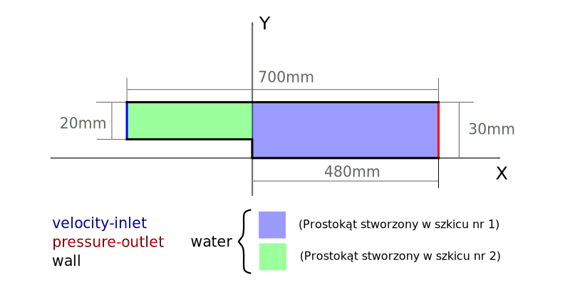

1. Stwórz projekt wg. opisu w [Rozpoczynanie pracy...](#rozpoczynanie-pracy-z-wykorzystaniem-gotowego-systemu)

2. Otwórz Desing modeler klikając prawym klawiszem myszki na komórkę geometry i wybierz **New DesignModeler geometry...**. Okno DesingModeler składa się z trzech elementów: **okno grafiki**, **drzewo historii operacji** oraz **okno szczegółów**. 
Rozwinięte menu kontekstowe zawiera elementy, które będą przydatne w trakcie pracy:

Rys. 6

	a. Menu wyboru elementów. Przydatne, jeżeli chcemy zaznaczyć konkretny typ elementu (linia, powierzchnia, itd.).
	b. Menu manipulacji widokiem w oknie graficznym. Warto również znać kombinacje klawiszy.
		- Wciśnięta rolka myszki - Obracanie kamery względem środka układu wspólrzędnych
		- ctrl + wciśnięta rolka myszki - Przesuwanie kamery
		- shift + wciśnięta rolka myszki - powiększanie aktualnego widoku (przed wciśnięciem kombinacji warto najechać kursorem na miejsce, które chcemy powiększyć)
	c. Menu szkicu. Niebieska ikona (po zaznaczeniu odpowiedniej płaszczyzny w **drzewie historii**) tworzy nowy szkic.
	d. Po każdej nowo wstawionej operacji w trybie modelingu powinniśmy ją stworzyć przy pomocy przycisku **Generate**

3. W menu kontekstowym **units** upewnij się, czy wybrana są dobre jednostki. **Przy każdym nowo otwartym programie w środowisku Workbench należy się upewnić czy jednostka jest dobrze ustawiona**

4. Utwórz **nowy szkic** (Rys. 6c). Upewnij się, czy wybrana została dobra płaszczyzna.
		
		Aby wykadrować widok na płaszczyznę pracy, możesz kliknąć prostopadłą oś do tej płaszczyzny na układzie współrzędnym widocznym w oknie graficznym. Jeżeli jesteś w trybie szkicownika, dodatkowo można to zrobić za pomocą najbardziej wysuniętego guzika na prawo w menu kontekstowym (Rys. 6)

5. Aby teraz przejść do trybu szkicownika, **zaznacz** nowo utworzony szkic w oknie drzewa historii i w tym samym oknie wejdź w zakładkę **Sketching**. Pojawi się nowe okno z zakładkami. Każda zakładka ma **dwie czarne strzałki** do nawigowania - Rys. 7a. Mamy do dyspozycji zakładkę **Draw**, w której znajdziemy wszystkie potrzebne "kreski". Zakładkę **Dimensions**, w której znajdziemy wszystkie narzędzia do wymiarowania (przydatna tutaj jest opcja **move** do przesuwania wymiaru).

Rys. 7

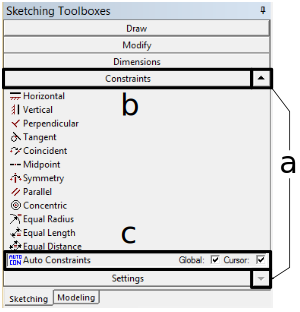

6. Po wejściu do szkicownika, należy ustawić **automatyczne nadawanie więzów** (Rys. 7b i 7c). Dzięki temu program nadaje więzy w trakcie dodawania nowych elementów do szkicu wyświatlając pierwszą literę więzu. Na przykład, rysując poziomą linię pojawia się litera *H* odpowiadająca więzowi *Poziom* (**H**orizontal).

Przejdźmy w końcu do rysowania:

7. W stworzonym szkicu, narysuj prawą część kanału za pomocą prostokąta. Nadaj więzy tak, aby lewą krawędzią dotykał osi Y, natomiast dolną krawędzią osi X (**Constraints -> Coincident**). Prostokąt zwymiaruj (**Dimensions -> General/Horizontal/Vertical**). W pełni zwymiarowany geometria powinna mieć kolor granatowy.
		
		Najwygodniej jest wymiarować linię wymiarując pozycję jej węzłów (końców).

8. Wyjdź ze szkicownika klikając zakładkę **Modeling**.

9. Stwórz kolejny szkic (Pamiętaj o wybraniu poprawnej płaszczyzny!). W nowym szkicu narysuj drugi prostokąt i za pomocą więzu **Coincident** połącz prostokąty górnymi wierzchołkami aby utworzyć ostateczny kształt kanału. **Zwymiaruj** prostokąt. Wyjdź do trybu **Modeling**

10. Na tym etapie musimy utworzyć powierzchnię która będzie reprezentować nasz dwuwymiarowy płyn. Wywołaj opcję **Concept -> Surfaces From Sketches**.

Rys. 8.

W oknie szczegółów pojawi się nowe menu:
- **Base Objects**: Tutaj należy wybrać szkic z którego ma powstać powierzchnia. Wystarczy zaznaczyć jedną z linii szkicu i kliknąć **Apply**
- **Operation**: Tutaj mamy dwie opcje:
	- **Add material** tworzona powierzchnia zostanie dodana do już znajdującej się powierzchni w geometrii, jeżeli ta pokrywa się z nią. Oczywiście w naszej geometrii nie ma jeszcze żadnych innych elementów. **Wybieramy tą opcję**
	- **Add frozen** tworzona powierzchnia zostanie dodana do geometrii jako odrębny element.
	
			Za każdym razem, gdy chcemy zaakceptować wybór i stworzyć
			geometrię wciskamy przycisk generate (Rys. 6d)

11. Powtarzamy krok 10 dla drugiego szkicu. Tym razem wybieramy opcję **Add frozen**. (*Generate*)

12. Nasze drzewo historii powinno wyglądać tak:

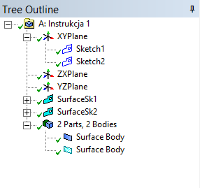

Na tym etapie mamy utworzone dwie powierzchnie. W takim stanie, powierzchnie są widziane jako dwa niezależne, nie połączone ze sobą elementy. Zależy nam teraz, aby dwie odrębne powierzchnie traktowane były jako złożenie.

13. Rozwińmy ostatni element w drzewie historii operacji. Powinny znajdować się tu dwie utworzone przez nas powierzchnie. Wciskając *ctrl* **zaznaczmy** obydwie pozycje. Prawym przyciskiem myszy otwieramy menu i wybieramy **Form new part** (Rys. 9a). Właśnie utworzyliśmy **złożenie**.

Rys. 9.

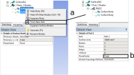

14. W szczegółach nowopowstałego złożenia, należy zmienić typ geometrii na **Fluid** (Rys. 9b).

15. **Zamykamy** DesignModeler.

---
	
		Zanim przejdziemy do kolejnego modułu, dobrym nawykiem jest zapisanie naszej pracy.
		Pozwoli to uniknąć utraty danych w razie awarii lub naszego błędu.

---

## Moduł Mesh

1. Otwieramy moduł Mesh, dwukrotnie klikając na odpowiednią komórkę.

2. Interface jest bardzo podobny do tego w DesignModelerze. (Drzewo historii, okno szczegółow oraz okno graficzne). Dodatkowym elementem jest belka z narzędziami w górnej części okna.

3. W oknie historii najważniejszym elementem jest gałąź **Mesh**. To tu znajdą się wszystkie operacje do wykonania siatki obliczeniowej. 

4. Aby wygenerować siatkę zaznaczamy **Mesh** i w oknie szczegółów przechodzimy do **Defaults** i w **Element size** zmieniamy domyślną wartość na **3 mm**.

5. **Generate** Powinniśmy zobaczyć gotową siatkę składającą się z czworokątów. Upewnij się, że wyższa część domeny podzielona jest na około 10 elementów w kierunku pionowym.

6. Ostanitą rzeczą, jest nazwanie elementów domeny. Dzięki temu, w programie fluent, można definiować warunki brzegowe. Nadawanie nazwy polega na **zaznaczeniu** elementów w oknie graficznym, wywołaniu menu podręcznego za pomocą **prawego przycisku myszki** i wybraniu opcji *Create named selection...*. **Szybszym sposobem** jest zaznaczenie elementów (kilka elementów zaznaczamy wciskając *ctrl*) i na klawiaturze wciskamy literę *n*. 

7. Zaznaczamy kolejno elementy domeny (krawędzie) i nazywamy je tak jak zostały nazwane w rysunku poglądowym w akapicie ["Moduł geometryczny..."](#moduł-geometryczny---designmodeler). Dla obu powierzchni tworzymy jedną nazwę **Woda**.

8. Wychodzimy z programu **Meshing**.

9. Należy zauważyć, że po wyjściu z programu **Meshing** status komórki jest oznaczony znakiem **Zaktualizuj dane**. Tak jak to zostało opisane w akapicie ["Symbole..."](#symbole-w-komórkach-komponentów-systemu), program lokalnie wykonał zadanie, jednak nie przekazał informacji do środowiska gdzie znajduje się cały projekt. Klikamy na komórkę **Mesh** prawym przyciskiem myszy i z menu podręcznego wybieramy opcję **Update**. Środowisko Workbench skomunikuje się z programem i zaktualizuje dane.

		Przy tej okazji warto przyjrzeć się temu co znajduje się w menu podręcznym.
		Pomocną opcją jest opcja reset.
		Jeżeli nie jesteśmy zadowoleni z pracy i/lub chcemy wyczyścić całą komórkę do stanu początkowego uzywamy właśnie opcji reset.
		
10. Zapisujemy projekt. Nasz blok *Instrukcja I* jest gotowy do wykonania Instrukcji II.

### Podstawowe elementy kontroli jakości siatki

Sprawdźmy jak można "poprawić" wygenerowaną siatkę.

1. W środowisku Workbench, do schematu projektu, dołącz komponent **Mesh** i zlinkuj geometrie nowo dodany blok z blokiem *Instrukcja I*. Jest to opisane w akapicie [Tworzenie własnych systemów (alternatywa)](#tworzenie-własnych-systemów-alternatywa)
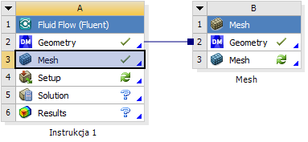
Jest to blok tymczasowy, po skończeniu ćwiczenia możesz go usunąć.

2. Otwórz nowo dodaną komórkę mesh.

3. Za pomocą opisanych poniżej opcji, odtwórz siatkę pokazaną na ilustracji.

Wszystkie opisane niżej opcje, możemy dodać do geometrii za pomocą górnej belki programu, w zakładce **Mesh**. Można je także aktywować po przez kliknięcie prawym klawiszem myszy na gałąź **Mesh** następnie **Insert** - **Sizing**.
Podstawowymi narzędziami do kontroli siatki obliczeniowej w programie Meshing, które poznamy na tym etapie zajęć są:

Sizing

**Sizing** - ta opcja pozwala na narzucenie podziału na krawędzi/powierzchni.
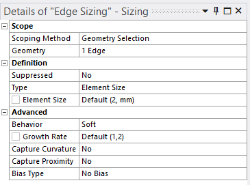
Opcjami, funkcji sizing, które nas interesują na tym etapie to:
	
- **Type**  - typ podziału na elementy. Do wyboru mamy opcje wymuszenia rozmiaru elementów siatki na danym obiekcie lub ilości podziałów na obiekcie.
- **Bias Type** - opcja dostępna w podziale krawędzi - Kierunkowe zagęszczenie linii.

---

Inflation

**Inflation** - Siatka warstwy przyściennej. Ta opcja pozwala nam na stworzenie strefy kierunkowego zagęszczenia na powierzchni lub objętości. Takie strefy powinny być tworzone przy fizycznych ścianach domeny.

- **Geometry** w tej rubryce należy zaznaczyć powierzchnie (w siatce dwuwymiarowej) lub objętość (w siatce trójwymiarowej)
- **Boundary** zaznaczmy krawędź (2D), powierzchnie (3D) przy której tworzymy siatkę warstwy przyściennej.
- **Maximum Layers** - ile warstw powinna mieć siatka warstwy przyściennej.
- Na potrzeby tej instrukcji użyjemy opcji Smooth Transition (o pozostałe opcje zapytaj prowadzącego)

			UWAGA: Opcja Inflation wyklucza się z opcją Mapped Meshing

	

---

Mapped Meshing/Face Meshing

**Mapped Meshing** - Siatka strukturalna. Ta opcja pozwala na zastosowanie prostokątów(2D)/graniastosłupów(3D) zamiast trójkątów(2D)/Czworościanów(3D).
		Zastosowanie tej opcji jest obarczone spełnieniem kilku zasad.
		
- Suma elementów siatki na przeciwległych ścianach musi być taka sama.
- Geometria powinna mieć 4 wierzchołki. W przypadku wieloboków (>4) program może nie być w stanie rozpoznać tych wierzchołków, wtedy możemy określić je przy pomocy opcji **Specified Corners**.
			
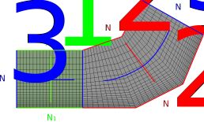

		UWAGA: Opcja Mapped meshing wyklucza się z opcją Inflation

	

---

Zaawansowane funkcje rozmiaru

**Zaawansowane funkcje rozmiaru** - opcje dostepne w gałęzi **Mesh** w drzewie historii operacji, w zakładce **sizing**:
	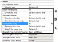
	
- **Mesh defeaturing** - Opcja pomijania elementów geometrii, które są mniejsze niż:
	-**Defeature Size** - poniżej ten wartości, elementy geometrii mogą być pomijane w siatkowaniu. Włączamy tą opcję, jeżeli zależy nam, aby model do obliczeń być uproszczony.
- **Capture Curvature** - funkcja zagęszczająca siatkę w okolicy i na krzywiznach.
	- **Curvature Min Size** - Minimalny rozmiar elementu siatki na krzywiźnie.
	- **Curvature Normal Angle** -  Sterowanie zagęszczeniem na krzywiźnie aby zachować zadany kąt pomiędzy wektorami normalnymi sąsiadujących ze sobą elementów.
- **Capture proximity** - włączając tą opcję, wprowadzamy zagęszczenie w przewężeniach.
	- **Proximity Min Size** - Jeżeli pomiędzy elementami geometrii odstęp jest mniejszy niż ta wartość, funkcja zagęści siatkę w tym miejscu.
	- **Num Cells Across Gap** - Najmniejsza liczba elementow siatki pomiędzy sąsiadującymi ze sobą geometriami.

---

# Zadanie dla chętnych

- Narysuj i posiatkuj geometrię pokazaną na ilustracji na dwa sposoby:
	- Zagęść siatkę przy ścianach za pomocą funkcji **Inflation**.
	- Spróbuj wygenerować podobną siatkę za pomoca opcji **Sizing (z opcją bias)** oraz **Mapped mesh**. Jak powinieneś przygotować geometrię aby spełniała wymogi zastosowania funkcji **Mapped Mesh**?
- Wloty zaznaczono strzałkami, wylot znajduje się u góry geometrii.
- Tak, to są cale.
 
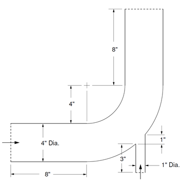