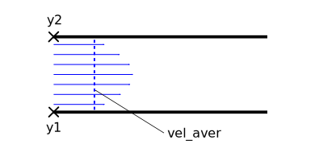
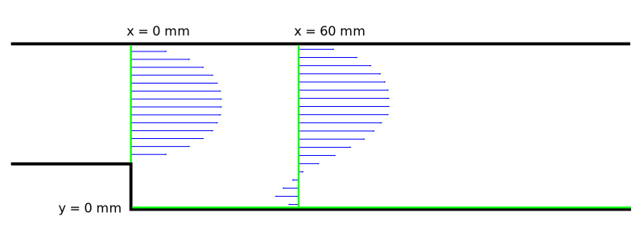
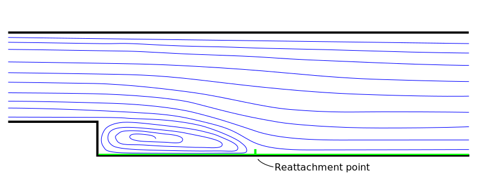

# Cel ćwiczenia

Symulacja przepływu laminarnego w kanale z uskokiem, analiza wpływu gęstości siatki obliczeniowej i rzędu aproksymacji członów konwekcyjnych w równaniach pędu na jakość uzyskanych wyników obliczeń.

# Streszczenie

W ramach ćwiczenia należy przeprowadzić symulacje przepływu **laminarnego** w kanale z uskokiem dla liczby Reynoldsa **Reh=230**. 
Liczba Reynoldsa bazuje na **średniej prędkości** na wlocie do obszaru obliczeniowego i **wysokości stopnia** h = 1 cm. 
Obliczenia testowe należy wykonać na dwóch siatkach obliczeniowych (rzadkiej i gęstej), z wykorzystaniem schematów pierwszego i drugiego rzędu do dyskretyzacji członów konwekcyjnych w równaniach pędu (first and second-order upwind). 
Uzyskane wyniki obliczeń porównać z [danymi eksperymentalnymi](#opis-danych-eksperymentalnych). 
Oszacować straty ciśnienia wzdłuż kanału. Wlotowy profil prędkości (parabola) należy zdefiniować przy pomocy funkcji [Interpreted UDF](#przygotowanie-funkcji-udf).

**Po zakończeniu symulacji nalezy zastanowić się:**

1. Jaka jest przyczyna lokalnego spadku ciśnienia tuż za stopniem? 
2. Jaki jest wpływ schematu dyskretyzacji członów konwekcyjnych na wynik obliczeń? 
3. Jaki wpływ na jakość uzyskanych wyników obliczeń ma gęstość siatki obliczeniowej? 
4. Co może być przyczyną niezgodności wyników obliczeń numerycznych, o ile występują, z danymi eksperymentalnymi? 

_Warunkiem zakończenia ćwiczenia jest przedstawienie prowadzącemu zajęcia otrzymanych wyników obliczeń oraz dokonanie analizy uzyskanych wyników. 
Całość w formie sprawozdania zawierającego obrazy jak również analizę wyników._

# Program Fluent

## 1. Symulacje dla metody 1 rzędu.

1.	Otworzyć program Fluent.
Włączając pierwszy raz program fluent w naszym bloku projektu zostanie wyświetlone okno powitalne w którym możemy wprowadzić wstępne ustawienia naszych obliczeń.

2. Na nasze potrzeby, ustawiamy analizę dwuwymiarową (program prawdopodobnie się domyśli tego ustawienia).
Dodatkowymi opcjami, które mogą nas interesować w przyszłości są opcje:

- **Double precision** - Zwiększamy dokładność obliczeń kosztem ich prędkości oraz stabilności
- **Solver Processes** - ile rdzeni procesora chcemy użyć do obliczeń. Oczywiście zwięszkając zasoby zwiększamy prędkość obliczeń.

	w tym momencie nie zmieniamy dodatkowych opcji, zostawiamy **ustawienia domyślne**

3. Interface użytkownika niewiele różni się od tego w poprzednich programach. Po lewej stronie ekranu znajduje się drzewo opcji *Outline View*. Aby **poprawnie ustawić przypadek** jakichkolwiek obliczeń powinno się uzupełniać wszystkie potrzebne ustawienia przechodząc drzewo opcji od góry do dołu.

4. Po wczytaniu się programu, jeżeli zaznaczyliśmy opcje *Display mesh after reading* a zaznaczyliśmy, w oknie graficznym powinna się pojawić nasza geometria. 

	Jeżeli się nie pojawiła, w oknie *Task Page* pomiędzy oknem graficznym a drzewem opcji, wybieramy przycisk *Display...*. W nowopowstałym oknie *Mesh display* klikamy przycisk *Display*.
	
5.	Aby sprawdzić czy przestrzeń obliczeniowa ma odpowiednie wymiary wciskamy **Scale...** (Wymiary naszej domeny: 0.7 m x 0.3 m).
	
	Jeżeli siatka została wykonana w innych jednostkach niż wcześniej sugerowano, to należy ją przeskalować (wybrać jednostkę w której był tworzony model *Mesh was created in* i potwierdzić przyciskiem Scale).

6.	W oknie **Task Page**, w polu solver sprawdzamy nasze podstawowe ustawienia solvera dla naszego przypadku:

	a.	Pressure-based - zalecane dla obliczeń nieściśliwych (Density-based - ściśliwe)
	
	b.	Steady - stan ustalony ( Unstedy - nieustalony)
	
	c.	Przepływ jest dwuwymiarowy 2D Space/Planar
	
7.	W oknie **Outline View** przechodzimy do **Models** po rozwinięciu klikamy dwukrotnie **Viscous**. Pojawi nam się okno opcji modeli obliczeniowych. Wybieramy odpowiedni [model](#streszczenie). Zamykamy okno i zwijamy menu Models.

8.	Teraz materiał zdefiniowany w menu **Materials**. Po rozwinięciu dwukrotnie klikamy na **air** (lub po zaznaczeniu **air** wciskamy przycisk **Create/Edit**).

	Wprowadźmy dane jak dla wody tzn.:
	- gęstość 1000 kg/m3
	- lepkość dynamiczną 0.001 kg/(m·s) 
	
	w oknie *Name* można zmienić nazwę z *air* na *woda* (we Fluencie jest też możliwość dodania dowolnego płynu z bazy danych *Fluent Database*, ale trzeba pamiętać potem o aktywacji wybranego płynu w *Cell Zone Conditions/Edit*). 
	potwierdzamy **Change/Create** i zamykamy okno.
	
9. Rozwijamy **Cell Zone Conditions** i otwieramy opcję naszej domeny. Pod zakładką Fluid powinna znajdywać się nazwa którą przyporządkowaliśmy naszym powierzchniom, w tym przypadku **Woda**.

	Upewniamy się, czy w menu rozwijanym **Material Name** jest wybrany materiał który przed chwilą stworzylismy (**woda**).
 
10.	Przygotowujemy plik [UDF](#przygotowanie-funkcji-udf).

11.	Wczytujemy zadany profil prędkości do Fluenta za pomocą okna *(Górna belka)* User-Defined/Functions/Interpreted potwierdzić przyciskiem Interpret.

	

12.	Oknie **Outline View** przechodzimy dalej. Kolejną opcją w drzewie jest **Boundary Conditions**. 
Tutaj definiujemy nasze warunki brzegowe. 
Jeżeli w odpowiedni sposób sformatowaliśmy nazwy naszych elementów geometrii, program fluent sam domyśli się jakie warunki brzegowe przyporządkować do tych nazw. 
Rozwiń poszczególne warunki brzegowe i upewnij się, że wszystko jest na swoim miejscu.

	- velocity_inlet - **Inlet** - warunek brzegowy **velocity-inlet**
	- wall - **Wall** - warunek brzegowy **wall**
	- pressure_outlet - **Outlet** - warunek brzegowy **pressure-outlet**

	Warto też zauważyć, że warunki brzegowe mają swoja reprezentacje w postaci kolorów. W oknie graficznym, wlot zawsze będzie niebieski, wylot czerwony a ściany (wall) białe.

	Wchodząc do warunku brzegowego inlet **aktywujemy** wczytany profil składowej X prędkości na wlocie do obszaru obliczeniowego.
	Należy pamiętać, że jest to składowa x prędkości nie moduł prędkości.
	**Wybieramy** odpowiednią metodę prowadzania warunku brzegowego w **Velocity Specification Method** i przy składowej X rozwijamy menu i wybieramy naszą zmienną z pliku UDF.
	Akceptujemy wybór i wychodzimy.

13.	To już wszystko w zakładce **Setup** w oknie **Outline View**.

14. W zakładce **Solution** w  **Methods**:
	- Zmieniamy schemat sprzęgnięcia ciśnienie-prędkość na **SIMPLE**
	- Zmieniamy również schemat dyskretyzacji I rzędu dla członów konwekcyjnych w równaniach pędu (**Momentum**: **First Order Upwind**).

15.	Po rozwinięciu **Monitors** w **Residual** ustawiamy poziom zbieżności rozwiązania (**Absolute Criteria**) dla wszystkich składników z 0.001 na 1e-5.

16.	W **Initialization** wybieramy Standardową metodę inicjalizacji.
	Pod Compute from wybrać warunek wlotowy, w oknie Initial Values pojawiły się teraz wartości z wlotu. 
	Sprawdzić czy prędkość odpowiada średniej wprowadzonej do UDFa. 
	Kliknięcie na Initialize spowoduje przypisanie tych wartości całemu obszarowi obliczeniowemu.
	
17.	Przechodzmy do **Run Calculation**. 
W polu **Parameters** sterujemy, w przypadku obliczeń stacjonarnych, **ilością iteracji**.
Ustaw wstępnie 30 iteracji i uruchom obliczenia. Pojawi się okno z informacją **Calculation complete** ale to nie znaczy, że obliczenia będą poprawne.
Aby dokładnośc obliczeń doprowadzić do zadowalającego poziomu nalezy obserwować **wykres zbieżności**.
**Zmień liczbę iteracji** i **kontynuuj obliczenia** aż wszystkie zmienne na wykresie **osiągną zbieżność**.
Jeżeli wykresy **wszystkich** zmiennych się zbiegnią, a więc zmienne ustalą się **w pobliżu** poziomu zbieżności którą ustawiliśmy w punkcie 11, lub go przekroczą tą wartość możemy zakończyć obliczenia.
**Jeżeli osiągniemy zbieżność** którą ustawilismy, program wyświetli informację **! solution converged** w **Konsoli** u dołu okna.

	**Proszę zachować** wykres zbieżności do raportu

18. Na tym etapie możemy już **zwizualizować** nasze wyniki. 

19.	Proszę wykonać wizualizacje konturów ciśnienia, prędkości, wektorów prędkości i linii prądu korzystając z opcji **Graphics** pod zakładką **Results**:

	a.	**Contours** – mapy konturów, wystarczy ustawić odpowiedni parametr pod Contours of. Aby przestrzenie między izoliniami były wypełnione musi być zaznaczona opcja **Filled**, nie trzeba nic zaznaczać w oknie Surfaces.
	
	b.	**Vectors** – mapy wektorów, aby były czytelniejsze można zmienić wartości pod Scale i Skip
	
	c.	**Pathlines** – linie prądu, pod Release from Surfaces, zaznaczyć z których powierzchni mają być puszczane, uwaga: przy gęstszych siatkach należy pamiętać o wprowadzeniu jakieś wartości pod Path Skip

	**Wszystkie grafiki mają się znaleźć w raporcie**
	
20.	Zdefiniować dodatkowe przekroje korzystając z Surface/Iso-Surface/Surface of Constant/Mesh. 
Wybrać współrzędną X(a później Y). Utworzyć odcinki **x = 0**, **x = 0.06** i **y = 0**, podając odpowiednie wartości pod Iso-Values. 

	**Uwaga:** wartości współrzędnych zależą od położenia geometrii na płaszczyźnie XY:
	- x = 0 - przekrój poprzeczny na uskoku
	- x = 0.06 -  przekrój poprzeczny w odległości 60 mm od uskoku
	- y = 0 -  przekrój wzdłuż dolnej krawędzi poziomej kanału

	Wartości liczbowe zostały podane dla przypadku gdy dolny punkt uskoku znajduje się w środku układu współrzędnych. 
	Na koniec wyświetlić siatkę razem z przekrojami, aby upewnić się że zostały dodane poprawnie.

21.	Porównać profile składowej x prędkości średniej w przekrojach x = 0 i x = 0.06 z danymi eksperymentalnymi Results/Plots/XY Plot. 
Porównania dokonujemy przy pomocy Fluenta. 
Dane eksperymentalne znajdują się w katalogu „dane_eksperyment”, wczytać je poprzez Load File. 
Kliknięcie na Plot powoduje wyświetlenie serii danych z pliku, zaznaczonych w oknie File Data.

	Zastanowić się jakie wartości powinny znajdować się na osiach X i Y. 
	Żeby stworzyć wykres, którego pozioma oś nie jest osią położenia należy odznaczyć opcję Position on x axis. 
	Zaznaczenie Position on y axis powoduje przypisanie położenia na osi pionowej. 
	Pod X Axis Function wybrać składową x prędkości, a pod Surfaces odpowiedni przekrój. 
	Jeżeli wyświetlamy dane dla linii poziomej, pod Plot Direction należy ustawić X = 1, natomiast dla pionowej Y = 1.
	
	Opcja „Write to File” umożliwia zapisanie serii danych do pliku.
	
22.	Określić położenie punktu przylgnięcia, poprzez wykonanie wykresu naprężeń po X Display/Plot/XYPlot/Wall Fluxes/X Wall Shear Stress. 
Punkt przylgnięcia znajduje się w miejscu, w którym wartości naprężeń zmieniają znak z ujemnego na dodatni.

	Eksperymentalne wartości znajdują się w pliku re-vs-reattachment-point_woda_cm.txt (otworzyć go Notatnikiem i odnaleźć wartość dla liczby Reynoldsa najbliższej 230), następnie porównać z obliczeniami.
	
23. Ten etap został zakończony, zanim jednak przejdziemy do kolejnego zamykamy program fluent. 

- W środowisku Workbench zapisujemy przypadek.
- Przy nagłówku bloku (Na 99% będzie to litera *A*) z którym pracowaliśmy przyciskamy czarny trójkąt i z rozwiniętego menu wciskamy przycisk *Duplicate*.

## 2. Symulacje dla metody 2 rzędu 

1. Zduplikowany blok nazywamy Instrukcja II.2.

2. W nowo powstałym bloku wchodzimy znów do komórki Setup. 

3. Otworzy się fluent, w oknie powitalnym znów zostawiamy ustawienia domyślne.

4. Zmieniamy **schemat dyskretyzacji** na schemat upwind 2 rzędu (Second order upwind). (Punkt 14 w poprzednim akapicie)

5. Wykonujemy obliczenia i porównujemy wyniki obliczeń (Powtarzamy kroki 17 - 22) (**Bez inicjalizacji)

## 3. Symulacje dla metody 1 rzędu na siatce gęstej.

1. Duplikuemy Blok A. i nazywamy konsekwentnie *Instrukcja II.3*

2. Aby zageścić naszą siatkę, w górnej belce programu wchodzimy w zakładkę **Domain**, później w polu **Adapt** klikamy **Refine/Coarsening**

3. W nowo otwartym oknie wciskamy przycisk **Cell Registers**/**New**/**Region...** w odpowiednie okienka wpisujemy wartości granicznych współrzędnych naszej domeny (te możemy sprawdzić w zakładce **Setup**/**General**/**Scale...** lub w górnej belce zakładka **Domain** i przycisk **Scale...** w pilu **Mesh**).

3. Następnie powtarzamy obliczenia tak jak dla 1 rzędu. ( punkty 16-21 w akapicie 1 )

## 4. Symulacje dla metody 2 rzędu na siatce gęstej.

1. Duplikujemy Blok *Instrukcja II.3* , nazywamy ... wiadomo.

	Dla siatki gęstej ustawmy schemat dyskretyzacji upwind 2 rzędu i wykonać obliczenia (punkty 17 - 22) (**Bez inicjalizacji)

---

# Przygotowanie funkcji UDF

Za pomocą funkcji UDF (*User defined function*) program fluent pozwala nieco bardziej rozszerzyć swoją funkcjonalność.
Dzięki temu można definiować własne profile prędkości, wprawiać elementy w ruch poddany prawom fizyki lub definiować własne modele obliczeniowe.

[Pod tym linikiem]( http://ccfd.github.io/courses/code/momp/UDF_I2.c ) znajduje się fragment programu umożliwiający zadanie profilu prędkości na wlocie do obszaru obliczeniowego.
Należy go pobrać do folderu z projektem programu ANSYS.

W funkcji DEFINE_PROFILE należy podać:

1. Współrzędne y1 [m] i y2 [m] odpowiadające dolnej i górnej ścianie kanału dolotowego
2. vel_aver [m/s] średnią wartość składowej x wektora prędkości, którą wyznacza się w oparciu o zadaną liczbę Reynoldsa. 

Po otwarciu Fluenta wczytać go przy pomocy funkcji Define/User-defined/Functions/Interpreted.

---

# Opis danych eksperymentalnych

W ramach laboratorium będziemy wykorzystywać **dane eksperymentalne**. W kanale z takimi samymi parametrami został wykonany eksperyment i zostały zmierzone wartości prędkości.

Pliki powinny być ściągnięte do folderu w którym się znajduje projekt.

- W pliku [PLIK 1]( http://ccfd.github.io/courses/data/momp/2/exper-xvel-re230-xh0_woda_cm.xy ) znajduję się składowa x wektora prędkości w przekroju poprzecznym dla uskoku.

- W pliku [PLIK 2]( http://ccfd.github.io/courses/data/momp/2/exper-xvel-re230-xh6_woda_cm.xy ) znajdują się składowa x wektora prędkości w przekroju poprzecznym w odległości 60 mm od uskoku.

- W pliku [PLIK 3]( http://ccfd.github.io/courses/data/momp/2/re-vs-reattachment-point_woda_cm.txt) znajdują się dane pozwalające na określenie punktu przylgnięcia warstwy ścinającej na dolnej ścianie kanału dla różnych liczb Reynoldsa. Z załączonych danych powinno się wybrać punkt przylgnięcia odpowiadający odpowiedniej liczbie Reynoldsa.

