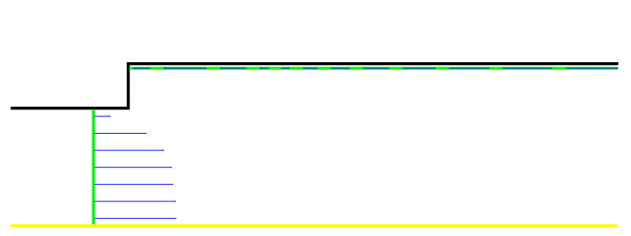

# Cel ćwiczenia

Symulacja przepływu turbulentnego przez rurę o zmiennej średnicy przy zastosowaniu modelu turbulencji k-\(\epsilon\), analiza wpływu warunków na wlocie do obszaru obliczeniowego i sposobu modelowania zjawisk przyściennych na wynik obliczeń.

# Streszczenie

Obliczenia przepływu turbulentnego dla liczby ReD = 200 000 z zastosowaniem tzw. standardowego modelu turbulencji k-\(\epsilon\) przeprowadzone będą na dwóch siatkach obliczeniowych: bazowej - rzadkiej(coarse) i gęstej(fine).
Liczba Reynoldsa bazuje na większej średnicy rury, D = 0.1524m i prędkości średniej na wylocie z obszaru obliczeniowego.

Symulacje na siatce bazowej wymagać będą stosowania funkcji ściany (Standard Wall Function) w celu poprawnego obliczenia prędkości średniej, energii kinetycznej turbulencji, k, oraz dyssypacji energii kinetycznej turbulencji, \(\epsilon\), w pobliżu ściany.
Obliczenia na siatce gęstej będą realizowane z wykorzystaniem modelu turbulencji k-\(\epsilon\)  w połączeniu z modelem jednorównaniowym Wolfsteina w pobliżu ściany.
Podejście to nazywa się Enhanced Wall Treatment.

Czynnikiem roboczym jest woda.

Na wlocie do obszaru obliczeniowego przyjęty zostanie warunek brzegowy typu velocity inlet. 
Profil prędkości średniej zdefiniowano w oparciu o symulację w pełni rozwiniętego przepływu turbulentnego w rurze.
Rozpatrywane będą trzy sposoby definiowania profili energii kinetycznej turbulencji i dyssypacji na wlocie:

1.	w oparciu o profile uzyskane dla w pełni rozwiniętego przepływu w rurze (plik inlet_profile_keps.prof)
2.	standardowe ustawienia Fluenta (nie mające znaczenia fizycznego)
3.	wielkości zdefiniowane przez użytkownika (w oparciu o pewne oszacowania intensywności turbulencji, Tu [%] i skali długości turbulentnej, lt [m]).

Student ma do dyspozycji przygotowane wcześniej pliki *.cas zawierające siatkę obliczeniową (bazowa i gęsta). 
Nie ma więc konieczności przygotowania siatki.

*Warunkiem zakończenia ćwiczenia jest przedstawienie prowadzącemu zajęcia otrzymanych wyników obliczeń oraz dokonanie analizy uzyskanych wyników. 
Całość w formie sprawozdania zawierającego obrazy jak również analizę wyników.*

# Przebieg ćwiczenia

## Obliczenia z zastosowaniem funkcji ściany

1. Do okna projektu wyciągnij **Fluent** z zakładki **Component systems**. Otwieramy program Fluent przez otwarcie komórki *Setup* (**2D, Double precision, serial** (jeden proces) )
2. Wczytać plik *.mesh z bazową siatką obliczeniową - **File/Import/Mesh...**.
	
	[Plik do ściągnięcia](http://ccfd.github.io/courses/data/momp/3/coarse.msh)
	Średnice rury to D = 0.1524m i Dinlet = 0.517D = 0.0788 m.
	
3. Przepływ jest osiowosymteryczny. Zapewne program fluent to zauważy i wypisze odpowiednie ostrzeżenie w konsoli (dzięki odpowiedniemu nazewnictwu warunku brzegowego). Sprawdź ustawienia w **Setup/General** w polu **Solver**.
4. Wybieramy odpowiedni model turbulencji w **Define/Models** i odpowiednią opcję w **Near-Wall Treatment**.
5. Sprawdzamy poprawność zdefiniowania własności płynu. **Setup/Materials/Fluid**.
6. Pobieramy [plik z zdefiniowanymi parametrami warunku brzegowego](http://ccfd.github.io/courses/data/momp/3/inlet_profile_keps.prof).
7. Wczytujemy pobrane profile. Można to zrobić na dwa sposoby:
	- W górnej belce: **Physics/Zones/Profiles..**
	- W drzewie po lewej stronie klikając dwukrotnie na **Setup/Boundary Conditions** i wciskając guzik **Profiles...** 
	
	Zostanie wczytanych 5 pól, z czego 3 są naszymi zmiennymi - **profil prędkości, energii kinetycznej turbulencji i dyssypacji energii kinetycznej turbulencji**.
	
8. Ustawiamy schemat dyskretyzacji I rzędu dla członów konwekcyjnych w równaniach pędu (upwind) oraz SIMPLE jako schemat sprzężenia prędkość-ciśnienie w **Solution/Methods**. 
9. Ustawiamy poziom zbieżności rozwiązania, **Solution/Monitors/Residual**, 1e-5.
10. **Inicjalizuj** obliczenia z wlotu i przeliczyć. Zbieżność rozwiązania monitorować.

	Sprawdź jak wyglądają wlotowe profile prędkości średniej, energii kinetycznej turbulencji i dyssypacji w **Results/Plots/Profile Data**. 
	Otworzyć w notatniku plik, z którego zostały wczytane i zobaczyć w jaki sposób zostały zdefiniowane. 
	
		W sprawozdaniu podaj przykłady przypadków dla których można zastosować tego typu profile w określaniu warunków brzegowych, oraz takich dla których wskazane jest użycie funkcji UDF(jak w poprzedniej instrukcji).
		
11.	Po uzyskaniu zbieżnego rozwiązania dla I rzędu, przełączyć na II rząd i kontynuować obliczenia (bez inicjalizacji). 
*W niektórych przypadkach nie da się uzyskać zbieżności startując od razu od równań II rzędu.*

		Wykres zbieżności przedstaw w raporcie.

12.	Wykonaj wizualizacje: konturów ciśnienia, prędkości, energii kinetycznej turbulencji i dyssypacji, wektorów prędkości i linii prądu korzystając z opcji pod zakładką **Results/Graphics/Contours**.

		Przedstaw w raporcie.
		
13.	Sprawdzić liczbę Reynoldsa w oparciu o prędkość średnią na wylocie z rury o średnicy D=0.1524m, **Results/Report/Surface Integrals**, Report Type: **Area-Weighted Average**. 

	Sprawdzić ile wynosi prędkość średnia i maksymalna w osi rury na wlocie. 
	Prędkość średnią i prędkość maksymalną można policzyć w **Results/Report/Surface Integrals**
	- Report Type: **Area-Weighted Average** (dla prędkości średniej)
	- Report Type: **Vertex Maximum** (dla prędkości maksymalnej). 
	
	Zanotować prędkość średnią, **Uśr**, i maksymalną prędkość , **Uxmax**. 
	Informacje te będą potrzebne do normalizacji składowej osiowej prędkości średniej i energii kinetycznej turbulencji, celem porównania z [danymi eksperymentalnymi](#opis-danych-eksperymentalnych-oraz-ich-interpretacja-graficzna).

14.	Zdefiniować znormalizowane funkcje w górnej belce programu - **User-defined/Field Functions/Custom**:

	- składowa osiowa prędkości znormalizowana maksymalną  prędkością w osi rury na wlocie do obszaru obliczeniowego, **Ux / Uxmax**

	(z menu rozwijanego **Field Functions** wybrać Velocity oraz Axial Velocity, potwierdzić wybór klikając na Select, następnie wybrać znak dzielenia i wpisać zanotowaną wcześniej wartość maksymalnej prędkości na wlocie, po wpisaniu nazwy zatwierdzić Define)
	
	-	energia kinetyczna turbulencji znormalizowana kwadratem średniej prędkości na wlocie do obszaru obliczeniowego, **k/(Uśr)2**

	(z menu rozwijanego **Field Functions** wybrać Turbulence oraz Turbulent Kinetic Energy (k) i podzielić przez kwadrat odpowiedniej stałej)

15.	Sprawdzić y+ na ścianach wall, wall_d i wall_inlet. **Results/Plots/XY Plot**:
	
	- Y axis function: Turbulence
		- Wall YPlus
		
	Efektywne wykorzystanie funkcji ściany wymaga aby bezwymiarowa odległość y+ centroid komórek obliczeniowych znajdujących się przy ścianie była w zakresie y+=30-300.

		Przedstaw w raporcie.
	
16. Porównać wyniki symulacji z [danymi eksperymentalnymi](#opis-danych-eksperymentalnych-oraz-ich-interpretacja-graficzna) w przekrojach poprzecznym *x = -0.0381* i wzdłużnym *r = 0.07271*.

	**Results/Plots/XY Plot**, **Load File** aby wczytać dane eksperymentalne. 
	Podobnie jak w **poprzedniej instrukcji**, najpierw wyświetlić wykres dla danych eksperymentalnych, a następnie zastanowić się jaka funkcja powinna znajdować się na osiach X i Y. 
	Zdefiniuj przekroje x=-0.0381 i r=0.07271. 
	Należy pamiętać, że nie porównujemy **bezpośrednio** prędkości i energii kinetycznej turbulencji, a **znormalizowane** przez nas funkcje, które można znaleźć pod zakładką Custom Field Functions. 
	Zwrócić uwagę na położenie pierwszego punktu w pobliżu ściany w przekroju poprzecznym. 
		
	*Czy wyniki symulacji numerycznej dobrze oddają charakter zmian prędkości średniej wzdłuż x dla przekroju wzdłużnego? Zauważ, że w eksperymencie obserwuje się dwa obszary recyrkulacji. Mniejszy na wysokości uskoku.*
	
17. Zapisz wykres dla przekroju wzdłużnego w pliku tekstowym, **Results/Plots/XY Plot** opcja **Write to File**.

		Przedstaw w raporcie.
		
18. Wyłącz program Fluent, w środowisu Workbench zapisz projekt.

---

## Analiza wpływu warunków na wlocie do obszaru obliczeniowego

### Standardowe ustawienia programu fluent

1. **Zduplikuj** blok z obliczeniami, odpowiednio nazwij, otwórz Fluent z nowopowstałego bloku klikając komórkę **Setup**
2. Zmień warunki brzegowe dla energii kinetycznej turbulencji i dyssypacji z profili UDF na standardowe warunki Fluenta const=1. **Setup/Boundary Conditions/Inlet/Velocity_inlet**
3. Zainicjalizuj rozwiązanie z wlotu. Przelicz przypadek. 
4. Porównaj uzyskane profile prędkości dla przekroju wzdłużnego z danymi eksperymentalnymi i z poprzednio uzyskanymi wynikami symulacji. 

	*Czy wyniki symulacji znacząco odbiegają od danych eksperymentalnych? Zapisać uzyskany profil prędkości w pobliżu ściany Display/Plot/Xyplot, Write to File*
	
		Przedstaw w raporcie.

5. Wyłącz program Fluent, w środowisu Workbench zapisz projekt.

---

### Warunki wynikające z teorii

1. **Zduplikuj** blok z obliczeniami, odpowiednio nazwij, otwórz Fluent z nowopowstałego bloku klikając komórkę **Setup**
	
2. Zmień warunki brzegowe dla turbulencji na wlocie, **Setup/Boundary Conditions/Inlet/Velocity_inlet** w polu **Turbulence** zmień metode na **Intensity and Hydraulic diameter**.

	*Relacja pomiędzy energią kinetyczną turbulencji, k, intensywnością turbulencji, Tu, i prędkością średnią, Uśr:* 

	*k=1.5(Tu Uśr)U2.*
	
	*Dla w pełni rozwiniętego przepływu w rurze można przyjąć Tu=4% w osi rury.*
	
	*W przepływach wewnętrznych skala długości turbulentnej lt nie może być większa od fizycznego rozmiaru obiektu L. Dla analizowanego przepływu w rurze L=Dinlet.  Przyjmuje się, że skala długości turbulentnej:*
	
	*lt. Przy czym \(\epsilon\) = k3/2 / lt.*
	
	*Podaj warunki brzegowe: Tu=4% i L=Dinlet.* **Zainicjalizuj** *obliczenia i* **przelicz**. 
	
	Porównaj wyniki obliczeń dla przekroju wzdłużnego z danymi eksperymentalnymi i z poprzednio uzyskanymi wynikami. 
	
	*Które wyniki symulacji są najbliższe danym eksperymentalnym i dlaczego? Czy stosowanie standardowych warunków Fluenta ma sens?*
	
		Przedstaw w raporcie.
	
3.	Wyłącz program Fluent, w środowisu Workbench zapisz projekt.

## Siatka gęsta, podejście Enhanced Wall Treatment.

1. **Zduplikuj** blok z obliczeniami z [akapitu 1](#obliczenia-z-zastosowaniem-funkcji-ściany), odpowiednio nazwij, otwórz Fluenta z nowopowstałego bloku klikając komórkę **Setup**
2. Ściągnij plik z zagęszczoną siatką:
	
	[Plik do ściągnięcia](http://ccfd.github.io/courses/data/momp/3/fine.msh)
	
3. Podmień siatki:
	
	W górnej belce programu, w zakładce **Domain** za pomocą opcji **Replace Mesh...** w polu **Zone**.
	
	*Zauważ, że program Fluent wykona szereg operacji, który dostosuje obecne ustawienia do nowej siatki. Bardzo ważne aby nowa siatka miała dokładnie te same nazwy warunków brzegowych.*
	
4. Zainicjalizuj i oblicz przypadek.

5. Po wykonaniu kilkudziesięciu iteracji, sprawdź y+ na ścianach wall_inlet i wall_d, **Results/Plots/XY Plot**, (Turbulence i Wall YPlus)

	W celu zastosowania podejścia Enhanced Wall Treatment , y+ musi być mniejsze od 3, aby poprawnie uwzględnić dynamikę przepływu w subwarstwie lepkiej. 
	Jeżeli warunek nie jest spełniony zagęścić siatkę obliczeniową. 
	Powtarzać obliczenia i zagęszczanie siatki do uzyskania y+ bliskiego 5.
	- W górnej belce programu wchodzimy w zakładkę **Domain**, później w polu **Adapt** klikamy **Refine/Coarsening**
	- W nowo otwartym oknie wciskamy przycisk **Cell Registers**/**New**/**Boundary...**
	- Arbitralnie wpisujemy nazwę adaptowanego pola.
	- Zaznaczmy nasze **wall_inlet** oraz **wall_d**
	- W pole **Number of cells** wpisujemy ilość komórek do adaptacji licząc od ściany - **2**.
	- **Save/Display**
	- Po powrocie do okna **Adaptation controls** z rozwijanym menu **Refinement Criterion** wybieramy utworzone pole adaptacji.
	- **Adapt**
	
6. Porównaj wyniki symulacji z danymi eksperymentalnymi w przekroju poprzecznym **Results/Plots/XY Plot**. Porównaj wyniki symulacji na siatce gęstej dla przekroju wzdłużnego z danymi eksperymentalnymi i wynikami symulacji dla siatki bazowej.

	*Czy zwiększenie rozdzielczości siatki obliczeniowej pozwala uzyskać dużo lepsze wyniki w pobliżu ściany ? Czy koszt obliczeń na siatce gęstej jest znacznie większy od kosztów obliczeń na siatce podstawowej?*
	
		Przedstaw w raporcie.
		
7.	Wykonać wizualizacje.

# Opis danych eksperymentalnych oraz ich interpretacja graficzna

- **[exper-axial-vel_x-0_0381.xy]( http://ccfd.github.io/courses/data/momp/3/exper-axial-vel_x-0_0381.xy )** – profil składowej osiowej prędkości średniej znormalizowanej maksymalną prędkością w osi rury na wlocie do obszaru obliczeniowego w funkcji promienia rury w przekroju x = - 0.0381 (tuż przed uskokiem)

- **[exper-axial-vel_r0.07271.xy]( http://ccfd.github.io/courses/data/momp/3/exper-axial-vel_r0.07271.xy )** – profil składowej osiowej prędkości średniej znormalizowanej maksymalną prędkością w osi rury na wlocie do obszaru obliczeniowego w funkcji współrzędnej x w odległości r = 0.07271 od osi rury (blisko ściany w rurze o większej średnicy). 

	

- **[exper-k-over-u2_x-0_0381.xy]( http://ccfd.github.io/courses/data/momp/3/exper-k-over-u2_x-0_0381.xy )** – profil energii kinetycznej turbulencji znormalizowany kwadratem prędkości średniej na wlocie do obszaru obliczeniowego w funkcji promienia rury w przekroju x = - 0.0381 (tuż przed uskokiem);

