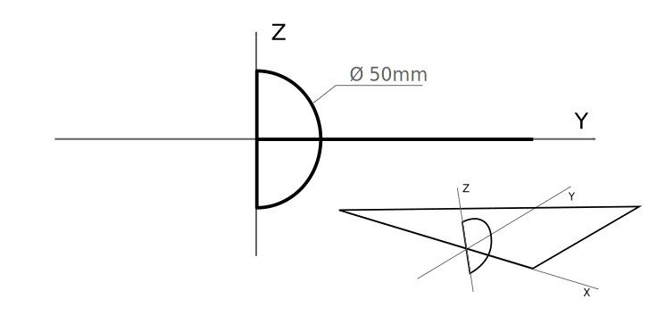
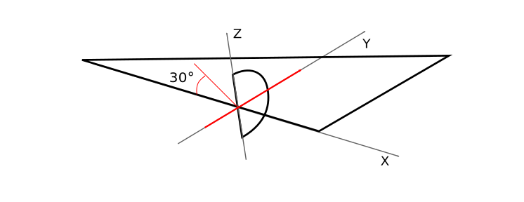
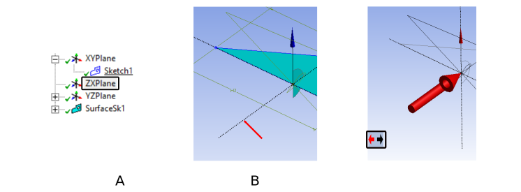
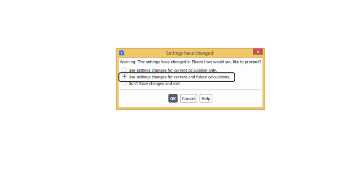

# Cel ćwiczenia

Celem ćwiczenia jest zapoznanie się ze sposobem modelowania przepływów trójwymiarowych oraz obróbka trójwymiarowych wyników graficznych.

# Streszczenie

Zadanie polega na wyznaczeniu opływu wokół skrzydła typu delta ustawionego pod dużym katem natarcia (30°), wyposażonego w śmigło, umieszczone w szczelinie.
Przepływ odbywa się w zamkniętej przestrzeni tunelu aerodynamicznego i posiada płaszczyznę symetrii.
Wymiary tunelu 150x200x600 cm. 
Przepływającym czynnikiem jest powietrze o prędkości V=10m/s i ciśnieniu p=101325 Pa. 
Model rozważany w tym ćwiczeniu jest właściwie półmodelem, w którym odwzorowano tylko połowę skrzydła delta oraz połowę kręgu śmigła. 
Tym samym założono przepływ symetryczny względem płaszczyzny XZ.

# Przebieg ćwiczenia

## Geometria

1. W środowisku workbench stwórz nowy system obliczeniowy - **Fluid Flow(Fluent)**.

2. Otwórz **Design Modeler** klikając prawym przyciskiem myszy na komórkę **Geometry**.

3. Ustaw jednostki na **centymetry**

4. Stwórz nowy szkic na płaszczyźnie **X-Y**. Narysuj geometrię połowy skrzydła delta tak jak na załączonej ilustracji.

5. Stwórz **powierzchnię** na podstawie utworzonego szkicu.

6. W ten sposób utworzyliśmy bardzo proste skrzydło delta a dokładnie jego połowę. Płaszczyzna X-Z będzie lustrzanym odbiciem skrzydła.

7. Teraz trzeba utworzyć powierzchnię **śmigła** zastępczego.

8. Utwórz szkic na płaszczyźnie **Y-Z**

9. Wewnątrz szkicu, za pomocą narzędzia **Arc by Center**, stwórz półokrąg według załączonej ilustracji. 

		UWAGA: Aby utworzyć powierzchnie śmigła, obwód musi być zamknięty. 
		
		Nie zapomnij domknąć półokręgu linią!
		
10. Utwórz **powierzchnię** na podstawie szkicu.

11. Obecnie skrzydło delta jest na 0 kącie natarcia. Nalezy zmienić kąt natarcia naszego skrzydła o 30 stopni

	Z menu kontekstowego **Create** wybieramy **Body Transformation** następnie **Rotate**.
	
	
	
	**Wybieramy geometrie** do obrotu. To można zrobić na dwa sposoby (patrz rysunek).
	
	- Z wciśniętym **ctrl**, wybieramy interesujące nas elementy w ostatnim menu w drzewie historii (Patrz rysunek)
	- Zaznaczamy powierzchnie w oknie graficznym. 
	Jeżeli w momencie zaznaczenia elementu pod naszym kursorem znajdują się inne elementy, w lewym dolnym rogu okna graficznego rozwinie się graficzna reprezentacja tych elementów.
	Reprezentowane elementy będą wyświetlone w postaci **warstw**.
	Pierwsza od lewej warstwa reprezentuje element znajdujący się najbliżej użytkownika, ostatni od lewej element znajdujący się najdalej od użytkownika.
	Najechanie kursorem na odpowiednią warstwę podświetli reprezentowany element.
	Klikając odpowiednią **warstwę** wybieramy interesującą nas powierzchnie. (Patrz rysunek)
	
	
	
	
	Wybieramy **skrzydło delta** i **wirnik**.
	
	Następnie **wybieramy oś obrotu**. To też można zrobić na dwa sposoby (Patrz rysunek).
	
	
	
	- W **menu płaszczyzn** w drzewie historii (tam gdzie znajdują się szkice), wybieramy **płaszczyznę prostopadłą** do naszej osi obrotu.
	- W **oknie graficznym**, na naszym rysunku, znajdują się przerywane linie reprezentujące osie układu współrzędnych. Klikamy na odpowiednią oś.
	
		Kolorowy układ współrzędnych znajdujący się w dolnym prawym rogu okna graficznego, służy tylko do manipulacji kamerą.
		
	Po zaznaczeniu osi, w oknie graficznym pojawią się **strzałki wyboru kierunku osi**. Klikamy aby odpowiednio zorientować oś obrotu. 
	Oś musi być tak zorientowana, żeby nasze "skrzydło", obracając się, zadarło "nos" w kierunku osi *Z*.
	
	Wpisujemy kąt obrotu naszych powierzchni.
	
	**Generate**
	

12. Ostatnim krokiem jest utworzenie objętości powietrza.

13. W menu kontekstowym **Create** przejdź do menu **Primitives** i wybierz opcję **Box**.

	| --- | Początek | Diagonale |
	| --- | -------- | --------- |
	| X | -250 cm | 600 cm |
	| Y | 0 cm | 150 cm |
	| Z | -80 cm | 200 cm |

	Warto ustawić **Operation - Add frozen**
	
	**Generate**
	
		Jeżeli figura nie będzie przezroczysta od opcji **Add frozen** i wszystko nam przysłoni, należy w menu kontekstowym wybrać - View -> Wireframe. Wtedy zmienimy sposób reprezentowania widoku na szkieletowy.
	
14. Z powstałych elementów tworzymy **złożenie**. We wspomnianym wcześniej **menu elementów**, ostatnim w drzewie historii, wybieramy wszystkie elementy i za pomocą prawego przycisku myszki wybieramy **form new part**.

---
	

Dla chętnych

	
15.	Stwórz kolejny **Box**
	
	| --- | Początek | Diagonale |
	| --- | -------- | --------- |
	| X | 0 cm | 200 cm |
	| Y | 0 cm | 35 cm |
	| Z | -20 cm | 35 cm |

	Warto ustawić **Operation - Add frozen**
	
	**Generate**
	
	W momencie tworzenia złożenia (punkt 14), nie dodawaj tej bryły do złożenia. Po punkcie 14 powinny być 1 złożenie (part) i jedna bryła (Solid).
	

	---

16. **Wychodzimy** z DesignModeler

## Siatka obliczeniowa

1. Otwieramy moduł **Mesh**.

2. Na wstępie nadajmy nazwy warunków brzegowych (Patrz rysunek). **W analizie trójwymiarowej naszymi warunkami brzegowymi są powierzchnie**.
Metoda zaznaczania powierzchni jest taka sama jak w systemie zaznaczania w DesignModelerze. 
Po zaznaczeniu powierzchni wcisnamy **n** na klawiaturze i wypełniamy nazwę warunku brzegowego.
	
	**UWAGA** zauważ, że design modeler podzielił naszą powierzchnie śmigła na dwie części. W górnej belce w zakładce **Display** możemy wyświetlić kierunek linii opcją **Direction** w polu **Edge**.
	Dzięki temu możesz się upewnić czy obydwie powierzchnie są tak samo zorientowane (Zasada prawej dłoni). Orientacja naszej powierzchni śmigła jest ważna w obliczeniach.
	
	- Jeżeli obie powierzchnie są tak samo zorientowane zaznaczmy je razem i nazywamy razem.
	- Jeżeli orientacje powierzchni różnią się od siebie. Nazwijmy je dodając cyfrę - fan_1, fan_2.
	
3. Przejdźmy do ustawień siatki.

4. W drzewie historii, w menu **Mesh**:

	- Zakładka **Defaults** - Upewaniamy się, że **Physics Preference** jest ustawione na **CFD**.
	- Zakładka **Sizing**:
		- Włączamy opcje **Capture Curvature** (powierzchnia wirnika jest okrągła)

5. Wygeneruj siatkę. Sprawdź czy geometria skrzydła jest odwzorowana.

6. Zaznacz powierzchnię skrzydła oraz powierzchnię wirnika. Utwórz dla nich element **Sizing**:
	- Type: **Element size**
	- Element size: **10 mm** (Dla osób ze słabszym sprzętem **20mm**)
	- Behavior: **Hard**
	
	**Generate**

7. Utwórz kolejny element typu **Sizing**:
	- **Scope**/**Geometry** zaznacz bryłę reprezentującą powietrze. **Upewnij się, że zaznaczasz objętość a nie powierzchnię**
	- Type: **Sphere of Influence**
	- Sphere Radious: **500 mm**
	- Element size: **30 mm** (Dla osób ze słabszym sprzętem **50mm**)
	
	**Generate**
	
		Przyjrzyj się siatce. Co się zmieniło?
	
---
	

Dla chętnych ciąg dalszy

	
8. Utwórz kolejny element typu **Sizing**:
	
	- **Scope**/**Geometry** zaznacz bryłę reprezentującą powietrze. **Upewnij się, że zaznaczasz objętość a nie powierzchnię**
	- Type: **Body of influence**
	- Bodies of Influence: **Zaznaczamy stworzoną dodatkową objętość w punkcie 13**
	- Element size: **30 mm**
	
	**Generate**
	
		Znów przeanalizuj zmianę, zastanów się po co stworzyliśmy dodatkowe zagęszczenie.
	

	
---

9. Wychodzimy z programu **Mesh**

## Obliczenia w programie Fluent

1. Otwieramy program fluent 

2. Wstępne ustawienia solvera:
	
	- Dimension: **3d**
	- Display Mesh After Reading
	
3. Ustawienia warunków analizy:

	- General:
		- Type: **Pressure-Based**
		- Time: **Steady**
	- Models 
		- Model turbulencji: **Spalart-Allmaras**
	- Materials
		- Powietrze z standardowymi ustawieniami
	- Cell zone conditions
		- Upewnij się, że materiałem w domenie jest powietrze
	- Boundary conditions (kliknij dwukrotnie na menu lub w belce górnej w zakładce **Physics**, wejdź w **Boundaries** z polu **Zones**)
		- **Inlet** - 10 m/s, intensywność turbulencji 2%, skala turbulencji 0.5 cm.
		- **Symmetry** - sprawdź czy został załozony odpowiedni warunek
		- **Wing** - upewnij się, że dla skrzydła ustowiony został warunek ściany
		
			Przy ustawieniu warunku brzegowego na **wall** zauważ, że fluent stworzy drugą powierzchnię. Zastanów się dlaczego.
		
		- **fan** 
			- Sprawdź w jaki kierunek ma normalna na powierzchni wirnika (Składowa X wektora), jeżeli normalna jest w złym kierunku zmień ją zaznaczając opcję **Reverse Fan Direction**.
			- W menu rozwijanym **Pressure Jump (jednostka)** wybierz **constant**
			- W tym momencie przeprowadzimy obliczenia bez śmigła - wpisujemy **0.0**
		- **Outflow** - domyślne ustawienia
		
4. Ustawienia solvera:
	
	- Methods:
		- Schemat: **Coupled**
	- Monitors/Residual
		- Domyślne wartości zbieżności

5. Zainicjalizuj **standardową metodą inicjalizacji**
	
	Jako punkt odniesienia wybierz wlot.
	
6. Prowadź obliczenia aż do osiągnięcia oczekiwanej zbieżności.
	(W zakładce Run Calculation zmień tylko **Number of Iterations** w polu **Parameters**)
	
		Ze względu na obliczenia trójwymiarowe, czas obliczeń będzie zauważalnie większy.
		
7. Stwórz wizualizacje przepływu Twojej analizy. Zastanów się jakie wizualizacje najwięcej powiedzą o stworzonej analizie. Zaprezentuj je.

8. Wyjdź z programu fluent. 
Przy wychodzeniu z programu zaznacz drugą odpowiedź. 
Pozwoli to na zachowanie wszystkich ustawień postrocesingu (wizualizacji i obróbki danych).

9. Zduplikuj system obliczeniowy.

10. ""Włącz śmigło" - W warunku brzegowym **fan** wpisz wartość **200** Pa (patrz punkt 3).

11. Zainicjalizuj przypadek i prowadź obliczenia aż do osiągnięcia oczekiwanej zbieżności.

12. Powtórz wizualizacje i porównaj z wynikami bez śmigła.

