# Wymagania

- minimalna znajomość systemów z rodziny Linux,
- podstawowa znajomość programowania (język nie ma znaczenia).

# System operacyjny
Zalecane jest korzystanie z systemów z rodziny Linux, a w szczególności opartych na Debianie. Jednak pakiety pythona są przygotowane do instalacji również na systemy z rodziny Windows (instalacja dodatkowych pakietów za pomocą *pip*, o którym w dalszej części). W związku z tym istnieje możliwość pracy na takim systemie, jednak będzie się to wiązało z ograniczonym wsparciem prowadzących kurs.

# Kontrola wersji - git i GitHub
Narzędzia kontroli wersji są praktycznie niezbędne podczas pracy nad większym kodem, a przede wszystkim w sytuacji gdy nad jednym projektem współpracuje więcej osób. Pozwalają one na:

- śledzenie kolejnych zmian w kodzie, 
- usuwanie niepotrzebnych zmian, 
- tworzenie "podprojektów" w których pracuje się tylko nad częścią nowego kodu, 
- łączenie kodu różnych osób w obrębie nawet tego samego pliku.

Więcej informacji o tym czym właściwie jest kontrola wersji można przeczytać pod linkiem [git - wprowadzenie do kontroli wersji](https://git-scm.com/book/pl/v1/Pierwsze-kroki-Wprowadzenie-do-kontroli-wersji). W przypadku naszego kursu do kontroli wersji będziemy stosowali narzędzie zwane *git*, które zostało opracowane przez "ojca" systemów Linux Linusa Torwaldsa. Wielu programistów obsługuje go z poziomu konsoli. My jednak skupimy się tylko na podstawowych jego funkcjach i będziemy z gita korzystali tylko z poziomu środowiska programistycznego, o którym więcej powiemy dalej. Na poziomie naszego kursu system ten posłuży do pobierania materiałów oraz przechowywania własnych wersji rozwiązań zadań. Dzięki temu uczestnicy poznają podstawowe sposoby korzystania z gita.  

W ramach przygotowania do zajęć należy przejść na stronę [GitHub](https://github.com/) i zarejestrować własne konto w tym serwisie. Dzięki temu otrzymamy pewną darmową (wersja darmowa wymaga publicznego dostępu do zamieszczonego kodu) przestrzeń dyskową na której będziemy mogli przechowywać wszystkie niezbędne pliki potrzebne w naszym projekcie. Serwis GitHub sam w sobie nie jest potrzebny do działania git'a (możemy utworzyć lokalne repozytorium na własnym dysku), jednak potrzebujemy jakiegoś miejsca, najlepiej w sieci aby mieć dostęp do kodu z każdego miejsca, w którym będziemy mogli składować własne repozytorium z tworzonym kodem.

# Python
W czasie rozwoju języka *python* wykształciły się dwie jego wersje:

- *python 2*,
- *python 3* (nowsza specyfikacja języka, choć niekoniecznie częściej używana).

Oba standardy języka znacząco się nie różnią, jednak są one niekompatybilne pomiędzy sobą, w związku z czym na samym początku pracy należy się zdecydować na której wersji będziemy pracowali. Należy także pamiętać, że każdy nowo zainstalowana biblioteka będzie musiała pochodzić z repozytorium właściwego dla używanej wersji. W przypadku naszego kursu zajęcia będą prowadzone w oparciu o wersję drugą i wszystkie podane informacje odnośnie instalacji i pracy z językiem będą właściwe tylko dla standardu języka *python 2*. 

# Instalacja niezbędnych pakietów
W poniższym punkcie zostaną opisane metody instalacji podstawowych i dodatkowych pakietów (zbioru narzędzi przygotowanych i upublicznionych przez innych programistów). Dokładny opis zostanie ograniczony jedynie do dystrybucji opartych na systemie Debian. W przypadku innych systemów uczestnicy powinni samodzielnie zadbać o instalację odpowiednich narzędzi.

## Wymagane pakiety
Poniżej przedstawiamy zbiór pakietów które są najczęściej wykorzystywane podczas pracy. Podczas zajęć także będziemy korzystali  z tych narzędzi, dlatego należy je zainstalować przed rozpoczęciem kursu. 

###python-dev
podstawowe narzędzia języka python które są niezbędne do pracy i rozwoju kodu w tym języku.

###pip
Narzędzia do zarządzania pakietami pythona. Pozwala na automatyczne pobranie kodu z oficjalnego repozytorium *Python Package Index* (PyPI), kompilację i instalację wybranego pakietu. Korzystając z *pip* możemy pobrać dowolną wersję danego pakietu, co jest najczęściej niemożliwe w przypadku innych metod instalacji pakietów. Ponadto często nowsze pakiety są dostępne jedynie za pośrednictwem tej platformy.

###numpy
Pakiet zawierający rozszerzenie tablic wielowymiarowych, który pozwala na wygodny dostęp do danych oraz na operacji na nich. Zawiera także wiele własnych funkcji do obliczeń naukowych, które jednak są ograniczone w porównaniu do pakietu *scipy* o którym dalej. 

###matplotlib
Zbiór narzędzi służących do tworzenia wykresów przeróżnego typu, takich jak:

- proste jedno wymiarowe,
- różne wykresy statystyczne,
- wykresy konturowe,
- wykresy trój wymiarowe.

###scipy 
Biblioteka zawierająca szeroki zbiór narzędzi do obliczeń naukowych . Nazwa *SciPy* może odnosić się do całego zbioru bibliotek (numpy, matplotlib, scipy, sympy, pandas). Jednak sam pakiet o nazwie  *scipy* zawiera tylko narzędzia obliczeniowe. Pakiet *scipy* posiada wiele funkcji o tym samym zastosowaniu co *numpy*. Duplikacja tych narzędzi wynika z tego, że *scipy* jest w dużej części opakowaniem implementacji w języku Fortran (które są bardzo wydajne) a *numpy* jest przygotowane tak, aby możliwa była jego instalacja także bez kompilatora Fortran. Jednak *scipy* zawiera dużo więcej i w dodatku nowszych narzędzi niż *numpy*.

###sympy
Pakiet pozwalający na dokonywanie obliczeń symbolicznych. 

###pandas
Biblioteka służąca do obróbki i analizy danych. W szczególności wprowadza wygodne struktury danych i operacje do ich obróbki. Biblioteka ta znajduje świetne zastosowanie w analizie statystycznej. Dane mogą być reprezentowane jako ciągi czasowe lub tablice z dodatkowymi nazwami wierszy i kolumn.


## Instalacja - Linux (dystrybucje Debian)
### Podstawowe narzędzia
Większość systemów posiada domyślnie zainstalowane podstawowe pakiety języka python. Jednak, aby się upewnić, że je posiadamy możemy po prostu spróbować je zainstalować. Na początek 2 podstawowe i najważniejsze pakiety. Otwieramy konsolę a w niej wpisujemy następujące komendy (Uwaga komenda `sudo`{.bash} oznacza uruchomienie zadania jako administrator co będzie wymagało podania hasła):
```bash
sudo apt-get install python-dev
sudo apt-get install python-pip
```
Po dokonaniu instalacji *python-pip* uzyskujemy dostęp do managera pakietów pythona z oficjalnego repozytorium PyPI. Z kolei instalacja pakietów za pomocą *apt-get* dostarcza tylko te pakiety które znajdują się w repozytorium wydawcy danego systemu (np. Ubuntu Repository) i na ogół są one dość ograniczone i zawierają tylko najnowsze wersje pakietów. Pakiety dostarczane za pomocą *apt-get* są wcześniej skompilowane dzięki czemu proces instalacji jest znacznie krótszy, ale nie zawsze jest to lepsze rozwiązanie.

### Dodatkowe pakiety
Aby zainstalować dodatkowe możemy skorzystać z repozytorium *PyPI* lub z repozytorium wydawcy systemu. W obu przypadkach aby zainstalować wszystkie biblioteki możemy w linii poleceń podać więcej niż jedną nazwę pakietu. Na obecnym etapie kursu będziemy potrzebowali tylko 3 dodatkowych pakietów:

- *apt-get*
`sudo apt-get install python-numpy python-scipy python-matplotlib python-pandas`{.bash}
- *pip*
`sudo pip install numpy scipy matplotlib pandas`{.bash}

### Instalacja git
W przypadku systemów Linux większość dystrybucji posiada zainstalowane to narzędzie domyślnie. Aby sprawdzić czy pakiet jest zainstalowany możemy w konsoli wpisać:
```bash
git --version
```
Jeśli w konsoli zostanie wyświetlona wersja, to znaczy, że posiadamy ten program i nie trzeba go instalować. Jeśli w danej dystrybucji nie znajduje się zainstalowany git to należy go doinstalować komendą:
```bash
sudo apt-get install git-all
```

## Instalacja - Windows
### Podstawowe narzędzia
Osoby zainteresowane instalacją na tym systemie odsyłamy do poniższego linku [Windows Installers](https://www.python.org/downloads/windows/) skąd można pobrać i zainstalować podstawowe narzędzia pythona (w przypadku naszego kursu należy wybrać wersję 2.x.x). 
### Dodatkowe pakiety
Dodatkowe pakiety można zainstalować z poziomu linii komend. Jednak przed uczynieniem tego należy dodać ścieżkę do folderu zawierającego skrypty pythona (np. C:\\Python27\\Scripts) do zmiennej środowiskowej PATH (Uwaga: pod edycji zmiennej środowiskowej może być wymagane ponowne uruchomienie systemu). Następnie należy otworzyć konsolę i wywołać instalację za pomocą *pip*:
```bat
pip install numpy scipy matplotlib pandas
```
### git
W przypadku systemów Windows program ten musi zostać zainstalowany oddzielnie, instrukcje dotyczące instalacji można znaleźć tutaj [git - intalacja Windows](https://git-scm.com/book/pl/v1/Pierwsze-kroki-Instalacja-Git#Instalacja-w-systemie-Windows). 


# Środowisko graficzne
Do wygodnej pracy przy pisaniu kodu posłużymy się zintegrowanym środowiskiem programistycznym (IDE) o nazwie PyCharm Community Edition (pochodzącym od firmy JetBrains). Środowisko to pozwoli na zarządzanie plikami, kolorowanie składni kodu oraz podpowiedzi do aktualnie edytowanego miejsca w kodzie. Ponadto środowisko to ma wbudowaną obsługę systemu kontroli wersji. 

## Instalacja
Aby zainstalować PyCharm na systemie Linux wystarczy pobrać odpowiedni plik i rozpakować do dowolnie wybranego miejsca na dysku. Spakowaną aplikację można pobrać ze strony [PyCharm - Linux](https://www.jetbrains.com/pycharm/download/#section=linux). Po zapisaniu pliku na dysku możemy go rozpakować komendą:
```bash
tar xfz <sciezka do sciagnietego pliku> -C <sciezka do miejsca gdzie rozpakowac>
``` 
Po rozpakowaniu za pierwszym razem musimy uruchomić program z konsoli (po pierwszym uruchomieniu program doda skróty do systemu):
```bash
<sciezka do rozpakowanego folderu>/bin/pycharm.sh
``` 
Po wywołaniu tej komendy program powinien się uruchomić. Przy pierwszym uruchomieniu program wyświetli okno konfiguracji w który należało będzie ustawić własne preferencje. 

## Początek pracy w PyCharm
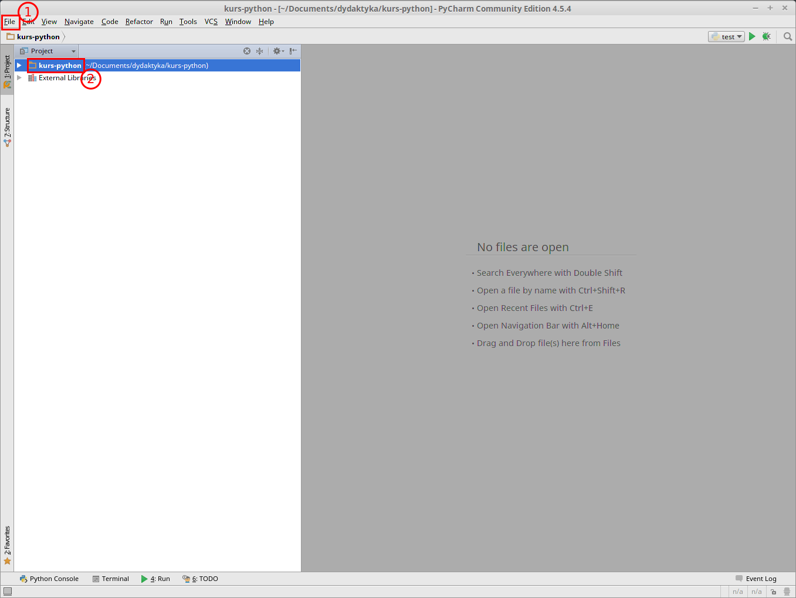

Gdy wstępna konfiguracja programu zostanie ukończona powinno automatycznie otworzyć się okno programu. Jeśli nie posiadamy żadnego ostatnio otwartego projektu, to należy:

1. Przejść do menu *File* i wybrać *New project*. Następnie wybrać lokalizację projektu na dysku i nazwę dla nowego projektu.
2. Nowy projekt otworzy się w drzewie projektu. Aby dodać nowy plik do projektu klikamy prawym przyciskiem na ten katalog w drzewie w którym plik ma zostać umieszczony.

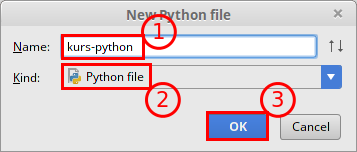

W trakcie tworzenia nowego pliku: 

1. Wybierz unikalną nazwę w kontekście wybranego katalogu,
2. Upewnij się że ***Kind*** jest ustawiony jako ***Python File***,
3. Zatwierdź utworzenie pliku. 

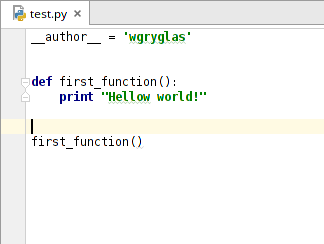

Nowo dodany plik zostanie automatycznie otwarty w panelu po prawej stronie. PyCharm automatycznie doda do pliku linijkę z kodem:
```python
__author__ = "user.name"
```
Instrukcja `__author__ =` oznacza utworzenie zmiennej globalnej. Nie jest ona konieczna potrzebna, a wręcz rzadko stosowana. Głównym celem jej dodawania jest przekazanie metadanych do celów tworzenia dokumentacji i pakietów. Opcję automatycznego dodawania tej zmiennej można wyłączyć w ustawieniach PyCharm.

W dalszej części napiszmy pierwszy kod - funkcję której zadaniem będzie wyświetlenie tekstu historycznie uznanego za jeden z najważniejszych w dziejach programowania, ten od którego wszyscy zaczęli - "Hellow World"
```python
def first_function():
    print "Hellow world!

first_function()
```
Przeanalizujmy powyższy kod. Słowo kluczowe `def` oznacza początek definicji funkcji. Następnie podajemy nazwę definiowanej funkcji, w naszym przypadku jest to *first_function*. W Pythonie nie podajemy typu zawracanej wartości, ponieważ typy jako takie w nim nie istnieją. Python jest językiem dynamicznie typowany co oznacza, że typ zmiennej jest taki jak wartość do niej przypisana, dlatego nie trzeba zmiennej deklarować. Każda zmienna może być typu *integer* a następnie może stać się typu *string*, w związku z czym nie ma sensu podawanie typu zwracanego obiektu ponieważ on wyniknie z tego co zostanie zwrócone. Po nazwie funkcji podajemy w nawiasie nazwy argumentów (tylko nazwy, poniweaż typy nie są potrzebne) a następnie wstawiamy znak **:**,  który rozpoczyna ciało funkcji. I tutaj pojawia się ciekawe zjawisko - brak klamer. W Pythonie klamry określające przynależność części kodu do instrukcji, zostały zastąpione wcięciem w tekście o 1 tabulację. Koniec ciała funkcji z kolei definiujemy poprzez przesunięcie kodu o 1 tabulację z powrotem w lewo. Funkcje wywołujemy dokładnie tak samo jak w większości innych języków, poprzez podanie nazwy funkcji i argumentów w okrągłych nawiasach.

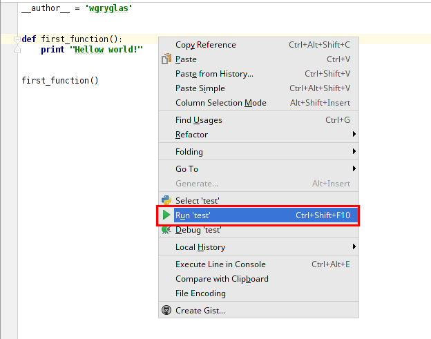

Gdy posiadamy już kod należy go uruchomić aby sprawdzić czy poprawnie zapisaliśmy to co chcemy osiągnąć. W przypadku kodu Pythona wystarczy wywołać interpreter ze wskazaniem ścieżki do pliku. Taką operację można wykonać z poziomu konsoli:
```bash
$ python nazwa_pliku.py
```
Jednak w sytuacji gdy korzystamy IDE uruchamianie kodu z konsoli nie jest wygodne. Aby to zrobić za pierwszym razem należy przygotować konfigurację uruchamiania wybranego pliku. W przypadku gdy chcemy uruchomić aktualnie edytowany plik możemy skorzystać z domyślnej konfiguracji:

1. Kliknij prawym przyciskiem w pustym miejscu w edytowanym pliku.
2. Wybierz opcję ***Run***.

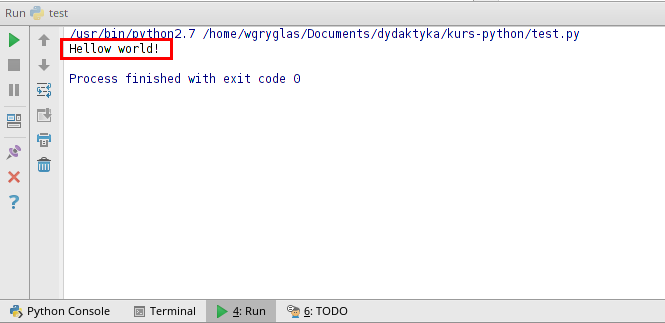

Po uruchomieniu kodu PyCharm automatycznie rozwinie konsolę w której powinien wyświetlić się napis *"Hellow world!"*.

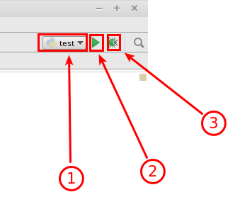

Wróćmy jeszcze do konfiguracji uruchamianiowej.Po kliknięciu na ***Run*** automatycznie zostaje utworzona domyślna konfiguracja, która nazywa się tak jak edytowany plik. Ponadto taka konfiugracja zostaje dodana do rozwijanego menu w prawym górnym rogu, tuż nad edytorem tekstu. Znajdują się tam 3 przyciski:

1. Menu służące do wyboru aktualnej konfiguracji.
2. Przycisk do uruchamiania wybranej konfiguracji.
3. Przycisk służący do uruchamiania wybranej konfiguracji w trybie "Debug". 

Po co nam różne konfiguracje? Otóż w obrębie jednego projektu możemy mieć kilka  różnych plików zawierających kod który ma wykonać jakieś zadania. Często zdaża się tak, że edytuajmy jedan plik, ale żeby zobaczyć efekty pracy chcemy jednak uruchomić inny wcześniej wybrany. 

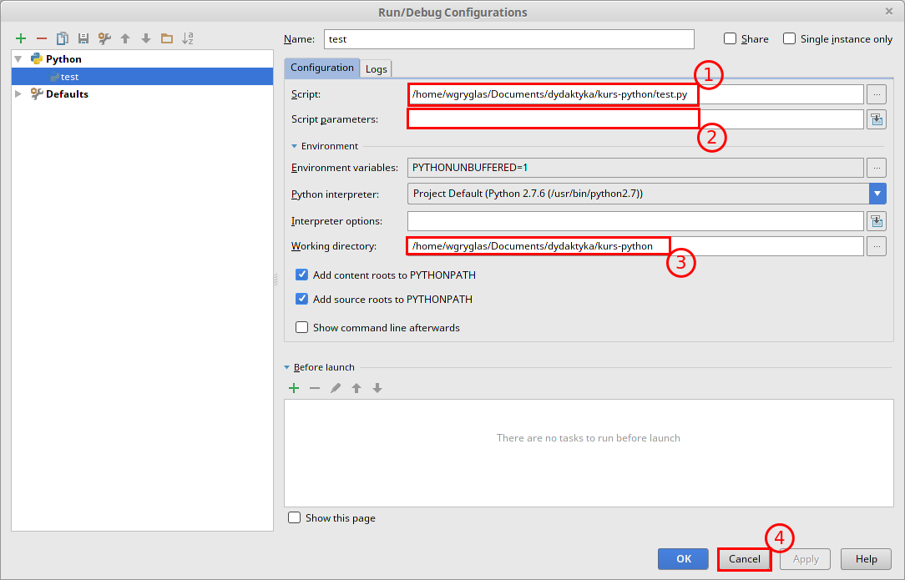

Na koniec jeszcze zobaczmy co zawiera konfiguracja uruchomieniowa naszego pliku test.py. Aby otworzyć okno jej edycji należy wybrać opcję ***Edit configuration*** z rozwijanego menu ([rysunek](05.png)). W panelu ***Configuration*** znajdują się 3 najważniejsze pola:

1. ***Script*** - ścieżka do pliku który ma zostać uruchomiony.
2. ***Script parameters*** - parametry jakie powinny zostać przkazane do naszego kodu w czasie jego wywołania. Paremetry te to nic innego jak parametry przekazywane do programów gdy je wywołujemy z konsoli, np.:
```bash
$ rm directory_name
```
W powyższym przykładzie ***rm*** jest nazwą programu, a *directory_name* to parametr który zostaje przekazany do programu. W sytuacji gdy będziemy pisali skrypt ogólnego zastosowania, który będzie zależał od parametrów przekazanych przez użytkownika, to na czas testów kodu warto właśnie w tym miejscu podać testowe parmetry, zamiast na sztywno je przypisywać wenątrz kodu.  
3. ***Working directory*** - lokalizacja z której ma zostać wywołany nasz program. Podobnie jak w przypadku parametrów ta informacja jest przekazywana do programu przez system operacyjny w czasie uruchamiania go z konsoli. W przykładzie z poprzedniego punkut komenda ***rm*** służy do usuwania plików wskazanych za pomocą parmetrów. Ścieżki tych parametrów mogą być podawane względem folderu w którym się znajdujemy, zatem program musi zawsze otrzymać dodatkową informację o lokalizacji z której został uruchomiony.

## Własne repozytorium w sieci i git w PyCharm

Jak już wcześniej o tym wspomnieliśmy kod i materiały potrzebne do pracy będziemy przechowywali przy wykorzystaniu systemu kontroli wersji ***git*** oraz zdalnego repozytorium w serwisie ***GitHub***. W serwisie tym znajduje się oficjalne repozytorium (pewna przestrzeń dyskowa obsługiwana przez system kontroli wersji) z materiałami do naszych ćwiczeń. Materiały te mogą edytować tylko osoby posiadające odpowiednie uprawnienia. Jednak dostęp do nich posiada każdy. Wszyscy mogą skopiować to repozytorium na własne konto i modyfikować je. Jednak zmiany te nie będą nigdy wprowadzone do oficjalnego repozytorium (chyba, że administratorzy uznają, że warto te zmiany dołączyć do swojego repozytorium, ale o tym później). Kopia jakiegoś repozytorium na własne konto jest nazywana ***Fork***. Oprócz tworzenia kopii repozytorium do swojego konta można także utworzyć kopię zwaną ***Branch*** - gałąź, która będzie znajdowała się nadal wewnątrz repozytorium, ale tą operację mogą tworzyć jedynie osoby które są przypisane do repozytorium. Od momentu utworzenia kopii kod staje się "własnością" osoby która go skopiowała i nie jest powiązany z głównym repozytorium. Często jednak chcemy wprowadzać własne zmiany do kodu, ale przy okazji chcemy aby nasz kody był cały czas aktualny z oficjalnym repozytorium. W takiej sytuacji można połączyć własną kopię ***Fork*** z drugim zdalnym repozytorium i co jakiś czas je aktualizować. Procedurę taką opiszemy na następnych ćwiczeniach, a teraz przejdziemy do utworzenia własnego repozytorium na bazie istniejącego.

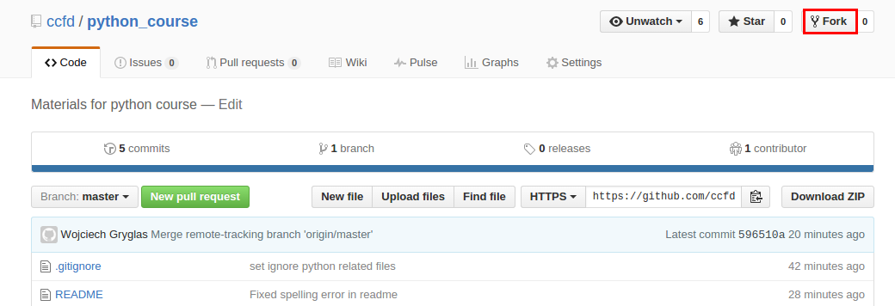

Należy przejść na stronę [GitHub](https://github.com "GitHub") i zalogować się na własne konto. Następnie należy znaleźć repozytorium z materiałami do naszego kursu (za pomocą wyszukiwarki bądź wprost z tego [linku](https://github.com/ccfd/python_course)). Następnie należy kliknąć na przycisk znajdujący się w prawym górnym rogu ***Fork***. Ta operacja utworzy kopię repozytorium na własnym koncie. Poniważ uczestnicy będą pisali własny kod będący rozwiązaniem zadań, to właśnie ta kopia repozytorium posłuży im do przechowywania własnego kodu i automatycznego pobierania materiałów przygotowanych przez prowadzących. 

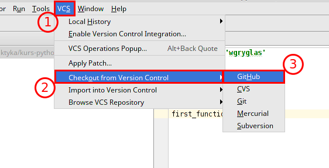

Utworzyliśmy właśnie własne repozytorium. Jednak znajduje się ono na razie tylko na serwerze. Aby ściągnąć pliki zawarte w tym repozytorium należy utowrzyć tzw. lokalne repozytorium. Lokalne repozytorium jest kopią kodu zawartego na serwerze na przestrzeń dyskową własnego komputera. Dzięki temu można wprowadzać zmiany z pozimu własnego komputera. Należy jednak pamiętać, że wszystkie takie zamiany będą tylko lokalne, tzn. istniały tylko w obrębie własnego komputera. Aby te zmiany mogły się pojawić także na serwerze, trzeba będzie je tam wysłać, ale o tym dalej. 
Operacja kopiowania (pobierania) zdalnego repozytorium na własny komputer nazywana jest klonowaniem (clone). Można to uczynić z poziumu konsoli za pośrednictwem programu ***git***:
```bash
$ git clone https://github.com/ccfd/python_course.git
```
Ta komenda utworzy repozytorium w folerze o nazwie "python_course". Jeśli chcemy aby to repozytorium zostało zapisane w innmym folderze, to należy podać dodatkowy parametr ze ścieżką do wybranego folderu.

PyCharm jest rozbuodwanym środowsikiem i sam także pozwala na utorzenie lokalnej kopii ze zdalnego repozytorium. Aby to ucznić należy:
1. Wybrać opcję ***VCS*** z górnego menu.
2. Wybrać opcję ***Cehckout from Version Control***.
3. Na koniec wskazać ***GitHub*** który jest dodatkowo wspierany przez PyCharm.


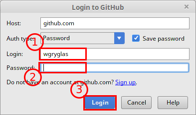

Następnie PyCharm poprsi o zalogowanie się na nasze konto, poniważ będzie chciał pobrać informacje o dostępnych repozytoriach na naszym koncie:
1. Podajemy login.
2. Podajemy hasło do naszego konta.
3. Logujemy się klikając na wskazany przycisk.

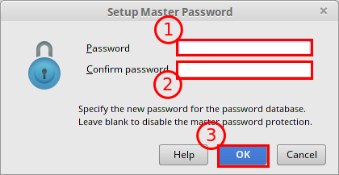

Poniważ za każdym razem gdy będziemy chcieli pobrać lub wysłać nową wersję kodu będziemy musieli podać login i hasło. Może być to uciążliwe, dlatego PyCharm pozwala na wprowadzenie dodatkowego hasła, które będzie istniało tylko w obrębie PyCharm. Dzięki temu będziemy mogli wpisać to nowe hasło tylko raz na jedną sesję pracy z programem, a on wykorzysta zapisane i zaszyfrowane właściwe hasło i login do naszego konta na GitHub, co znacząco ułatwia pracę. Jeśli kotś nie chce tego robić wystarczy klinkąć ***Cancel*** i PyCharm będzie za każdym razem (gdy będzie to wymagane) prosił o podanie właściwego loginu i hasła do konta na GitHub. 

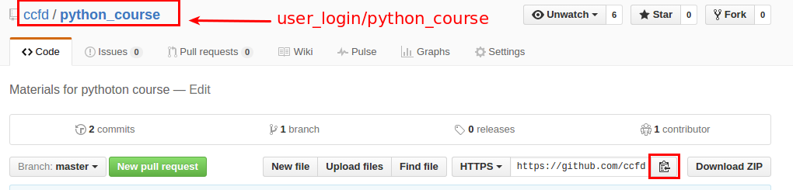

Następnym krokiem jest wybór adresu repozytorium na serwerze. Można to zrobić wchodząc na własne konto i wybierając repozytorium które skopiwoaliśmy. Następnie można skopiować jego adres za pomocą przycisku na stronie.

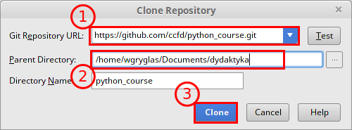

1. Z racji tego, że już zalogowaliśmy się na nasze konto za pomocą PyCharm, to on sam automatycznie pobrał wszystkie adresy naszych repozytoriów. Dlatego w miejscu ***Git Repository URL*** można wkleić skopiowany adres bądź wybrać jeden z rozwijanego menu. 
2. Oprócz adresu musimy wybrać lokalizajcę na naszym dysku gdzie ma zostać przechowana lokalna kopia kodu (w przypadku używania konsoli należało przejść do właściwego folderu przed wywołaniem git clone ...). 
3. Na koniec zatwierdzamy klikając na ***Clone***.

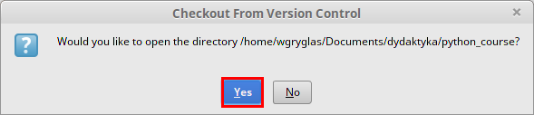

Gdy PyCharm zakończy pobierać dane z serwera zapyta czy otworzyć to repozytorium jako nowy projekt - klikamy ***Yes***.

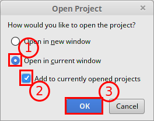

Po kliknięciu na ***Yes*** może pojawić się powyższy komunikat. Chodzi tutaj o to, że wcześniej utowrzyliśmy pierwszy projekt i program pyta się czy nowy projekt powinien zostać dodany do drzewka czy powinien otworzyć całkiem nowe okno. Możemy wybrać opcję ***Open in current window*** choć to nie będzie miało większego znaczenia.

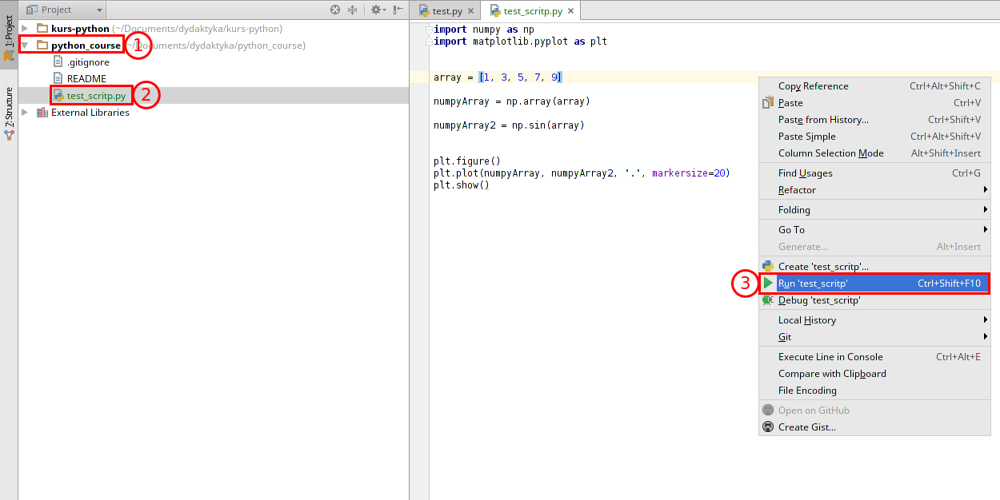

Gdy załaduje się projekt z naszego repozytorium otwórzmy plik "test_script.py". Plik ten zawiera testowy kod, który wykorzystuje biblioteki NumPy i Matplotlib. Jeśli program zadziała poprawnie to będzie znaczyło, że udało się zainstalować je poprawnie. Aby uruchomić ten plik możemy zrobić tak jak poprzedni, czyli wybrać opcję ***Run*** z menu otwieranego prawym przyciskiem myszy. 

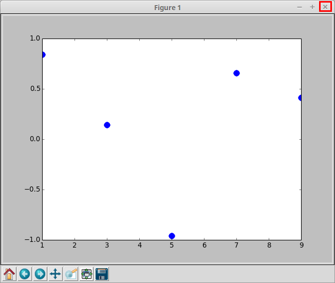

Jeśli program zadziałał poprawnie, to powinniśmy zobaczyć powyższy wykres w nowym oknie. 

Teraz dokonamy drobnych zmian w naszym kodzie, tak aby można było zatwierdzić zmianę (zrobić "Commit") oraz wysłać ją z lokalnego repozytorium na zdalne - serwer. 

W tym celu zamieńmy linijkę:

```python
numpyArray2 = np.sin(array)
```
na linijkę:
```python
numpyArray2 = np.sin(array) + np.cos(array)
```

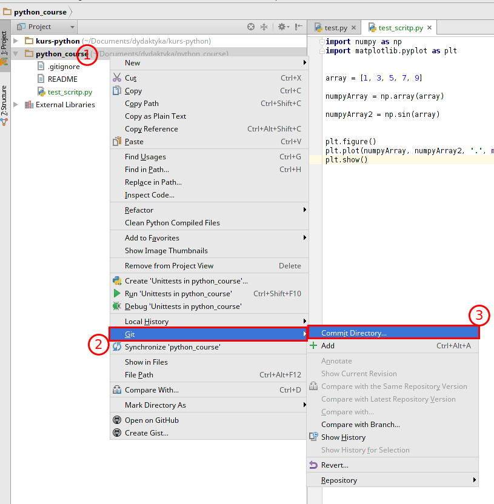

Teraz musimy zatwierdzić zmianę. W tym celu możemy utworzyć "commit" dla pojedyńczego pliku lub wszystkich w naszym projekcie, co zazwyczaj jest bardziej wygodne. Aby to zrobić:

1. Kliknij prawym przyciskiem na folder "python_course" w drzewie.
2. Wybierz opcję ***Git***.
3. A następnie ***Commit Directory...***.

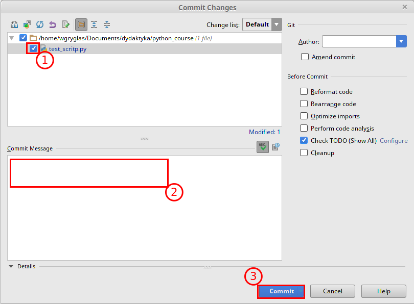

Otworzy się teraz nowe okno służące do zatwierdzania zmian. Warto robić takie zatwierdzenia jak najczęściej, dzięki czemu każda zmiana w kodzie będzie łatwa do odszukania i np. usunięcia. Aby utowrzyć "Commit" musimy:

1. Wybrać zmodyfikowane pliki które mają być zatwierdzone tym commitem. 
2. Wpisać wiadomość informującą jakie zmiany w kodzie zostały przeprowadzone. 
3. Zatwierdzić przyciskiem ***Commit***. Uwaga, zanim kliknie się na ten przycisk rozwija się dodakowe menu, które pozwala wybrać opcję ***Commit and Push***. Opcja ta tworzy nowy commit i automatycznie wysyła zmiany na serwer. Czasami nie chcemy wysłać zmian, ponieważ nie jesteśmy pewni czy nie będziemy chcieli zrezygnować z nich za jakiś czas. Wybierzmy teraz drugą opcję, tj. ***Commit and Push***.

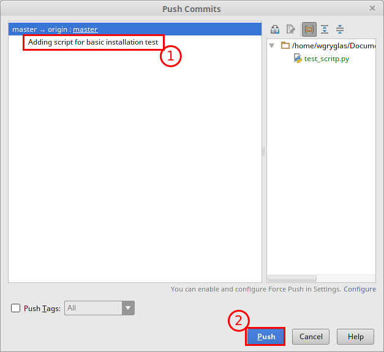

Po utworzeniu commitu PyCharm otworzy nowe okno w którym należy zatwierdzić, że chcemy wysłać zmiany na serwer. W naszym przypadku commit powinien zostać zaznaczony automatycznie, więc wystarczy kliknąć na przycisk ***Push***.

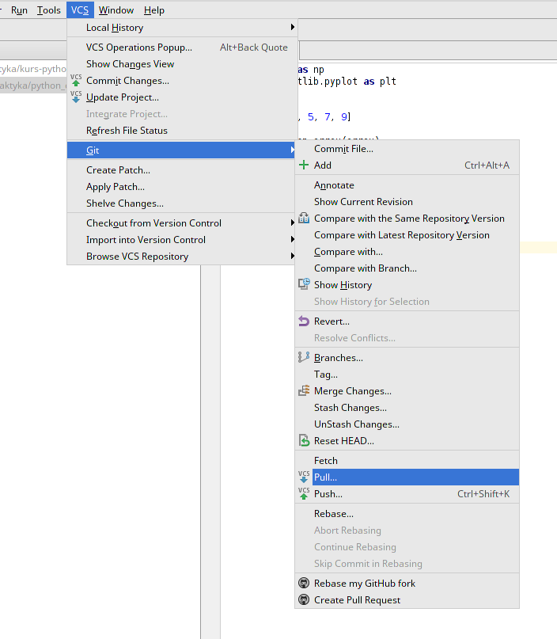

Na koniec pokażemy jeszcze jak pobrać zmiany ze zdalnego repozytorium na nasze lokalne, które już istnieje (np. w sytuacji, gdy ktoś inny wprowadził zmiany i chcemy aby ten nowszy kod pojawił się także u nas na dysku). Do tego celu korzystamy z opcji "Pull" która działa przeciwnie do "Push" - czyli pobiera wszystkie zmiany z serwera i dołącza je do naszego kodu. Aby dokonać tej operacji z pozimu konsoli należy przejść do właściwego folderu zawierającego nasze lokalne repozytorium, a następnie wywołać:
```bash
$ git pull
```
Po tej operacji zostaniemy poproszeni o podanie nazwy użytkownika i hasła. 

W naszy przypadku skorzystamy z PyCharma - wystarczy wybrać odpowienią opcję z menu (tak jak na rysunku powyżej) a program wykona żądaną operację i ściągnie najświeższy kod.
Musimy zrócić uwagę na jeszcze jedną opcję znajdującą się obok "Push" i "Pull" - "Fetch". Opcja ta służy jedynie do pobrania inforamcji i danych ze zdalnego repozytorium. Ona, w przeciwieństwie do "Pull", nie zmienia plików źródłowych w lokalnym repozytorium.


Git - aktualizacja kopii repozytorium
.... todo ....
