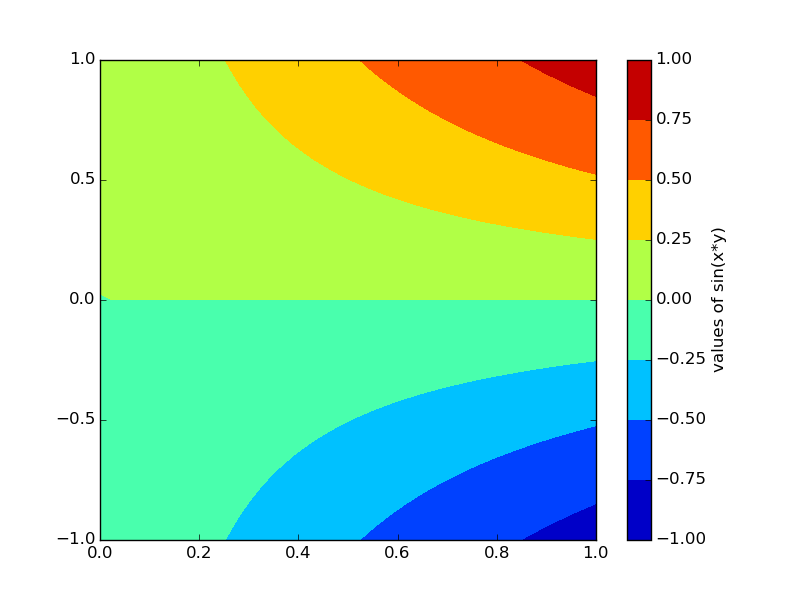
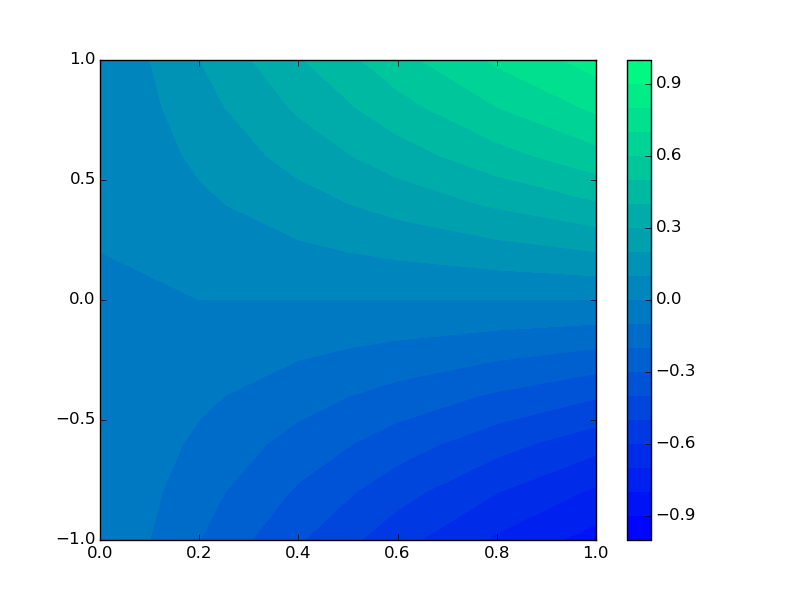
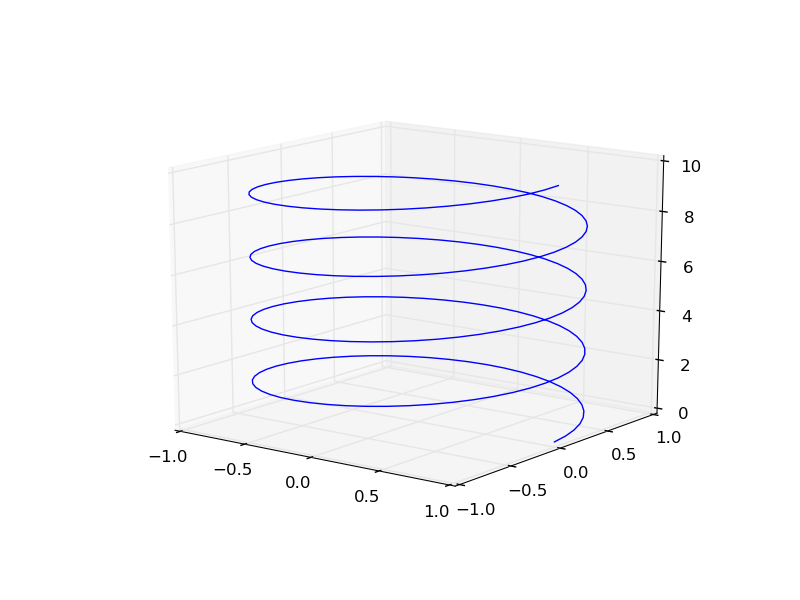
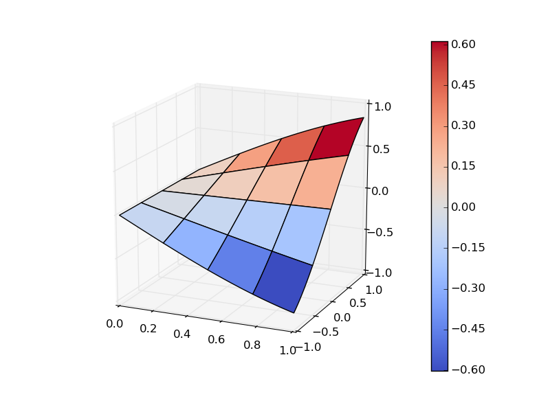
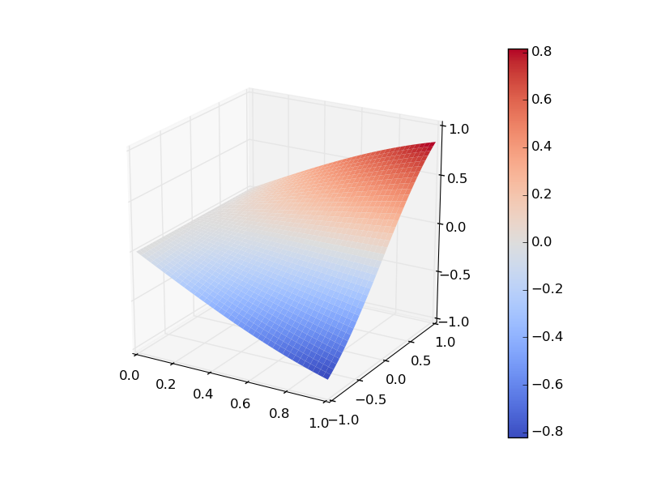
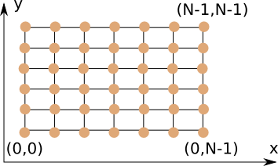

#Wprowadzenie


## NumPy array - zamiana wymiarów

Jak wiemy z poprzednich zajęć, tablice numpy.array są stałego wymiaru. W przypadku np. dwu-wymiarowym są to zawsze tablice prostokątne, co oznacza, że nie nie może zdarzyć się sytuacja w której jeden z wierszy będzie krótszy. Aby zobaczyć wymiary tablicy korzystamy ze zmiennej "shape":
```python
import numpy as np

t = np.ones((2,3))
print t.shape # >> (2, 3)
```

Czasami istnieje jednak potrzeba zamiany tablicy np. dwu-wymiarowej na jednowymiarową poprzez połączenie kolejnych wierszy w jeden wektor. Do tego celu służy funkcja "reshape", którą możemy wywołać na dwa sposoby:

* Jako funkcja biblioteki numpy, tworząc nową tablicę

```python
import numpy as np

tab2D = np.array( [[ i*2+j for j in range(2)] for i in range(3)])
# tab2D = [[0 1]
#                 [2 3]
#		    [4 5]]

tab1D = np.reshape(tab2D, (6, 1))
# tab1D = array([[0],
#      		     [1],
#       		     [2],
#       		     [3],
#       		     [4],
#       		     [5]])

tab1D = np.reshape(tab2D, (1, 6))
# array([[0, 1, 2, 3, 4, 5]])
```
Należy tutaj zwrócić uwagę, że nowo utworzona tablica jest także dwu-wymiarowa, ponieważ nowy "kształt" został przekazany jako tuple. Aby uzyskać w pełni jednowymiarową tablicę wystarczy podać wymiar jako tylko "6":
```python
tab1D = np.reshape(tab2D, 6)
# array([0, 1, 2, 3, 4, 5])
```

* Jako metoda obiektu tablica, tworząc także nową tablicę:
```python
import numpy as np

tab2D = np.array( [[ i*3+j for j in range(2)] for i in range(3)])

tab1D = tab2D.reshape(6)
# array([0, 1, 2, 3, 4, 5])
```

Powyżej pokazaliśmy, jak zmienić kształt z tablicy 2D na 1D. Podobnie można uczynić w drugą stronę:

```python
import numpy as np

tab1D = np.array( [ i for i in range(6) ] )

tab2D = tab1D.reshape((3,2))
# [[0 1]
#  [2 3]
#  [4 5]]
```
Gdy będziemy używali funkcji ***reshape*** musimy mieć pewność, że nowy wymiar będzie pasował. Pomocna może być zmienna ***size*** należąca do tablic, która informuje o całkowitej liczbie elementów:

```python
import numpy as np

tab2D = np.array( [[ i*3+j for j in range(2)] for i in range(3)])

tab1D = tab2D.reshape(tab2D.size)
# array([0, 1, 2, 3, 4, 5])
```

## NumPy - load/save data

Kolejną bardzo przydatną funkcją z biblioteki numpy jest ***load*** i ***save***. Podczas poprzednich zajęć pokazaliśmy jak wczytywać/zapisywać dane z pliku linia po linii. Jak wiadomo w praktyce inżynierskiej zapisywanie danych do pliku zazwyczaj sprowadza się tylko do zapisu pewnego zbioru liczb. I właśnie do tego celu bardzo dobrze nadają się wspomniane funkcje. Potrafią one zapisać dowolną tablicę numpy.array do pliku o rozszerzeniu ***npy***. Plik taki zostaje zapisany w postaci binarnej, dzięki czemu proces zapisywania i wczytywania jest możliwie najbardziej wydajny. Zobaczmy jak to działa w praktyce:

```python
import numpy as np

x = np.linspace(0,1, 100)
y = np.sin(x)

xy = np.zeros((100,2))
xy[:,0] = x
xy[:,1] = y

np.save("nazwa_pliku", xy)
```

W miejscu "nazwa_pliku" możemy wstawić dowolną ścieżkę. Jeśli nie podamy ścieżki tylko samą nazwę, to zostanie utworzony plik w aktualnym roboczym katalogu. Wczytywanie tych danych jest tak samo proste jak ich zapisywanie:

```python
import numpy as np
import matplotlib.pyplot as plt

xy = np.load("nazwa_pliku")

plt.figure()
plt.plot(xy[:,0],xy[:,1])
plt.title("Funkcja sinus")
plt.show()
```

Oprócz opisanych powyżej funkcji do zapisu danych można skorzystać z funkcji:
- ```numpy.savetxt(fname, X, fmt='%.18e', delimiter=' ', newline='\n', header='', footer='', comments='# ')```  - funkcja zapisuje dane w postaci tekstowej. Wymagane jest przekazanie dwóch pierwszych parametrów: nazwa pliku i tablica. Pozostałe parametry są opcjonalne. Domyślne wartości przedstawiono powyżej. 
- ```numpy.loadtxt(fname, dtype=<type 'float'>, comments='#', delimiter=None, converters=None, skiprows=0, usecols=None, unpack=False, ndmin=0)``` - funkcja wczytuje dane z pliku tekstowego. Wymagany parametr to ścieżka do pliku. Pozostałe parametry są opcjonalne. Warto tutaj zwrócić uwagę na parametr ***dtype*** który określa typ zmiennych do jakich mają być wczytane dane. Domyślnie ustawiony jest typ ***float***, który nie zawsze jest tym którego oczekujemy. 

Z powyższych funkcji korzysta się dokładnie tak samo jak z poprzednich. Funkcje te zapisują/wczytują jednak dane w postaci tekstowej, co jest znacznie wolniejsze ale za to bardziej uniwersalne. Wykorzystując parametry funkcji możemy zdefiniować 

Sprawdź format zapisu tych danych. Jakie informacje są zawarte w pliku? Czy wczytywanie takich danych jest optymalne? Jeśli nie to dlaczego?


## Obiekty klasy "dict"

Do tej pory pokazaliśmy kilka podstawowych typów, takich jak ***list*** czy ***string***. Python zawiera jeszcze jeden bardzo ważny typ ***dictionary*** - oznaczany jako ***dict***. Type ten jest odpowiednikiem typu mapa spotykanego w innych językach. Mapuje on wartości jednego typu na wartości drugiego, np. string -> integer. Jest on bardzo przydatny, ponieważ pozwala na przechowywanie liczb(ewentualnie jakiś obiektów) ale przy okazji pozwala się do nich odwoływać za pomocą nazwy zamiast indeksów np.:
"dom" -> 1
"drzwi" -> 2
Gdy nie chcemy pamiętać jaki indeks ma "dom" to wystarczy przechować te nazwy i indeksy za pomocą typu "dict", a następnie pobierać wartości już tylko za pomocą ich nazw. W Pythonie typ ***dict*** możemy utworzyć na dwa sposobu:
* wywołując funkcje ***dict()*** która utworzy pustą mapę ```mapa=dict()```
* przypisując do zmiennej konkretne pary: 
```python
mapa = { "dom":1, "drzwi":2}
```
Aby skorzystać następnie z takiej mapy wystarczy odwołać się do jej elementów za pomocą klucza - czyli pierwszej zmiennej w parze:

```python
mapa = { "dom":1, "drzwi":2}

print "Indeks przypisany do domu to ", mapa["dom"]
print "a indeks przypisany do drzwi to ", mapa["drzwi"]
```

W przypadku gdy będziemy chcieli dodać nowy element do mapy wystarczy przypisać do nowej nazwy nową wartość:

```python
mapa = dict()
mapa["dom"] = 1
mapa["drzwi"] = 2
```

Należy pamiętać, ze mapa wcale nie musi mapować tylko nazw do liczb. Możemy zapisać za jej pomocą na przykład pary obiekt okno graficzne - jego tytuł

```python
import matplotlib.pyplot as plt

okno1 = plt.figure()
okno2 = plt.figure()

tytuly={okno1:"Okno pierwsze", tytuly[okno2]:"Okno drugie"}


print "Tytul okna pierwszego to ", tytuly[okno1]

#ustawiamy tutul okna
okno1.fig.canvas.set_window_title( tytuly[okno1] )
```

Należy jednak pamiętać, że aby jakiś typ mógł być użyty jako klucz mapy musi być on "hashowalny". Nie będziemy tego opisywali, tylko zwracamy uwagę, że nie wszystkie typy mogą być użyte jako klucze, np. skorzystanie z listy spowoduje wyrzucenie błędu. 

## Sprawdzanie czy klucz znajduje się w słowniku "dict"

Bardzo często będzie zachodziła sytuacja, gdy będziemy chcieli dowiedzieć się, czy dany obiekt jest już w jakimś kontenerze ***dict***. Podobnie do list i tutaj wystarczy skorzystać z słowa kluczowego ***in***, np.:

```python
mapa = {"dom":1, "drzwi":2}

if "dom" in mapa:
	print "Dom jest w mapie, a jego indeks to", mapa["dom"]
```

Do słowa kluczowego ***in*** można dodać ***not***, co odwróci jego działanie:

```python
mapa = {"dom":1, "drzwi":2}

if "okno" not in mapa:
	mapa["okno"] = 5

print "Okno ma indeks", mapa["okno"]
```

Powyższy kod pozwala nam upewnić się, że okno znajdzie się w mapie, a linijka z "print" nie wygeneruje błędu.

## Iterowanie po elementach słownika

W przypadku list i tablic iterowanie po ich elementach jest dość oczywiste - kolejne parametry pojawiające się w pętli ***for*** są kolejnymi elementami list. A jak to jest w przypadku słownika, gdzie operujemy na parach klucz-wartość? Jest podobnie, tylko elementami po których iterujemy są klucze. A zatem jeśli mamy mapę o parach string-integer to kolejnymi elementami w pętli for będą nazwy:

```python
mapa = {"dom":1, "drzwi":2, "okno":5}

for key in mapa:
	print "klucz to:", key, " a wartosc", mapa[key]
```
Podsumowując, w przypadku kontenerów typu ***dict*** iterujemy w pętlach zawsze po jej kluczach, a wartości możemy uzyskać pobierając wartość z mapy za kolejnego klucza w pętli. 


## Funkcje zwracające więcej niż jeden argument

W większości znanych języków funkcje zazwyczaj mogą zwracać tylko jeden lub żaden argument. W przypadku Pythonie jest i nie jest tak samo jednocześnie. Jest tak samo, ponieważ fizycznie Python zwraca jeden argument. Nie jest tak samo, bo w praktyce wygląda to tak jakbyśmy pracowali na kodzie, gdzie może być zwracanych więcej niż jeden argument. Przyjrzyjmy się następującej funkcji:

```python
def funkcja(a,b):
	return a+b, a-b
```

Funkcja ta przyjmuje 2 liczby i zwraca także dwie liczby, ponieważ po przecinku wypisaliśmy sumę i różnicę przekazanych parametrów a i b. Taka konstrukcja służy do zwracania większej liczby parametrów. Zobaczmy w takim razie jaki to typ zwraca nasza funkcja:

```python
def funkcja(a,b):
	return a+b, a-b

print type( funkcja(1,2) ) # >> <type 'tuple'>
```

Jak widać Python parę liczb zwraca jako typ ***tuple***. Przypomnijmy, ***tuple*** to kontener, który przechowuje dowolne typy (elementy mogą być różnego typu) ale nie można zmieniać tych elementów. Zatem w wyniku dostajemy niemodyfikowalną listę różnych obiektów. A sprawdź co zwraca funkcja jedno i bez argumentowa:

```python
def funkcja(a,b):
	return a+b

print type( funkcja(1,2) ) # >> <type 'int'>

def funkcja(a,b):
	c  = a-b

print funkcja(1,2) # >> None
print type(funkcja(1,2)) # >> <type 'NoneType'>
```

Jak widzimy w przypadku jednego argumentu Python automatycznie zwraca ten jeden konkretny obiekt, nie opakowuje go w kontener ***tuple***. Z kolei gdy funkcja nic nie zwraca, to okazuje się, że w rzeczywistości Python zwraca domyślnie zmienną typu ***NoneType*** o wartości ***None***. Zmienna ta jest czymś co przypomina pusty wskaźnik "Null" w innych językach. Można go testować w konstrukcji ***if***:

```python
def funkcja(a,b):
	c  = a-b

wynik = funkcja(1, 2)

if wynik:
	print "Funkcja zwraca argument"
else:
	print "Funkcja nie zwraca argumentow"
```

Wróćmy do zwracania wielu argumentów pod postacią tuple. Na poprzednich ćwiczeniach mówiliśmy, że w Pythonie dowolną listę, tablicę czy tuple (coś po czym można iterować jak w pętli for) można "rozwinąć" do zmiennych. W tym celu korzysta się z konstrukcji

```python
dane = (1, 2, "cos")
liczba1, liczba2, text = dane
```

która przypisuje zmiennym po przecinku dane z kontenera. Z racji tego, że funkcja zwracająca wiele argumentów zwraca fizycznie ***tuple*** to dokładnie w ten sam sposób możemy wynik z funkcji przypisać do kilku zmiennych:

```python
def funkcja(a,b):
	return a+b, a-b

suma, roznica = funkcja(1,2)

print "Suma =",suma # >> Suma = 3
print "Roznica =",roznica # >> Roznica = -1 
```


## Domyślne wartości argumentów funkcji

W Pythonie w odróżnieniu od innych języków programowania nie można zdefiniować funkcji o tej samej nazwie, tak aby różniła się tylko inną liczbą argumentów. W języku C++ czy Java jest to bardzo często wykorzystywane, jednak tam nazwa funkcji nie jest prawdziwą jej nazwą, ponieważ kompilator zawsze dopisuje do niej jeszcze typy argumentów. Zazwyczaj wykorzystuje się takie zduplikowane funkcje do tego aby przekazać domyślne argumenty funkcji, np.:

```c++
double root(double a, double order)
{
	return pow(a, 1./order);
}

double root(double a)
{
	return root(a, 2);
}
```

 W związku z tym w tych językach można korzystać z tej samej nazwy dla różnych zadań. W Pythonie jak już wspominaliśmy typy argumentów nie mają znaczenia, dlatego wpisanie nowej funkcji spowoduje nadpisanie jej. 

W Pythonie z kolei (w języku C++ także jest to dozwolone) można dodawać domyślne wartości do zmiennych. Dzięki temu, możemy napisać jedną funkcję, która będzie obsługiwała różne przypadki. W tym celu posługujemy się operatorem = tuż za nazwą zmiennej przy argumentach funkcji, np.:

```python
def root(a, order=2):
	return a**(1./order)

print "Pierwiastek z 2 to", root(2)
print "Pierwiastek trzeciego stopnia z 2 to", root(2,3)
```
Jak widać, powyższa funkcja została wywołana 2 razy, jednak za pierwszym razem argument "order" został po cichu ustawiony jako 2, a w drugim explicite podaliśmy jego wartość jako 3. 

Należy tutaj zauważyć, że takie domyślne (opcjonalne) parametry funkcji muszą znajdować się tuż za koniecznymi argumentami. 

Teraz zajmijmy się przypadkiem, gdy mamy więcej niż jeden domyślny argument, ale tylko jeden konkretny chcemy zmienić. W takim przypadku odwołujemy się do konkretnego argumentu za pomocą jego nazwy. Załóżmy, że chcemy aby funkcja "root" mogła zwracać wynik w postaci wybranego typu. W związku z tym zmienimy definicję naszej funkcji poprzez dodanie trzeciego argumentu rtype ("return type"):

```python
def root(a, order=2, rtype=float):
	return rtype(a**(1./order))
```

W powyższej definicji funkcji skorzystaliśmy z faktu, że Python posiada wbudowane funkcje o nazwie danego typu, które automatycznie konwertują przekazany argument do wybranego typu (np. rtype=int oznacza, że a**(1./order) zostanie zamienione w zmienną typu całkowitego). Zastosujmy teraz naszą funkcję tak, aby zostawić domyślny parametr order, a zamienić tylko zwracany typ:

```python
def root(a, order=2, rtype=float):
	return rtype(a**(1./order))

print "Pierwiastek z 2 jako l. domyślna to", root(2)
print "Pierwiastek z 2 jako l. calkowita to", root(2, rtype=int)
print "Pierwiastek 3-ciego stopnia z 2 jako int to", root(2, 3, str)
```

Jak widać powyżej, w sytuacji gdy podajemy kolejne argumenty, tak samo jak zostały one zdefiniowane w funkcji, nie musimy korzystać z nazw argumentów. Jednak gdy chcemy przekazać argumenty w dowolnej kolejności, to już niestety tak musimy uczynić. 

## Definiowanie funkcji ze zmienną liczbą argumentów

Ponieważ Python jest bardzo elastycznym językiem to pozwala na stosowanie zmiennej ilości argumentów. Taka zmienna liczba argumentów jest przekazywana do funkcji za pomocą jednej zmiennej która w praktyce jest jakimś kontenerem (sekwencją obiektów). Przyjrzyjmy się następującej funkcji:

```python
def fun(*args):
       for a in args:
               print a

fun(1,2,"dos","beta")
#>> 1
#>> 2
#>> dos
#>> beta
```

W powyższej funkcji zdefiniowaliśmy jeden argument o nazwie ***args*** dodając przed nim gwiazdkę "*". Oznacza to, że pod zmienną "args" może znajdować się dowolna liczba parametrów. Sprawdźmy jakiego typu jest zmienna ***args***:

```python
def fun(*args):
	print type(args)

fun(1,2,"dos","beta") # >> <type 'tuple'>
```
Jak łatwo było się domyślić kontener ten to ***tuple***, ponieważ wszystkie argumenty zdefiniowaliśmy w trakcie przekazania ich do funkcji, zatem ich liczba ani wartości nie powinny być modyfikowalne, co zapewnia typ ***tuple***.

Funkcje ze zmienną liczbą argumentów wcale nie muszą być pozbawione zwyczajowych argumentów, ważne jest tylko aby argument ****args*** (nazwa może być dowolna) był na końcu, np.:

```python
def suma(a, b, *args):
	s = a + b
	for arg in args:
		s += arg
	return s
```
Powyższa funkcja potrafi zsumować wszystkie przekazane argumenty. Z racji tego, że argumenty ***a, b*** zostały zdefiniowane dodatkowo, to w przypadku gdy ktoś zechce z niej skorzystać przekazując mniej liczb otrzyma błąd, ponieważ sumowanie ma sens tylko gdy mamy co najmniej 2 liczby. Sprawdźmy jej działanie:

```python
def suma(a, b, *args):
	s = a + b
	for arg in args:
		s += arg
	return s

print "Suma 1,2,3,4,5 to", suma(1,2,3,4,5) 
# >> 15
print "Suma tylko 1 to", suma(1)
#>> TypeError                                 Traceback (most recent call last)
#>> <ipython-input-198-5304d71f0cc4> in <module>()
#>> ----> 1 print "Suma 1 to", suma(1)
#>>
#>> TypeError: suma() takes at least 2 arguments (1 given)
```

## Przekazywanie listy wprost do argumentów funkcji

Bardzo często zdarza się tak, że w wyniku jakiś operacji przechowujemy w liście/tablicy pewne dane, które następnie wszystkie muszą być przekazane do kolejnej funkcji. W takiej sytuacji zazwyczaj po prostu wyciągamy kolejne argumenty z listy za pomocą indeksów, a następnie je przekazujemy do funkcji, np.:

```python
def dziwnafunkcja(a,b,c,x1,x2):
	return a*x1**2 + b*x1 + c, a*x2**2 + b*x2 + c

lista = [1,2,3,20,-12]

print dziwnafunkcja(lista[0], lista[1], lista[2], lista[3], lista[4]) 
# >> (443, 123)
```

Przekazywanie takich argumentów jest uciążliwe. Ale zaraz zaraz, przecież możemy skorzystać z rozwijania sekwencji do argumentów, a zatem możemy przerobić naszą funkcję na taką która przyjmuje listę:

```python
def dziwnafunkcja(lista):
	a,b,c,x1,x2 = lista
	return a*x1**2 + b*x1 + c, a*x2**2 + b*x2 + c

lista = [1,2,3,20,-12]

print dziwnafunkcja(lista) 
# >> (443, 123)
```

Teraz wywołanie funkcji jest bardzo krótkie, ale za to, aby przekazać liczby wprost do niej będziemy musieli je zawsze opakować w nawis kwadratowy, np.:

```python
print dziwnafunkcja( [ 1, 2, 3, 20, -12] ) 
# >> (443, 123)
```

Okazuje się, że Python potrafi obejść także taki problem. W tej sytuacji znów skorzystamy z operatora gwiazdka "*", ale posłuży on nam do rozwinięcia sekwencji na argumenty funkcji. W przypadku zwykłych zmiennych wystarczyło przypisać listę do zmiennych po przecinku. W przypadku funkcji już tak łatwo nie jest, ponieważ musimy poinformować interpreter, że chcemy aby nasza lista była użyta jako ==kolejne argumenty, a nie jako pierwszy argument==. Aby móc zastosować rozwinięcie sekwencji do argumentów funkcja nie wymaga zmian a nieznacznie musi być zmodyfikowane jej wywołanie:

```python
def dziwnafunkcja(a,b,c,x1,x2):
	return a*x1**2 + b*x1 + c, a*x2**2 + b*x2 + c

lista = [1,2,3,20,-12]

print dziwnafunkcja(*lista) 
# >> (443, 123)
```

Oczywiście takie rozwijanie sekwencji może być zastosowane na dowolnym typie, po którym możemy iterować, np. tuple albo numpy.array. 


## Definiowanie funkcji z nazwanymi argumentami

Teraz przedstawimy ostatni element dotyczący samych funkcji - nazwane argumenty o dowolnej ich liczbie. Wcześniej pokazaliśmy, że podczas wywoływania funkcji można skorzystać z nazw argumentów i  przekazać je w dowolnej kolejności. Jednak w tej sytuacji wszystkie takie argumenty musiały być zdefiniowane w nagłówku funkcji. Teraz przejdziemy do trochę bardziej zaawansowanej kwestii, a mianowicie sytuacji gdy liczba tych nazwanych argumentów może być dowolna. W takiej sytuacji, kod zawarty w funkcji musi sam sprawdzać, czy argument został przekazany czy nie. 

W celu zdefiniowania dowolnej liczby nazwanych argumentów korzystamy znów z operatora "*" ale tym razem podwojonego, aby odróżnić go od sekwencji argumentów bez nazw. Ponadto wszystkie te argumenty zostaną przekazane do funkcji za pomocą obiektu o typie ***dict*** który będzie zawierał pary: nazwa zmiennej - wartość. 

```python

def funkcja(**kwargs):
	for argName in kwargs:
		print "Argument ",argName, " zostal przekazany z wartoscia", kwargs[argName]
	if "speak" in kwargs and kwargs["speak"]:
		print "You've asked to say Hellow!"

funkcja(cos=20, ktos="ada", speak=True)
```

W powyższym kodzie na początku zadeklarowaliśmy funkcję przyjmującą dowolną ilość nazwanych parametrów. To od użytkownika tej funkcji zależy czy ją wywoła poprawnie czy nie. Z racji tego ważne jest, aby dokumentacja tej funkcji była odpowiednio przygotowana. Funkcja ta na początek iteruje po wszystkich przekazanych argumentach i wyświetla ich wraz z wartością. Następnie sprawdzamy czy do ***kwargs*** został przekazany argument "speak" i czy wartość tego argumentu jest prawdą (kwargs["speak"] zwraca wartość, która z założenia ma być równa True/False)

W tym momencie powinno pojawić się nam w głowie czerwone światełko - po co w ogóle to robić, skoro i tak następnie w kodzie musimy znów sprawdzać czy zmienna jest przekazana, czy nie. Lepiej już pozostawić to w gestii domyślnych wartości argumentów tak aby użytkownik mógł łatwo zauważyć jakie zmienne należy przekazać. I to jest prawda, w przypadku większości funkcji lepszym rozwiązaniem są domyślne parametry. Jednak są dwie sytuacje w których jest to użyteczne:

1. Gdy nasza funkcja ma mieć bardzo dużo opcjonalnych argumentów. Wtedy nagłówek funkcji będzie bardzo nieczytelny i lepiej jest pozostawić takie parametry schowane. Jednak to rozwiązanie może być nadal dyskusyjne. 
2. Gdy wewnątrz naszej funkcji wywołujemy następną funkcję, która posiada dużo parametrów, o których czasami nawet nie wiemy, a chcemy aby użytkownik mógł z poziomu wywołania naszej funkcji wykorzystać je. Ten opis może być niewystarczający, więc przyjrzyjmy się poniższej funkcji, która służy to rysowania sinusa:
```python
import numpy as np
import matplotlib.pyplot as plt

def sinus(num_divisions=100, a=0, b=np.pi, **kwargs):	
	x = np.linspace(a, b, num_divisions)
	y = np.sin(x)
	plt.plot(x,y,**kwargs)
```

Funkcja ta ma zadeklarowane 3 argumenty z domyślnymi parametrami. Ponadto możemy przekazać do niej dowolnie nazwane argumenty w miejscu "kwargs". Zastosowanie podstawowych zmiennych jest oczywiste. Należy jednak zwrócić uwagę na przekazanie *****kwargs*** do funkcji ***plt.plot***. Tam przed argumentem ***kwargs*** umieściliśmy podwójny znak **. Oznacza on w tym przypadku, że chcemy zamienić słownik ***kwargs*** z powrotem na argumenty funkcji. Podobną operację wykonywał operator * gdy chcieliśmy przekazać listę jako kolejne argumenty funkcji. W tej sytuacji musimy zastosować operator ** ponieważ chcemy aby słownik został rozwinięty do zbioru nazwanych argumentów. Dzięki takiej konstrukcji możemy kontrolować parametry rysowania linii tak samo jak to miało miejsce w czystej funkcji ***plt.plot***:

```python
import numpy as np
import matplotlib.pyplot as plt

def sinus(num_divisions=100, a=0, b=2*np.pi, **kwargs):	
	x = np.linspace(a, b, num_divisions)
	y = np.sin(x)
	plt.plot(x, y, **kwargs)

plt.figure()
sinus() #domyslne parametry
sinus(linestyle="", marker=".", color="red", markersize=10) #domyslny zakres, inne parametry graficzne
sinus(25, -5, 5, color="grey") # kombinacja argumentow f. sinus i przekazanych do plot
plt.show()
```


## Wykresy konturowe

Biblioteka Matplotlib poza prostymi wykresami 2D może służyć do tworzenia wykresów słupkowych, kołowych a także wykresów trójwymiarowych. W poniższym opracowaniu pokażemy jak przygotować wykres konturowy (mapa konturowa). Na koniec przedstawimy jak utworzyć także wykres w pełni trójwymiarowy.

Aby utworzyć jakiś wykres trójwymiarowy musimy zdefiniować na początek pewną przestrzeń próbkowania. W przypadku dwuwymiarowych wykresów taką przestrzeń stanowiła np. tablica równomiernie rozłożonych liczba w danym zakresie. W przypadku wykresów trójwymiarowych zamiast jednej osi mamy płaszczyznę. W związku z tym musimy na niej określić w jakich punktach będą znajdowały się nasze próbki (dla których punktów x,y powinna zostać zaznaczona wartość na osi Z). Taka przestrzeń powinna być zdefiniowana jako tablica dwuwymiarowa współrzędnych X oraz druga tablica dwuwymiarowa współrzędnych Y. Dlaczego muszą być to dwie tablice dwuwymiarowe? Ponieważ każdy punkt na płaszczyźnie musi mieć przypisaną swoją współrzędną x i y. Para takich tablic tworzy siatkę. Można te tablice uzupełnić ręcznie, ale to tego celu lepiej nadaje się funkcja ***numpy.meshgrid*** która generuje dwie tablice X,Y na podstawie zadanych podziałów wzdłuż jednego kierunku i wzdłuż drugiego:

```python
import numpy as np
x = np.linspace(0,1,6)
y = np.linspace(-1,1,11)

X,Y = np.meshgrid(x, y)
```

Tablice X, Y będą tablicami dwuwymiarowymi. Każda kolumna tablicy X będzie miała dokładnie te same wartości. Z kolei każdy wiersz tablicy Y będzie także miał te same wartości co inne wiersze. Tablica X będzie zatem wyglądać tak
| | | | | | |
|:-:|:-:|:-:|:-:|:-:|:-:|
|0|0.2|0.4|0.6|0.8|1|
|0|0.2|0.4|0.6|0.8|1|
|0|0.2|0.4|0.6|0.8|1|
|0|0.2|0.4|0.6|0.8|1|
|0|0.2|0.4|0.6|0.8|1|
|0|0.2|0.4|0.6|0.8|1|
|0|0.2|0.4|0.6|0.8|1|
|0|0.2|0.4|0.6|0.8|1|
|0|0.2|0.4|0.6|0.8|1|
|0|0.2|0.4|0.6|0.8|1|
|0|0.2|0.4|0.6|0.8|1|

Analogicznie tablic Y z tą różnicą, że zmieniać się będą wartości w wierszach. 

Gdy już posiadamy siatkę (czyli pary [x,y]) to możemy wyznaczyć kolejną tablicę, o tym samym rozmiarze, która każdej z par [x,y] przypisze wartość na osi z, np. za pomocą funkcji sin(x*y):

```python
import numpy as np
x = np.linspace(0,1,6)
y = np.linspace(-1,1,11)

X,Y = np.meshgrid(x, y)

Z = np.sin(X * Y)
```
Domyślny iloczynem w przypadku tablic numpy jest iloczyn dwóch odpowiadających sobie elementów (w przypadku gdybyśmy chcieli wykonać mnożenie macierzowe, to należało by skorzystać z funkcji numpy.dot). 

Posiadamy już dane, teraz przejdźmy do utworzenia mapy konturowej:
```python
import numpy as np
import matplotlib.pyplot as plt

x = np.linspace(0, 1, 40)
y = np.linspace(-1, 1, 40)

X,Y = np.meshgrid(x, y)

Z = np.sin(X * Y)

plt.figure()
plt.contour(X, Y, Z)
plt.show()
```


Jak widać utworzenie wykresu konturowego, jest tak proste jak zwykłego. Wykres konturowy może zostać także wyświetlony jako wypełniony, jednak należy wtedy skorzystać z zamiast funkcji ***contour*** funkcję ***contourf***. Trudno jest odczytywać wykresy konturowe po samych kolorach bo musimy posiadać ich definicję. W tym celu korzystamy z funkcji ***colorbar***. Do skali kolorów można także dodać tytuł:

```python
import numpy as np
import matplotlib.pyplot as plt

x = np.linspace(0, 1, 40)
y = np.linspace(-1, 1, 40)

X,Y = np.meshgrid(x, y)

Z = np.sin(X * Y)

plt.figure()
cnt = plt.contourf(X, Y, Z)
cbar = plt.colorbar(cnt)
cbar.ax.set_ylabel("values of sin(x*y)")
plt.show()
```


Do funkcji ***contourf*** można przekazać za pomocą argumentu ***levels*** wartości określające poziomy na których powinny zmieniać się kolory:

```python
plt.figure()
cnt = plt.contourf(X, Y, Z, levels=[-1,-0.5,0., 0.5, 1])
cbar = plt.colorbar(cnt)
plt.show()
```
Domyślne skala kolorów może zostać zamieniona. W tym celu należy przekazać do funkcji ***contourf*** parametr ***cmap*** który jest obiektem typu ColorMap. Pewne określone mapy kolorów są z góry zdefiniowane w pakiecie ***matplotlib.cm*** gdzie znajdują się wszystkie stałe i domyślne parametry biblioteki matplotlib:

```python
import numpy as np
import matplotlib.pyplot as plt
import matplotlib.cm

x = np.linspace(0, 1, 40)
y = np.linspace(-1, 1, 40)

X,Y = np.meshgrid(x, y)

Z = np.sin(X * Y)

plt.figure()
cnt = plt.contourf(X, Y, Z, levels=np.linspace(-1,1,21),  cmap=matplotlib.cm.winter)
cbar = plt.colorbar(cnt)
plt.show()
```


## Wykresy trójwymiarowe
Elementy grafiki 3D znajdują się w pakiecie ***mplot3d***. Znajdują się tam funkcje pozwalające na rysowanie linii oraz powierzchni w trzech wymiarach. Na początek przedstawimy rysowanie linii na przykładzie spirali:

```python
import numpy as np
import matplotlib.pyplot as plt
from mpl_toolkits.mplot3d import Axes3D

angles = np.linspace(0, 8*np.pi, 200)
x = np.cos(angles)
y = np.sin(angles)
z = np.linspace(0,10, 200)

fig = plt.figure()
ax3D = fig.add_subplot(111, projection="3d") #dodajemy osie 3D
ax3D.plot(x,y,z)
plt.show()
```


Aby przedstawić wyświetlanie powierzchni zastosujemy te same dane co w przypadku wykresów konturowych. Dane w tym przypadku muszą być przygotowane w podobny sposób, tj. za pomocą tablic dwuwymiarowych dla współrzędnych X, Y i Z:

```python
import numpy as np
import matplotlib.pyplot as plt
import matplotlib.cm
from mpl_toolkits.mplot3d import Axes3D

x = np.linspace(0, 1, 40)
y = np.linspace(-1, 1, 40)

X,Y = np.meshgrid(x, y)

Z = np.sin(X * Y)

fig = plt.figure()
ax3D = fig.add_subplot(111, projection="3d")
psurf= ax3D.plot_surface(X, Y, Z,  cmap = matplotlib.cm.coolwarm)
cbar = fig.colorbar(psurf)
plt.show()
```


Widać, że na powierzchni pojawiają się duże prostokąty, pomimo, że danych jest znacznie więcej. Wynika to z tego że domyślnie jest rysowany tylko co dziesiąty element. Aby się tego pozbyć należy ustawić parametry rstride i cstride na 1. Ponadto aby linie nie były widoczne należy ustawić grubość linii na 0:

```python
fig = plt.figure()
ax3D = fig.add_subplot(111, projection="3d")
psurf= ax3D.plot_surface(X, Y, Z,  cmap = matplotlib.cm.coolwarm, linewidth=0, rstride=1, cstride=1)
cbar = fig.colorbar(psurf)
plt.show()
```


# Zadania 

## Zadanie 1

Skopiuj plik resources/lab3/zadanie1-template.py do swojego katalogu roboczego i zmień jego nazwę na "zadanie1.py". Następnie uzupełnij ciało funkcji ***animate_contour_plot***. Zadaniem tej funkcji jest wykonanie animacji wykresu konturowego na bazie przekazanej listy tablic 2D. Każda kolejna tablica 2D jest zbiorem wartości jakiejś funkcji z(x,y) w kolejnych węzłach siatki kartezjańskiej (nie koniecznie kwadratowej) dla kolejnych klatek animacji.



Funkcja ta powinna także obsługiwać sytuację gdy przekazana jest tylko jedna tablica  - wyświetlenie mapy konturowej bez uruchamiania animacji. Zadeklarowana funkcja posiada dodatkowe domyślne argumenty, które powinny zostać wykorzystane. 

Przygotowaną funkcję przetestuj wywołując kod znajdujący się pod funkcją. Gdy uznasz, że funkcja działa poprawnie usuń kod służący do testowania, ponieważ nie chcemy aby był on wywoływany podczas importowania funkcji do innych plików. 

Uwagi:
* Aby skorzystać z animacji należy zaimportować pakiet animation: ***from matplotlib import animation***
* Aby animacja zadziałała obiekt z funkcji ***FuncAnimation*** musi zostać przypisany do zmiennej (zabezpiecza to przed automatycznym wyczyszczeniem)
* Przykładowe zastosowanie: anim = animation.FuncAnimation(fig, animate, frames=100), gdzie ***fig*** to uchwyt do okna, ***animate*** to nazwa funkcji aktualizującej wykres a ***frames*** to liczba klatek. 
* Funkcja aktualizująca dane powinna przyjmować jako parametr jeden argument - numer aktualnej klatki. 
* Aby zaktualizować wykres konturowy należy po prostu jeszcze raz wywołać funkcję ***plt.contourf(...)***
* Aby animacja się uruchomiła należy na koniec wywołać  funkcję plt.show()


## Zadanie 2

a) Rozwiąż równanie nieustalonego przewodnictwa cieplnego w kwadracie o boku 1 i współczynniku przewodzenia a=1 dla przedziału czasowego od 0 do 1s:

$$\frac{\partial T(x,y,t)}{\partial t} - a \cdot \Delta T(x,y,t) = 0$$
z warunkami:
$$ T|_{y=0} = 1 $$
$$ T|_ {y=1} = T|_ {x=0} = T|_{x=1}= 0 $$
$$ T(x, y, t=0) = 0 $$
 
W tym celu zaimplementuj metodę różnic skończonych z jawnym schematem eulera kroczenia w czasie. Zacznij od skopiowania pliku ***resources/lab3/zadanie2-template.py*** do swojego katalogu roboczego i zmiany jego nazwy na ***zadanie2***. Wypełnij pozostawione miejsce w kodzie. Na koniec zastanów się jaki powinien zostać zastosowany krok czasowy w metodzie jawnej.

b) Zmodyfikuj swój kod tak, aby pozbyć się pętli ***for*** i zamiast niej skorzystać z wektoryzacji operacji na tablicach numpy.array

c) Zmodyfikuj warunki początkowe, tak aby obszar ochładzał się zamiast ogrzewać:

$$ T(x,y,t=0)=1$$

**Uwagi:**
-----
Jawna schemat Eulera otrzymujemy za pomocą prostego uproszczenia równania różniczkowego:

$$ \frac{\partial T}{\partial t} = g(t)$$

do:

$$ \frac{T^{n+1} - T^{n}}{\Delta t} = g^n $$

gdzie indeks ***n*** oznacza numer kroku czasowego, a $T^n = T(t^n)$ i $g^n = g(t^n)$. Wykorzystując to uproszczenie otrzymujemy prosty wzór pozwalający obliczyć rozwiązanie w nowym korku czasowym ***n+1***:

$$ T^{n+1} = T^n + \Delta t \cdot g^n $$

Jak widać powyższy wzór pozwala na zastosowanie go do naszego docelowego zagadnienia. Jednak musimy w jakiś sposób obliczyć wartość funkcji ***g*** w poprzednim kroku. U nas funkcja g jest równa $\Delta T(x,y,t)$ a zatem musimy obliczyć wyrażenie:

$$ \frac{\partial^2 T(x,y,t^n)}{\partial x^2} + \frac{\partial^2 T(x,y,t^n)}{\partial y^2} $$

W tym miejscu musimy przypomnieć jak wygląda przybliżenie drugiej pochodnej za pomocą wartości funkcji w równoodległych od siebie punktach:

$$ \frac{d^2 f(x)}{dx^2} \approx \frac{f(x + dx) - 2 \cdot f(x) + f(x-dx)}{dx^2} $$

Powyższy wzór może być łatwo zastosowany do naszego zadania. Wartości funkcji (w naszym przypadku jest to T) w każdym punkcie przestrzeni są znane, ponieważ zgodnie z zaproponowanym jawnym schematem Eulera funkcja prawej strony powinna być wyznaczona na bazie rozwiązań z poprzedniego kroku czasowego. Ostatecznie, przyjmując konwencję $$T^n_{i,j} = T(x_i, y_j, t^n)$$ schemat będzie miał postać:

$$ T^{n+1}_{i,j} = T^{n}_{i,j} + \Delta t \cdot a \cdot ( \frac{T^{n}_{i+1,j} -2\cdot T^{n}_{i,j} + T^{n}_{i-1,j}}{dx^2} + \frac{T^{n}_{i,j+1} -2\cdot T^{n}_{i,j} + T^{n}_{i,j-1}}{dy^2}) $$

Jeśli założymy, że $dx=dy = \delta$ to wzór uprości się do postaci:

$$ T^{n+1}_{i,j} = T^{n}_{i,j} + \frac{\Delta t \cdot a}{\delta^2} \cdot ( T^{n}_{i,j+1} + T^{n}_{i+1,j} - 4 \cdot T^{n}_{i,j} + T^{n}_{i-1,j} + T^{n}_{i,j-1}) $$

Na zajęciach z informatyki ćwiczyliśmy dokładnie takie same zagadnienia. Różnica polega na tym, że funkcja prawych stron jest w rzeczywistości operatorem Laplaeca, który wiąże rozwiązania z sąsiednich węzłów.  Ponadto w przypadku ćwiczeń całkowaliśmy jedno lub dwa równania w postaci wektorowej. Teraz całkujemy na raz aż $N \cdot N$ równań, ponieważ musimy znaleźć rozwiązania w każdym punkcie siatki obliczeniowej.  


## Zadanie 3

Rozwiąż zagadnienie ustalonego przewodnictwa cieplnego o postaci:
$$\Delta T(x,y,t) = 0$$
z warunkami:
$$ T|_{y=0} = 1 $$
$$ T|_ {y=1} = T|_ {x=0} = T|_{x=1}= 0 $$

metodą różnic skończonych. Wynik obliczeń przedstaw graficznie.


**Uwagi:**
-----
Do tego zagadnienia nie nadaje się metoda całkowania Eulera, ponieważ poszukujemy rozwiązania ustalonego. W związku z tym należy zastosować inne podejście. Z poprzedniego zadania wiemy, że operator Laplace'a można zdyskretyzować za pomocą metody różnic skończonych, co prowadzi do następującego wzoru:

$$ \Delta T(x,y) \approx \frac{T_{i,j+1} + T_{i+1,j} - 4 \cdot T_{i,j} + T_{i-1,j} + T_{i,j-1}}{\delta^2}  = 0$$

Indeks ***n*** nie jest w tym wypadku potrzebny, ponieważ poszukujemy jednego pola rozwiązań T(x,y). Z powyższego wzoru wynika, że potrafimy napisać jedno równanie liniowe, które wiąże 5 liczby. Jednak wiemy także, że równań takich możemy napisać $N \cdot N$ ponieważ w naszej siatce obliczeniowej tyle węzłów (liczb do wyznaczenia) się znajduje. Wiedząc, że potrafimy ułożyć $N \cdot N$ równań **liniowych**, oraz wiedząc, że mamy $N \cdot N$ niewiadomych to powinno nam przyjść od razu na myśl, że musimy rozwiązać pewien układ równań aby znaleźć niewiadome wartości w węzłach. Jak wiadomo aby rozwiązać układ równań należy odwrócić pewną macierz. Ale aby tego dokonać trzeba na początek taką macierz posiadać. Zapiszmy naszą formę różnicową operatora Laplaca w postaci iloczyny wektorowego:

$$[1, 1, -4, 1, 1] \cdot [T_{i,j+1}, T_{i+1,j}, T_{i,j}, T_{i-1,j}, T_{i,j-1}]^T $$

Jak widać, równania ułożone dla każdego kolejnego węzła [i,j] zawsze będą miały taką samą postać, tylko będą musiały mnożyć się z innymi węzłami. Jeśli przyjmiemy konwencję, że indeksy i odnoszą położenia węzła na osi X a indeks j na osi Y siatki kartezjańskiej, to wszystkie wartości węzłowe możemy zapisać w jednym dużym wektorze rozwiązań, np.:

T = [T00, T10, T20, T30, T40, ..... T01, T11, T21, T31, T41,   ....... T40, T41, T42, T43, T44]

Powyższy wektor reprezentuje wartości węzłowe dla siatki 5x5, a węzły są w nim ułożone kolejnymi "warstwami" zmieniając tylko indeks j. Mając taki wektor możemy ułożyć dowolne równanie, np. dla węzła i=1 i j=1 zgodnie ze wzorem różnicowym:

$$\frac{1}{\delta^2} \cdot ( T12 + T21 - 4 \cdot T11 + T01 + T10)$$

A w formie macierzowej to jedno równanie ma postać:

$$\frac{1}{\delta^2} \cdot [ 0, \textbf{1}, 0, 0, 0, \textbf{1}, \textbf{-4},  \textbf{1},  0, 0, 0, \textbf{1}, 0, .... 0, .... 0 ] \cdot [T00, \textbf{T10}, T20, T30, T40, \textbf{T01}, \textbf{T11}, \textbf{T21}, T31, T41, \textbf{T02}, T12, T22, T32, T42, ..... ]$$

Jak teraz łatwo zauważyć, każde następne równanie, dla kolejnych ineksów, np. (2,1), (3,1), (4,1), (0,2),(1,2).... będzie wyglądało dokładnie tak samo, tylko wystarczy przesunąć niezerowe elementy o 1 indeks w prawo. Przykładowo układ równań będzie wyglądał tak:


| | | | | | | | | | | | | | | | | | | |
|:-:|:-:|:-:|:-:|:-:|:-:|:-:|:-:|:-:|:-:|:-:|:-:|:-:|:-:|:-:|:-:|:-:|:-:|:-:|
|...|...|...|...|...|...|...|...|...|...|...|...|...|...|...|...|...|...|....|
|0|1|0|0|0|1|-4|1|0|0|0|1|0|0|0|0|0|0|....|
|0|0|1|0|0|0|1|-4|1|0|0|0|1|0|0|0|0|0|....|
|0|0|0|1|0|0|0|1|-4|1|0|0|0|1|0|0|0|0|....|
|0|0|0|1|0|0|0|1|-4|1|0|0|0|1|0|0|0|0|....|
|...|...|...|...|...|...|...|...|...|...|...|...|...|...|...|...|...|...|....|


Oprócz samego układu równań należy jeszcze wprowadzić warunki brzegowe, bo macierze ułożona w powyższy sposób będzie osobliwa. W naszym przypadku warunki brzegowe są zadane jako typu Dirichleta, co oznacza, że w wybranych brzegowych węzłach należy wymusić konkretne, założone wartości. Można to uczynić na kilka sposobów. My zrobimy to w najprostszy możliwy, modyfikując równania które są ułożone dla węzłów brzegowych (zwróć uwagę, że dla węzłów brzegowych nie jesteśmy nawet w stanie ułożyć pełnego równania, ponieważ nie mamy jak się odnieść np. do węzła znajdującego się poniżej dolnej krawędzi). Jak powinno zatem wyglądać równanie dla węzła brzegowego gdy? Chcemy po prostu zapisać, że rozwiązanie dla węzła T11 = 1, a zatem wystarczy zamienić wszystkie elementy w danym wierszu macierzy na 0 poza tą kolumną która odpowiada T11 w wektorze T. Np. załóżmy,  że pierwsze 2 węzły z macierzy powyżej są brzegowe, wtedy taka macierz musi być zmodyfikowana do:
| | | | | | | | | | | | | | | | | | | |
|:-:|:-:|:-:|:-:|:-:|:-:|:-:|:-:|:-:|:-:|:-:|:-:|:-:|:-:|:-:|:-:|:-:|:-:|:-:|
|...|...|...|...|...|...|...|...|...|...|...|...|...|...|...|...|...|...|....|
|0|0|0|0|0|0|1|0|0|0|0|0|0|0|0|0|0|0|....|
|0|0|0|0|0|0|0|1|0|0|0|0|0|0|0|0|0|0|....|
|0|0|0|1|0|0|0|1|-4|1|0|0|0|1|0|0|0|0|....|
|0|0|0|1|0|0|0|1|-4|1|0|0|0|1|0|0|0|0|....|
|...|...|...|...|...|...|...|...|...|...|...|...|...|...|...|...|...|...|....|

W przypadku naszego wyjściowego równani otrzymaliśmy równanie o postaci: $\frac{1}{\delta^2} \cdot ( ..+.. +...) = 0$. Oznacza to, że wektor prawych stron równania macierzowego $\textbf{M} \cdot T = B = 0$. Jednak wprowadzając warunki brzegowe modyfikujemy niektóre równania do postaci $T_{ij} = a$, a zatem wektor $B$ nie będzie już składał się z samych zer. Należy w odpowiednich elementach (odpowiadającym węzłom warunków brzegowych) zadać wybraną wartość, np. 1 dla węzłów dolnej krawędzi jak to jest w naszym przypadku. 


## Zadanie 4

Rozwiąż dokładnie takie same zagadnienie jak w zadaniu 2, lecz teraz skorzystaj nie z jawnego schematu Eulera, a z niejawnego. 

**Uwagi**:
-----
Przypomnijmy, schemat jawny Eulera został wyprowadzony z następującego przybliżenia:
$$ \frac{T(t^{n+1}) - T(t^{n})}{\Delta t} = g(t^n) $$

a w przypadku równania Laplaca miał postać
$$ \frac{T(t^{n+1}) - T(t^{n})}{\Delta t} = a \cdot \Delta T(t^n) $$


Niejawny schemat Eulera charakteryzuje się tym, że funkcja prawych stron jest obliczana nie za pomocą poprzedniego rozwiązania, ale za pomocą tego które aktualnie jest wyznaczane, a zatem ma on taką postać: 
$$ \frac{T(t^{n+1}) - T(t^{n})}{\Delta t} - a\cdot \Delta T(t^{n+1})  = 0$$

A po uproszczeniu:
$$ T(t^{n+1})  - \Delta t \cdot a\cdot \Delta T(t^{n+1})  = T(t^{n})$$

Jak teraz widać, nie możemy wprost obliczyć $T(t^{n+1}) $ponieważ rozwiązania dla kolejnych węzłów zależą od rozwiązania w innych węzłach co jest spowodowane operatorem Laplaca. Jadnak taka forma nadal jest liniowa, ponieważ jak wcześniej pokazaliśmy dyskretyzując operator Laplaca. Lecz równania nadal posiadamy, tylko przyjęły one inną formę. Jeśli przypomnimy sobie sytuację z ustalonego zagadnienia, to zauważymy, że mamy teraz do czynienia z bardzo podobnym przypadkiem. Macierz którą uzyskaliśmy z dyskretyzacji operatorem Laplaca może zostać znów wykorzystana w tym zagadnieniu. Wystarczy ją uzupełnić o dodatkowe współczynniki pochodzące od wyrazu wolnego $T(t^{n+1})$ - czyli w praktyce sprowadzi się to do dodania 1 do elementów głównej diagonali. Oczywiście warunki brzegowe powinny zostać zadane na całą macierz, po zsumowaniu wpływu od pochodnej czasowej i operatora Laplaca. Pozostaje ostatnia rzecz - prawa strona równania. W poprzednim zadaniu była ona równa 0, teraz nie, teraz po prostu do niej musimy przypisać rozwiązanie z poprzedniego korku czasowego. To wszystko, nasz układ równań będzie miał postać macierzową:

$$ (\textbf{M} + \textbf{K})\cdot T^{n+1} = T^{n} $$

gdzie macierz $\textbf{M}$ jest macierzą jednostkową  $\textbf{I}$ a $\textbf{K}$ to macierz utworzona tak jak w poprzednim zdaniu. 


## Zadanie 5

Przerób program z poprzedniego zadania tak, aby układ równań był utworzony za pomocą macierzy rzadkich i rozwiązany metodą iteracyjną.

**Uwagi:**
----
* Do rozwiązania układu równań można zastosować metodę iteracyjną znajdującą się w funkcji **bicgstab** którą można zaimportować wykorzystując ***from scipy.sparse.linalg.isolve.iterative import bicgstab***
* Macierz rzadką można utworzyć wykorzystując funkcję ***csr_matrix*** z biblioteki ***scipy.sparse***. Macierz tą tworzy się przygotowując 3 tablice:
	- tablica zawierająca kolejne indeksy niezerowych kolumn w wierszach macierzy
	- tablica zawierająca kolejne wartości które powinny być umieszczone w niezerowych kolumnach
	- tablic określająca liczbę indeks od którego zaczynają się następne wiersze w dwóch poprzednich tablicach- rozmiar jej powinien być taki sam jak liczba wierszy, poprzednie dwie tablice mają rozmiar równy sumie niezerowych kolumn.

Całe zadanie tutaj polega na tym aby uzupełnić macierz układu równań, ale tworząc ją w postaci skompresowanej. W poprzednim zadaniu wypełnialiśmy macierz wprost, razem z zerami, teraz już definiujemy tylko niezerowe elementy. Format zapisy jest dość prosty, tylko aby go zrozumieć należy pomyśleć nad tym jakie informacje musi posiadać macierz aby być w pełni zdefiniowana. 
