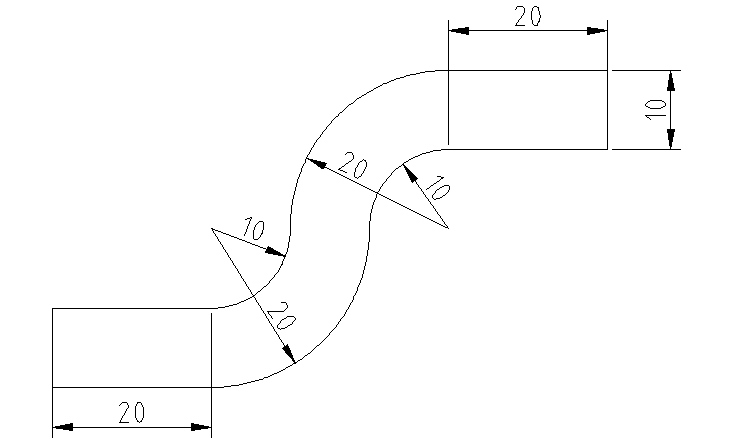
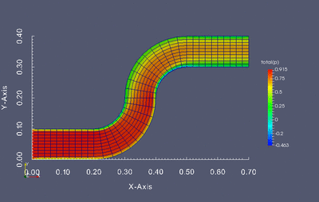
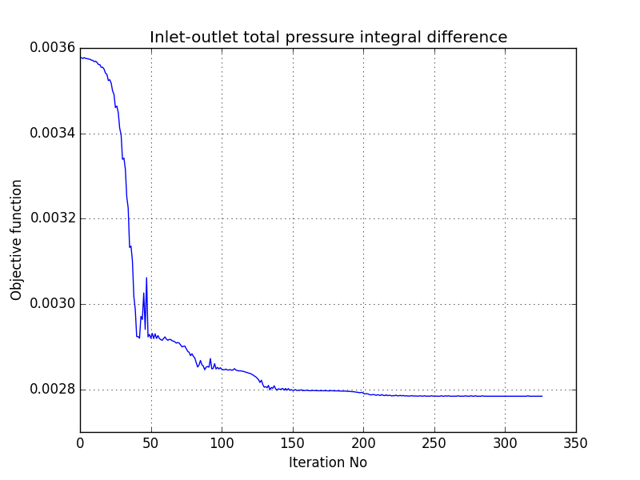

# Wprowadzenie

## Tworzenie własnych klas

## Uruchamianie zewnętrznych procesów

## Konsola "ipython"

## Tworzenie własnych generatorów

## Tworzenie własnych modułów

# Instalacja OpenFOAM i ParaView

Do rozwiązania poniższego zadania będzie wymagane zainstalowanie aplikacji OpenFOAM. OpenFOAM jest zbiorem różnych solverów opensource, które pozwalają na rozwiązywanie zagadnień obliczeniowej mechaniki płynów. W przypadku naszego zadania będzie on zastosowany do tworzenia siatki i wykonania obliczeń przepływu 2D, których wynik będzie następnie przez nas wykorzystany do utworzenia optymalizacji. Instalacja OpenFOAM z pakietów jest bardzo prosta. Opis instalacji można znaleźć pod [tym](http://openfoam.org/download/3-0-1-ubuntu/) linkiem. Poniżej opisujemy dokładnie te same kroki:

 - Należy na początek dodać repozytorium OpenFOAM do system, tak aby nasz system wiedział skąd ma pobrać aplikację. W tym celu w konsoli wpisujemy:
```bash
$ sudo add-apt-repository http://www.openfoam.org/download/ubuntu
```

- Oprócz dodania repozytorium musimy odświeżyć nasz manager pakietów:
```bash
$ sudo apt-get update
```

- Na koniec możemy już zainstalować samego OpenFOAMa
```bash
$ sudo apt-get install openfoam30
```

OpenFOAM domyślnie powinien zostać zainstalowany w lokalizacji "/opt/openfoam30".

Oprócz samego OpenFOAMa potrzebujemy także narzędzia do wykonywania postprocessingu. Świetnie nadaje się do tego narzędzie ParaView które domyślnie wspiera wczytywanie siatki i danych wygenerowanych przez OpenFOAMa.  Aplikację tą można zainstalować na dwa sposoby: 
Z repozytorium OpenFOAM (posiada dodatkowe wsparcie do danych OpenFOAMa):
```bash
$ sudo apt-get install paraviewopenfoam44
```

Drugim sposobem jest pobranie ParaView z [oficjalnego repozytorium](http://www.paraview.org/download/) - tutaj wystarczy pobrać archiwum i następnie je rozpakować. Zaletą tego podejścia jest pobranie najnowszej dostępnej wersji tego oprogramowania.  

# Zadanie

Dokonaj optymalizacji kształtu poniższej geometrii tak aby otrzymany profil kanału zapewniał najmniejszą stratę energii przepływu. Optymalizacji powinny podlegać jednie kolanka kanału, nie wlot i wylot.



Stratę przepływu można wyznaczyć jako różnicę ciśnienia całkowitego pomiędzy wlotem i wylotem. Twoim zadaniem jest napisanie skryptu w języku Python który będzie służył do modyfikacji siatki obliczeniowej, wczytywania wyników oraz uruchamiania kolejnych symulacji w pętli optymalizacyjnej. W związku z tym kod powinien realizować następujący zadania:

1. Utworzyć bazową siatkę obliczeniową.
2. Wczytywać i zapisywać współrzędne węzłów siatki obliczeniowej z formatu OpenFOAM
3. Wczytywać wyniki z pliku zawierającego obliczone całki z ciśnienia całkowitego na wlocie i wylocie domeny.
4. Uruchamiać symulację
5. Uruchamiać narzędzie ***minimize*** z biblioteki ***scipy.optimize*** w celu dokonania optymalizacji. 

Symulacją i tworzeniem siatki nie należy się przejmować, ponieważ zostały przygotowane specjalne funkcje służące do uruchamiania aplikacji OpenFOAM - znajudują się one w pliku "resources/lab4/of.py". Aby poprawnie działały te funkcje z poziomu środowiska PyCharm przed jego uruchomieniem należy dodać pewne ścieżki do pliku konfiguracji. W tym celu otwórz plik o nazwie ***pycharm.sh*** który znajduje się w folderze ***bin*** w miejscu w którym mamy zainstalowanego PyCharma, np.: "/home/wgryglas/Applications/pycharm/bin". 

W pliku tym przed:
```bash
# ---------------------------------------------------------------------
# Run the IDE.
# ---------------------------------------------------------------------
```
dodaj poniższe linijki:
```bash
export PYTHONPATH=<ParaView install path>/lib/paraview-4.3/site-packages:<ParaView install path>/lib/paraview-<PV version number>/site-packages/vtk:$PYTHONPATH
export LD_LIBRARY_PATH=<ParaView install path>/lib/paraview-<PV version number>:${LD_LIBRARY_PATH}
```
zastępując <ParaView install path> ścieżką do miejsca gdzie jest zainstalowany ParaView na twoim komputerze (sprawdź wpisując komendę ```which paraview```) oraz <PV version number> numerem wersji, np. 4.3 (odczytaj ze ścieżki wyświetlonej komendą ```which paraview```).

Powyższy krok może zostać pominięty, ale w tej sytuacji należało będzie zakomentować funkcje które służą do uruchamiania ParaView "w locie":

* view
* view2
* saveCurrentImage

Przed rozpoczęciem pracy musimy jeszcze przekopiować folder w którym znajdują się ustawienia OpenFOAMa(ustawienie takie, które zwyczajowo wykonuje się we Fluencie w oknie graficznym) oraz w którym będzie zapisana siatka obliczeniowa oraz wyniki. Folder do przekopiowania znajduje się w "/resources/lab4/channel_optimization". Powinien on zostać przekopiowany w dowolne miejsce, najlepiej gdzieś poza projektem PyCharm, ponieważ jest to folder symulacji a nie kodu python. 

Zadanie to rozwiąż na trzy różne sposoby, które będą różniły się metodą transformacji siatki.
#### przypadek a) - dwuparametryczna transformacja siatki

Dokonaj transformacji tak, że parametr określa jak mocno powinny zostać przesunięte węzły względem odległości od linii środkowej kolanka. Parametr dodatni powinien określać odsunięcie od środkowej linii, a ujemny przyciągnięcie do niej. Ponadto transformacja powinna zapewniać, że punkty na skraju kolanka nie zostaną wcale przesunięte (wartość odsunięcia powinna być uzależniona od np. kąta pomiędzy środkiem kolanka a punktem). 


 



 

