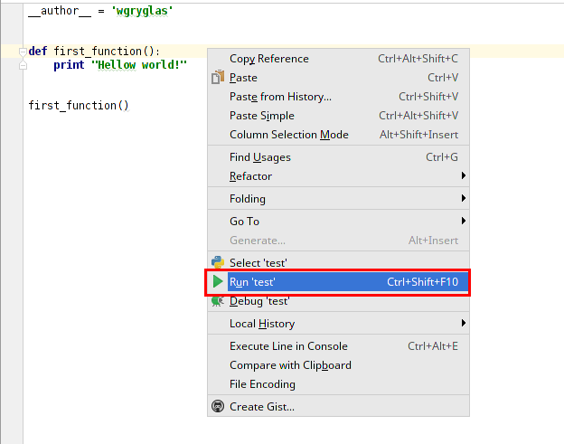
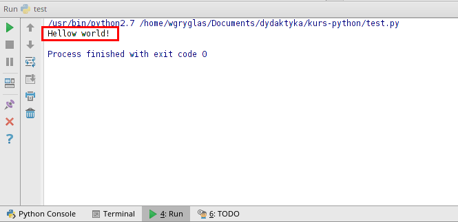
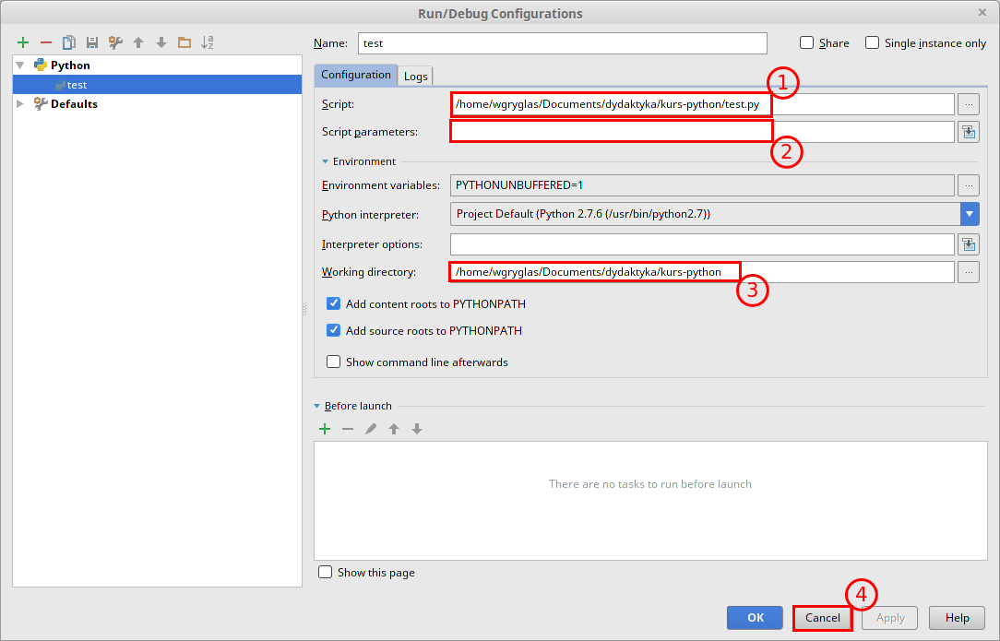
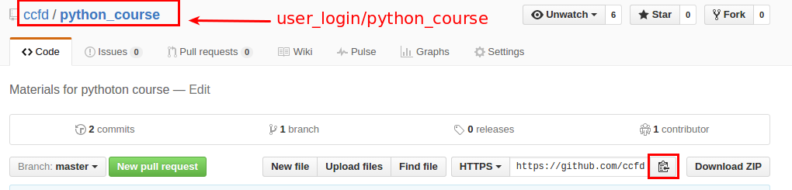
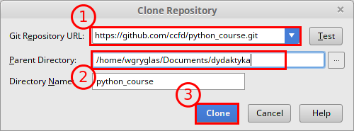
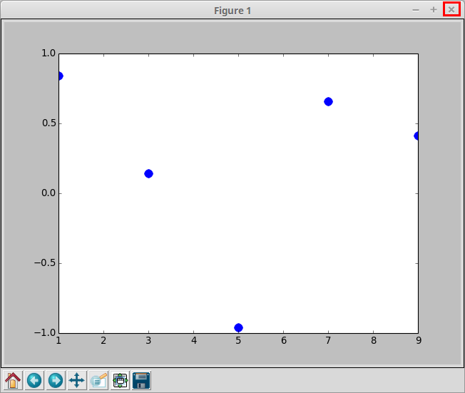
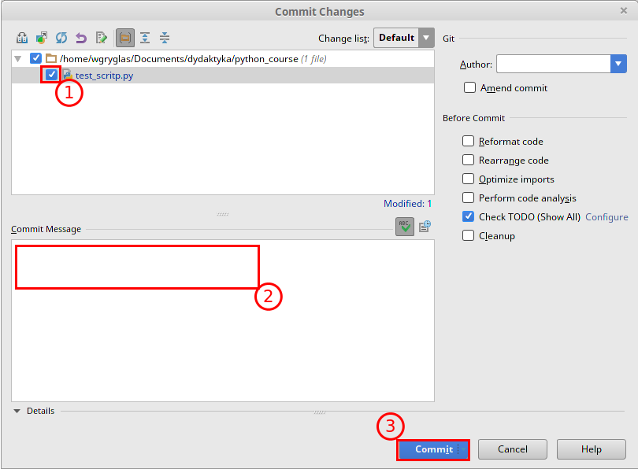
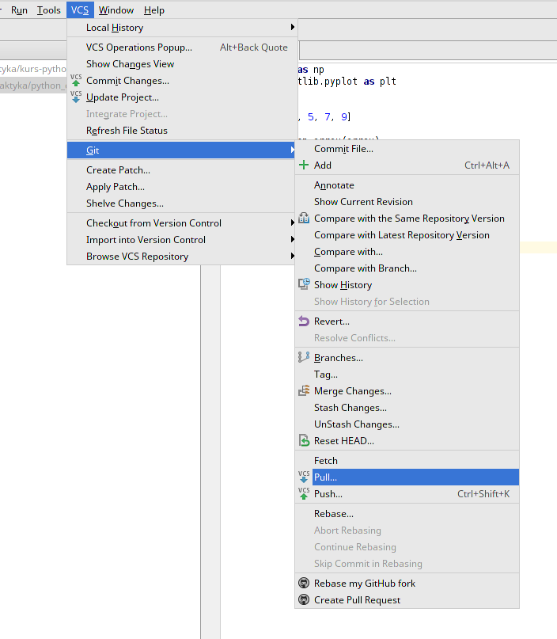

# Wymagania

- minimalna znajomość systemów z rodziny Linux,
- podstawowa znajomość programowania (język nie ma znaczenia).

# System operacyjny
Zalecane jest korzystanie z systemów z rodziny Linux, a w szczególności opartych na Debianie. Jednak pakiety pythona są przygotowane do instalacji również na systemy z rodziny Windows (instalacja dodatkowych pakietów za pomocą *pip*, o którym w dalszej części). W związku z tym istnieje możliwość pracy na takim systemie, jednak będzie się to wiązało z ograniczonym wsparciem prowadzących kurs.

# Kontrola wersji - git i GitHub
Narzędzia kontroli wersji są praktycznie niezbędne podczas pracy nad większym kodem, a przede wszystkim w sytuacji gdy nad jednym projektem współpracuje więcej osób. Pozwalają one na:

- śledzenie kolejnych zmian w kodzie, 
- usuwanie niepotrzebnych zmian, 
- tworzenie "podprojektów" w których pracuje się tylko nad częścią nowego kodu, 
- łączenie kodu różnych osób w obrębie nawet tego samego pliku.

Więcej informacji o tym czym właściwie jest kontrola wersji można przeczytać pod linkiem [git - wprowadzenie do kontroli wersji](https://git-scm.com/book/pl/v1/Pierwsze-kroki-Wprowadzenie-do-kontroli-wersji). W przypadku naszego kursu do kontroli wersji będziemy stosowali narzędzie zwane *git*, które zostało opracowane przez "ojca" systemów Linux Linusa Torwaldsa. Wielu programistów obsługuje go z poziomu konsoli. My jednak skupimy się tylko na podstawowych jego funkcjach i będziemy z gita korzystali tylko z poziomu środowiska programistycznego, o którym więcej powiemy dalej. Na poziomie naszego kursu system ten posłuży do pobierania materiałów oraz przechowywania własnych wersji rozwiązań zadań. Dzięki temu uczestnicy poznają podstawowe sposoby korzystania z gita.  

W ramach przygotowania do zajęć należy przejść na stronę [GitHub](https://github.com/) i zarejestrować własne konto w tym serwisie. Dzięki temu otrzymamy pewną darmową (wersja darmowa wymaga publicznego dostępu do zamieszczonego kodu) przestrzeń dyskową na której będziemy mogli przechowywać wszystkie niezbędne pliki potrzebne w naszym projekcie. Serwis GitHub sam w sobie nie jest potrzebny do działania git'a (możemy utworzyć lokalne repozytorium na własnym dysku), jednak potrzebujemy jakiegoś miejsca, najlepiej w sieci aby mieć dostęp do kodu z każdego miejsca, w którym będziemy mogli składować własne repozytorium z tworzonym kodem.

# Python
W czasie rozwoju języka *python* wykształciły się dwie jego wersje:

- *python 2*,
- *python 3* (nowsza specyfikacja języka, choć niekoniecznie częściej używana).

Oba standardy języka znacząco się nie różnią, jednak są one niekompatybilne pomiędzy sobą, w związku z czym na samym początku pracy należy się zdecydować na której wersji będziemy pracowali. Należy także pamiętać, że każdy nowo zainstalowana biblioteka będzie musiała pochodzić z repozytorium właściwego dla używanej wersji. W przypadku naszego kursu zajęcia będą prowadzone w oparciu o wersję drugą i wszystkie podane informacje odnośnie instalacji i pracy z językiem będą właściwe tylko dla standardu języka *python 2*. 

# Instalacja niezbędnych pakietów
W poniższym punkcie zostaną opisane metody instalacji podstawowych i dodatkowych pakietów (zbioru narzędzi przygotowanych i upublicznionych przez innych programistów). Dokładny opis zostanie ograniczony jedynie do dystrybucji opartych na systemie Debian. W przypadku innych systemów uczestnicy powinni samodzielnie zadbać o instalację odpowiednich narzędzi.

## Wymagane pakiety
Poniżej przedstawiamy zbiór pakietów które są najczęściej wykorzystywane podczas pracy. Podczas zajęć także będziemy korzystali  z tych narzędzi, dlatego należy je zainstalować przed rozpoczęciem kursu. 

###python-dev
podstawowe narzędzia języka python które są niezbędne do pracy i rozwoju kodu w tym języku.

###pip
Narzędzia do zarządzania pakietami pythona. Pozwala na automatyczne pobranie kodu z oficjalnego repozytorium *Python Package Index* (PyPI), kompilację i instalację wybranego pakietu. Korzystając z *pip* możemy pobrać dowolną wersję danego pakietu, co jest najczęściej niemożliwe w przypadku innych metod instalacji pakietów. Ponadto często nowsze pakiety są dostępne jedynie za pośrednictwem tej platformy.

###numpy
Pakiet zawierający rozszerzenie tablic wielowymiarowych, który pozwala na wygodny dostęp do danych oraz na operacji na nich. Zawiera także wiele własnych funkcji do obliczeń naukowych, które jednak są ograniczone w porównaniu do pakietu *scipy* o którym dalej. 

###matplotlib
Zbiór narzędzi służących do tworzenia wykresów przeróżnego typu, takich jak:

- proste jedno wymiarowe,
- różne wykresy statystyczne,
- wykresy konturowe,
- wykresy trój wymiarowe.

###scipy 
Biblioteka zawierająca szeroki zbiór narzędzi do obliczeń naukowych . Nazwa *SciPy* może odnosić się do całego zbioru bibliotek (numpy, matplotlib, scipy, sympy, pandas). Jednak sam pakiet o nazwie  *scipy* zawiera tylko narzędzia obliczeniowe. Pakiet *scipy* posiada wiele funkcji o tym samym zastosowaniu co *numpy*. Duplikacja tych narzędzi wynika z tego, że *scipy* jest w dużej części opakowaniem implementacji w języku Fortran (które są bardzo wydajne) a *numpy* jest przygotowane tak, aby możliwa była jego instalacja także bez kompilatora Fortran. Jednak *scipy* zawiera dużo więcej i w dodatku nowszych narzędzi niż *numpy*.

###sympy
Pakiet pozwalający na dokonywanie obliczeń symbolicznych. 

###pandas
Biblioteka służąca do obróbki i analizy danych. W szczególności wprowadza wygodne struktury danych i operacje do ich obróbki. Biblioteka ta znajduje świetne zastosowanie w analizie statystycznej. Dane mogą być reprezentowane jako ciągi czasowe lub tablice z dodatkowymi nazwami wierszy i kolumn.


## Instalacja - Linux (dystrybucje Debian)
### Podstawowe narzędzia
Większość systemów posiada domyślnie zainstalowane podstawowe pakiety języka python. Jednak, aby się upewnić, że je posiadamy możemy po prostu spróbować je zainstalować. Na początek 2 podstawowe i najważniejsze pakiety. Otwieramy konsolę a w niej wpisujemy następujące komendy (Uwaga komenda `sudo`{.bash} oznacza uruchomienie zadania jako administrator co będzie wymagało podania hasła):
```bash
sudo apt-get install python-dev
sudo apt-get install python-pip
```
Po dokonaniu instalacji *python-pip* uzyskujemy dostęp do managera pakietów pythona z oficjalnego repozytorium PyPI. Z kolei instalacja pakietów za pomocą *apt-get* dostarcza tylko te pakiety które znajdują się w repozytorium wydawcy danego systemu (np. Ubuntu Repository) i na ogół są one dość ograniczone i zawierają tylko najnowsze wersje pakietów. Pakiety dostarczane za pomocą *apt-get* są wcześniej skompilowane dzięki czemu proces instalacji jest znacznie krótszy, ale nie zawsze jest to lepsze rozwiązanie.

### Dodatkowe pakiety
Aby zainstalować dodatkowe możemy skorzystać z repozytorium *PyPI* lub z repozytorium wydawcy systemu. W obu przypadkach aby zainstalować wszystkie biblioteki możemy w linii poleceń podać więcej niż jedną nazwę pakietu. Na obecnym etapie kursu będziemy potrzebowali tylko 3 dodatkowych pakietów:

- *apt-get*
`sudo apt-get install python-numpy python-scipy python-matplotlib python-pandas`{.bash}
- *pip*
`sudo pip install numpy scipy matplotlib pandas`{.bash}

### Instalacja git
W przypadku systemów Linux większość dystrybucji posiada zainstalowane to narzędzie domyślnie. Aby sprawdzić czy pakiet jest zainstalowany możemy w konsoli wpisać:
```bash
git --version
```
Jeśli w konsoli zostanie wyświetlona wersja, to znaczy, że posiadamy ten program i nie trzeba go instalować. Jeśli w danej dystrybucji nie znajduje się zainstalowany git to należy go doinstalować komendą:
```bash
sudo apt-get install git-all
```

## Instalacja - Windows
### Podstawowe narzędzia
Osoby zainteresowane instalacją na tym systemie odsyłamy do poniższego linku [Windows Installers](https://www.python.org/downloads/windows/) skąd można pobrać i zainstalować podstawowe narzędzia pythona (w przypadku naszego kursu należy wybrać wersję 2.x.x). 
### Dodatkowe pakiety
Dodatkowe pakiety można zainstalować z poziomu linii komend. Jednak przed uczynieniem tego należy dodać ścieżkę do folderu zawierającego skrypty pythona (np. C:\\Python27\\Scripts) do zmiennej środowiskowej PATH (Uwaga: pod edycji zmiennej środowiskowej może być wymagane ponowne uruchomienie systemu). Następnie należy otworzyć konsolę i wywołać instalację za pomocą *pip*:
```bat
pip install numpy scipy matplotlib pandas
```
### git
W przypadku systemów Windows program ten musi zostać zainstalowany oddzielnie, instrukcje dotyczące instalacji można znaleźć tutaj [git - intalacja Windows](https://git-scm.com/book/pl/v1/Pierwsze-kroki-Instalacja-Git#Instalacja-w-systemie-Windows). 


# Środowisko graficzne
Do wygodnej pracy przy pisaniu kodu posłużymy się zintegrowanym środowiskiem programistycznym (IDE) o nazwie PyCharm Community Edition (pochodzącym od firmy JetBrains). Środowisko to pozwoli na zarządzanie plikami, kolorowanie składni kodu oraz podpowiedzi do aktualnie edytowanego miejsca w kodzie. Ponadto środowisko to ma wbudowaną obsługę systemu kontroli wersji. 

## Instalacja
Aby zainstalować PyCharm na systemie Linux wystarczy pobrać odpowiedni plik i rozpakować do dowolnie wybranego miejsca na dysku. Spakowaną aplikację można pobrać ze strony [PyCharm - Linux](https://www.jetbrains.com/pycharm/download/#section=linux). Po zapisaniu pliku na dysku możemy go rozpakować komendą:
```bash
tar xfz <sciezka do sciagnietego pliku> -C <sciezka do miejsca gdzie rozpakowac>
``` 
Po rozpakowaniu za pierwszym razem musimy uruchomić program z konsoli (po pierwszym uruchomieniu program doda skróty do systemu):
```bash
<sciezka do rozpakowanego folderu>/bin/pycharm.sh
``` 
Po wywołaniu tej komendy program powinien się uruchomić. Przy pierwszym uruchomieniu program wyświetli okno konfiguracji w który należało będzie ustawić własne preferencje. 

## Początek pracy w PyCharm









## Własne repozytorium w sieci i git w PyCharm
















