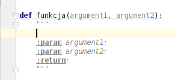
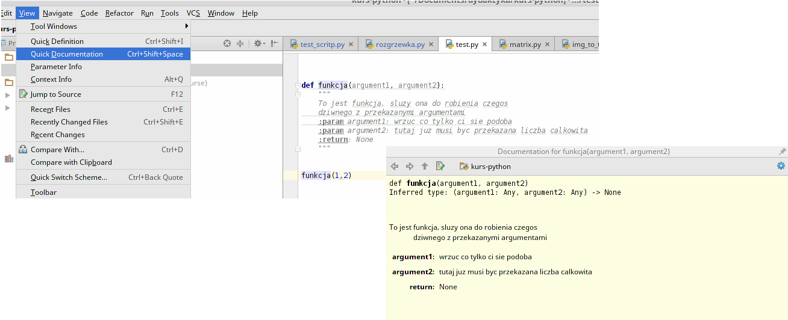

# Wprowadzenie

## Kilka słów o Pythonie 
Python jest **dynamicznie typowanym** i **interpretowanym** (w szczególnych przypadkach kompilowanym) językiem. Dynamiczne typowanie oznacza, że jakakolwiek zmienna (globalna czy lokalna w funkcji) nie posiada przypisanego typu. Dzięki temu kod jest bardzo krótki, elastyczny oraz jest pozbawiony sprawdzania typów na poziomie kompilacji, co znacząco skraca czas potrzebny od wprowadzenia zmian do uruchomienia kodu. Typ zmiennej jest sprawdzany dopiero w momencie wykonywania instrukcji, czyli jej konkretnego użycia. Dowolna zmienna staje się, np. integerem, w momencie gdy do niej przypiszemy wartość:

```python
a = 5
```

W powyższym przykładzie nie został przypisany żaden typ do zmiennej "a",  tylko konkretna wartość 5 która automatycznie informuje, że "a" od tej pory będzie integerem. Dynamiczne typowanie pozwala także na przypisanie innego typu do tej samej zmiennej, tzn.:

```python
a = 5 # zmienna jest typu integer
a = 5. # a teraz jest typu float
a = "jakis text" # i na koniec typu string
```

Podobnie ma się sytuacja z funkcjami - nie trzeba deklarować typu argumentu, wystarczy że przekazaną wartość będzie dało się zastosować do instrukcji znajdujących się wewnątrz funkcji. Na przykład do funkcji:

```python
def funkcja(argument1):
	a = argument1[3]
	return a

print funkcja([1, 2, 3, 4]) # wyswietli sie liczba 4
print funkcja("to jest string") #wyswietli sie znak "j"
```

można bez problemu przekazać zarówno listę jak i string, ponieważ oba te typy obsługują operator "[ ]". Ważne jest jedynie, aby dało się wykonać wszystkie instrukcje znajdujące się wewnątrz funkcji, a nie ma znaczenia to czy przekazana jest lista, string czy jakikolwiek inny typ. 

Pythona na ogół należy postrzegać jako język **interpretowany**, ponieważ w taki sposób zazwyczaj będziemy uruchamiać kod. Język interpretowany to taki, w którym nie dokonuje się kompilacji całości kodu na raz(przetwarzania kodu z języka w miarę łatwo zrozumiałego dla człowiek do kodu w postaci instrukcji przesyłanych do procesora). Kod w tym przypadku jest "kompilowany" w czasie jego wykonywania. Oznacza to, że w następna linijka naszego kodu zostanie "skompilowana" dopiero w momencie gdy skończy się wywoływać poprzednia instrukcja. Z językiem interpretowanym spotykamy się bardzo często, ponieważ jest nim "bash" - język obsługujący powłokę systemową Linuxa. Dlatego też wiele podobnych cech będzie widocznych  w języku Python, jednak jest on dużo bardziej wygodny i naturalny w użytkowaniu. Oprócz swobody pisania kodu chyba najważniejszą zaletą Pythona jest właśnie czas od zapisania kodu do jego uruchomienia. Z racji tego że kod jest "kompilowany w locie" program uruchamia się błyskawicznie, co w przypadku dużych kodów w języku C/C++ bywa bardzo uciążliwe.


## Kod i jego uruchamianie

Kod Pythona może być pisany i uruchamiany w dwóch trybach:

- interaktywnym,
- wsadowym.

Praca interaktywna z kodem sprowadza się do uruchomienia konsoli języka Python w której kod jest wykonywany po jego zatwierdzeniu klawiszem Enter. Aby uruchomić konsolę Pythona wystarczy z poziomu konsoli systemowej uruchomić aplikację "python": 
```bash
$ python
```
Po tej operacji środowisko konsoli systemowej zamieni się w środowisko konsoli Pythona i każda linijka będzie zaczynała się od znaku ***>>>***:

```bash
Python 2.7.6 (default, Jun 22 2015, 17:58:13) 
[GCC 4.8.2] on linux2
Type "help", "copyright", "credits" or "license" for more information.
>>> 
```
Od tego momentu możemy pisać i od razu uruchamiać kolejne instrukcje, np.:
 
```bash
>>> a=5
>>> b=5
>>> print a+b
10
>>> 
```
W trybie konsolowym można także definiować wieloliniowe instrukcje takie jak funkcje lub pętle. Dzięki temu, że każde takie wyrażenie kończy się znakiem ":",  to po naciśnięciu klawisza ***Enter***  środowisko automatycznie przechodzi w tryb wieloliniowy:
```bash
>>> def funkcja_suma(a, b):
...     c = a + b
...     return c
... 
>>>
```
W powyższym przykładzie znak ***>>>*** został zamieniony na ***...*** który oznacza kolejne linie. Należy tutaj pamiętać, że ciała funkcji są zawsze przesunięte o jedną tabulację, w związku z czym w konsoli po znaku ***...*** także należy dodać jedną tabulację. W momencie gdy uznamy, że ciało funkcji należy zakończyć, to wystarczy wcisnąć ***Enter*** w linijce niezawierającej tabulacji, co zakończy definicję funkcji i konsola powróci do znaku ***>>>***. 

Na koniec, aby opuścić tryb konsolowy wystarczy wywołać funkcję ***exit*** lub w przypadku systemów Linux można także użyć skrótu ***CTRL+d***:
```bash
>>> print a+b
>>> exit()
$
```

Interaktywna konsola Pythona jest bardzo użyteczna w przypadku gdy chcemy zrobić jakąś prostą operację, np. obliczyć proste wyrażenie matematyczne bądź  chcemy wykonać prostą operację na zbiorze plików. 

Przejdźmy teraz do drugiego trybu - wsadowego.  Ten tryb pozwala na uruchamianie kodu znajdującego się w pliku. Kod napisany w języku Python powinien zostać umieszczony w pliku o rozszerzeniu ***.py*** i każdy taki plik nazywany jest modułem (więcej o modułach się dalej). Aby uruchomić wybrany plik wystarczy przekazać ścieżkę do pliku do interpretera Pythona:
```bash
$ python /home/uzytkownik/nazwa_pliku.py
```
Można także pominąć interpreter przy wywołaniu i uruchamiać skrypt ta jak zwykłą aplikację. W takiej sytuacji trzeba dodać do pliku komentarz który poinformuje system który interpreter powinien być użyty do uruchomienia pliku

```python
#!/bin/usr/python

... kod pythona ...
... kod pythona ...
```

Oprócz linijki ***#!/bin/usr/python*** należy także zezwolić na uruchamianie pliku na poziomie systemu:

```bash
$ chmod a+x sciezka/do/pliku.py #zmiana uprawnień 
$ sciezka/do/pliku.py #uruchomienie programu
```
Powyższa metoda działa dokładnie tak samo jak w przypadku skryptów ***bash***, gdzie w miejscu ścieżki korzystamy zazwyczaj z */bin/bash*.

## Moduły
Każdy pojedynczy plik napisany w języku Python nazywany jest modułem. Każdy z modułów może być uruchamiany wprost (tak jak to zostało wcześniej opisane) lub zostać użyty w innym module. W tej sytuacji można w drugim module korzystać z funkcji, klas i zmiennych zawartych w pierwszym. Jednak aby skorzystać z funkcji należy odwołać się nie do samej nazwy np. funkcji, ale należy poprzedzić ją nazwą modułu (pliku):

```python
#wywołanie funkcji z innego modułu:
nazwapliku.nazwafunkcji()
```
Dzięki temu nazwy funkcji mogą być takie same w różnych plikach i nie powstanie konflikt. Każdy moduł stanowi swego rodzaju przestrzeń nazw wewnątrz której nazwy elementów języka nie mogą się powtarzać. Moduły rozpinają się nie tylko na pliki, ale także na struktury folderów. Jeśli plik znajduje się wewnątrz folderu o nazwie *folder2*, który z kolei znajduje w folderze *folder1*, to odwołanie do funkcji będzie miało następującą postać:

```python
folder1.folder2.nazwapliku.nazwafunkcji()
```

## Komentarze w plikach źródłowych

Jednym z najczęściej używanych elementów każdego języka są komentarze, które pozwalają na chwilowe wyłączenie kodu bądź dodanie notatki na temat danej instrukcji. W języku python w odróżnieniu od C/C++ komentować można tylko linię za pomocą znaku ***#***

```python
# To jest komentarz, a poniżej zwykły kod
a = 5
```

Jeśli chcemy dodać komentarz do kilku linii tekstu to niestety należy znak ***#*** umieścić na początku każdej z linii:
```python
# linia 1 komentarza
# linia 2 komentarza
a = 5
```
Może być to mało wygodne, jednak w praktyce, gdy korzystamy ze środowiska graficznego PyCharm wystarczy posłużyć się odpowiednim skrótem klawiszowym. Na przykład, gdy chcemy zamienić linijkę w której znajduje się nasz kursor to wystarczy wcisnąć na klawiaturze kombinację  ***CTRL + /***

 

Z kolei jeśli chcemy zamienić blok kodu na komentarz to należy go zaznaczyć a następnie ponownie skorzystać z kombinacji ***CTRL + /***

 

Aby odkomentować ten sam blok tekstu wystarczy znów go zaznaczyć i użyć kombinacji ***CTRL + /***.

Oprócz zwykłych komentarzy specyfikacja języka python przewiduje dodatkowy rodzaj komentarza, który jest automatycznie uznawany za dokumentację. Tekst dokumentacji powinien znaleźć się w pomiędzy znacznikami początku i końca. Jako znaczniki stosuje się trzykrotny znak cudzysłowu.  Dokumentacja powinna znaleźć się tuż pod deklaracją dokumentowanego narzędzia, np. funkcji:

```python
def funkcja(arg1, arg2):
	"""
	To jest funkcja, sluzy ona do robienia czegos 
	dziwnego z przekazanymi argumentami
	"""
	# kod zawierajacy cialo funkcji
	pass
```

Środowisko PyCharm w przypadku dokumentacji jest także bardzo pomocne. Jeśli chcemy dodać taki rodzaj dokumentacji funkcji, wystarczy tuż pod jej nazwą dodać trzy znaki cudzysłowu i nacisnąć klawisz ***Enter*** a program automatycznie wygeneruje ciało dokumentacji w następującej postaci



Jak widać na powyższym rysunku PyCharm wygenerował dodatkowe elementy które wypada umieścić w dokumentacji. Tuż za znakami cudzysłowów została pozostawiona wolna linia w której należy umieścić opis funkcji, tzn. do czego służy i ewentualnie jaki algorytm implementuje. Oprócz tego PyCharm umieścił informację o argumentach funkcji:

- ***param: argument1:***  należy dopisać informację jaki obiekt powinien być przekazane jako pierwszy argument
- ***param: argument1:***  należy dopisać informację jaki obiekt powinien być przekazane jako drugi argument
- ***return:***  należy dodać informację jaki obiekt jest zwracany z funkcji. W przypadku gdy funkcja nie powinna zwracać argumentów zwyczajowo podaje się  "None" które oznacza, że funkcja nic nie zwraca. 

Czasami programiści umieszczają pod argumentami dodatkowo przykład zastosowania funkcji.

Gdy już przygotujemy tak udokumentowaną funkcję, to możemy w środowisku PyCharm skorzystać z opcji "Quick Documentation" która wyświetla w dodatkowym oknie podpowiedzi to co zapisaliśmy lub ktoś inny udokumentował. Aby wyświetlić taką dokumentację należy postawić kursor na nazwie funkcji (w miejscu w którym chcemy z niej skorzystać) a następnie z górnego menu wybrać ***View/Quick Documentation***



Dokumentacja kodu w języku python jest szczególnie ważna z uwagi na brak typów obiektów. Jeśli chcemy aby argument przekazany do funkcji był liczbą całkowitą, to nie możemy tego powiedzieć użytkownikowi za pomocą deklaracji funkcji (deklaracja zawiera tylko nazwy przekazanych zmiennych, nie ma typu) i musimy to zrobić za pośrednictwem dokumentacji. 

## Polskie znaki diakrytyczne
W sytuacji gdy w komentarzach zostaną umieszczone polskie znaki diakrytyczne kod znajdujący się w danym pliku może nie uda się uruchomić. Wynika to z tego, że python używa domyślnego kodowania ASCII nieobsługującego tego typu znaków. Jeśli jednak chcemy używać polskich znaków, to na początku pliku należy wstawić następujący komentarz
```python
# coding=utf-8
```
Ta linijka wymusi na interpreterze skorzystanie z innego dekodera.

## Zmienne
O zmiennych już wcześniej wspominaliśmy, teraz uzupełnimy te informacje. Najważniejsza cecha zmiennych to brak typu, z czym wiąże sie kilka cech. Po pierwsze typ zmiennej jest taki jak typ wprowadzonej wartości. Może być to jednak problematyczne, gdy chcemy wykonać operację (np. dzielenie) na konkretnie wybranym typie:

```python
def oblicz(a,b):
	return (a - b)/a
print oblicz(2, 1)
```
W wyniku działanie tej funkcji, zobaczymy 0, ponieważ funkcja została wywołana dla zmiennych integer. W tej sytuacji można problem rozwiązać przekazując poprawne wartości:
```python
print oblicz(2., 1.)
```
Można także rozwiązać ten problem w bardziej ogólny sposób, za pomocą funkcji konwertującej do odpowiedniego typu, np. ***float(...)*** :

```python
def oblicz(a,b):
	return float(a - b)/a
print oblicz(2, 1)
```
Ponadto funkcje te potrafią konwertować string do wybranego typu, dlatego powyżej zdefiniowana funkcja zadziała i w takiej sytuacji:

```python
def oblicz(a,b):
	a = float(a)
	b = float(b)
	return (a - b)/a
a = "2"
print oblicz(a, "1")
```
Zmienne mogą być nazywane dowolnie, nawet tak samo jak funkcje wcześniej zaimportowane. W tej sytuacji obiekt "funkcja" zostanie zastąpiony inną wartością, przez co nie będziemy już mieli możliwości użyć funkcji. Sprawdź działanie następującego kodu:

```python
def moja_funkcja():
	return 5
moja_funkcja=3
moja_funkcja()
```
Ta cecha języka może być jednak problematyczna, ponieważ wprowadza potencjalne błędy które trudno zlokalizować. O ile pisząc własne funkcje łatwo zauważyć taki problem, to w przypadku wbudowanych funkcji (zawsze dostępnych) takich jak ***list*** lub ***len*** jest to trudniejsze i trzeba na to uważać.

## Własne funkcje
Już kilkukrotnie pokazywaliśmy jak wyglądają funkcje w języku Python. Teraz uzupełnimy tę wiedzę o 2 przydatne cechy. W Pythonie funkcjami można operować podobnie do zmiennych, ponieważ one są w rzeczywistości obiektami. Dzięki temu, można dowolnie zmieniać nazwę funkcji, bądź przypisywać im inne. Sprawdź poniższy kod:

```python
def funkcja1():
	print "Hellow"

funkcja2 = funkcja1
funkcja1()
funkcja2()
```
Oraz działanie tego:
```python
def suma(a, b):
	return a + b
def roznica(a, b):
	return a - b
suma = roznica
print suma(5, 2)
```
Druga bardzo ważna sprawa związana z funkcjami to przekazywanie jednej funkcji do drugiej. Z racji tego, że Python jest dynamicznie typowany to przekazanie funkcji do funkcji jest tak proste jak przekazanie argumentu. Czy wewnątrz funkcji zostanie ona użyta poprawnie dowiemy się dopiero w momencie uruchomienia kodu. Sprawdź poniższy przykład, który oblicza całkę metodą trapezów:

```python
def calka(fun, a, b):
	dx = (b - a) / 99
	Int = 0
   for i in range(100):
		Int += (fun(i*dx) + fun((i+1)*dx))/2*dx
	return Int

def x_kwadrat(x):
	return x**2

print "Calka =", calka(x_kwadrat, 0., 10.)
```

## Podstawowe wbudowane funkcje
Do tej pory pokazaliśmy, jak wygląda definicja własnych funkcji. Python posiada jednak kilka podstawowych funkcji, które są zawsze dostępne i możemy z nich korzystać w dowolnym miejscu kodu. Należą do nich np.:  ***print, float, int, str, len, range, dict, list***. Funkcje ***float, int, str*** służą do konwersji do danego typu. Następne funkcje zostaną wyjaśnione w dalszej części gdzie będziemy opisywali ich praktyczne zastosowanie. 

## Listy
Jednym z najważniejszych elementów każdego języka jest kontener do przechowywania zbioru danych. W języku Python takim podstawowym typem jest lista, która może przechowywać elementy dowolnego typu, tzn. może przechowywać zarówno int jak i string w obrębie jednej listy. Ponadto listy są modyfikowalne, co oznacza, że do listy można dopisywać nowe elementy albo usuwać już znajdujące się w niej. 

Pustą listę można utworzyć na 2 sposoby:
- Za pomocą wbudowanej funkcji ***list***:
```python
aList = list()
```
- Za pomocą nawiasów kwadratowych []
```python
aList = []
```
Puste listy są mało przydatne, dlatego wykorzystując nawiasy [] można zadeklarować listę od razu wypełnioną:
```python
aList = [1, 2, 3, 5]
```
Lista nie musi składać się z elementów tego samego typu:
```python
aList = [1, "dwa", 3. , 5]
```
Wiemy już jak umieszczać elementy, a jak je się pobiera? Tak samo jak w innych językach, używając nawiasów []. Należy jednak pamiętać, że listy są indeksowane o 0:

```python
aList = [1, "dwa", 3. , 5]
print aList[0]  # >> 1
print aList[1]  # >> "dwa"
print aList[0] + aList[3] # >> 6
```
Aby sprawdzić rozmiar listy korzysta się z wbudowanej funkcji ***len***:
```python
aList = [1, "dwa", 3. , 5]
print "Dlugosc listy =", len(aList)
```

### Metody należące do klasy list
Lista tak jak wszystkie zmienne jest obiektem, w związku z tym posiada przypisane do siebie funkcje, które operują na liście, na której zostały wywołane (funkcje takie nazywane są metodami i wywołuje się je podając jej nazwę tuż po nazwie listy, np. nazwaListy.nazwaFunkcji()) . Do tych funkcji należą:
- nazwaListy.append(element) - metoda dodaje element na koniec listy, np.:
```python
aList = [1,2]
aList.append(5)
print aList # >> [1, 2, 5]
```
- nazwaListy.insert(indeks, element) - metoda wstawia element w dokładnej pozycji
```python
aList = [1, 2]
aList.insert(1, "cos")
print aList # >> [1, "cos", 2]
```
- nazwaListy.remove(element) - metoda usuwa wskazany element z listy (podajemy wartość elementu, nie indeks),

- nazwaListy.sort() - sortuje listę,
- nazwaListy.reverse() - odwraca kolejność elementów w liście
```python
aList = [1,'cos',2]
aList.reverse()
print aList # >> [2, 'cos', 1]
```
- list.index(element) - zwraca numer elementu, np.:
```python
aList = [1,'cos',2]
print aList.index('cos') # >> wyswietli sie 1
```

Oprócz tych funkcji dla zmiennych typu list został dodatkowo przeciążony operator ***+***. W kontekście użycia zmiennych typu list operator ten łączy 2 listy ze sobą:
```python
aList= [1,2,3]
bList = [3,2,1]
print aList + bList # >> [1, 2, 3, 3, 2, 1]
```
Można także użyć operatora ***+=*** zamiast metody ***append*** co spowoduje dodanie wszystkich elementów z jednej listy po prawej stronie do listy po lewej stronie operatora:

```python
aList= [1,2,3]
aList += [3,2,1]
print aList # >> [1, 2, 3, 3, 2, 1]
```


### Słowo kluczowe "in" w kontekście list
Język Python w specjalny sposób wspiera sprawdzanie czy element znajduje się w liście. Do tego służy słowo kluczowe ***in***. Przeanalizujmy następujący kod:
```python
aList = [1, 'cos', 2]
isInList = 'cos' in aList
print isInList # >> True
print 5 in aList # >> False

if 'cos' in aList:
	print 'cos is in the aList'
```
Wyrażenie  *element* ***in*** *lista* zwraca wartość logiczną True/False. 

### Pętla "for" i generator "range"
Jednym z najważniejszy elementów języków programowania są pętle. W przypadku Pythona pętla ***for*** różni się swojego odpowiednika w języku C/C++. W języku C aby pobrać z tablicy kolejne elementy piszemy:
```c++
float[] aList = {1,2,3,4};
float sum = 0;
for(int i=0; i<4; ++i)
{
		sum += aList[i];
}
```
Widać powyżej, że aby pobrać kolejne elementy z tablicy trzeba w pętli przesuwać indeks elementu i za każdym razem pobierać wartość z tablicy. Taka konstrukcja pętli jest bardzo często używana, dlatego w języku Python pętla for została sformułowana w następujący sposób:
```python
aList = [1, 2, 3, 4]
sum = 0
for a in aList:
	sum += a
```
Pętla ***for*** tutaj ma konstrukcję następującą:
```python
for elementListy in nazwaListy:
	... instrukcje operujace na kolejnych elementach z listy ...
```
Widzimy, że w Pythonie nie operujemy za pomocą indeksów, tylko od razu za pomocą kolejnych elementów z listy. Zmienna "elementListy" w każdym wywołaniu pętli przyjmuje kolejne wartości z listy. 

Niestety, czasami przydaje się korzystanie z indeksów, np. gdy chcemy wykonać jakąś operację pewną ilość razy bez korzystania z listy.  Niestety w takiej sytuacji Python wymaga czegoś, co będzie zawierało te indeksy:
```python
indeksy = [0, 1, 2, 3, 4, 5, 6]
for i in indeksy:
	print i
```
W takiej sytuacji uciążliwe by było tworzenie takiej listy, dlatego można spodziewać się, że istnieje jakaś funkcje służąca do tego. I faktycznie, istniej i nazywa się ***range***. Funkcja ta zwraca kolejne indeksy:
```python
for i in ragne(7):
	print i
```
Musimy tutaj wyjaśnić pewną rzecz. Funkcja ***range*** nie zwraca w rzeczywistości listy, tylko tzw. ***generator***. Generator różni się tym od listy tym, że nie przechowuje elementów tylko generuje je na zapytanie o kolejny element. Dlatego nawet w przypadku gdy użyjemy funkcji ***range*** z bardzo dużą liczbą, to pamięć nie zostanie zajęta. Funkcja ***range*** może przyjmować kilka argumentów:
1. Koniec zakresu - ```range(10)``` wygeneruje liczby od 0 do 9. Koniec zakresu określa największą liczbę całkowitą która już nie powinna być wygenerowana. Taka konstrukcja jest dopasowana do indeksowania od 0.
2. Początek i koniec zakresu - ```range(2,8)``` wygeneruje liczby od 2 do 7. 
3. Początek, koniec i krok - ```range(2, 20, 3)``` wygeneruje  liczby [2, 5, 8, 11, 14, 12, 5, 8, 11, 14, 17] czyli od 2 do 20 co 3. 

### Wycinki list
Często w trakcie pracy z listami okazuje się, że chcemy pracować nie na całej liście, lecz tylko na jej części. Do takich zadań bardzo przydatne są "wycinki" list, które pozwalają na pobranie np. 5 pierwszych elementów. Do tego służy znak "***:***"
```python
aList = [1, 2, 5, 8, 4, 54, 12, 11]
print aList[:5] # >> wyswietli  5 pierwszych elementow [1,2,5,8,4]
print aList[5:] # >> wyswietli elementy od 5 do końca [54,12,11]
```
Można także łączyć oba zakresy

```python
print aList[2:6] # >> wyswietli  5, 8, 4, 54
```
Ponadto można zdefiniować krok pomiędzy indeksami, np. co drugi element:

```python
print aList[::2] # >> wyswietli [1, 5, 4, 12]

print aList[:5:2] # >>  wyswiteli [1, 5, 4]
```

Ostatnia metoda dostępu do elementów to wykorzystanie ujemnego indeksu, który zwraca elementy licząc od końca, tj.: 

```python
print aList[-1] # >> wyswietli ostatni element 11
print aList[-3] # >> wyswietli trzeci od końca 54
```

Wycinki list działają praktycznie tak jak listy, tzn. można korzystać z nich w pętli for, np.:
```python
sum = 0
for elmnt in aList[:5]:
	sum += elmnt 
	print sum
```
lub przypisywać wartość do cześci elementów:
```python
aList[:3] = [100, 101, 102]
print aList # >> wyswietli [100, 101, 102, 8, 4, 54, 12, 11]
```
W dalszej części przedstawimy bibliotekę NumPy która obsługuje typ "array", dla którego wycinki pozwalają na jeszcze większą swobodę. 

### Listy wielowymiarowe

Jak łatwo się domyślić listy wielowymiarowe to są po prostu listy przechowujące jako elementy kolejne listy. Aby stworzyć taką listę możemy po prostu skorzystać inicjalizacji [...], gdzie elementami będą kolejne listy:
```python
lista2D = [ [1,2], [2,3] ]

print "Element 0,0 =", lista2D[0][0] # >> wyswietli 1
print "Element 0,1 =", lista2D[0][1] # >> wyswietli 2
```

Listy wielowymiarowe zazwyczaj są potrzebne do przechowywania danych w postaci liczb (np. jako reprezentacja macierzy). W takiej sytuacji typ lista nie jest najlepszym kontenerem, ponieważ czas dostępu do zmiennych może się wydłużać. Do tego typu operacji najlepiej jest skorzystać z tablic pochodzących z biblioteki NumPy, która domyślnie obsługuje tablice wielowymiarowe i robi to bardzo efektywnie, ale o tym dalej. 

### Zaawansowana inicjalizacja

Poprzednio pokazaliśmy, że listę można inicjalizować wartościami wpisanymi w prost pomiędzy nawiasami [...]. Jednak ta metoda jest dość ograniczona, ponieważ explicite trudno wypełnić taką listę zbiorem np. 100 liczb. W takiej sytuacji lepiej już jest utworzyć pustą listę i skorzystać z metody append:

```python
aList = list()
for i in range(100):
	aList.append(i**2) # << wypelnienie listy kwadratem kolejnych liczb 0, 1, ..., 99
```
Powyższa struktura kodu jest poprawna, jednak tworzenie takiej pętli jest uciążliwe. Dlatego w Pythonie konstrukcja tego typu została uproszczona do:
```python
aList = [ i*i for i in range(100)]
```

Powyższy kod inicjalizuje listę kwadratem kolejnych liczb. Wyrażenie tuż przed ***for*** jest wartością która powinna uzupełniać kolejne elementy listy. Jest to kod który zazwyczaj znajduje się w ciele pętli for. Reszta składni tej konstrukcji typowa definicja pętli for.
W miejscu wartości może także znajdować się wywołanie funkcji, a wynik jej działania będzie przypisany do kolejnych elementów, np.:

```python
def inicjalizacja(index):
	a = index / 2 
	b = index*a
	return b
aList = [ inicjalizacja(i) for i in range(100)]
```

Ponieważ wewnątrz tej konstrukcji znajduje się zwykła pętla for, to po słowie "in" możemy wstawić dowolną inną listę:

```python
aList = [ i for i in range(100)]
bList = [2*element for element in aList]
```

### Rozwijanie list

Jak wiadomo w Pythonie nie korzystamy ze znaków ";" oznaczających koniec instrukcji. W tym języku z założenia koniec linii jest końcem pojedynczej instrukcji. Czy zatem istnieje możliwość inicjalizacji kilku zmiennych w jednej linii? Okazuje się, że tak. Służy do tego "rozwijanie list", które pozwala przypisać kolejne wartości z listy (ogólniej z obiektu po którym można iterować) do zmiennych. Konstrukcja ta ma następującą postać:

```python
aList = [ 1, 'cos', 2]
a1, a2, a3 = aList
print a1 # >> 1
print a2 # >> 'cos'
print a3 # >> 2
```
Jeśli utworzymy listę w "locie" to okaże się, że możemy przypisać wartości do kilku zmiennych w jednej linii:
```python
a1, a2, a3 = [1, 'cos', 2]
```
Podobnie można czynić z każdym obiektem który służy do przechowywania zbiorów (np. tuple i tablice numpy o których dalej).

## Tuple

Następnym typem który pozwala na przechowywanie danych jest ***tuple***. Jego konstrukcja i użytkowanie jest podobne do list. Jednak w odróżnieniu od nich ten typ jest swego rodzaju listą niemodyfikowalną. Jeśli raz zostanie utworzony obiekt tego typu, to nie można zmieniać ani wartości znajdującuych się w nim ani liczby elementów. Obiekty typu ***tuple*** tworzy się podobnie do list z tą różnicą, że zamiast nawiasów [] korzystamy z ():

```python
aTuple = (1, 2, 'cos')
print aTuple # >> (1, 2, 'cos')
print aTuple[1] # >> 2
```
Poniważ jest on niemodyfikowalny, to nie posiada ani metody "append" ani nie jest możliwe przypisanie. Sprawdź poniższy kod:

```python
aTuple = (1, 2, 'cos')
aTuple[1] = 3
```

Poza powyższymi uwagami tuple zachowuje się jak lista. To znaczy, że można go używać w pętlach:

```python
for elmnt in (1, 2, 'cos'):
	# jakiś kod operujący na elementach
```
oraz rozwijać tak jak listy:
```python
a1,a2,a3 = (1, 2, 'cos')
```


## Instrukcja warunkowa if, elif, else

Konstrukcja instrukcji ***if*** jest bardzo prosta, nawet przedstawialiśmy ją w niektórych przykładach. Przypomnijmy:

```python
if wartosc_bool :
	# instruckcje jesli wartosc jest prawda
else:
	# instruckje jesli wartosc jest falszem
```
"wartosc_bool" powinna przyjmować wartość **True** lub **False**, co może wynikać z warunku logicznego, np.: ```a == b``` lub  ```a in aList```. Należy tutaj pamiętać, że ":" musi znaleźć się także po słowie ***else***

Oprócz tej prostej konstrukcji często przydatne jest sprawdzanie drugiego warunku jeśli pierwszy nie jest spełniony. Do tego służy konstrukcja if- elif:
```python
if wartosc_bool_1 :
	# instruckcje 
elif wartosc_bool_2 :
	# instruckje
else
	# instruckje
```

## Wyrażenia logiczne


## String

Poza danymi liczbowymi najczęściej będziemy musieli pracować z danymi w postaci ciągów znaków - typu string. W języku Python zmienną tego typu można tworzyć wykorzystując zarówno pojedynczy znak cudzysłowu 'text' lub podwójny "text". Obie wersje są poprawne i mogą być używane zamiennie. Jednak zawsze lepiej jest przyjąć jedną konwencję i jej się trzymać. 

Aby utworzyć zmienną pustą zmienną string można wykorzystać funkcję ***str***:

```python
aString  = str()
```

lub nie podać żadnego znaku w cudzysłowie:

```python
aString  = "" #  lub aString='' 

aString  = "Jakis ciag znakow"
```

### Wieloliniowe ciągi znaków
Aby złamać linię w tekście wystarczy użyć znaku "\n", jednak w kodzie nadal będziemy pisali w tej samej linii, co jest bardzo nieczytelne.  Python dodatkowo wspiera pisanie w postaci wieloliniowego tekstu. W tym celu korzysta się z potrójnego cudzysłowu:

```python
longString = """Piszemy dlugi, wieloliniowy tekst, a teraz nowa linia
i nadal piszemy, bez przerywania definicji zmiennej longString"""
```

### String jako tablica

Zmienne typu string są w rzeczywistości tablicami znaków, w związku z czym możemy nimi operować dokładnie tak jak tablicami:

```python
aString = "Uwielbiam pisac w Pythonie"

print "Liczba znakow to w zdaniu", len(aString)

print "Trzeci znak to ", aString[2]

for znak in aString:
	print znak
```

Z racji tego że w listach operator ***+*** służył do dodawania elementów do listy, to w przypadku stringów może posłużyć do łączenia tekstów:

```python
aString = "Uwielbiam"
aString += " pisac"

print aString + "w Pythonie"
```

Wycinki listy działają tak samo także na zmiennej string:
```python
aString = "Uwielbiam pisac w Pythonie"

print "5 pierwszych znakow to " + aString[:5]
print "A 8 ostatnich to "+ aString[-8:]
```


### Konwersja typów 

Z kolei jeśli chcemy połączyć string ze zmienną innego typu najlepiej jest skorzystać z funkcji konwertującej typy - ***str***:
```python
a = 1
b = 2.2

aString = "Liczba a =" + str(a) + ", a liczba b = " + str(b)

print aString
```

### Operator % 

Oprócz konwersji zmiennych za pomocą funkcji ***str*** możemy jej dokonać przy pomocy formatowania tekstu, które jest podobne do tego znanego z języka C/C++ w funkcji "printf". W przypadku C korzystaliśmy z funkcji, w Pythonie do tego celu używa się operatora ***%***. Sprawdź działanie poniższego kodu
```python
a = 5.234
formatedString = "Wartosc zmiennej a=%f" % a
print formatedString

formatedString = "Wartosc zmiennej a=%.2f" % a
print formatedString


b = 12
print "Wartosc zmiennej b = %03d" % b
```

W przypadku gdy chcemy sformatować więcej niż jedną zmienną, to należy przekazać argumenty do podmiany w postaci ***tuple***:

```python
print "Trzy sformatowane kolejne cyfry to %f-%02d-%.2f" % (1.25312, 2, 2.35495)
```

**Uwaga** zmienne do sformatowania nie mogą być przekazane jako lista, ponieważ 


### Dodatkowe metody należące do typu ***string***

Zmienne typu ***string*** podobnie jak ***list *** posiadają dodatkowe metody które pozwalają na wygodną pracę. Przydatne metody należące do klasy ***string*** to:

- s.lower(), s.upper() - metody zwracające nowy obiekt który stanowi konwersję znaków do małych/dużych liter:
```python
aString = "UbasfYTEDF"
bString = aString.lower()
print bString # >> 'ubasfytedf'
```
- s.strip() - funkcja zwraca nowy string pozbawiony białych znaków na początku i końcu

- s.isalpha() - sprawdza czy string zawiera tylko litery
```python
print "absctd".isalpha() # >> True

print "ab45".isalpha()  # >> False
```
- s.isdigit() - sprawdza czy zawiera tylko znaki liczbowe
- s.isspace() - sprawdza czy obiekt zawiera tylko spacje
- s.startswith("other")/ s.endswith("other") - sprawdza czy string zaczyna/kończy się słowem "other"
- s.find("other") - sprawdza czy słowo "other" znajduje się w zmiennej s. Jeśli znajduje się, to funkcja zwraca indeks początku słowa "other" w zmiennej s, np.:
```python
print "stringotherstring".find("other") # >> 6
```
- s.replace("old","new")  - zamienia ciąg znaków "old" w "new" i zwraca nowo utworzony obiekt
- s.split('delimiter') - metoda zwraca listę stringów podzielonych za pomocą znaku 'delimiter'. Jeśli nie zostanie przekazany znak 'delimiter', to domyślnie zostanie wybrany biały znak. 
```python
strList= "numery:1:2:123:312".split(':')
print strList # >> ['numery', '1', '2', '123', '312']
```
- s.join(strList) - funkcja która łączy elementy listy. Jako znak rozdzielenie zostaje użyta zmienna "s" na której została wywołana metoda:
```python
delimiter="--"
strList=['aaa','bbb','ccc']

newString = delimiter.join(strList)
print newString # >> 'aaa--bbb--ccc'
# lub w jendej linii:
print ":".join(strList) # >> 'aaa:bbb:ccc'
```

# Zadania treningowe

## Zadanie 1
```python
#Remove duplicated elements
def remove_adjacent_duplication(listObject):
    # your code
    pass

print remove_adjacent_duplication([1, 2, 3, 3, 5, 68, 68, 24])
```

## Zadanie 2 
```python
# Mereg 2 lists
def merge_lists(list1, list2):
    # your code
    pass

print merge_lists([1,2,45,19,2],[12,-12,'c',3,'5'])
```

## Zadanie 3 
uzupełnij ciała funkcji:
```python
# Order list of tuples by last element
def order_tuples(listTuples):
    # your code
    pass

print "is order ok?"+ str( order_tuples([(1, 3), (3, 2), (2, 1)]) == [(2, 1), (3, 2), (1, 3)])
```


