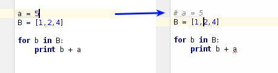
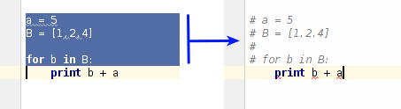

# Git - aktualizacja kopii repozytorium

# Wprowadzenie

## Kilka słów o Pythonie 
Python jest **dynamicznie typowanym** i **interpretowanym** (w szczególnych przypadkach kompilowanym) językiem. Dynamiczne typowanie oznacza, że jakakolwiek zmienna (globalna czy lokalna w funkcji) nie posiada przypisanego typu. Dzięki temu kod jest bardzo krótki, elastyczny oraz jest pozbawiony sprawdzania typów na poziomie kompilacji, co znacząco skraca czas od wprowadzenia zmian do uruchomienia kodu. Typ zmiennej jest sprawdzany dopiero w momencie wykonywania instrukcji, czyli jej konkretnego użycia. Dowolna zmienna staje się, np. integerem, w momencie gdy do niej przypiszemy wartość:

```python
a = 5
```

Nie został powyżej przypisany żaden typ do zmiennej "a",  tylko konkretna wartość 5 która automatycznie informuje, że "a" od tej pory będzie integerem. Dynamiczne typowanie pozwala także na przypisanie innego typu do tej samej zmiennej, tzn.:

```python
a = 5
a = "jakis text"
```

Podobnie ma się sytuacja z funkcjami - nie trzeba deklarować typu argumentu, wystarczy że przekazaną wartość będzie dało się zastosować do instrukcji znajdujących się wewnątrz funkcji. Na przykład do funkcji:

```python
def funkcja(argument1):
	a = argument1[3]
	return a

print funkcja([1, 2, 3, 4]) # wyswietli sie liczba 4
print funkcja("to jest string") #wyswietli sie znak "j"
```

można bez problemu przekazać zarówno listę jak i stringa, ponieważ oba te typy obsługują operator "[ ]". Ważne jest jedynie, aby dało się wykonać wszystkie instrukcje znajdujące się wewnątrz funkcji, a nie ma znaczenia to czy przekazana jest lista, string, tuple czy cokolwiek innego. 

Pythona na ogół należy postrzegać jako język **interpretowany**, ponieważ w taki sposób zazwyczaj będziemy uruchamiać kod. Język interpretowany to taki, w którym nie dokonuje się kompilacji całości kodu na raz(przetwarzania kodu z języka w miarę łatwo zrozumiałego dla człowiek do kodu w postaci instrukcji przesyłanych do procesora). Kod w tym przypadku jest "kompilowany" w czasie jego wykonywania. Oznacza to, że w następna linijka naszego kodu zostanie "skompilowana" dopiero w momencie gdy skończy się wywoływać poprzednia instrukcja. Z językiem interpretowanym spotykamy się bardzo często, ponieważ jest nim "bash" - język obsługujący powłokę systemową Linuxa. Dlatego też wiele podobnych cech będzie widocznych  w języku Python, jednak jest on dużo bardziej wygodny i naturalny w użytkowaniu. Oprócz swobody pisania kodu chyba najważniejszą zaletą Pythona jest właśnie czas od zapisania kodu do jego uruchomienia. Z racji tego że kod jest "kompilowany w locie" program uruchamia się błyskawicznie, co w przypadku dużych kodów w języku C/C++ bywa bardzo uciążliwe.


## Kod i jego uruchamianie

Kod Pythona może być pisany i uruchamiany w dwóch trybach:

- interaktywnym,
- wsadowym.

Praca interaktywna z kodem sprowadza się do uruchomienia konsoli języka Python w której kod jest wykonywany po zatwierdzeniu klawiszem Enter. Aby uruchomić konsolę Pythona wystarczy z poziomu konsoli systemowej uruchomić aplikację "python": 

```bash
$ python
```

Po tej operacji środowisko konsoli systemowej zamieni się w środowisko konsoli Pythona i każda linijka będzie zaczynała się od znaku ***>>>***:
```bash
Python 2.7.6 (default, Jun 22 2015, 17:58:13) 
[GCC 4.8.2] on linux2
Type "help", "copyright", "credits" or "license" for more information.
>>> 
```

Od tego momentu możemy pisać i od razu uruchamiać kolejne instrukcje, np.:
 
```bash
>>> a=5
>>> b=5
>>> print a+b
10
>>> 
```

W trybie konsolowym można także definiować wieloliniowe funkcje, pętle lub wyrażenia. Jest to możliwe ponieważ każde takie wyrażenie kończy się znakiem ":",  co po naciśnięciu klawisza ***Enter***  środowisko interpretuje jako przejście tryb wieloliniowych komend:
```bash
>>> def funkcja_suma(a, b):
...     c = a + b
...     return c
... 
>>>
```
W powyższym przykładzie znak ***>>>*** został zamieniony na ***...***. Należy tutaj pamiętać, że ciała funkcji są zawsze przesunięte o jedną tabulację, w związku z czym w konsoli po znaku ***...*** także należy dodać jedną tabulację. W momencie gdy już uznamy, że ciało funkcji należy zakończyć, to wystarczy wcisnąć ***Enter*** w linijce bez tabulacji, co zakończy definicję funkcji i konsola powróci do znaku ***>>>***. 

Na koniec, aby opuścić tryb konsolowy wystarczy wywołać funkcję ***exit*** lub w przypadku systemów Linux można także użyć skrótu ***CTRL+d***:
```bash
>>> print a+b
>>> exit()
$
```

Interaktywna konsola Pythona jest bardzo użyteczna w przypadku gdy chcemy zrobić jakąś prostą operację, np. obliczyć proste wyrażenie matematyczne bądź gdy chcemy wykonać prostą operację na plikach - np. zamienić nazwy wszystkim plikom w folderze. 


Kod napisany w języku Python powinien zostać umieszczony w pliku o rozszerzeniu ****.py*** i każdy taki plik nazywany jest modułem. (więcej o modułach dowiesz się dalej). Aby uruchomić kod zawarty w danym pliku wystarczy przekazać go do interpretera Pythona (interpreter jest narzędziem które czyta i wykonuje nasz kod linia po linii). 


## Co to jest moduł


## Komentarze w plikach źródłowych

Jednym z najczęściej używanych elementów każdego języka są komentarze, które pozwalają na chwilowe wyłączenie kodu bądź dodanie notatki na temat danej instrukcji. W języku python w odróżnieniu od C/C++ komentować można tylko linię za pomocą znaku ***#***

```python
# To jest komnentarz, a poniżej zwykły kod
a = 5
```

Jeśli chcemy dodać komentarz do kilku linii tekstu to niestety należy znak ***#*** umieścić na początku każdej z linii:
```python
# linia 1 komentarza
# linia 2 komentarza
a = 5
```
Może być to mało wygodne, jednak w praktyce, gdy korzystamy ze środowiska graficznego PyCharm wystarczy posłużyć się odpowiednim skrótem klawiszowym. Na przykład, gdy chcemy zamienić linijkę w której znajduje się nasz kursor to wystarczy wcisnąć na klawiaturze kombinację  ***CTRL + /***

 

Z kolei jeśli chcemy zamienić blok kodu na komentarz to należy go zaznaczyć a następnie ponownie skorzystać z kombinacji ***CTRL + /***

 

Aby odkomentować ten sam blok tekstu wystarczy znów go zaznaczyć i użyć kombinacji ***CTRL + /***.

Oprócz zwykłych komentarzy specyfikacja języka python przewiduje dodatkowy rodzaj komentarza, który jest automatycznie uznawany za dokumentację. Tekst dokumentacji powinien znaleźć się w pomiędzy znacznikami początku i końca. Jako znaczniki stosuje się trzykrotny znak cudzysłowu.  Dokumentacja powinna znaleźć się tuż pod deklaracją dokumentowanego narzędzia, np. funkcji:

```python
def funkcja(arg1, arg2):
	"""
	To jest funkcja, sluzy ona do robienia czegos 
	dziwnego z przekazanymi argumentami
	"""
	# kod zawierajacy cialo funkcji
	pass
```

Środowisko PyCharm w przypadku dokumentacji jest także bardzo pomocne. Jeśli chcemy dodać taki rodzaj dokumentacji funkcji, wystarczy tuż pod jej nazwą dodać trzy znaki cudzysłowu i nacisnąć klawisz ***Enter*** a program automatycznie wygeneruje ciało dokumentacji w następującej postaci


Jak widać na powyższym rysunku PyCharm wygenerował dodatkowe elementy które wypada umieścić w dokumentacji. Tuż za znakami cudzysłowów została pozostawiona wolna linia w której należy umieścić opis funkcji, tzn. do czego służy i ewentualnie jaki algorytm implementuje. Oprócz tego PyCharm umieścił informację o argumentach funkcji:

- ***param: argument1:***  należy dopisać informację jaki obiekt powinien być przekazane jako pierwszy argument
- ***param: argument1:***  należy dopisać informację jaki obiekt powinien być przekazane jako drugi argument
- ***return:***  należy dodać informację jaki obiekt jest zwracany z funkcji. W przypadku gdy funkcja nie powinna zwracać argumentów zwyczajowo podaje się  "None" które oznacza, że funkcja nic nie zwraca. 

Czasami programiści umieszczają pod argumentami dodatkowo przykład zastosowania funkcji.

Gdy już przygotujemy tak udokumentowaną funkcję, to możemy w środowisku PyCharm skorzystać z opcji "Quick Documentation" która wyświetla w dodatkowym oknie podpowiedzi to co zapisaliśmy lub ktoś inny udokumentował. Aby wyświetlić taką dokumentację należy postawić kursor na nazwie funkcji (w miejscu w którym chcemy z niej skorzystać) a następnie z górnego menu wybrać ***View/Quick Documentation***


Dokumentacja kodu w języku python jest szczególnie ważna z uwagi na brak typów obiektów. Jeśli chcemy aby argument przekazany do funkcji był liczbą całkowitą, to nie możemy tego powiedzieć użytkownikowi za pomocą deklaracji funkcji (deklaracja zawiera tylko nazwy przekazanych zmiennych, nie ma typu) i musimy to zrobić za pośrednictwem dokumentacji. 

## Polskie znaki diakrytyczne
W sytuacji gdy w komentarzach zostaną umieszczone polskie znaki diakrytyczne kod znajdujący się w danym pliku może nie uda się uruchomić. Wynika to z tego, że python używa domyślnego kodowania ASCII nieobsługującego tego typu znaków. Jeśli jednak chcemy używać polskich znaków, to na początku pliku należy wstawić następujący komentarz
```python
# coding=utf-8
```
Ta linijka wymusi na interpreterze skorzystanie z innego dekodera.

## Zmienne


## Listy
### Tworzenie i uzupełnianie

## Pętla "for", słowo "in" i generator "range"

### Metody należące do klasy list
- append - metoda dodaje element na koniec list, np.:
```python
a = [1,2]
a.append(5)
print a # wyswietli sie [1, 2, 5]
```
- insert - metoda wstawia element w dokładnej pozycji

### Wycinki list

### Tablice wielowymiarowe

### Zaawansowana inicjalizacja

### Rozwijanie list

### Zadania - uzupełnij ciała funkcji:
```python
#Remove duplicated elements
def remove_adjacent_duplication(listObject):
    # your code
    pass

print remove_adjacent_duplication([1, 2, 3, 3, 5, 68, 68, 24])
```

```python
# Mereg 2 lists
def merge_lists(list1, list2):
    # your code
    pass

print merge_lists([1,2,45,19,2],[12,-12,'c',3,'5'])
```


## Tuple
##### Zadania - uzupełnij ciała funkcji:
```python
# Order list of tuples by last element
def order_tuples(listTuples):
    # your code
    pass

print "is order ok?"+ str( order_tuples([(1, 3), (3, 2), (2, 1)]) == [(2, 1), (3, 2), (1, 3)])
```

## Instrukcja warunkowa if

## Wykorzystywanie i tworzenie bibliotek


## Numpy array zamiast list

### Tworzenie tablic

### Dostęp do elementów tablicy wielowymiarowej

### Wycinki tablic za pomocą indeksów i masek

### Operacje matematyczne na całych tablicach

## String

### String jako tablica

### Konwersja typów 

### Operator % 

## instrukcja if 

## Operacje na plikach

## Podstawowe narzędzie obsługi systemu

## Rysowanie wykresów - podstawy biblioteki matplotlib


# Zadanie 1
W folderze ***resources/lab1/files*** zlokalizowanym się w repozytorium znajduje się szereg plików o losowych nazwach. W każdym z plików znajduje się tylko jeden wiersz o postaci: *location: [nazwa folderu]*, gdzie [nazwa folderu] może różnić się pomiędzy plikami. Należy skopiować poszczególne pliki zawarte w podanej lokalizacji do folderów, których nazwy są takie same jak ta podana wewnątrz pliku. 

 

Nowo utworzone foldery mogą zostać umieszczone w dowolnej lokalizacji. 

# Zadanie 2
Należy utworzyć funkcję która będzie potrafiła przeskalować macierz z większego rozmiaru na mniejszy. W tym celu:

1. Utwórz nowy plik pythona o nazwie matrix. 
2. Wewnątrz tego pliku przygotuj funkcję "reduce" która jako argumenty będzie przyjmowała obiekt reprezentujący listę/tablicę dwuwymiarową oraz rozmiar wynikowej macierzy (parametr określający rozmiar powinien obsługiwać sytuację gdy przekazano 1 liczbę lub parę)
3. Uzupełnij ciało funkcji wykorzystując algorytm opisany poniższym rysunkiem
 
Na powyższym rysunku oznaczono jak poszukiwać referencyjnych elementów w tablicy większej w zależności od indeksu elementu w tablicy mniejszej. Wartość kolejnych elementów w tablicy mniejszej powinna być obliczona jako średnia z zaznaczonych sąsiadów i referencyjnego elementu z tablicy większej. 

4. Zwróć wynikową tablicę/listę dwuwymiarową.


# Zadanie 3
Należy napisać skrypt który będzie wczytywał plik graficzny ***resources/lab1/meil.png***. 

 

Ponadto skrypt ten powinien przeskalować obraz do rozmiaru 20x20 (wykorzystaj funkcję z poprzedniego zadania) i wyświetlić w jednym oknie obraz wczytany i przeskalowany obok siebie.

### Podpowiedzi
- Obraz można wczytać za pomocą funkcji ***imread*** znajdującej się w bibliotece ***matplotlib.image***. Wczytany obraz będzie w postaci tablicy 3 wymiarowej, gdzie pierwsze 2 wymiary określają indeks pojedynczego punktu, a ostatni określa kanał (red, green, blue i opcjonalnie alpha)
- Aby utworzyć 2 wykresy/obrazki w jednym oknie zamiast funkcji ***figure*** (z biblioteki matplotlib.pyplot) należy skorzystać z funkcji ***subplot*** gdzie argumentami jest para określająca liczbę wykresów w wierszach i  kolumnach:

```python
import matplotlib.pyplot as plt
# kod wyznaczający tablice x, y ....
_, axes =  plt.subplot(1,2)
axes[0].plot(x, y)
axes[1].plot(y, x)
plt.show()
```

- Obraz zapisany w postaci macierzy kolorów RGB (lub RGBA) można wyświetlić za pomocą funkcji ***imshow*** znajdującej się w bibliotece ***matplotlib.pyplot*** (w przypadku rysowania w jednym oknie należy skorzystać z metody ***imshow*** należącej do obiektów typu Axes, zwracanych z funkcji subplot)

# Zadanie 4
Uzupełnij skrypt z poprzedniego zadania tak, aby na podstawie jasności obrazka w danym punkcie generował obraz w pliku tekstowym za pomocą wybranych znaków. Obraz tekstowy powinien zostać utworzony na bazie przeskalowanego, mniejszego obrazka oraz powinien używać co najmniej 2 różnych znaków do określenia 2 różnych jasności (np. "||" dla czarnego koloru i "--" dla szarego). Poniżej zamieszczono przykładowy rezultat.  
```python
                  - - -                 
            - - - - - - - - -           
        ||  - -           - - -         
      ||||        - ||        - - -     
    ||||||      ||||||  ||||    - -     
    ||||  ||||  ||      ||||||    - -   
  ||||    ||    ||      ||    ||    - - 
  ||||  ||      ||      ||    ||||  - - 
  ||    ||      ||      ||      ||  - - 
||||  - ||      ||      ||      ||    - 
||||  - ||    ||||||||  ||      ||    - 
||||    ||      ||      ||      ||    - 
  ||-   ||      ||      ||      ||  - - 
  ||||  ||||    ||      ||    ||||  - - 
  ||||    ||-   ||      ||  ||||    -   
    ||||    ||  ||      ||||||    - -   
    - ||||      ||      ||||    - -     
      ||||||                    -       
          ||||||||      ||||||          
            ||||||||||||||||-           
```
### Podpowiedzi
W celu określenia jasności obrazka w danym punkcie skorzystaj z definicji kolorów HSV zamiast RGB. Kolory HSV, podobnie jak RGB są przechowywane w macierzy o 3 kanałach. Definicja każdego z kanałów można zobaczyć na poniższym rysunku:

 

Konwrsji koloru z macierzy RGB na macierz HSV można dokonać za pomocą funkcji ***rgb_to_hsv*** znajdującej się w bibliotece ***matplotlib.colors***. Kanał  ***Value*** dla macierzy HSV jest określony jako trzeci(ostatni).
