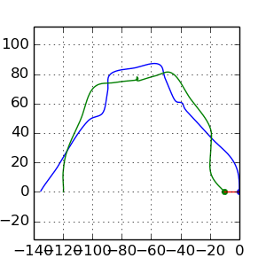

# Wprowadzenie

W ramach tych zajęć nauczymy się korzystać z bibliotek Pythona na przykładzie NumPy, Matplotlib i SciPy. W praktyce większość narzędzi z których korzysta się nacodzień w Pythonie pochodzi właśnie z wymienionych bibliotek. Oprócz tych zagadnień nauczymy się jak odczytywać/zapisywać pliki oraz jak wykonywać przydatne operacje na poziomie systemu. 

## Wykorzystywanie istniejących modułów

Podczas poprzednich zajęć powiedzieliśmy, że każdy plik jest nazywany modułem. Aby z niego skorzystać w innym pliku należy na początek zaimportować go do aktualnego pliku. W tym celu posługujemy się następującym wyrażeniem:

```python
import nazwa_modulu
```
Jeśli utworzyliśmy plik o nazwie "matrix.py" zawierający jakieś funkcje które wykonują operacje na macierzach, to aby skorzystać z tych funkcji musimy się do nich odwołać za pośrednictwem nazwy modułu, tzn.:
```python
import matrix

A = matrix.create() #wywolanie funkcji "create" z pliku matrix.py
matrix.invert(A)
```

Czasami jednak takie odwływanie się jest uciążliwe, ponieważ musimy za każdym razem powtarzać nazwę "matrix". Sytuacja będzie jeszcze trudniejsza jeśli np. plik "matrix.py" znajduje się folderze "tools":

```python
import tools.matrix

A = tools.matrix.create() 
tools.matrix.invert(A)
```

Do rozwiązania takiego problemu służy słowo "as" które pozwala zmienić nazwę importowanego modułu. Dzięki temu możemy odwoływać się do tych funkcji za pomocą skróconego zapisu:

```python
import tools.matrix as mat

A = mat.create()
mat.invert(A)
```

Innym sposobem rozwiązania tego problemu jest częściowy import, który pozwala na import tylko wybranych elementów danego pakietu: 

```python
from tools.matrix import create
from tools.matrix import invert

A = create()
invert(A)
```

W powyższym kodzie zamiast importować moduł tools.matrix zaimportowaliśmy tylko same funkcje "create" i "invert". Należy jednak uważać nazwy importowanych funkcji nie wprowadzały konfliktu z innymi funkcjami. Załóżmy, że importujemy z dwóch różnych pakietów funkcje invert:
```python
from tools.matrix import invert
from other.numerical import invert

invert()
```

W tej sytuacji funkcja "invert" z pakietu tools.matrix zostanie "przykryta" drugą funkcją z pakiety "other.numerical" i nie będziemy mieli do niej dostępu. Dlatego w takiej sytuacji lepiej jest korzystać z funkcji wykorzystując nazwę pakietu. 

Ostatnim użytecznym sposobem importowania narzędzi jest skorzystanie ze znaku "*" zamiast nazw funkcji. Pozwala to na import wszystkich funkcji znajdujących się wewnątrz danego pliku. Oczywiście, podobnie jak poprzednio należy zachować szczególną uwagę na nazwy funkcji. Taki sposób importowania jest przydatny gdy piszemy bardzo krótki kod:

```python
from tools.matrix import *

A = create()
invert(A)
```

Dokładnie w taki sam sposób możemy importować wszystkie narzędzia, nie koniecznie tylko te które sami napisaliśmy, ale także te które pochodzą z zainstalowanych bibliotek. Aby skorzystać z funkcji służącej do całkowania znajdującej się w bibliotece SciPy możemy przykładowo napisać taki kod:
```python
from scipy.integrate import odeint

# ... 
# ... jakis kod wyznaczajacy wektory Y0 i timeSteps

def funkcja_prawych_stron():
	pass

Y = odeint(funkcja_prawych_stron, Y0, timeSteps )
```

## Nazwane argumenty funkcji


## Numpy array zamiast list

Na poprzednich zajęciach uczyliśmy się jak przechowywać dane w listach. Listy są kontenerami zawierającymi dowolne typy. Ma to duży wpływ na wydajność kody gdy w rzeczywistości wiemy, że lista na której pracujemy składa się tylko z liczb tego samego typu. Wbudowany typ ***list*** przed wywołaniem dowolnej operacji, np. dodawania, będzie musiał wykonać sprawdzenie czy taka operacja może być wykonana na przekazanych typach. Dlatego w przypadku wykonywania operacji na dużych zbiorach danych lepiej jest skorzystać z narzędzi, które potrafią zoptymalizować wykonanie takiego kodu. Jednym z takich narzędzi jest klasa ***array*** pochodząca z biblioteki ***NumPy***.  Tablice te różnią się znacząco od list, ponieważ:
1. rozmiar jest stały,
2. typ zmiennych jest ten sam w całej liście.

Dlaczego jeszcze należy poznać bibliotekę NumPy? Głównie dlatego, że większość innych narzędzi związanych z obliczeniami numerycznymi czy rysowaniem wykresów jako wynik obliczeń zwraca obiekty które są właśnie typu numpy.array.

### Tworzenie tablic numpy.array

Aby utworzyć nową tablicę można skorzystać z konstruktora (funkcji tworzącej obiekt) klasy numpy.array.  Konstruktor przyjmuje Jako argument obiekt, po którym można iterować, tzn. taki którego można użyć w pętli for.  W ten sposób utworzymy tablicę wypełnioną zadanymi elementami:

```python
import numpy as np

tablica1 = np.array([1,2,5,12,5])
print tablic1# >> [ 1  2  5 12  5]
```
Możemy także skorzystać wprost z generatora ***range***:
```python
import numpy as np

tablica1 = np.array([i for i in ragne(10])
print tablic1# >> [0 1 2 3 4 5 6 7 8 9]

tablica1 = np.array(range(10)
print tablic1# >> [0 1 2 3 4 5 6 7 8 9]
```

Drugim sposobem inicjalizacji tablicy jest wykorzystanie funkcji:

- zeros - generuje tablicę o zadanym rozmiarze wypełnioną zerami
- ones - generuje tablicę o zadanym rozmiarze wypełnioną jedynkami
- zeors_like - generuje tablicę wypełnioną zerami o rozmiarze takim samym jak przekazana tablica
- ones_like - generuje tablicę wypełnioną jedynkami o rozmiarze takim samym jak przekazana tablica

```python
import numpy as np

tablica1 = np.zeros(10)
print tablica1 #>> [ 0.  0.  0.  0.  0.  0.  0.  0.  0.  0.]

tablica2 = np.ones_like(tablica1)
print tablica2 #>> [ 1.  1.  1.  1.  1.  1.  1.  1.  1.  1.]
```
W poprzednim przypadku przekazaliśmy listę o elementach składających się z integerów, dlatego wynikowa tablica została utworzona jako tablica integerów. W drugiej sytuacji wygenerowaliśmy tablicę która składa się ze elementów typu float, ponieważ ten typ jest domyślnie przyjmowany. W obu przypadkach możemy jednak zdecydować z jakiego typu powinna się składać dana tablica:

```python
import numpy as np

tablica1 = np.array( [1, 2, 3, 4, 5], dtype=float)
print tablica1 #>>[ 1.  2.  3.  4.  5.]

tablica2 = np.zeros(10, dtype=int)
print tablica2 #>> [0 0 0 0 0 0 0 0 0 0]
```

Jak widać definicję typu przeprowadzamy za pomocą nazwanego argumentu ***dtype***.

### Dostęp do elementów - optymalizacja działań

Teraz przejdźmy do wykorzystywania tablic. Zazwyczaj jesteśmy przyzwyczajeni do korzystania z nich za pośrednictwem pętli for, jednak w przypadku tych tablic tak nie jest. Wynika to z tego, że pętla for będzie wymagała pobierania elementów z tablicy. Każdy taki element następnie staje się obiektem Python, co jest kosztowne. Każda następna operacja, np. dodawanie, zanim zostanie wykonana, będzie wymagała sprawdzenia typów, które z założenia zawsze są takie same. Dlatego do wykonywania takich operacji lepiej nadaje się skorzystanie z gotowej funkcji, która potrafi np. zsumować kolejne elementy dwóch tablic, ale tak, że ta operacja jest wykonana optymalnie już na poziomie kodu natywnego a nie interpretowanego. Aby lepiej zobaczyć różnicę przeanalizujmy poniższy kod, który będzie mierzył czas wykonania operacji sumowania:

```python
import timeit

size=1000000

start = timeit.default_timer()

list1 = [i for i in range(size)]
list2 = [i for i in range(size)]
list3 = [0 for i in range(size)]

start = timeit.default_timer()

for i in range(size):
    list3[i] = list1[i] + list2[i]

t1 = float(timeit.default_timer()-start)
print "Czas :", str(t3)


import numpy as np

list1 = np.array(range(size))
list2 = np.array(range(size))
list3 = np.zeros_like(list2)

start = timeit.default_timer()

for i in range(size):
    list3[i] = list1[i] + list2[i]

t2 = float(timeit.default_timer()-start)
print "Czas :", str(t3)


start = timeit.default_timer()

list3 = list1 + list2

t3 = float(timeit.default_timer()-start)
print "Czas :", str(t3)

print "t2/t1", t2/t1
print "t1/t3", t1/t3
print "t2/t3", t2/t3
```

W pierwszej sytuacji wykonaliśmy sumowanie w pętli elementów znajdujących się listach. W drugim przypadku także wykonaliśmy sumowanie w pętli for, ale tym razem elementów znajdujących się tablicach numpy.array. W ostatnim przypadku wykonaliśmy sumowanie wykorzystując operator + (czyli w praktyce pewną funkcję) który wykonał zoptymalizowaną operację (w rzeczywistości operacja sumowania została oddelegowana do funkcji znajdującej się w skompilowanym binarnym kodzie). W wyniku działania powyższego skryptu otrzymaliśmy następujący wynik:
```python
Czas : 0.142781019211
Czas : 0.458594083786
Czas : 0.00325489044189
t2/t1 3.21187008134
t1/t3 43.8666129505
t2/t3 140.893861705
```
Jak widać najgorzej spisała się implementacja, która w pętli wykonywała sumowanie z tablicy numpy.array. Sumowanie elementów z listy było 3 razy szybsze niż z tablicy. Wynika to z tego, że dostęp do elementów tablice jest wolniejszy, ponieważ każdy element tablicy jest kopiowany z natywnego kodu do obiektu Pythona. Zwróćmy teraz uwagę na ostatni przypadek. Operacja sumowania "całych" tablic na raz jest wykonana ponad 40 razy szybciej niż iterowanie po elementach listy i aż 140 razy szybciej niż iterowanie po elementach tablicy. Wynika z tego następujący wniosek - **jeśli korzystasz z tablic typu numpy.array unikaj za wszelką cenę pętli!**. Bardzo dużo operacji można wykonać za pomocą różnych funkcji z pakiety NumPy oraz za pomocą wycinków tablic, podobnych do wycinków list.  

### Tworzenie i dostęp do elementów tablicy wielowymiarowej

Klasa array z biblioteka NumPy domyślnie wspiera tworzenie tablic wielowymiarowych. Tablicę taką można utworzyć podobnie jak w przypadku jednowymiarowej tablicy:

- Za pomocą konstruktora:
```python
import numpy as np

tab2D = np.array( [[1,2,3],[3,2,1], [2,3,1]])
print tab2D # >> [[1 2 3]
		   #         [3 2 1]
 		   #         [2 3 1]]

tab2D = np.array( [ [i*j  for i in range(3)] for j in range(3)] )
print tab2D # >> [[0 0 0]
		   #         [0 1 2]
 		   #         [0 2 4]]
```

- Za pomocą funkcji zeros, ones, zeros_like, ones_like:
```python
import numpy as np

tab2D = np.zeros( (3, 3) )
print tab2D # >> [[0 0 0]
		   #         [0 0 0]
 		   #         [0 0 0]]


tab2D = np.ones_like( tab2D )
print tab2D # >> [[1 1 1]
		   #         [1 1 1]
 		   #         [1 1 1]]
```
Jak widać w powyższym przykładzie tablice wielowymiarowe tworzymy przekazując jako rozmiar obiekt ***tuple*** (liczby znajdujące się w nawiasach ()) który jako elementy przyjmuje rozmiar tablicy w kolejnych wymiarach. Oczywiście, podobnie jak w przypadku tablicy jednowymiarowej możemy wybrać typ elementów za pomocą nazwanego argumentu ***dtype***. 

W przypadku tablic wielowymiarowych można dostać się do jej elementów dokładnie tak samo jak w przypadku list:

```python
import numpy as np
tab2D = np.zeros((3,3))
print "Element z drugiego wiersza i drugiej kolumny to", tab2D[1][1]
```
Jednak dostęp do elementów w powyższy sposób może być wolniejszy, ponieważ tablica taka najpierw musi zwrócić cały wiersz, a następnie dopiero odpowiednią kolumnę. Wielowymiarowe tablice NumPy domyślnie wspierają odwoływanie się do konkretnego elementy poprzez podanie wiersza i kolumny w obrębie jednego nawiasu []:

```python
import numpy as np
tab2D = np.zeros((3,3))
print "Element z drugiego wiersza i drugiej kolumny to", tab2D[1,1]
```
###  Spradzanie rozmiru tablic

Gdy posiadaliśmy obiekt typu ***list*** to liczbę elementów można było sprawdzić za pomocą funkcji ***len***. Ta funkcja także zadziała w przypadku tablic:
```python
import numpy as np

tab = np.zeros(10)

print len(tab) # >> 10
```

A w przypadku tablic wielowymiarowych funkcja ta zwróci tylko rozmiar pierwszego wymiaru (np. liczbę wierszy w tablicy dwuwymiarowej). Dlatego aby sprawdzić wymiar korzystamy ze zmiennej "shape" przypisanej do obiektu tablicy, która sama w sobie jest typu ***tuple***:
```python
import numpy as np
tab2D = np.ones((10,5), dtype=int)

print tab2D.shape # >> (10, 5)
print "Pierwszy wymiar", tab2D.shape[0] # >> Pierwszy wymiar 10
print "Drugi wymiar", tab2D.shape[0] # >> Drugi wymiar 5
```

### Wycinki tablic i uzupełnianie wartości tablicy
Podczas poprzednich zajęć pokazaliśmy jak można wygodnie pracować na części listy. Podobne, a nawet dalej idące, narzędzie wspierają tablice. Tworzenie wycinków w tablicach jednowymiarowych jest dokładnie takie same jak w przypadku list. Tablice pozwalają jednak na przypisanie tej samej wartości do wszystkich elementów z wycinka:

```python
import numpy as np
tab = np.zeros(5)
tab[:3] = 2
print tab # >> [ 2.  2.  2.  0.  0.]
```
W przypadku list nie mogliśmy tak zrobić, można było tylko przypisać do inną listę o tym samym wymiarze.

Podobnie sprawa ma się w przypadku tablic wielowymiarowych: 
```python
tab2D = np.zeros((4,4))
tab2D[:2,:2] = 2
print tab2D #>> [[ 2.  2.  0.  0.]
 					 	#  		 [ 2.  2.  0.  0.]
 						# 		 [ 0.  0.  0.  0.]
						#			 [ 0.  0.  0.  0.]]
```

### Wycinki tablic za pomocą indeksów i masek
Tablice NumPy pozwalają także na inny sposób tworzenia wycinków tablic:
1. Za pomocą listy indeksów.
2. Za pomocą maski -  tablica o tej samej długości co źródłowa i złożona ze zmiennych typu boolean - wartość True oznacza wybór elementy a False pominięcie

Sprawdź działanie poniższego kodu:
```python
import numpy as np

tab = np.zeros(10)
tab[[1,4,8,9]] = 2
print tab

mask = tab == 0
print mask

tab[ mask ] = -1
print tab

from random import randint
tab = np.array( [ randint(0,9) for i in range(10)])

print "Liczby losowe wieksze od 5:"
for e in tab[tab > 5]:
	print e
```

### Operacje matematyczne na całych tablicach
Obiekty klasy ***numpy.array*** wspierają większość znanych funkcji takich jak ***sin, cos, exp, abs, ...*** oraz operatory ** +, -, /, *, ** **. Pełną lista funkcji matematycznych zobacz [tutaj](http://docs.scipy.org/doc/numpy/reference/routines.math.html "Funkcje matematyczne NumPy"). Aby skorzystać z tych funkcji trzeba odwoływać się do nich poprzez nazwę pakietu. 

Inna bardzo przydatna funkcja należąca do pakietu NumPy to ***linspace(start, stop, step)*** która generuje tablicę o liczbach równomiernie rozłożonych w zadanym zakresie:
```python
import numpy as np
xy = np.zeros((10,2))
xy[:, 0] = np.linspace(-1, 1, 10)
print xy[:,0] #>>[-1.         -0.77777778 -0.55555556 -0.33333333 -0.11111111  0.11111111 0.33333333 0.55555556  0.77777778  1. ]

xy[:, 1] = np.exp( xy[:, 0] )
print xy
```

## Operacje na plikach

Podstawy wczytywania i zapisywania danych do plików w Pythonie niczym szczególnym nie różni się od pracy w innych językach. Aby otworzyć strumień danych z pliku wystarczy utworzyć obiekt typu ***file*** za pomocą funkcji ***open(filename, mode)***, gdzie parametr ***mode*** określa cel otwarcia pliku:

- "r" - wczytywanie danych z pliku, strumień ustawiony jest na początku pliku.
- "r+" - wczytywanie i zapisywanie do pliku, strumień ustawiony na początku pliku.
- "a" - zapisywanie danych do pliku, strumień jest ustawiony na końcu pliku.
- "a+" - zapisywanie danych do pliku, strumień jest ustawiony na końcu pliku.
- "w" - zapisywanie danych do pliku, jeśli plik nie jest pusty zostanie wyczyszczony.
- "w+" - wczytywanie i zapisywanie danych do pliku, jeśli plik nie jest pusty zostanie wyczyszczony.

Po zakończeniu pracy z plikiem należy pamiętać o zamknięciu strumienia do pliku, co można sprawdzić dzięki zmiennej ***closed*** należącej do obiektu plik:

```python
plik = open("tmp.txt", "r")
if not plik.closed:
	print "closing file ..."
	plik.close()
```

Czasami można zapomnieć zamknąć strumień, bądź pojawi się wyjątek (który automatycznie przerwie wykonywanie kodu) w trakcie pracy nad plikiem. Taka sytuacja może spowodować niepoprawną pracę kodu. W związku z tym istniej potrzeba takiej konstrukcji, w której kod, niezależnie od tego co się stanie w pewnej jego części, wykona "sprzątającą" operację. W wielu językach taka konstrukcja nazywa się ***try/finally*** która zapewnia, że nie zależnie od tego co się stanie po słowie ***try*** zostanie wykonany kod ***finally***. W przypadku pracy z plikami miałoby to postać:
```python
plik = open("tmp.txt", "r")
try:	
	.... operacje na pliku .....
finally:
	plik.close()
```

W Pythonie taka konstrukcja także istnieje, ale posiada on także jeszcze jedną, która potrafi automatycznie wykonać sprzątanie i jest bardzo przyjazna dla oka :). Zapewnia ona, że zasoby wykorzystywane przez kod zostaną zwolnione i wyczyszczone. Ta nowa konstrukcja ma następującą postać:

```python
with wyrazenie[as zmienna]:
	... blok kodu operujacego na obiekcie zmienna ...
```
W przypadku pracy z plikami jako "wyrazenie" wystarczy użyć funkcję ***open***:

```python
with open("tmp.txt","r") as plik:
	... kod pracujacy na zmiennej plik ....
```

Na koniec przyjrzyjmy się kilku metodom jakie należą do obiektów typu ***file***, które pozwolą na praktyczne wczytywanie danych:

- read() - wczytuje na raz cały plik, można przekazać parametr "size" który ograniczy ilość bitów do jego wartości.
- readline() - wczytuje kolejną linię z pliku.
- readlines() - wczytuje wszystkie linie z pliku i zwraca listę.
- write(str) - zapisuje przekazany ciąg znaków do pliku
- writelines(sekwencja_stringow) - zapisuje kolejne linie z przekazanej sekwencji stringów (np. listy)

Oprócz tych funkcji należy pamiętać, że obiekt ***file*** sam w sobie jest sekwencją stringów, dzięki czemu pozwala on iterować w pętli for po kolejnych liniach: 

```python
with open("tmp.txt","r") as plik:
	for linia in plik:
			print "Wczytalem linie tekstu = ", linia
```
Z kolei jeśli chcemy zapisać dane, wygodnie jest skorzystać z metody ***write***:

```python
zdanie="Jaki ten python jest latwy i czytelny"
with open("tmp.txt", "w") as plik:
	for slowo in zdanie.split():
		plik.write(slowo + "\n")
```
lub jeszcze w jednej linii kodu:
```python
zdanie="Jaki ten python jest latwy i czytelny"
with open("tmp.txt", "w") as plik: plik.writelines([s+"\n" for s in zdanie.split()])
```

## Podstawowe narzędzie obsługi systemu


## Rysowanie wykresów - podstawy biblioteki matplotlib


# Zadania

## Zadanie 1

W folderze ***resources/lab1/files*** zlokalizowanym w repozytorium znajduje się szereg plików o losowych nazwach. W każdym z plików znajduje się tylko jeden wiersz o postaci: *location: [nazwa folderu]*, gdzie [nazwa folderu] może różnić się pomiędzy plikami. Należy skopiować poszczególne pliki zawarte w podanej lokalizacji do folderów, których nazwy są takie same jak ta podana wewnątrz pliku. 

 

Nowo utworzone foldery mogą zostać umieszczone w dowolnej lokalizacji. 

## Zadanie 2

Wyznacz ruch dwóch ciał połączonych sprężynami o sztywności $k=10$ znajdujących się polu grawitacyjnym o przyśpieszeniu $\vec{g}=[0,-9.81][\frac{m}{s^2}]$. Oba ciała są wstępnie ustawione w odległości $l = 10$ od siebie i leżą na linii poziomej, a sprężyna w tym momencie jest nienaciągnięta. Prędkość początkowa ciała pierwszego wynosi $u_1=[0,5][\frac{m}{s}]$ a drugiego $ u_2=[-3,3] [\frac{m}{s}]$. Masy obu ciał są równe i wynoszą $m=1 [kg]$ lub $m=10 [kg]$ (sprawdź jak zmienią się wyniki w obu przypadkach). 

Wykonaj wykres torów ruchu obu ciał, a następnie utwórz animację, w której przedstawisz ruch ciał w postaci punktów poruszających się po obliczonych torach. 

 

Animację można zapisać do pliku *.gif za pomocą metody "save" z obiektu animation. Aby zapisać do tego formatu należy posiadać zainstalowaną aplikację "imagemagic":

```python
# ...
anim = animation.FuncAnimation(....)
anim.save("nazwa_pliku.gif", writer="imagemagic", fps=30)
plt.show()
```

## Zadanie 3
Należy utworzyć funkcję która będzie potrafiła przeskalować macierz z większego rozmiaru na mniejszy. W tym celu:

1. Utwórz nowy plik pythona o nazwie zadanie3.py
2. Wewnątrz tego pliku przygotuj funkcję "reduce" która jako argumenty będzie przyjmowała obiekt reprezentujący listę/tablicę dwuwymiarową oraz rozmiar wynikowej macierzy (parametr określający rozmiar powinien obsługiwać sytuację gdy przekazano 1 liczbę lub parę)
3. Uzupełnij ciało funkcji wykorzystując algorytm opisany poniższym rysunkiem
 
Na powyższym rysunku oznaczono jak poszukiwać referencyjnych elementów w tablicy większej w zależności od indeksu elementu w tablicy mniejszej. Wartość kolejnych elementów w tablicy mniejszej powinna być obliczona jako średnia z zaznaczonych sąsiadów i referencyjnego elementu z tablicy większej. 

4. Zwróć wynikową tablicę/listę dwuwymiarową.


## Zadanie 4
Należy napisać skrypt który będzie wczytywał plik graficzny ***resources/lab1/meil.png***. 

 

Ponadto skrypt ten powinien przeskalować obraz do rozmiaru 20x20 (wykorzystaj funkcję z poprzedniego zadania) i wyświetlić w jednym oknie obraz wczytany i przeskalowany obok siebie.

### Podpowiedzi
- Obraz można wczytać za pomocą funkcji ***imread*** znajdującej się w bibliotece ***matplotlib.image***. Wczytany obraz będzie w postaci tablicy 3 wymiarowej, gdzie pierwsze 2 wymiary określają indeks pojedynczego punktu, a ostatni określa kanał (red, green, blue i opcjonalnie alpha)
- Aby utworzyć 2 wykresy/obrazki w jednym oknie zamiast funkcji ***figure*** (z biblioteki matplotlib.pyplot) należy skorzystać z funkcji ***subplot*** gdzie argumentami jest para określająca liczbę wykresów w wierszach i  kolumnach:

```python
import matplotlib.pyplot as plt
# kod wyznaczający tablice x, y ....
_, axes =  plt.subplot(1,2)
axes[0].plot(x, y)
axes[1].plot(y, x)
plt.show()
```

- Obraz zapisany w postaci macierzy kolorów RGB (lub RGBA) można wyświetlić za pomocą funkcji ***imshow*** znajdującej się w bibliotece ***matplotlib.pyplot*** (w przypadku rysowania w jednym oknie należy skorzystać z metody ***imshow*** należącej do obiektów typu Axes, zwracanych z funkcji subplot)

## Zadanie 4
Uzupełnij skrypt z poprzedniego zadania tak, aby na podstawie jasności obrazka w danym punkcie generował obraz w pliku tekstowym za pomocą wybranych znaków. Obraz tekstowy powinien zostać utworzony na bazie przeskalowanego, mniejszego obrazka oraz powinien używać co najmniej 2 różnych znaków do określenia 2 różnych jasności (np. "||" dla czarnego koloru i "--" dla szarego). Poniżej zamieszczono przykładowy rezultat.  
```python
                  - - -                 
            - - - - - - - - -           
        ||  - -           - - -         
      ||||        - ||        - - -     
    ||||||      ||||||  ||||    - -     
    ||||  ||||  ||      ||||||    - -   
  ||||    ||    ||      ||    ||    - - 
  ||||  ||      ||      ||    ||||  - - 
  ||    ||      ||      ||      ||  - - 
||||  - ||      ||      ||      ||    - 
||||  - ||    ||||||||  ||      ||    - 
||||    ||      ||      ||      ||    - 
  ||-   ||      ||      ||      ||  - - 
  ||||  ||||    ||      ||    ||||  - - 
  ||||    ||-   ||      ||  ||||    -   
    ||||    ||  ||      ||||||    - -   
    - ||||      ||      ||||    - -     
      ||||||                    -       
          ||||||||      ||||||          
            ||||||||||||||||-           
```
### Podpowiedzi
W celu określenia jasności obrazka w danym punkcie skorzystaj z definicji kolorów HSV zamiast RGB. Kolory HSV, podobnie jak RGB są przechowywane w macierzy o 3 kanałach. Definicja każdego z kanałów można zobaczyć na poniższym rysunku:

 

Konwrsji koloru z macierzy RGB na macierz HSV można dokonać za pomocą funkcji ***rgb_to_hsv*** znajdującej się w bibliotece ***matplotlib.colors***. Kanał  ***Value*** dla macierzy HSV jest określony jako trzeci(ostatni).


